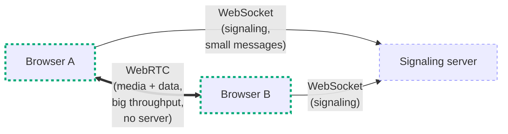
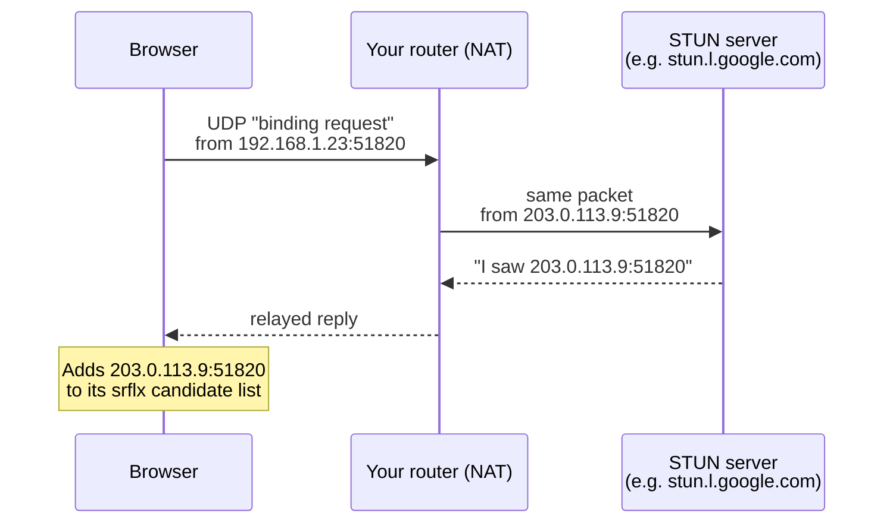
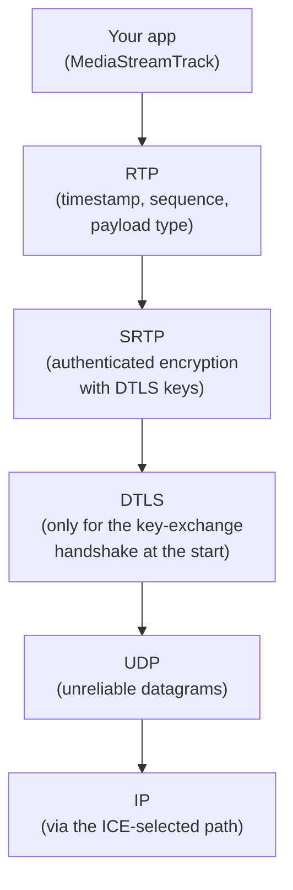
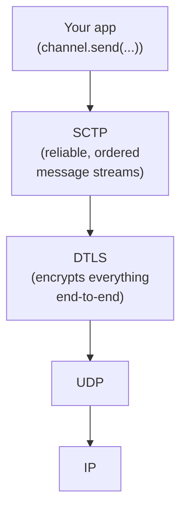
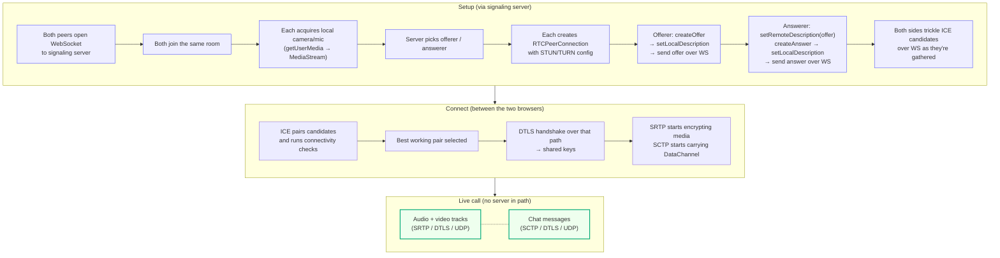

# WebRTC Primer — start here if you've never used WebRTC before

**Who this is for**: developers who are completely new to WebRTC. If the
words *STUN*, *SDP*, *DTLS*, *ICE*, *SRTP* either mean nothing to you or
you've only half-remembered them, this doc is the one to read first.

**How to read this**: top to bottom, once. Skim it. You do not need to
remember every detail — you need a mental model so the next doc
([`02-app-walkthrough.md`](./02-app-walkthrough.md))
makes sense.

**What this is NOT**: a reference manual, a code walkthrough, or an
exhaustive spec. It's the minimum conceptual vocabulary to understand
what the code in this repository does.

---

## 1. The problem WebRTC is solving

Before WebRTC, if you wanted two browsers to exchange live audio and
video, your only real option was to send every frame through your own
server:

```
Browser A  ─►  Your server  ─►  Browser B
```

That's expensive (you pay for bandwidth), slow (an extra network hop),
and doesn't scale (one server per thousand users).

WebRTC solves this by letting two browsers talk **directly** to each
other:

```
Browser A  ◄═════════════════════►  Browser B
                 (direct)

Browser A  ─►  Tiny "signaling" server  ◄─  Browser B
               (only used to introduce them)
```

Once introductions are done, media flows peer-to-peer. The server is
out of the hot path.

Sounds simple. In practice, getting "talk directly" to work is the
hard part, because the modern internet is actively hostile to two
random browsers trying to reach each other. Most of WebRTC is the
machinery needed to defeat that hostility. The rest of this primer
walks through that machinery piece by piece.

---

## 2. Three APIs, one protocol family

When you hear "WebRTC" you're usually hearing about three browser APIs
that are designed to work together:

| API | What it gives you | One-liner |
|---|---|---|
| `navigator.mediaDevices.getUserMedia(...)` | A `MediaStream` with live camera + mic tracks | "Let me use the webcam, please." |
| `RTCPeerConnection` | A peer-to-peer pipe to another browser | "Send this media / these bytes to that other browser." |
| `RTCDataChannel` | Arbitrary data bytes over the same pipe | "Ship me some JSON or files, peer-to-peer." |

And one deliberate gap:

| NOT an API | Why it's missing |
|---|---|
| Signaling | WebRTC doesn't standardize how two browsers **find** each other or **exchange setup info**. That part is your app's problem. |

If someone says "WebRTC is hard because you have to write your own
signaling," this is what they mean. We picked WebSocket + JSON for
signaling in this app (see
[`specs/001-webrtc-1to1-call/contracts/signaling-protocol.md`](../../specs/001-webrtc-1to1-call/contracts/signaling-protocol.md)),
but someone else might pick HTTP long-poll, MQTT, Server-Sent Events,
or anything else that can move a few KB of JSON between two browsers.

---

## 3. WebSocket is not WebRTC

One confusion worth clearing up before going further:

- **WebSocket** is a bidirectional message channel between a browser
  and a *server*. It's used in this app as the **signaling transport**.
  Two browsers each open a WebSocket to the same server; the server
  relays small setup messages between them.
- **WebRTC** is the peer-to-peer pipe for media and data. Once it's
  established, there is **no server** in the media path.



WebSocket does the *introduction*. WebRTC does the *conversation*.

---

## 4. NAT — why "just connect to the other browser" doesn't work

Home and office networks almost always sit behind a device called a
**NAT** (Network Address Translator). This is what your Wi-Fi router
does: it takes your internal LAN IP (say, `192.168.1.23`) and hides it
behind one public IP that you share with everyone else in the building.

```
Your laptop (192.168.1.23)  ──┐
Your phone  (192.168.1.47)  ──┼──► Router  ──► Public IP 203.0.113.9  ──► Internet
TV (192.168.1.80)           ──┘
```

From the internet's perspective, all of those devices look like
`203.0.113.9`. There's no way for a stranger on the internet to "send
a packet to the laptop" because the internet doesn't know the laptop
exists as an addressable thing.

NAT is great for the regular web: you open a TCP connection *outward*
to google.com, the router remembers that, and lets replies come back
on that specific conversation. It's terrible for peer-to-peer: if
Browser A and Browser B are both behind different NATs, neither can
accept an unsolicited incoming packet from the other.

**This is the core problem ICE/STUN/TURN exists to solve.**

---

## 5. ICE — the algorithm for "find a working path"

**ICE** (Interactive Connectivity Establishment) is the master
algorithm WebRTC uses to figure out how two NATed browsers can
actually reach each other. It's not a single thing; it's a recipe
with several steps.

ICE runs inside each browser's `RTCPeerConnection`. You don't call it
directly — you just listen to the events it fires.

### 5.1 Candidate gathering

The first thing ICE does is make a list of every IP:port pair at which
this browser *might* be reachable. Each entry in that list is called
a **candidate**. There are four common types:

| Type | Meaning | Example | Who found it |
|---|---|---|---|
| **host** | The browser's raw local IP | `192.168.1.23:51820` | The OS (via network interfaces) |
| **srflx** (server-reflexive) | The browser's public IP as seen by a STUN server | `203.0.113.9:51820` | STUN (§5.2) |
| **prflx** (peer-reflexive) | A public IP:port learned from the *peer's* probe packets | `203.0.113.9:62104` | Discovered mid-connection |
| **relay** | A TURN server's IP:port, acting as a relay on your behalf | `198.51.100.7:5349` | TURN (§5.3) |

If both peers are on the same Wi-Fi, the `host` candidates are enough.
If they're on different networks, `srflx` usually works. If NATs are
especially strict (corporate firewalls, carrier-grade NAT), only
`relay` works.

### 5.2 STUN — "what is my public IP?"

**STUN** (Session Traversal Utilities for NAT) is a tiny, stateless
protocol. Your browser sends a UDP "binding request" to a STUN server;
the STUN server replies with "here's the public IP:port I saw you
coming from." That becomes your `srflx` candidate.



**No media ever goes through the STUN server.** STUN is only a
lookup — "what's my public IP?" — and then it's done. This is why
running a free public STUN (like the Google one) is fine: it's cheap.

### 5.3 TURN — "forward my packets for me"

Sometimes neither peer can reach the other even after swapping
`srflx` candidates. Strict NATs may only accept packets from IP:port
combos they've previously sent to, and the two peers never sent to
exactly the right address. Or corporate firewalls block peer-to-peer
UDP entirely.

**TURN** (Traversal Using Relays around NAT) is the fallback. A TURN
server has a public IP that both peers can reach; each peer sends its
media to the TURN server, which forwards it to the other peer:

```
Browser A  ──►  TURN server  ──►  Browser B
Browser A  ◄──  TURN server  ◄──  Browser B
```

Downsides: the TURN server sees your (encrypted) media flow through
it, so it uses real bandwidth. You pay for it. In exchange, TURN
works even through the strictest NATs, because it's just two regular
outbound UDP flows that the NATs think are normal traffic.

A TURN candidate is called a **relay candidate**. If you ever see
video over WebRTC that works on 4G/LTE but not on a corporate network,
usually what happened is: corporate network blocked UDP; browsers
fell back to TURN over TCP/TLS; that worked.

This repo doesn't ship a TURN server yet — it's planned for Phase 13
(see `specs/001-webrtc-1to1-call/tasks.md`). On a plain home LAN test,
`host` candidates are enough.

### 5.4 Connectivity checks

Once both peers have exchanged their candidate lists (via signaling),
ICE forms **pairs** — every one of my candidates × every one of yours
— and tries them in priority order. For each pair it sends small UDP
probe packets ("STUN binding requests" again, but this time
peer-to-peer). The first pair that answers *both* directions is
declared the winner and becomes the selected path for media.

You rarely need to debug this, but when you do, the Learning Inspector
panel in this app shows how many `host` / `srflx` / `relay` candidates
each side gathered.

### 5.5 Trickle ICE — don't wait, ship them as they come

Old-school ICE (RFC 5245) waited to collect every candidate before
sending the offer. That added seconds to call setup. **Trickle ICE**
(RFC 8838) sends candidates one by one over signaling as they're
found. It's what every modern browser does; this app implements it
(and has to buffer candidates that arrive before
`setRemoteDescription` has finished — see
`frontend/src/modes/one-to-one/webrtc/ice-buffer.ts`).

---

## 6. SDP and the offer/answer model

Once the two browsers have a potential network path, they still have
to agree on *what* they're going to send. Specifically:

- What codecs can you decode? (I can do Opus for audio, VP8 + H.264
  for video; what about you?)
- What media streams am I offering? (One audio, one video, in send+
  receive mode.)
- What are my DTLS fingerprints? (For encryption key exchange.)
- What are my ICE credentials? (A username + password pair that
  prevents unrelated peers from hijacking this session.)

All of that is bundled into a text blob called an **SDP** (Session
Description Protocol). It's not JSON; it's an older key:value text
format that looks like this (abbreviated):

```
v=0
o=- 8443457534873645 2 IN IP4 127.0.0.1
s=-
m=audio 9 UDP/TLS/RTP/SAVPF 111 103 104
a=rtpmap:111 opus/48000/2
a=fingerprint:sha-256 AC:36:...:C1
a=ice-ufrag:4ZcD
a=ice-pwd:xc1N5tLpLN9g4S6MBHpt53Do
...
```

The offer/answer model is: one side generates an **offer** (an SDP
saying "here's what I'd like to do"), the other side generates an
**answer** (an SDP saying "here's the intersection of what I can do").
Both are shipped over signaling.

| Role | API calls | Sends |
|---|---|---|
| Offerer | `pc.createOffer()` → `pc.setLocalDescription(offer)` → send → (wait) → `pc.setRemoteDescription(answer)` | offer |
| Answerer | (receives offer) → `pc.setRemoteDescription(offer)` → `pc.createAnswer()` → `pc.setLocalDescription(answer)` → send | answer |

In this app, the server picks the offerer deterministically (lowest
`admissionOrder`) so the two sides don't race to be offerer at the
same time. The server also **does not parse SDP** — it treats the
blob as opaque bytes and relays it, so bugs in SDP generation never
become server-side problems.

### 6.1 JSEP, briefly

The formal name for "WebRTC's offer/answer state machine" is **JSEP**
(Javascript Session Establishment Protocol). You'll see it in the
spec. In practice it means: you don't manipulate SDP by hand; you
call `createOffer` / `createAnswer` / `setLocalDescription` /
`setRemoteDescription` in the right order, and the browser does the
SDP generation for you.

---

## 7. Security: DTLS + SRTP

WebRTC is **always encrypted**. There is no "plaintext mode," not
even for localhost testing. Two protocols do the heavy lifting:

### 7.1 DTLS — TLS for datagrams

You know TLS (the thing that makes URLs start with `https://`). TLS
runs on top of TCP. WebRTC uses UDP, which doesn't have reliable
ordered delivery, so it uses a UDP-friendly cousin called **DTLS**
(Datagram TLS). DTLS gives you:

- A cryptographic handshake between the two browsers (not involving
  any server).
- A shared secret they can both use as a symmetric key.

The twist: each browser generates a self-signed certificate *per
RTCPeerConnection*. Those certificates' **fingerprints** (SHA-256
hashes) are written into the SDP and shipped through signaling. After
the DTLS handshake, each side checks "is the fingerprint of the cert
my peer presented equal to the fingerprint the signaling server gave
me?" If yes, there was no man-in-the-middle.

That's how you get end-to-end encryption even when the signaling
server is untrusted: the server sees the fingerprints but never the
private keys.

### 7.2 SRTP — encrypted media packets

DTLS gives you keys. **SRTP** (Secure RTP) is the format the actual
audio/video packets use. It's RTP (the standard real-time media
protocol — headers, timestamps, sequence numbers) with authenticated
encryption applied to the payload using keys derived from the DTLS
handshake. This combination is called **DTLS-SRTP**.

When people say "WebRTC media flows over SRTP/DTLS/UDP," what they
mean is this stack:



For DataChannels the middle layer is different but the spirit is the
same:



Takeaways:

- **DTLS** is used **once at handshake time** to agree on keys. After
  that it mostly sits idle (occasional rekeying aside).
- **SRTP** carries every media packet after the handshake.
- **SCTP** carries DataChannel messages. SCTP gives you reliable
  ordered streams over UDP — so DataChannel is TCP-like but rides the
  same encrypted tunnel as your media.

---

## 8. Codecs — the actual audio/video bits

The browser decides what bytes go inside each SRTP packet based on
which codecs both peers said they supported (in the SDP offer/answer
exchange).

| Kind | Codec | Status in WebRTC |
|---|---|---|
| Audio | **Opus** | **Required**. This is what real calls use — wide bandwidth, great quality, small footprint. |
| Audio | G.711 (PCMU/PCMA) | Required baseline for compatibility with old phone networks. |
| Video | **VP8** | Required. Simple, royalty-free. |
| Video | **H.264 (Constrained Baseline)** | Required. Hardware-accelerated on most phones. |
| Video | VP9, AV1 | Optional; commonly supported by modern browsers. |

You normally don't pick codecs by hand — `createOffer` lists
everything the browser supports, and `createAnswer` narrows it down
to the intersection. If you ever need to force one, there are APIs
(`RTCRtpTransceiver.setCodecPreferences`), but this app doesn't
touch them.

---

## 9. Signaling — the piece WebRTC leaves up to you

WebRTC deliberately does not define how the offer, answer, and ICE
candidates travel from one peer to another. You can use:

- A WebSocket to a server (this app's choice — simple, low-latency,
  bidirectional).
- HTTP long-polling or Server-Sent Events.
- A third-party messaging service (Firebase, Pusher, Ably).
- A chat protocol (Matrix, XMPP, Slack webhooks — yes, really).

The signaling server's job is small:

1. Know which two browsers are in the same "call" / "room."
2. Forward JSON messages between them without understanding the
   contents.
3. (Often) also push presence events: "the other peer just joined,"
   "the other peer disconnected."

Our server is ~1,000 lines of Go and can be replaced with any system
that moves JSON between two WebSocket clients. Nothing in the server
parses SDP or candidate strings.

---

## 10. Putting it together — one call's life

A mental model for what happens end-to-end:



The signaling server is only present in the **Setup** box. Once you're
in **Live**, the two browsers talk to each other and nothing else.

---

## 11. Glossary — every acronym, one sentence each

- **WebRTC** — Web Real-Time Communication. The browser APIs that let
  two browsers exchange media and data peer-to-peer.
- **Signaling** — Any out-of-band channel used to exchange WebRTC
  setup info (offer, answer, ICE candidates). Not defined by WebRTC.
- **Peer** — One of the two browsers in a call. Not a server.
- **NAT** — Network Address Translator. The thing (your router) that
  hides many private IPs behind one public IP.
- **ICE** — Interactive Connectivity Establishment. The algorithm for
  finding a network path between two NATed peers.
- **ICE candidate** — One possible IP:port pair where the browser
  might be reachable. Types: host, srflx, prflx, relay.
- **STUN** — Session Traversal Utilities for NAT. A small server that
  tells a browser its public IP:port.
- **TURN** — Traversal Using Relays around NAT. A relay server that
  forwards media when direct P2P is impossible.
- **Trickle ICE** — Sending ICE candidates one by one as they're
  found, instead of batching them.
- **SDP** — Session Description Protocol. A text blob describing
  codecs, media streams, DTLS fingerprints, and ICE credentials.
- **JSEP** — JavaScript Session Establishment Protocol. The formal
  name for WebRTC's offer/answer state machine.
- **Offer / Answer** — The two SDPs exchanged to agree on what media
  the call will carry.
- **DTLS** — Datagram TLS. TLS adapted to run over UDP. Used in
  WebRTC to negotiate keys peer-to-peer.
- **DTLS-SRTP** — The combination of DTLS (for key exchange) and
  SRTP (for encrypting media).
- **SRTP** — Secure RTP. Real-time Transport Protocol with built-in
  authenticated encryption.
- **RTP** — Real-time Transport Protocol. The framing format for
  audio and video packets on the wire.
- **SCTP** — Stream Control Transmission Protocol. What DataChannels
  use internally for reliable ordered messaging over DTLS.
- **MediaStream / MediaStreamTrack** — JavaScript objects
  representing a live media feed from the camera/mic or from the
  remote peer.
- **RTCPeerConnection** — The JavaScript object that owns a single
  peer-to-peer pipe: ICE, DTLS, SRTP, SCTP, media tracks, data
  channels.
- **RTCDataChannel** — A WebSocket-like messaging channel that rides
  inside an RTCPeerConnection.
- **WebSocket** — A persistent, bidirectional message channel between
  a browser and a server. Used here *only* for signaling; unrelated
  to WebRTC itself.
- **Codec** — The format used to compress audio/video (Opus, VP8,
  H.264, etc.). Codecs are negotiated via SDP.

---

## 12. Now read the walkthrough

With the vocabulary above in your head, go read
[`02-app-walkthrough.md`](./02-app-walkthrough.md).
It takes everything in this primer and pins it to exactly what this
repository's code does, file by file, event by event. If a term in
the walkthrough looks unfamiliar, come back here — they match 1:1.
