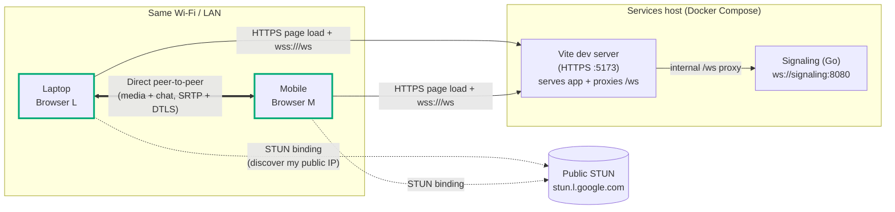
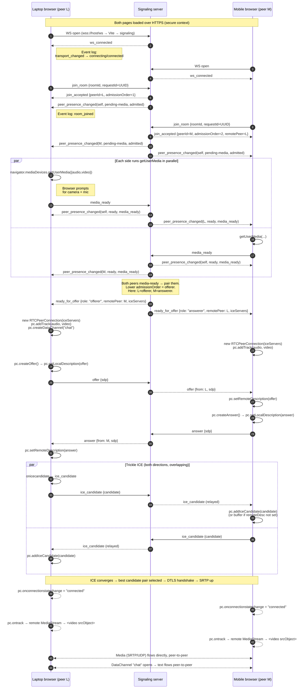
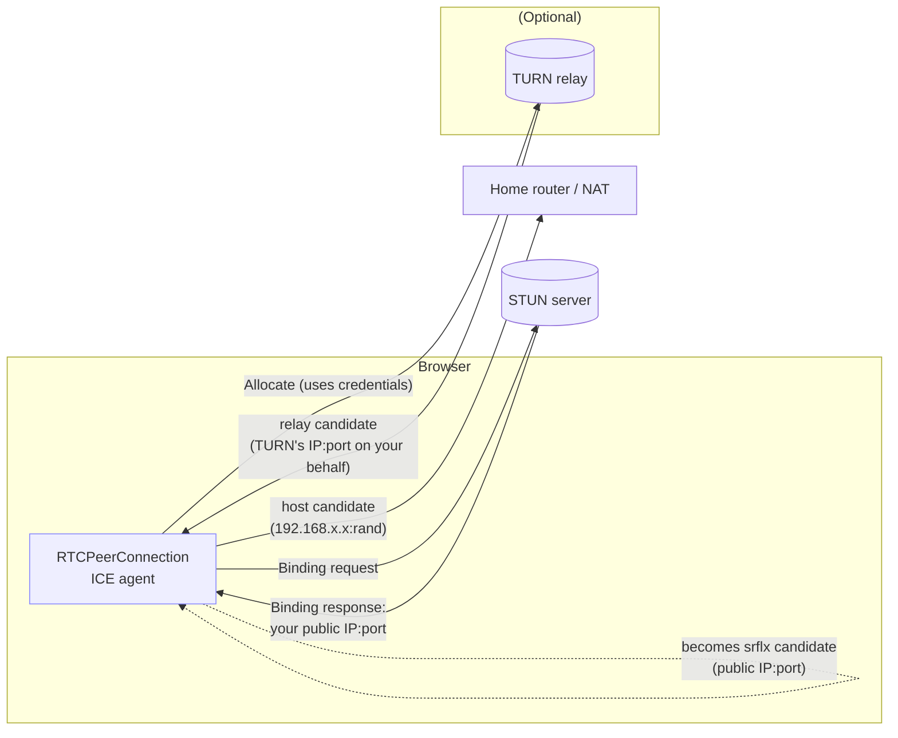
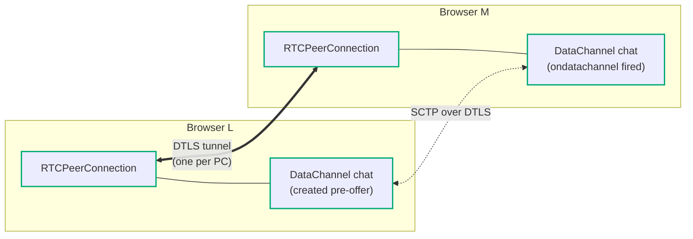
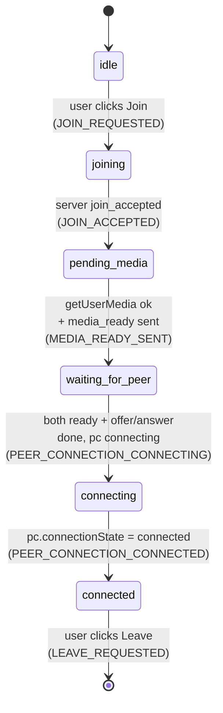

# WebRTC Concepts Walkthrough — happy path, grounded in this app

**Who this is for**: anyone running this repo who wants to understand
*what the browser and the signaling server are actually doing* when a 1:1
call comes up. Every section links the concept to a real file in this
tree and the matching Event Log line you'll see in the bottom-right panel
of the UI.

**Scope**: the successful two-device flow only — open the app on two
devices, both join the same room, both grant camera/mic, video + audio +
chat work. Failure paths (media denied, peer drops, ICE failed) are
deliberately out of scope here; see the spec under
[`specs/001-webrtc-1to1-call/`](../../specs/001-webrtc-1to1-call/) when you
want those.

**Prereq (conceptual)**: if *STUN*, *SDP*, *DTLS*, *ICE*, or *SRTP* are
unfamiliar, read [`01-webrtc-primer.md`](./01-webrtc-primer.md) first — it's
the beginner-oriented companion to this doc. This walkthrough assumes
you know what those terms mean and focuses on *how this specific app
wires them up*.

**Prereq (environment)**: the stack is up (`docker compose up -d`) and
you've gone through the one-time cert tap-through on each browser per
[`two-browser-test.md`](../manual-tests/two-browser-test.md).

---

## 1. The big picture

WebRTC lets two browsers exchange media and data **directly**,
peer-to-peer, without the bytes going through any server. A small,
dumb server (we call it the **signaling server**) is only used to help
the two browsers *find each other* and *agree on how to talk*. Once the
connection is up, audio/video/chat flow straight between browsers.



Three things are worth internalizing before the walkthrough:

1. **Signaling is app-specific.** WebRTC the spec does *not* define a
   signaling protocol. We picked one — a small JSON-over-WebSocket
   contract in
   [`specs/001-webrtc-1to1-call/contracts/signaling-protocol.md`](../../specs/001-webrtc-1to1-call/contracts/signaling-protocol.md)
   — and implemented it in `signaling/` (server) and
   `frontend/src/modes/one-to-one/signaling/` (client).
2. **Media and DataChannel are peer-to-peer.** After setup, audio/video
   frames and chat bytes travel directly between the two browsers over
   encrypted UDP (SRTP over DTLS). Neither the signaling server nor
   Vite's proxy is on that path.
3. **STUN/TURN** are WebRTC-standard helpers for getting through NAT
   and firewalls. STUN only tells a browser *"here's your public
   IP:port"*. TURN is a relay used when direct P2P can't work; this
   app doesn't ship one by default — it's planned for Phase 13.

---

## 2. The three moving parts

| Layer | Owned by | Key files |
|---|---|---|
| **Signaling** — who's in the room, role assignment, SDP/ICE relay | JSON over WebSocket, both sides | `signaling/internal/modes/onetoone/handler.go`, `frontend/src/modes/one-to-one/signaling/{client,dispatcher,schema}.ts` |
| **Local media** — `getUserMedia`, a live `MediaStream` | Browser, wrapped in a React provider | `frontend/src/modes/one-to-one/webrtc/local-media-provider.tsx`, `frontend/src/shared/webrtc/media-acquisition.ts` |
| **Peer connection** — the actual WebRTC pipe: SDP, ICE, media tracks, DataChannel | Browser `RTCPeerConnection`, wrapped in a provider | `frontend/src/modes/one-to-one/webrtc/peer-connection.ts`, `frontend/src/modes/one-to-one/webrtc/peer-connection-provider.tsx`, `frontend/src/modes/one-to-one/webrtc/ice-buffer.ts`, `frontend/src/modes/one-to-one/webrtc/data-channel.ts` |

The UI (`frontend/src/modes/one-to-one/components/`) is deliberately thin: it dispatches
actions into a reducer (`frontend/src/modes/one-to-one/state/`) and reads state back out.
Nothing app-logical lives in components.

---

## 3. The full happy-path sequence (one diagram to rule them all)

This is what actually happens between clicking **Join** on both devices
and seeing each other's video. Read it top-to-bottom; each arrow is one
signaling message or one browser API call. The Event Log entries you'll
see in the UI are called out on the right edge.



Each numbered arrow is either a line in
`signaling/internal/modes/onetoone/handler.go` or a method call inside
`frontend/src/modes/one-to-one/webrtc/peer-connection-provider.tsx`. The sections below
expand the interesting ones.

---

## 4. Stage-by-stage with code anchors

### 4.1 Signaling transport — the WebSocket

Before anything WebRTC-specific happens, the browser needs a
bidirectional channel to the signaling server. We use WebSocket.

- Client: `frontend/src/modes/one-to-one/signaling/client.ts` — a thin `connect(url)`
  wrapper whose only job is to turn browser WS events into
  `SignalingTransportState` transitions (`disconnected` →
  `connecting` → `connected`) and pass JSON strings through.
- Server: `signaling/internal/modes/onetoone/handler.go` upgrades HTTP to
  WS on `/ws` and runs a per-connection read loop.

Because the page is served over HTTPS (Vite's `@vitejs/plugin-basic-ssl`),
the WebSocket URL **must** be `wss://` — plain `ws://` from an HTTPS
page is blocked as mixed content. The app reads
`VITE_SIGNALING_URL=wss://<host>:5173/ws` and Vite's `server.proxy` in
`frontend/vite.config.ts` forwards that path to `http://signaling:8080`
on the compose network.

**What you see**: two `transport_changed` entries in the Event Log per
peer:

```
transport_changed  signaling transport → connecting
transport_changed  signaling transport → connected
```

### 4.2 Admission — `join_room` / `join_accepted`

Once the WS is up, the client sends `join_room` with a `roomId` and a
UUID `requestId`. The server matches that `requestId` on the reply so
clients can correlate. It then either admits the peer (up to 2 per
room) and replies `join_accepted`, or it replies `join_rejected`.

- Sender: `frontend/src/modes/one-to-one/components/JoinForm.tsx` (`runJoinFlow`).
- Server: `handleJoinRoom` in `signaling/internal/modes/onetoone/handler.go`.
- The server also **broadcasts** `peer_presence_changed(admitted)` to
  every reserved slot — that's how the remote peer sees you arrive.

**Why `admissionOrder` matters**: the server deterministically picks the
first-admitted peer as the **offerer** later. This makes role
assignment symmetric without any negotiation round-trip.

**What you see**:

```
room_joined             room joined (roomId=...)
peer_presence_changed   peer ... → pending-media (admitted)
```

### 4.3 Local media — `getUserMedia`

`RTCPeerConnection` doesn't know how to get the camera; *you* hand it
a `MediaStream`. That stream is acquired with:

```ts
navigator.mediaDevices.getUserMedia({ audio: true, video: true })
```

This is the call that triggers the browser's mic/camera permission
prompt. It **requires a secure context** — same reason the HTTPS fix
was necessary to get this working on LAN devices.

- Wrapper: `frontend/src/shared/webrtc/media-acquisition.ts`
  (`acquireLocalMedia`) normalizes browser DOMException codes into
  app-domain `MediaFailureReason`s.
- Lifecycle: `frontend/src/modes/one-to-one/webrtc/local-media-provider.tsx` watches the
  session reducer. When `session.session === "pending-media"` it calls
  `acquireLocalMedia`, emits `media_ready` on success, and hands the
  stream to the `PeerConnectionProvider` via a ref (the live
  `MediaStream` is *not* in reducer state — see data-model §B.2 for
  why browser objects stay out of Redux).

**What you see**:

```
media_acquisition_requested  getUserMedia({audio:true, video:true}) requested
media_ready_sent             media_ready sent
```

### 4.4 Pairing + role assignment — `ready_for_offer`

When both peers have sent `media_ready`, the room transitions to
`paired` and the server emits `ready_for_offer` to both — but with
different `role` values:

| admissionOrder | role     | What it does next |
|---|---|---|
| 1 (arrived first) | `offerer`  | creates the DataChannel, makes the SDP *offer* |
| 2 (arrived second) | `answerer` | waits for the offer, responds with an *answer* |

`ready_for_offer` also carries the `iceServers` list (STUN, optionally
TURN). Both peers must use the **same** list or they can end up with
asymmetric candidate gathering — so we always send it from the server.

- Server: `sendReadyForOffer` in
  `signaling/internal/modes/onetoone/handler.go`.
- Client receiver: `PeerConnectionProvider` in
  `frontend/src/modes/one-to-one/webrtc/peer-connection-provider.tsx` — this is where
  the `RTCPeerConnection` is actually constructed (not earlier).

### 4.5 Building the peer connection

At this point, each browser creates its `RTCPeerConnection`:

```ts
const pc = new RTCPeerConnection({ iceServers })
pc.addTrack(audioTrack, localStream)
pc.addTrack(videoTrack, localStream)
if (role === "offerer") pc.createDataChannel("chat")
```

- Factory: `createPeerConnection(...)` in
  `frontend/src/modes/one-to-one/webrtc/peer-connection.ts`.
- The **DataChannel must be created before the offer** if we want it
  to appear in the SDP and on the remote side automatically. See the
  `createChatDataChannel()` note in that file.

Key event handlers wired at construction:

| Handler | Fires when | We do |
|---|---|---|
| `onicecandidate` | ICE agent found a local candidate | Send it as `ice_candidate` over signaling |
| `ontrack` | Remote track arrived | Attach the `MediaStream` to `<video>` |
| `onconnectionstatechange` | Aggregated connection state changed | Drive session state `connecting → connected` |
| `ondatachannel` (answerer) | Remote created a DataChannel | Wrap it for chat |

### 4.6 SDP offer / answer — "what codecs can you speak?"

SDP (Session Description Protocol) is a text format that describes:
"I can send video in H.264 or VP8, audio in Opus, here's my DTLS
fingerprint, here are the ICE credentials I'll use." Both peers compare
offers and answers and settle on the intersection.

The **server does not parse SDP** — it relays the bytes verbatim. That's
a deliberate design rule (NFR-003 in the spec): keep the signaling
server oblivious to media details. It only rewrites envelope metadata
(`from`, `to`, `ts`).

- Offerer: `pc.createOffer()` → `pc.setLocalDescription(offer)` →
  send as `offer`.
- Answerer: receive `offer` → `pc.setRemoteDescription(offer)` →
  `pc.createAnswer()` → `pc.setLocalDescription(answer)` → send as
  `answer`.
- Offerer: receive `answer` → `pc.setRemoteDescription(answer)`.

After those six lines of browser-side code, both peers know how to
decode the incoming media. They just need a network path.

### 4.7 Trickle ICE — finding a network path

ICE (Interactive Connectivity Establishment) is the algorithm each
browser uses to figure out what IP:port pairs it can be reached on,
and which pair works for this specific peer. It emits **candidates**
one at a time as it finds them — hence *trickle*.

Candidate types you'll likely see in the Learning Inspector panel:



| Candidate | What it is | Works when… |
|---|---|---|
| `host` | The browser's raw LAN IP | Both peers on the same network (our LAN test) |
| `srflx` | Public IP:port learned via STUN | Peers on different networks, but NAT is permissive enough |
| `relay` (TURN) | Relay server IP:port | Strict NATs/firewalls where even `srflx` can't make it through |

**Buffering is important.** Candidates arrive over signaling, which is
a *different* WebSocket from the peer connection. Arrival order is not
synchronized with `setRemoteDescription` completing. If you call
`pc.addIceCandidate(c)` *before* the remote description is set, the
browser either silently drops it or throws `InvalidStateError`.

- Buffer: `frontend/src/modes/one-to-one/webrtc/ice-buffer.ts` (`createIceBuffer`).
  Pushes early candidates into a FIFO; drains them in order once the
  remote description resolves.
- Per-peer behavior: `peer-connection-provider.tsx` passes inbound
  `ice_candidate` frames to the buffer; after its
  `setRemoteDescription` resolves, `ice-buffer.drain()` flushes them.

A candidate with `candidate: null` (end-of-candidates) is a signal
that ICE gathering has finished on the remote side. We surface that in
the Learning Inspector as **end-of-candidates (remote): yes**.

### 4.8 Connection up + media flowing

When the ICE agent finds a working candidate pair, DTLS handshakes run
on top, SRTP keys are derived, and media starts flowing. The state
machine inside `RTCPeerConnection` fires:

- `iceConnectionState`: `new → checking → connected`
- `connectionState`: `new → connecting → connected`

`pc.ontrack` fires on each side once the first remote track's keys are
ready. We attach the `event.streams[0]` to the `<video>` element in
`frontend/src/modes/one-to-one/components/RemoteVideo.tsx`.

**What you see**: `pc.connectionState` in the State panel flips to
`connected`, the remote video frame turns on, audio starts playing.

### 4.9 DataChannel — the chat

Because the offerer called `createDataChannel("chat")` before making
the offer, the SDP advertises a DataChannel, and the answerer's
`pc.ondatachannel` fires with a ready channel on its side.

- Wrapper: `wrapDataChannel(...)` in
  `frontend/src/modes/one-to-one/webrtc/data-channel.ts` maps the browser's `readyState`
  to an app-visible `DataChannelStateValue` (`absent | connecting |
  open | closing | closed`) and handles send-with-backpressure.

DataChannel bytes travel over the **same** DTLS tunnel as media (SCTP
over DTLS). They don't touch any server.



---

## 5. Session state machine (one peer's view)

The UI surface is driven by this reducer slice in
`frontend/src/modes/one-to-one/state/session.ts`. Every transition shown here is a real
`case` in `sessionReducer`.



Points to note:

- State **only advances one step at a time** — the reducer rejects
  illegal transitions with `IllegalSessionTransitionError`, and a
  snapshot test in `frontend/frontend/src/modes/one-to-one/tests/unit/session.spec.ts` pins every
  legal edge.
- The peer connection's own machine (`connectionState`,
  `iceConnectionState`, `signalingState`) is shown separately in the
  State panel — those are browser-internal and not reducer-controlled.
  Our reducer just promotes `connecting → connected` when the
  *browser* tells us so.

---

## 6. Watching it live

The Learning Inspector panel is designed to make every abstract thing
above concrete. While you call yourself from two devices:

1. Open **both** browsers side by side (dev tools helpful but not
   required — the UI itself shows the state).
2. Watch the **Event log** scroll through the sequence from §3:
   `transport_changed`, `room_joined`, `peer_presence_changed`,
   `media_ready_sent`, `ready_for_offer`, `offer_sent`/`offer_received`,
   `answer_sent`/`answer_received`, `ice_candidate_sent`,
   `ice_candidate_received`, `peer_connection_connected`.
3. Watch the **ICE servers** / **Candidates observed** sub-panels —
   on a LAN-only test, you'll typically see several `host` candidates,
   a couple of `srflx` ones, zero `relay` (no TURN configured yet).
4. Watch the **Local SDP** and **Remote SDP** panels fill in with the
   actual offer/answer bodies — this is what §4.6 was about.

---

## 7. Glossary (five terms in plain English)

For the full vocabulary (DTLS, SRTP, SCTP, JSEP, codecs, prflx
candidates, etc.), see [`01-webrtc-primer.md §11`](./01-webrtc-primer.md#11-glossary--every-acronym-one-sentence-each).
The short list below is just the five terms this walkthrough leans on
most.

- **SDP** — a text blob describing codecs, media tracks, DTLS
  fingerprints, and ICE credentials. The thing swapped as *offer* and
  *answer*.
- **ICE candidate** — one possible network address the browser could
  be reached on. Candidates are tried in preference order until one
  pair works.
- **STUN** — a tiny server that tells the browser its public IP:port
  as seen from outside the NAT. No media ever goes through STUN.
- **TURN** — a relay server that forwards media/data when direct P2P
  fails. Media *does* go through TURN when used. Not enabled by
  default in this repo.
- **Trickle ICE** — sending candidates over signaling as they are
  found, instead of waiting to collect them all before making the
  offer. Lower time-to-first-frame, more messages.

---

## 8. Where to go next

- **Contract**:
  [`specs/001-webrtc-1to1-call/contracts/signaling-protocol.md`](../../specs/001-webrtc-1to1-call/contracts/signaling-protocol.md)
  — every wire message, every field.
- **State design**:
  [`specs/001-webrtc-1to1-call/data-model.md`](../../specs/001-webrtc-1to1-call/data-model.md)
  — why the reducer looks the way it does.
- **Background reading**:
  [`specs/001-webrtc-1to1-call/research.md`](../../specs/001-webrtc-1to1-call/research.md)
  — the design decisions that shaped this app.
- **Run another scenario**:
  [`two-browser-test.md`](../manual-tests/two-browser-test.md)
  — step-by-step reproduction, including the third-peer rejection path.

When you're ready for the non-happy paths, start with the
`media-error` branch (decline camera on one device) and the
`peer_left` branch (close one tab mid-call) — both exist in the
current code and both produce easy-to-read log sequences.
