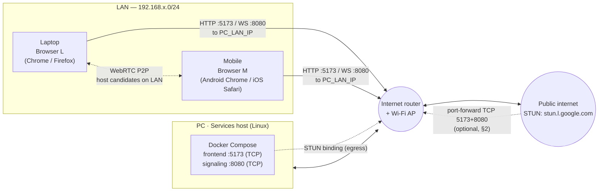
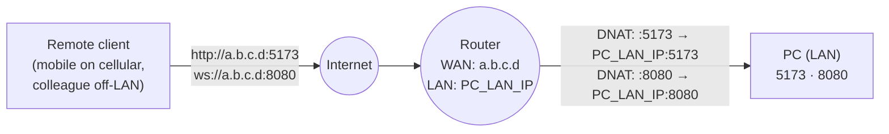
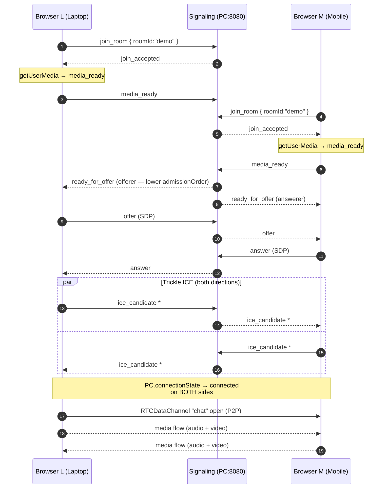
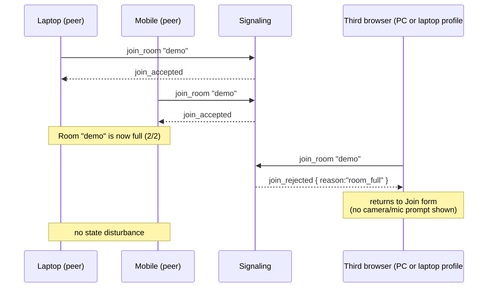
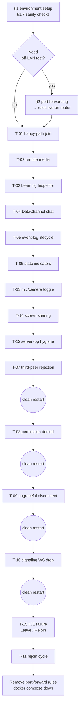

# Manual Two-Browser Test Plan — `001-webrtc-1to1-call`

**Scope**: current branch state (Phases 0–12 merged — Phase 10 adds
the mic/camera toggle covered in T-13; Phase 11 adds screen sharing
covered in T-14; Phase 12 adds the three-path cleanup orchestrator,
FailurePanel with Leave/Rejoin, and signaling-disconnect UX — covered
across T-09, T-10, and new T-15). For the full-feature checklist, see
[`../../specs/001-webrtc-1to1-call/quickstart.md`](../../specs/001-webrtc-1to1-call/quickstart.md).

**Date of last review**: 2026-04-25.

---

## 1. Testing environment

### 1.1 Topology

Three devices on the same LAN, sharing one internet router:

- **PC** — runs Docker Compose (Vite frontend on 5173, Go signaling on
  8080). Does **not** participate as a peer (but can open an extra
  browser for the third-peer-rejection test).
- **Laptop** — Browser peer **L**.
- **Mobile** — Browser peer **M**.

Neither peer is on the same origin as the services host. Both fetch
the client app and open a WebSocket using the **PC's LAN IP**, not
`localhost`. That deliberately exercises the non-localhost secure-
context story and real LAN transport on both sides at once.



Consequences of the topology:

- Both peers generate `host` ICE candidates on the LAN subnet, so
  pairing should complete without TURN.
- Outbound STUN still works and is expected to surface a `srflx`
  candidate (the router's public IPv4) on both sides — useful signal
  in the Learning Inspector.
- **Only the PC** exposes 5173 + 8080. Both laptop and mobile reach
  those ports via the PC's LAN IP. No port forwarding is needed for
  LAN testing; see §2 for the optional remote-access variant.

### 1.2 Device roles

| Role | Device | What it runs |
|---|---|---|
| **Services host** | PC (this machine) | `docker compose up --build`; no peer browser required |
| **Peer L** | Laptop on LAN | One browser profile |
| **Peer M** | Mobile on LAN (same Wi-Fi SSID) | One browser |
| **Peer C** *(T-07 only)* | Extra browser profile — on the PC **or** laptop | Third window to trigger `room_full` |

### 1.3 Per-device prerequisites

| | PC | Laptop | Mobile |
|---|---|---|---|
| OS | Linux | any | Android 12+ **or** iOS 16+ |
| Docker + Compose v2 | Required | — | — |
| Browser | (optional) Chromium | Chromium or Firefox, profile #1 | Android Chrome **or** iOS Safari |
| Camera + mic | — | Required | Required (physical, not emulated) |
| Free ports `5173`, `8080` TCP inbound from LAN | Required | — | — |
| Inbound firewall exceptions for 5173/8080 from LAN subnet | Required | — | — |
| On same Wi-Fi / LAN segment as PC | — | Required | Required (Wi-Fi, **not** cellular — unless §2 is in use) |

### 1.4 Critical: non-localhost secure context

`getUserMedia()` requires a **secure context**. Browsers treat
`http://localhost` as secure, but `http://192.168.x.x` is **not**.
Because neither peer is on the PC, **both** Laptop and Mobile trip
this check on a plain HTTP LAN URL. Pick one of the workarounds per
platform:

| Browser | Workaround for `http://<PC_LAN_IP>:5173/` |
|---|---|
| **Chrome / Edge (desktop)** | `chrome://flags/#unsafely-treat-insecure-origin-as-secure` → add `http://<PC_LAN_IP>:5173` → relaunch. Or a disposable CLI launch: `google-chrome --user-data-dir=/tmp/webrtc-test --unsafely-treat-insecure-origin-as-secure="http://<PC_LAN_IP>:5173"` |
| **Firefox (desktop)** | `about:config` → `media.devices.insecure.enabled = true` **and** `media.getusermedia.insecure.enabled = true` |
| **Android Chrome** | Open `chrome://flags/#unsafely-treat-insecure-origin-as-secure` on the phone, add `http://<PC_LAN_IP>:5173`, force-stop Chrome, reopen |
| **iOS Safari** | **No flag** exists — iOS requires real HTTPS. Use one of §1.4.1 below |
| **Firefox Android** | No supported flag path on release channel. Use §1.4.1 |

#### 1.4.1 HTTPS options (needed for iOS and optional elsewhere)

Easiest first:

1. **Cloudflare Tunnel / ngrok** — run on the PC, get a public HTTPS
   URL that proxies to `localhost:5173` (and a second tunnel for
   `localhost:8080`). Pros: zero cert management, works on iOS. Cons:
   traffic exits your LAN; add `VITE_SIGNALING_URL` env so the
   frontend's WS points at the tunnel hostname, not `window.location`.
2. **mkcert + Caddy** — generate a locally-trusted cert for
   `<PC_LAN_IP>.nip.io` or `pc.local`, put Caddy in front of Vite +
   signaling. On iOS you must install and **trust** the mkcert root
   CA under Settings → General → VPN & Device Management and then
   Settings → General → About → Certificate Trust Settings.

Either option keeps traffic on HTTPS/WSS; the frontend already
auto-upgrades WS → WSS based on `window.location.protocol`, so no
code changes are needed.

### 1.5 Mobile-specific prep

- **Same Wi-Fi SSID** as the PC; disable cellular data during the
  test to force LAN. Android Wi-Fi-assistant or iOS "Wi-Fi Assist"
  can silently switch to cellular — turn both off.
- **Screen lock** triggers an autoplay / suspension edge case. Keep
  the screen on during the test (Android: Developer options → Stay
  awake; iOS: Settings → Display → Auto-Lock → Never).
- **Permissions prompt** must be granted separately per-origin. After
  switching between LAN IP and tunnel URL, expect to re-grant.
- **Safari playsinline**: the `<video>` tag must carry `playsinline`
  or Safari fullscreens it. Already handled in `RemoteVideo.tsx`, but
  worth watching for regressions.
- **Autoplay audio** on iOS is gated behind a user gesture. If you
  don't hear remote audio on M, tap anywhere in the page once.
- **Orientation**: mobile cameras deliver portrait frames; the remote
  tile will render tall. Not a bug.

### 1.6 Discovering PC's LAN IP

On the PC:

```bash
# Linux
hostname -I | awk '{print $1}'
ip -4 addr show scope global | awk '/inet /{print $2}' | cut -d/ -f1
```

Record as `PC_LAN_IP`. Expect something like `192.168.1.23` or
`10.0.0.7`. If you get two addresses (Ethernet + Wi-Fi, or a Docker
bridge), pick the one on the same subnet as the router (laptop's and
mobile's IPs will share the prefix).

### 1.7 Reachability sanity check (before any test)

| # | Where | Action | Pass |
|---|---|---|---|
| S1 | PC | `docker compose up --build` | `signaling` logs `"listening" addr=":8080"`; Vite prints `ready` |
| S2 | PC | `curl -fsS http://localhost:8080/healthz` | HTTP 200 |
| S3 | Laptop | `curl -fsS http://$PC_LAN_IP:8080/healthz` | HTTP 200 — else firewall |
| S4 | Mobile | Visit `http://$PC_LAN_IP:8080/healthz` in browser | Shows `ok` / HTTP 200 |
| S5 | Laptop | Open `http://$PC_LAN_IP:5173/` | Join form renders |
| S6 | Mobile | Open `http://$PC_LAN_IP:5173/` | Join form renders (after §1.4 workaround) |

If S3/S4 fail: open the PC firewall for TCP 5173 + 8080 on the LAN
subnet only. Linux example:

```bash
# ufw
sudo ufw allow from 192.168.0.0/16 to any port 5173 proto tcp
sudo ufw allow from 192.168.0.0/16 to any port 8080 proto tcp

# firewalld
sudo firewall-cmd --add-rich-rule='rule family="ipv4" source address="192.168.0.0/16" port port="5173" protocol="tcp" accept'
sudo firewall-cmd --add-rich-rule='rule family="ipv4" source address="192.168.0.0/16" port port="8080" protocol="tcp" accept'
```

Scope it to your LAN subnet; do **not** open these ports to 0.0.0.0.

---

## 2. Port-forwarding manual (optional / stretch tests)

### 2.1 When you do NOT need port-forwarding

The default topology in §1.1 — laptop and mobile both on LAN Wi-Fi —
requires **no** router configuration. Skip this entire section if
that's your setup.

### 2.2 When you DO need it

Set up port-forwarding only if one of these is true:

- Testing with a device outside the LAN (mobile on cellular; a
  collaborator on a different network).
- You're using a guest Wi-Fi network that is **client-isolated** —
  clients can't see each other even on the same SSID. The fix is
  either move off guest Wi-Fi or publish the service via the router
  WAN and have each client hit the WAN address.



### 2.3 Generic router steps

Router admin UIs vary, but the fields are always the same. Log in to
the router (commonly `http://192.168.1.1` or `http://192.168.0.1`;
check the sticker) and find the port-forwarding / virtual-server /
NAT page. Add two rules:

| Name | Protocol | External port | Internal IP | Internal port |
|---|---|---|---|---|
| `webrtc-frontend` | TCP | 5173 | `PC_LAN_IP` | 5173 |
| `webrtc-signaling` | TCP | 8080 | `PC_LAN_IP` | 8080 |

Save / apply. Most routers restart the NAT table within a few
seconds. Some UIs label the fields "WAN port" vs "LAN port" or
"Service port" vs "Internal port" — the mapping is the same.

**Pin the PC's LAN IP** first, either via the router's DHCP
reservation page or by setting a static IP on the PC. Otherwise the
PC's IP can change after a reboot and the forwarding rule starts
pointing into thin air.

### 2.4 Find your router's public IP

From the PC:

```bash
curl -fsS https://api.ipify.org ; echo
```

Use the result as the WAN address `a.b.c.d`. Double-check it's not a
CGNAT range (`100.64.0.0/10`) — if your ISP uses CGNAT, inbound
forwarding won't work from the open internet and you'll need a tunnel
(ngrok / cloudflared) instead.

### 2.5 Client-side URL after forwarding

Remote client visits:

```
http://a.b.c.d:5173/
```

The frontend derives the WS URL from `window.location.hostname`, so
it will auto-use `ws://a.b.c.d:8080/ws`. No client-side config
needed.

If you've moved to HTTPS/WSS via a tunnel instead (§1.4.1), set
`VITE_SIGNALING_URL=wss://<tunnel-host>/ws` so the frontend doesn't
fall back to derived values.

### 2.6 Security caveats — READ BEFORE FORWARDING

- The signaling WebSocket has **no authentication** in the MVP.
  Exposing :8080 to the internet means anyone who guesses the path
  can open a room. Keep the window narrow (run only during the test;
  remove the rule after).
- The dev Vite server has **no authentication** either and is not
  hardened. Do **not** leave 5173 forwarded long-term.
- No SDP / ICE / credential content is logged (NFR-003), but
  `docker compose logs signaling` can include room IDs. Do not use
  real / sensitive room IDs during forwarded tests.
- Shut down with `docker compose down` and **remove the port-forward
  rules** when finished.

### 2.7 DDNS note (optional)

If your ISP assigns a dynamic public IP and you're retesting across
sessions, point a DDNS name (DuckDNS, no-ip, Cloudflare free) at the
WAN IP. Update clients with the DDNS hostname instead of the raw IP.

### 2.8 Future TURN note

Phase 13 will add a coturn service. When enabled, **UDP 3478** (and,
if TLS-TURN is configured, TCP/UDP 5349) must also be forwarded for
TURN to be reachable from outside the LAN. The default plan in §1
does not need this.

---

## 3. Labels

- **L** — Browser on the laptop at `http://$PC_LAN_IP:5173/`
- **M** — Browser on the mobile at `http://$PC_LAN_IP:5173/`
- **C** — Third browser (extra profile on PC or laptop), for T-07 only
- Room ID: `demo` throughout (any `[a-z0-9-]{1,64}` works)

---

## 4. Happy-path scenario (reference)

The nominal two-peer lifecycle observed across T-01..T-05, with
laptop and mobile both going through the PC's signaling server over
LAN.



---

## 5. Test cases

### T-01 · Happy-path join (SC-001, SC-002)

1. **L**: enter `demo` → **Join** → accept camera + mic.
2. **M**: enter `demo` → **Join** → accept camera + mic.

**Pass:**

- Each window shows its own `LocalVideo`.
- `StateIndicators` on both sides reaches `session: connected` within
  ~5 s.
- `EventLogPanel` rows are rendered as `[direction] <type> <summary>`.
  Match on the canonical `type` token (left column of
  `EventLogEntryType` in `frontend/src/modes/one-to-one/state/event-log.ts`). There is
  no dedicated `local track added` entry — local tracks are covered
  by `media_acquire_started` / `media_ready_sent`.
- **Both sides** must log (order roughly top-to-bottom, but some rows
  interleave with ICE and the peer-presence broadcasts):
  `join_room_sent` → `room_joined` → `peer_presence_changed` (self
  = `pending-media`) → `media_acquire_started` → `media_ready_sent`
  → `peer_presence_changed` (self = `ready`, then remote goes
  `ready`) → `ready_for_offer_received` → `peer_connection_created`
  → `ice_candidate_sent` (≥1) → `ice_candidate_received` (≥1) →
  `signaling_state_changed` → `remote_track_received` →
  `peer_connection_state_changed` (`connected`).
- The **offerer** side additionally logs `data_channel_created` →
  `offer_created` → `offer_sent` → `answer_received`.
- The **answerer** side additionally logs `offer_received` →
  `answer_created` → `answer_sent` → (later) `data_channel_created`
  from `ondatachannel`.
- **Exactly one** side logs `offer_created` / `offer_sent` (R-3
  glare guard).

### T-02 · Remote media renders

- L sees M's camera and hears M's mic (speak on M).
- M sees L's camera and hears L's mic.

iOS-specific: if no remote audio, tap once inside the page to bypass
autoplay policy. Record that as a note, not a failure.

### T-03 · Learning Inspector v1 (FR-030)

Open the Inspector panel on L and M:

- `STUN configured: yes`
- `TURN configured: no` (unless `VITE_TURN_*` is set)
- Candidate types: `host` on both; `srflx` on both, with the **same
  public IPv4** (the router WAN IP) — good signal that both peers sit
  behind the same NAT.
- SDP m-lines include `audio` and `video`.

Pairing should complete on `host` candidates alone, without needing
`srflx`. If it doesn't, the LAN may have client-isolation (see §2.2).

### T-04 · DataChannel chat round-trip (FR-015a; see [quickstart §4.3](../../specs/001-webrtc-1to1-call/quickstart.md))

1. L: send `hello from laptop`.
2. M: send `hi from mobile`.
3. L: try empty string; try 501-char string.
4. L: send ``.

**Pass:**

- Both messages appear on both sides, attributed to sender.
- `chat channel state` indicator = `open` on both.
- Event-log entries are `chat_message_sent` / `chat_message_received`
  with `transport: datachannel`.
- Empty / overlong inputs rejected client-side — no WS or DC traffic.
- XSS payload renders as literal text (NFR-006) — no alert dialog on
  either device.

### T-05 · Event-log lifecycle (SC-004)

Scroll L's log end-to-end. Combined with M's, every US5 Base
lifecycle event from
[`../../specs/001-webrtc-1to1-call/quickstart.md`](../../specs/001-webrtc-1to1-call/quickstart.md)
§4.1 must be present. Record gaps, if any.

### T-06 · Persistent state indicators (FR-022a/b)

With L+M connected, confirm on both devices (labels match
`StateIndicators.tsx` verbatim):

- `session: connected`
- `signaling transport: connected`
- `remote peer presence: in-call`
- `pc.signalingState: stable`
- `pc.iceConnectionState: connected` or `completed`
- `pc.iceGatheringState: complete`
- `pc.connectionState: connected`
- `chat channel state: open`

### T-07 · Third-peer rejection (SC-003)



1. Keep L and M connected.
2. Open **C** (second profile on PC or laptop) → `demo` → **Join**.

**Pass:**

- C shows a `room_full` error within ~2 s and returns to Join form.
- C is rejected **before** any camera/mic prompt — server rejects on
  `join_room`.
- L and M show no state flicker and no new event-log entries caused
  by C.

### T-08 · Permission denied, pre-media (EC-004)

From a clean state:

1. L: Join, accept permissions.
2. M: Join, **deny** camera or mic on the mobile OS prompt.

**Pass:**

- M surfaces a clear permission-denied error; **no** offer/answer
  occurred. M locally logs `media_failed_sent`; the server unicasts
  `participant_released` back to M (and only to M — contract §3.13).
- L never sees `participant_released` for M. L's log shows M's slot
  going `pending-media` and then `peer_presence_changed` with
  `presence: "released", reason: "pending_released"` (contract
  §3.4 / §3.13). L remains in / returns to `waiting-for-peer`.
- Re-grant on M (OS-level for iOS: Settings → Safari → Camera /
  Microphone → Ask) and retry — full happy path resumes.

### T-09 · Ungraceful disconnect (EC-009 + §5.4)

Phase 12 has shipped: the surviving peer runs **Path B** and
returns cleanly to `waiting-for-peer` with local tracks still live.

Pick one of:

- Close M's browser tab/app.
- Toggle **airplane mode** on the mobile for ~5 s.
- Pull the laptop's Ethernet cable or turn Wi-Fi off briefly.

**Pass (on the surviving peer, within ~10 s — SC-009):**

- Event log records a `peer_presence_changed` row with
  `presence: "left", reason: "disconnect"` and a `peer_left` row
  with `reason: "disconnect"` (contract §3.4 / §3.12 — pending-
  media releases would ride `peer_presence_changed` alone).
- A `cleanup_completed` row appears with `code=remote_peer_left`
  (Phase 12 narration — the single source of truth for which
  cleanup path ran).
- Session indicator flips to `waiting-for-peer` (NOT `failed` —
  FR-005 split: remote departure is not a local failure).
- **Local camera/mic in-use indicator stays on** (the surviving
  user is still media-ready; the Path B invariant that T087's
  `Path B — remote peer_left` test locks down).
- `RemoteVideo` clears (remote tracks detached; the local
  `<video>` for the surviving peer stays visible).
- Learning Inspector retains the local SDP / candidate summary but
  the remote half clears.
- `pc.connectionState` goes to `closed` (the PC was torn down by
  Path B; a fresh pairing will build a new one when a new peer
  joins).
- No uncaught exceptions in devtools.

### T-10 · Signaling WS drop (EC-010 + §5.5)

Phase 12 has shipped the teachable-moment branch: a WS drop while
`connected` is a **warning, not a failure** — media keeps flowing
P2P.

1. With L+M connected, on PC: `docker compose stop signaling`.

**Pass (within ~5 s):**

- Both windows show a `SignalingTransportState = error` indicator
  and a visible warning ("signaling disconnected — media continues
  P2P" or equivalent).
- Session indicator **stays at `connected`** (data-model §B.1.1
  separation of signaling and media).
- Audio/video keeps flowing P2P in both directions — the teachable
  moment.
- Outgoing `media_state` / `leave_room` / screen-share renegotiation
  is disabled (mic/camera toggle clicks are accepted locally but
  produce no `media_state` send; the event log reflects this).
- Event log carries one `error_occurred` row with
  `code=transport_error_during_connected`.

2. `docker compose start signaling`, then on each window click
   Leave in the UI.

**Pass:**

- Leave runs Path A cleanly on both peers (local tracks stop, WS
  closes, `cleanup_completed` row with `code=local_leave`).
- A fresh Join (after both are back at `idle`) succeeds without a
  page reload — the signaling client reconnects on click.

**Variant — WS dropped before `connected`:**

With L+M in `waiting-for-peer` (one has media-ready, the other
hasn't): `docker compose stop signaling`. Expected: both sessions
go **terminal `failed`** with the FailurePanel visible (Leave /
Rejoin), because no stable P2P exists yet (§B.1.1 pre-connected
branch). Rejoin after restarting signaling should re-enter the
normal Join flow.

### T-11 · Rejoin cycle

1. Reload L and M; fresh Join with same room `demo`.

**Pass:**

- No stale remote video or chat transcript.
- Event log resets; a fresh Base lifecycle plays out.

### T-13 · Mic / camera toggle (Phase 10, FR-014a, [quickstart §4.2](../../specs/001-webrtc-1to1-call/quickstart.md))

With L+M connected (post-T-01):

1. On L, click **Mute mic**.
2. On L, click **Turn camera off**.
3. On L, click **Unmute mic**.
4. On L, click **Turn camera on**.

**Pass on M (remote view of L):**

- The Media controls "Remote" summary updates within ~1 s of each
  click: `mic on → off → off → on → on`; `camera on → on → off → on`.
- Audio from L is silent while muted; L's video is blanked / frozen
  while its camera is off.
- Each step produces **exactly one** `media_state` event-log entry
  on M with `direction: remote` (four entries total across the
  sequence).

**Pass on L (local echo):**

- Each click produces **exactly one** `media_state` event-log entry
  with `direction: local`.
- `pc.signalingState` stays `stable` across all four clicks — no
  renegotiation (research §4 + plan Phase 10 DoD).

**Fail signals:**

- M's remote indicator stays stale after L clicks → check that the
  server relayed `media_state` (the Go structured log on PC should
  show `"event":"media_state_relay"` lines with `from_peer_id` /
  `to_peer_id` only — never the mic/camera values; the latter would
  violate §3.11's log-safety rule).
- `signalingState` flips to `have-local-offer` or similar during a
  toggle → a regression has wired `createOffer` into the toggle
  path; this is the exact failure that `frontend/src/modes/one-to-one/tests/unit/media-controls.spec.ts`
  is supposed to catch.

### T-14 · Screen sharing (Phase 11, FR-017, SC-007, EC-011, [quickstart §4.4](../../specs/001-webrtc-1to1-call/quickstart.md))

With L+M connected (post-T-01):

1. On L, click **Share screen**; pick a window or tab in the picker.
2. On L, click **Stop sharing** (in-app button).
3. On L, click **Share screen** again; this time stop via the
   browser's own "Stop sharing" banner at the top of the window.
4. On L, click **Share screen** one more time, then **cancel** the
   picker (Escape / Cancel button in the OS dialog).

**Pass on M (remote view of L):**

- Step 1: `RemoteVideo` swaps to L's shared content within ~1 s;
  Media controls "Remote" summary shows `screen active`.
- Step 2: remote video reverts to L's camera; summary shows
  `screen inactive` within SC-007 (≤ 2 s).
- Step 3: same revert behaviour as step 2.
- Step 4: no change at all — L never started sharing.

**Pass on L (local echo):**

- Each of steps 1, 2, 3 produces **exactly one** `media_state`
  event-log entry with `direction: local` carrying the new
  `screen=active` / `screen=inactive` value.
- Step 1 additionally logs `screen_share_started` and one
  `track_replaced` with summary `video sender: camera → screen`.
- Step 2 logs `screen_share_stopped` with `code: app` and one
  `track_replaced` `video sender: screen → camera`.
- Step 3 logs `screen_share_stopped` with `code: browser` and one
  `track_replaced` `video sender: screen → camera`.
- Step 4 logs exactly one `screen_share_cancelled` entry — no
  `track_replaced`, no `media_state` send, no state mutation.
- `pc.signalingState` stays `stable` across all four steps — single
  outgoing video slot invariant (FR-017).

**Fail signals:**

- `signalingState` flips to `have-local-offer` during start or stop
  → a regression wired `createOffer` into the screen-share path;
  `frontend/src/modes/one-to-one/tests/unit/screen-share.spec.ts` is the regression guard.
- M shows a second remote video tile → someone added a track
  (`addTrack`) instead of replacing it; `replaceTrack` is the only
  permitted swap.
- Camera indicator on L (OS-level) stays red after step 4 — picker
  cancel must not even invoke `getUserMedia`.

### T-15 · ICE failure → Path C Leave / Rejoin (EC-006 / EC-007, §5.3)

Phase 12 has shipped the terminal-failure UX. Mirrors T-14's shape
(four-step flow with explicit pass observables).

With L+M connected (post-T-01):

1. On L's router (or OS firewall), **block all UDP** for 10-15 s.
   The easiest way: on the PC running compose, disable the
   gateway's UDP outbound for L's IP briefly, or on the laptop
   itself run a temporary iptables rule. Alternatively set a
   Chromium flag `--force-webrtc-ice-candidates-policy=relay`
   against a non-existent TURN to force failure.
2. Wait for L's `pc.connectionState` to transition to `failed`.
3. On L, click **Leave** in the FailurePanel.
4. (Fresh run) trigger the same failure, then on L click **Rejoin**.

**Pass on L (step 2):**

- Session indicator flips to `failed` — a dedicated terminal
  state, distinct from `disconnected` or `waiting-for-peer`.
- The FailurePanel appears with **Leave** and **Rejoin** buttons
  (no automatic retry — MVP is manual-recovery per FR-005 / EC-006).
- **Local camera / mic in-use indicator stays on** (tracks remain
  live until the user clicks a button — §C.5 Path C step 5).
- Event log includes an `error_occurred` row with
  `code=ice_failure` and a `cleanup_completed` row with
  `code=local_failure`.
- `pc.connectionState` reads `closed` (PC torn down immediately
  on Path C entry); `iceConnectionState` reads `failed`
  historically in the log.

**Pass on M (step 2 — the surviving peer):**

- Within ~10 s (SC-009) M observes `peer_presence_changed(left,
  disconnect)` + `peer_left(disconnect)` + a `cleanup_completed`
  row with `code=remote_peer_left`.
- M's session flips to `waiting-for-peer` (Path B — same as T-09).

**Pass on L (step 3 — Leave click):**

- Runs Path A in full — tracks stop, WS closes, session → `idle`.
- Event log carries a `cleanup_completed` row with
  `code=local_leave`.

**Pass on L (step 4 — Rejoin click):**

- Runs Path A in full (tracks stop, WS closes, `code=local_leave`
  event), then **immediately re-enters the normal Join flow** on
  the previously-used room id. No new contract message is sent —
  Rejoin is a convenience alias for Leave + fresh Join (§C.5
  Path C step 7).
- Browser does NOT re-prompt for camera/mic permission if it was
  previously granted — expected per-browser behaviour.
- Session indicator walks `idle → joining → pending-media →
  waiting-for-peer` as usual.

**Fail signals:**

- Session enters `failed` but FailurePanel has no Leave / Rejoin
  — regression to the Phase-11 placeholder.
- Local camera indicator goes off BEFORE the user clicks Leave
  or Rejoin — §C.5 Path C step 5 violated.
- Rejoin introduces a new `release_slot` / `restart_join` envelope
  on the WS — contract violation; tasks.md T082 / review-pass-5
  pins Rejoin as "Leave + fresh Join" explicitly.

### T-12 · Server-log hygiene (NFR-003)

During T-01..T-04, on PC in a separate terminal:

```bash
docker compose logs signaling | grep -iE 'sdp|candidate:|credential'
```

**Pass**: zero matches. Any hit is a bug.

---

## 6. Suggested execution order



"Clean restart" = both browsers in `idle`, or `docker compose down
&& docker compose up --build` if anything looks wedged.

---

## 7. Reporting template

Paste into the PR for whichever phase you're closing out.

```
Environment
  PC           : <os / cpu / docker version>
  Laptop       : <os / browser / version>
  Mobile       : <os / browser / version>
  Router       : <model, firmware>
  LAN subnet   : 192.168.1.0/24
  PC_LAN_IP    : 192.168.1.23
  Secure-ctx workaround on L : <none | chrome flag | firefox about:config | HTTPS tunnel>
  Secure-ctx workaround on M : <none | chrome flag | HTTPS tunnel | mkcert+installed>
  Port forwarding active     : <no | yes — TCP 5173, 8080>
  Public IP (if forwarded)   : <a.b.c.d or n/a>
  STUN         : stun:stun.l.google.com:19302
  TURN         : none

Results
  T-01 happy-path join           : PASS / FAIL — <notes>
  T-02 remote media              : PASS / FAIL — <notes>
  T-03 Learning Inspector        : PASS / FAIL — <notes>
  T-04 DataChannel chat          : PASS / FAIL — <notes>
  T-05 event-log lifecycle       : PASS / FAIL — <notes>
  T-06 state indicators          : PASS / FAIL — <notes>
  T-07 third-peer rejection      : PASS / FAIL — <notes>
  T-08 permission denied         : PASS / FAIL — <notes>
  T-09 ungraceful disconnect     : PASS / FAIL — <notes>
  T-10 signaling WS drop         : PASS / FAIL — <notes>
  T-11 rejoin cycle              : PASS / FAIL — <notes>
  T-12 server-log hygiene        : PASS / FAIL — <notes>
  T-13 mic/camera toggle         : PASS / FAIL — <notes>
  T-14 screen sharing            : PASS / FAIL — <notes>
  T-15 ICE failure Leave/Rejoin  : PASS / FAIL — <notes>
```

---

## 8. Explicitly out of scope this round

Do **not** file bugs for these yet — they belong to unmerged phases:

- Coturn TURN-relay happy path (Phase 13 / T092–T093).
