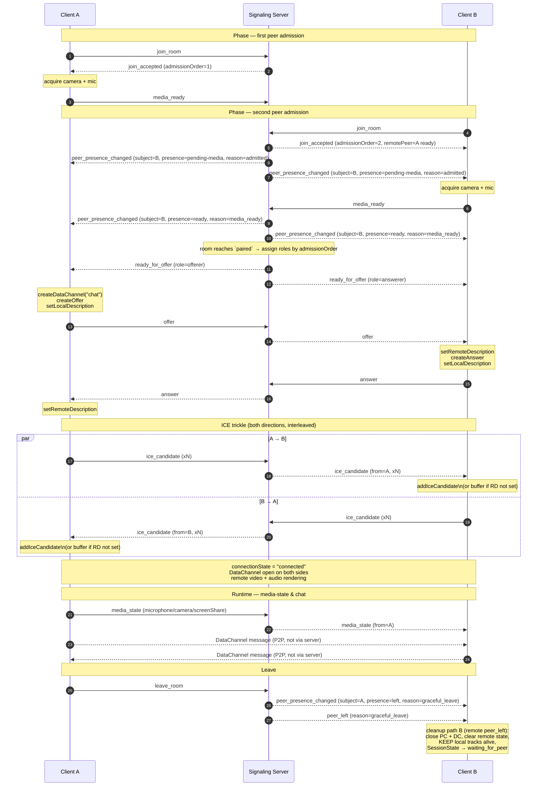

# Signaling Protocol Contract (v1)

**Feature**: 1:1 WebRTC Learning Call
**Branch**: `001-webrtc-1to1-call`
**Contract version**: `1`
**Date**: 2026-04-19
**Transport**: WebSocket text frames (one JSON message per frame)
**Status**: **canonical source of truth** for every signaling message.
The Go server and the TypeScript client both derive their validators
from this document.

> Per Constitution Principle II: **no ad-hoc JSON messages are
> permitted.** Any message whose `type` is not listed below, or whose
> shape does not match its schema here, MUST be rejected by both sides
> with an `error occurred` log entry.

---

## 1. Message envelope

Every frame is a JSON object with the following envelope:

```json
{
  "v": 1,
  "type": "<enum>",
  "roomId": "<string, required for all room-scoped messages>",
  "from": "<peerId, server-assigned>",
  "to": "<peerId, optional>",
  "requestId": "<uuid-v4, optional, for request correlation>",
  "ts": 1713500000000,
  "payload": { }
}
```

| Field | Type | Required | Notes |
|---|---|---|---|
| `v` | integer | **yes** | contract version; currently `1` |
| `type` | string | **yes** | message-type enum (see §3) |
| `roomId` | string | **yes** for room-scoped messages | validated per Room ID rules |
| `from` | string | set by server on relay | UUIDv4 peer ID |
| `to` | string | optional | set when relaying to a specific peer |
| `requestId` | string | optional | UUIDv4 generated by sender of request-style messages |
| `ts` | integer | optional | Unix milliseconds; informational |
| `payload` | object | per-type | see each message below |

**Room ID validation** (server authoritative, client pre-checks):

- trimmed, case-sensitive
- length 1–64
- regex: `^[A-Za-z0-9._-]{1,64}$`
- any violation ⇒ `join_rejected_invalid_room`

**Peer ID generation**: server generates a UUIDv4 on `join_accepted`.
Clients MUST NOT invent their own `peerId`.

---

## 2. Direction legend

- **C→S**: client → server
- **S→C**: server → client (unicast to one peer)
- **S→B**: server → broadcast (both peers in the room)

---

## 3. Message types

### 3.1 `join_room` (C→S)

**Purpose**: client requests admission to a room.

**Direction**: C→S

**Required fields**: `v`, `type`, `roomId`, `requestId`

**Optional fields**: `ts`

**Payload**: empty `{}` (room ID carried in envelope).

**Example**:

```json
{
  "v": 1,
  "type": "join_room",
  "roomId": "demo",
  "requestId": "5b3a1e23-...-...-...-...",
  "ts": 1713500000000,
  "payload": {}
}
```

**Validation rules** (server):

1. `roomId` matches the Room ID regex.
2. Room has ≤ 1 reserved slots.
3. If the source WebSocket is already in a room ⇒ `error` with code
   `already_joined`.

**Server response**: exactly one of:

- `join_accepted` (admission succeeded), OR
- `join_rejected` (pre-admission rejection — carries `result:
  join_rejected_room_full | join_rejected_invalid_room` in the payload),
  OR
- `error` with code `already_joined` (WS violated its one-room-per-
  connection contract).

The historical separate `room_full` message type has been **removed**
(review-pass 4 unified pre-admission rejection into a single
`join_rejected` message). Post-admission slot release uses the
separate `participant_released` message (§3.13).

---

### 3.2 `join_accepted` (S→C)

**Purpose**: tell the joining client its admission succeeded and
assign its `peerId`.

**Direction**: S→C (to the joiner only)

**Required fields**: `v`, `type`, `roomId`, `requestId` = echoed from
the `join_room`, `payload`

**Envelope `from`** is **omitted** on system-originated S→C messages
(join_accepted, join_rejected, participant_released,
peer_presence_changed, ready_for_offer, peer_left). Only relay
messages (offer / answer / ice_candidate / media_state) carry
`from = sender peerId`. See §1 for the canonical rule.

**Payload**:

```json
{
  "peerId": "uuid-v4",
  "admissionOrder": 1,
  "roomReadiness": "waiting_for_media",
  "remotePeer": null
}
```

- `peerId` — the server-assigned identity of this participant. Clients
  MUST read their own peerId from `payload.peerId` (not from
  envelope `from`).
- `admissionOrder` — 1 or 2; strictly monotonic per room.
- `roomReadiness` — room call-readiness at the moment of admission.
- `remotePeer` — snapshot of the other reserved slot if any, else null:

  ```json
  {
    "peerId": "uuid-v4",
    "mediaReadiness": "pending-media" | "ready"
  }
  ```

**Example**:

```json
{
  "v": 1,
  "type": "join_accepted",
  "roomId": "demo",
  "requestId": "5b3a1e23-...",
  "ts": 1713500000100,
  "payload": {
    "peerId": "8e4c0...",
    "admissionOrder": 2,
    "roomReadiness": "waiting_for_media",
    "remotePeer": { "peerId": "a11ce-...", "mediaReadiness": "ready" }
  }
}
```

**Client validation**: payload matches schema; store `peerId` and
`admissionOrder`.

**Error behavior**: if validation fails, client logs `error occurred`
with reason `bad_join_accepted` and closes the WS.

---

### 3.3 `join_rejected` (S→C)

**Purpose**: pre-admission rejection of a `join_room` request. Used
for both "room is full" and "room ID failed validation". Post-
admission releases (media-failure, disconnect while pending-media) use
the separate `participant_released` message (§3.13).

**Direction**: S→C (to the rejected joiner only)

**Required fields**: `v`, `type`, `roomId`, `requestId` (echo), `payload`

**Payload**:

```json
{
  "result": "join_rejected_room_full" | "join_rejected_invalid_room",
  "reason": "room_full" | "invalid_room_id",
  "message": "human-readable short reason"
}
```

- `result` — the canonical Join Result enum value (spec §Key Entities).
- `reason` — short machine-readable tag (aligned with `result` suffix).
- `message` — human-readable, safe for UI display.

**Example — room full** (rejected because 2 slots already reserved,
including any `pending-media`):

```json
{
  "v": 1,
  "type": "join_rejected",
  "roomId": "demo",
  "requestId": "5b3a1e23-...",
  "payload": {
    "result": "join_rejected_room_full",
    "reason": "room_full",
    "message": "Room 'demo' already has two reserved participants."
  }
}
```

**Example — invalid room ID**:

```json
{
  "v": 1,
  "type": "join_rejected",
  "roomId": "bad room!",
  "requestId": "5b3a1e23-...",
  "payload": {
    "result": "join_rejected_invalid_room",
    "reason": "invalid_room_id",
    "message": "Room ID must match ^[A-Za-z0-9._-]{1,64}$."
  }
}
```

**Validation (client)**: on receipt, show a user-visible error keyed
to `reason`, log `error occurred`, close WS. No state change other
than returning to `idle`.

**Error behavior**: none further; terminal for this join attempt.

---

### 3.4 `peer_presence_changed` (S→B)

**Purpose**: notify both reserved participants whenever **any**
participant's slot presence or media readiness changes (admission,
media-readiness transition, call-phase transition, release, leave).
This is the **single** message that powers FR-022b (bidirectional
pending-media visibility) and replaces the earlier separate
`peer_joined` / `peer_left` / `peer_state_changed` designs.

**Direction**: S→B (to both reserved participants in the room,
including the subject participant itself).

**Required fields**: `v`, `type`, `roomId`, `payload`

**Payload**:

```json
{
  "subjectPeerId": "uuid-v4",
  "admissionOrder": 1 | 2,
  "presence": "pending-media" | "ready" | "in-call" | "left" | "released",
  "reason": "admitted" | "media_ready" | "media_failed" | "role_assigned" | "graceful_leave" | "disconnect" | "pending_released"
}
```

- `subjectPeerId` — the peer whose state changed. Receiver MAY
  compare against its own `peerId` to know if the event is about
  **self** or **remote**.
- `admissionOrder` — echoed for convenience (derivable from
  prior messages).
- `presence` — canonical presence enum (unifies media-readiness +
  call-phase + termination):
  - `pending-media` — admitted, no `media_ready` yet.
  - `ready` — `media_ready` received, not yet paired.
  - `in-call` — role assigned; negotiating or connected.
  - `left` — graceful or ungraceful departure; slot released.
  - `released` — admitted then released without ever reaching
    `in-call` (e.g., `media_failed`, `pending_released`).
- `reason` — short tag explaining the transition trigger.

**Example — remote admitted, still pending-media** (sent to the
already-waiting peer):

```json
{
  "v": 1,
  "type": "peer_presence_changed",
  "roomId": "demo",
  "payload": {
    "subjectPeerId": "8e4c0...",
    "admissionOrder": 2,
    "presence": "pending-media",
    "reason": "admitted"
  }
}
```

**Example — remote just became media-ready**:

```json
{
  "v": 1,
  "type": "peer_presence_changed",
  "roomId": "demo",
  "payload": {
    "subjectPeerId": "8e4c0...",
    "admissionOrder": 2,
    "presence": "ready",
    "reason": "media_ready"
  }
}
```

**Example — remote pending-media participant failed media
acquisition** (sent to the already-waiting peer):

```json
{
  "v": 1,
  "type": "peer_presence_changed",
  "roomId": "demo",
  "payload": {
    "subjectPeerId": "8e4c0...",
    "admissionOrder": 2,
    "presence": "released",
    "reason": "media_failed"
  }
}
```

**Validation (client)**:

- Update `remoteParticipant.presence` for events where
  `subjectPeerId != selfPeerId`.
- For self-events (`subjectPeerId == selfPeerId`), the message is
  informational — the client already drove the transition.
- Append one event-log entry per message, keyed to `reason`
  (`peer joined`, `peer ready`, `peer left`, `pending peer released`,
  etc.).

**Relationship to `peer_left` (§3.12)**: `peer_left` is a convenience
message sent at the same time as the terminating `peer_presence_changed`
so the remaining peer has a single trigger point for cleanup. A
compliant server MAY send **only** `peer_presence_changed(presence:
"left" | "released")` if the client supports it; the spec-default
behavior is to send both for clarity and ease of implementation.

---

### 3.5 `media_ready` (C→S)

**Purpose**: client reports successful local-media acquisition.
Required before pairing can happen.

**Direction**: C→S

**Required fields**: `v`, `type`, `roomId`, `payload`

**Payload**:

```json
{
  "mediaCapabilities": {
    "audio": true,
    "video": true
  }
}
```

- Both `audio` and `video` **MUST be `true`**. The MVP does not
  support audio-only or video-only mode (spec Non-Goals + Assumptions:
  "Users have a working camera and microphone"). A client that
  cannot deliver both MUST send `media_failed` instead.

**Example**:

```json
{
  "v": 1,
  "type": "media_ready",
  "roomId": "demo",
  "payload": { "mediaCapabilities": { "audio": true, "video": true } }
}
```

**Server behavior**: transitions the participant's media readiness
`pending-media → ready`. If both reserved participants are now `ready`,
the room reaches `paired` call-readiness and the server sends
`ready_for_offer` to both peers.

**Validation (server)**:

- Participant's media readiness MUST be `pending-media`; otherwise
  `error` with code `unexpected_media_ready`.
- Both `mediaCapabilities.audio` and `mediaCapabilities.video` MUST
  be `true`; otherwise `error` with code `unsupported_media_capability`
  and no state change (client is expected to send `media_failed`
  instead).

---

### 3.6 `media_failed` (C→S)

**Purpose**: client reports local-media acquisition failure. Triggers
slot release per FR-010d.

**Direction**: C→S

**Required fields**: `v`, `type`, `roomId`, `payload`

**Payload**:

```json
{
  "reason": "permission_denied" | "device_not_found" | "device_in_use" | "other",
  "detail": "optional human-readable string, no secrets"
}
```

**Example**:

```json
{
  "v": 1,
  "type": "media_failed",
  "roomId": "demo",
  "payload": { "reason": "permission_denied" }
}
```

**Server behavior**:

1. Release the sender's slot.
2. Send `participant_released` (§3.13) to the sender with
   `result: participant_released_media_failed`.
3. If a remote peer was shown the pending participant (per FR-022b),
   send them a `peer_presence_changed` with `presence: "released",
   reason: "media_failed"`.

**Validation (server)**: sender's `mediaReadiness` MUST be
`pending-media`.

---

### 3.7 `ready_for_offer` (S→C)

**Purpose**: assign offerer/answerer role. Sent exactly once per
pairing attempt, to both peers, when room reaches `paired`.

**Direction**: S→B (role differs per peer)

**Required fields**: `v`, `type`, `roomId`, `payload`

**Payload**:

```json
{
  "role": "offerer" | "answerer",
  "remotePeer": {
    "peerId": "uuid-v4",
    "admissionOrder": 1 | 2
  },
  "iceServers": [
    { "urls": ["stun:stun.l.google.com:19302"] },
    { "urls": ["turn:turn.example.com:3478"], "username": "...", "credential": "..." }
  ]
}
```

- `iceServers` — exactly the shape `RTCPeerConnection` expects. The
  server loads it from env and relays; it is NOT cached or logged.
- `role === "offerer"` is sent to the participant with the lower
  `admissionOrder`.

**Example** (offerer):

```json
{
  "v": 1,
  "type": "ready_for_offer",
  "roomId": "demo",
  "to": "a11ce-...",
  "payload": {
    "role": "offerer",
    "remotePeer": { "peerId": "8e4c0...", "admissionOrder": 2 },
    "iceServers": [{ "urls": ["stun:stun.l.google.com:19302"] }]
  }
}
```

**Validation (client)**: must arrive exactly once per pairing. If
received in state other than `waiting-for-peer`, log
`unexpected_ready_for_offer` and ignore.

**Client behavior**:

- Both peers: construct `RTCPeerConnection(iceServers)`, attach local
  tracks, wire event handlers.
- Offerer: create `RTCDataChannel("chat")` **before** `createOffer`
  so SDP contains a data m-line. Then `createOffer` →
  `setLocalDescription` → send `offer`.
- Answerer: do not create DataChannel; wait for `ondatachannel`.

---

### 3.8 `offer` (C→S→C, relay)

**Purpose**: deliver the offerer's SDP to the answerer.

**Direction**: C→S (from offerer) then S→C (to answerer, server sets
`from`).

**Required fields**: `v`, `type`, `roomId`, `payload`

**Payload**:

```json
{
  "sdp": {
    "type": "offer",
    "sdp": "v=0\r\no=- ... ...\r\n"
  }
}
```

**Example**:

```json
{
  "v": 1,
  "type": "offer",
  "roomId": "demo",
  "from": "a11ce-...",
  "to": "8e4c0...",
  "payload": { "sdp": { "type": "offer", "sdp": "v=0\r\n..." } }
}
```

**Validation (server)** — uses the split server model
(`MediaReadiness` × `CallPhase`):

- Sender's `mediaReadiness` MUST be `ready`.
- Sender's `callPhase` MUST be `role-assigned` or `negotiating`.
- Sender's assigned role for this pairing MUST be `offerer`.
- `payload.sdp.type === "offer"`.
- A **second** offer for the same pairing attempt (sender's
  `callPhase` already moved past `role-assigned` for an earlier
  offer) is rejected as `unexpected_offer` (spec EC-013).

**Validation (client/answerer)**: `payload.sdp.type === "offer"`;
local `SessionState` MUST be `connecting` (post `ready_for_offer`).

**Error behavior**: any server validation failure ⇒ `error` with code
`unexpected_offer`. The offerer MUST NOT send a second offer for the
same pairing attempt (would be glare; spec EC-013).

---

### 3.9 `answer` (C→S→C, relay)

**Purpose**: deliver the answerer's SDP back to the offerer.

**Direction**: C→S (from answerer) then S→C (to offerer).

**Required fields**: `v`, `type`, `roomId`, `payload`

**Payload**:

```json
{
  "sdp": {
    "type": "answer",
    "sdp": "v=0\r\n..."
  }
}
```

**Validation (server)** — uses the split server model:

- Sender's `mediaReadiness` MUST be `ready`.
- Sender's `callPhase` MUST be `role-assigned` or `negotiating`.
- Sender's assigned role for this pairing MUST be `answerer`.
- `payload.sdp.type === "answer"`.

**Error behavior**: unexpected answer ⇒ `error` with code
`unexpected_answer`.

---

### 3.10 `ice_candidate` (C→S→C, relay)

**Purpose**: relay a single ICE candidate from one peer to the other.

**Direction**: C→S then S→C.

**Required fields**: `v`, `type`, `roomId`, `payload`

**Payload**:

```json
{
  "candidate": {
    "candidate": "candidate:1 1 UDP ...",
    "sdpMid": "0",
    "sdpMLineIndex": 0,
    "usernameFragment": "abcd1234"
  }
}
```

Passing `candidate: null` signals **end-of-candidates** (trickle
done). Clients MUST forward this. The empty-string form is **not**
valid — validators MUST reject `candidate: ""` with `malformed`.

**End-of-candidates example**:

```json
{
  "v": 1,
  "type": "ice_candidate",
  "roomId": "demo",
  "payload": { "candidate": null }
}
```

**Validation (server)** — uses the split server model:

- Sender's `mediaReadiness` MUST be `ready`.
- Sender's `callPhase` MUST be one of `role-assigned`, `negotiating`,
  or `connected` (late-trickle candidates during an established call
  are legal).
- Body is relayed as-is (server does not parse the candidate string).

**Validation (client)**: on receive, either call `addIceCandidate` if
remote description is set, or buffer per `IceBuffer` rules
(data-model §B.6).

---

### 3.11 `media_state` (C→S→C, relay)

**Purpose**: announce local mic / camera / screen-share state changes
so the remote UI can reflect them intentionally (FR-014a).

**Direction**: C→S then S→C (relayed to remote peer only).

**Required fields**: `v`, `type`, `roomId`, `payload`

**Payload**:

```json
{
  "microphone": "on" | "off",
  "camera": "on" | "off",
  "screenShare": "active" | "inactive"
}
```

All three fields are **required** in every `media_state` message so
the full state is always known; partial updates are not supported (MVP
simplicity, Principle IX).

**Example**:

```json
{
  "v": 1,
  "type": "media_state",
  "roomId": "demo",
  "payload": { "microphone": "off", "camera": "on", "screenShare": "inactive" }
}
```

**Validation (server)** — uses the split server model:

- Sender's `mediaReadiness` MUST be `ready`.
- Sender's `callPhase` SHOULD be `connected` for normal MVP operation.
  The server MAY relay `media_state` during `negotiating` (e.g., to
  announce an initial mute state right after `ready_for_offer`); the
  remote MUST render based on its own current state.
- Not valid from `pending-media` or `idle` senders.

---

### 3.12 `peer_left` (S→C)

**Purpose**: convenience message that notifies the remaining
participant the **in-call peer** is gone — its only job is to give
the client a single obvious trigger point for the remote-peer-left
cleanup (data-model §C.5 Path B).

**When sent**: **only when the remote participant had reached
`callPhase ∈ {role-assigned, negotiating, connected}`** — i.e., a
peer who was actually in the call. Pending-media releases (the
remote never became `ready`, or it failed before pairing) are NOT
announced via `peer_left`; they are announced via
`peer_presence_changed` (§3.4) with `presence: "released"` only.
This keeps the event log clean: pending-media departures appear as
"pending peer released" and only actual in-call departures appear as
"peer left".

**Direction**: S→C (to the remaining peer).

**Required fields**: `v`, `type`, `roomId`, `payload`

**Payload**:

```json
{
  "peerId": "uuid-v4",
  "reason": "graceful_leave" | "disconnect"
}
```

- `graceful_leave` — peer sent `leave_room`.
- `disconnect` — WebSocket closed without `leave_room`.

Only these two reasons are valid for `peer_left`. Pre-pairing
reasons (`media_failed`, `pending_released`) are delivered through
`peer_presence_changed` alone.

**Example**:

```json
{
  "v": 1,
  "type": "peer_left",
  "roomId": "demo",
  "payload": { "peerId": "8e4c0...", "reason": "graceful_leave" }
}
```

**Client behavior** (remote peer departed; this is NOT a local
failure):

1. Close the `RTCPeerConnection` and `RTCDataChannel`.
2. Clear `RemoteMediaState` and any references to remote tracks.
3. **Keep local `MediaStreamTrack`s running** (camera/mic/screen).
   The local user has not left — only the remote peer did.
4. Transition session state:
   - If local is still media-ready → `waiting-for-peer`.
   - If local was still `pending-media` (shouldn't happen
     post-connected, but possible mid-negotiation) → back to
     `pending-media`.
5. Do NOT enter terminal `failed` — `peer_left` is not a local
   failure (spec FR-005 split).
6. Log event `peer left` with `reason`.

See data-model §C.5 for the full cleanup-ordering contract (three
distinct cleanup paths: local leave, remote peer_left, local
terminal failure — they are NOT the same).

---

### 3.13 `participant_released` (S→C)

**Purpose**: tell a previously-admitted client that **its own** slot
was released. Unlike `join_rejected` (pre-admission), this is a
post-admission release — the slot was reserved but never became
`in-call`. Typical triggers: the client's own `media_failed` signal,
a pending-media WS disconnect observed by the server.

**Direction**: S→C (to the released peer only — unicast). **Note
however**: if the release is caused by a WebSocket disconnect, the
released peer is by definition unreachable, so `participant_released`
cannot be delivered to it. In that case the server MUST still
release the slot and MUST notify any remaining reserved participant
via `peer_presence_changed` with `presence: "released"` and
`reason: "disconnect"` (the "disconnect → released" path is how the
remaining peer learns about the pending-media failure).

**Required fields**: `v`, `type`, `roomId`, `payload`

**Payload**:

```json
{
  "result": "participant_released_media_failed" | "participant_released_disconnect",
  "reason": "media_failed" | "disconnect",
  "detail": "camera_permission_denied"
}
```

- `result` — canonical Join-Result-style enum for post-admission
  outcomes.
- `reason` — short machine-readable tag.
- `detail` — optional short human string (no secrets, no SDP, no
  ICE content).

**Example**:

```json
{
  "v": 1,
  "type": "participant_released",
  "roomId": "demo",
  "payload": {
    "result": "participant_released_media_failed",
    "reason": "media_failed",
    "detail": "camera_permission_denied"
  }
}
```

**Client behavior**: media-acquisition failure is **retry-able**, not
terminal. The client MUST:

- Show a clear permission/media error with a visible Retry affordance
  (per FR-009) — do NOT enter terminal `failed`.
- Keep the WS alive; the user can click Join again after fixing the
  permission / hardware issue, which re-enters `joining` →
  `pending-media` without reconnecting the WS.
- Transition session state to a **retry-able** state:
  `pending-media → media-error`, or back to `idle-with-error` in
  simpler implementations. (Canonical: `media-error` in data-model
  §B.1.)
- Log event `error occurred` with reason = `result`.

Reserved terminal-`failed` is only for local peer-connection
failures (ICE failure, local fatal), never for media-acquisition
failures.

---

### 3.14 `leave_room` (C→S)

**Purpose**: explicit, graceful departure.

**Direction**: C→S

**Required fields**: `v`, `type`, `roomId`

**Payload**: `{}`

**Example**:

```json
{
  "v": 1,
  "type": "leave_room",
  "roomId": "demo",
  "payload": {}
}
```

**Server behavior**: release the sender's slot; broadcast `peer_left`
with `reason: "graceful_leave"` to the remaining peer (if any); close
the WS.

**Validation**: sender must be in the room. Otherwise `error` with
`not_in_room`.

---

### 3.15 `error` (S→C or bidirectional)

**Purpose**: communicate a protocol-level error.

**Direction**: typically S→C (server rejecting a client message);
clients MAY send `error` to the server to signal local failures (e.g.,
Zod validation rejection of an inbound server message). Server ignores
client-originated `error` except to log it.

**Required fields**: `v`, `type`, `payload`

**Payload**:

```json
{
  "code": "<error code enum>",
  "message": "short human-readable",
  "correlates": "<optional requestId being answered>"
}
```

**Error codes**:

| Code | Meaning |
|---|---|
| `already_joined` | same WS tried to join two rooms |
| `unexpected_media_ready` | `media_ready` received while sender's `mediaReadiness` ≠ `pending-media` |
| `unsupported_media_capability` | `media_ready.mediaCapabilities` missing `audio` or `video` (MVP requires both; §3.5) |
| `unexpected_offer` | `offer` received from non-offerer or with wrong `mediaReadiness` / `callPhase` |
| `unexpected_answer` | `answer` received from non-answerer or with wrong `mediaReadiness` / `callPhase` |
| `not_in_room` | protocol action requires room membership |
| `malformed` | envelope or payload failed schema validation (includes `ice_candidate` with `candidate: ""`) |
| `unsupported_version` | `v != 1` |
| `internal_error` | server-side fault (no detail leaked) |

> **`room_full` and `invalid_room_id` are NOT `error` codes.** Pre-
> admission rejection is delivered via the dedicated `join_rejected`
> message (§3.3) with `payload.result` = `join_rejected_room_full`
> or `join_rejected_invalid_room`. This keeps admission outcomes on
> one canonical channel.

**Client behavior**: log `error occurred` with code; do not mutate
state based on an `error` except to reset after certain terminal
codes (`already_joined`, `unsupported_version`).

---

### 3.16 WebSocket-level Ping/Pong (out of band)

**Purpose**: ungraceful disconnect detection (SC-009 / EC-009 / EC-010).

**Direction**: server-initiated Ping frames (WS control frames, not
JSON messages).

**Timing** (sized to satisfy SC-009's **10-second worst-case**
detection bound; a 10s + 10s layout has a 20s worst case and would
fail the criterion):

- Ping interval: **5 seconds**.
- Pong timeout: **5 seconds** after each Ping send.
- Worst-case detection: peer goes silent just after a Ping is sent ⇒
  next Ping 5s later ⇒ Pong timeout 5s after that ⇒ server closes
  within **≤ 10 seconds**.
- On timeout: server closes the WS and releases the slot via
  `peer_presence_changed(presence: "left", reason: "disconnect")`
  (and the convenience `peer_left` message if the slot was in-call).

Clients do NOT send app-level ping messages. The browser auto-responds
with Pong. Both timings are exposed as env vars (`PING_INTERVAL_MS`,
`PONG_TIMEOUT_MS`) with the 5000 ms defaults above.

---

## 4. Relay semantics

The server is a **pure signaling relay** for these types:

- `offer`, `answer`, `ice_candidate`, `media_state`.

For these, the server:

1. Validates envelope + sender state.
2. Sets `from = sender.peerId`.
3. Forwards the JSON to the other peer in the room (if any).
4. Does NOT parse, mutate, cache, or persist the payload.
5. Does NOT log payload bodies (SDP, ICE, media state) — only
   counts + correlation IDs.

This implements spec FR-011 (media path is peer-to-peer) and FR-029
(signaling server does not touch media).

---

## 5. Message sequence — happy path



---

## 6. Conformance checklist

A compliant implementation MUST:

- Validate every inbound message against its schema in §3.
- Reject any message with `v != 1`.
- Use **one** pre-admission rejection message (`join_rejected`) and
  **one** post-admission release message (`participant_released`).
  Do not implement a separate `room_full` message type.
- Use **one** peer-presence-change message
  (`peer_presence_changed`). The legacy `peer_joined` /
  `peer_state_changed` types are not present; `peer_left` is kept
  only as a convenience fired alongside `peer_presence_changed(
  presence: "left" | "released")`.
- Emit `peer_presence_changed` to **both** reserved participants on
  every readiness / call-phase transition (bidirectional pending-
  media visibility per FR-022b).
- Refuse to create an `RTCPeerConnection` before receiving
  `ready_for_offer`.
- Refuse to `createOffer` unless `role === "offerer"`.
- Buffer remote ICE candidates arriving before `setRemoteDescription`.
- Forward `ice_candidate` end-of-candidates as `candidate: null`
  exactly (reject `candidate: ""` as `malformed`).
- Send a `media_state` message on every local mic/camera/screen
  transition.
- Reject `media_ready` payloads where either `audio` or `video` is
  not `true` (return `error` with `unsupported_media_capability`).
- On a remote `peer_left`, **keep local `MediaStreamTrack`s running**
  (cleanup path B, data-model §C.5). Stopping local tracks is only
  correct when the **local** user leaves (path A) or eventually
  clicks Leave from `failed` (path C).
- On WS-level Pong timeout, close the WS within the configured
  window (default 5 s after Ping; ≤ 10 s total worst case per
  SC-009).
- Tag every chat event in the UI event log with its transport
  (`signaling` vs `datachannel` — see US5 Conditional events).
- Omit envelope `from` on system-originated S→C messages
  (join_accepted, join_rejected, participant_released,
  peer_presence_changed, ready_for_offer, peer_left). Carry
  `from = sender.peerId` only on relay messages (offer, answer,
  ice_candidate, media_state).
- Never log SDP bodies, ICE candidate strings, or TURN credentials
  (NFR-003).
