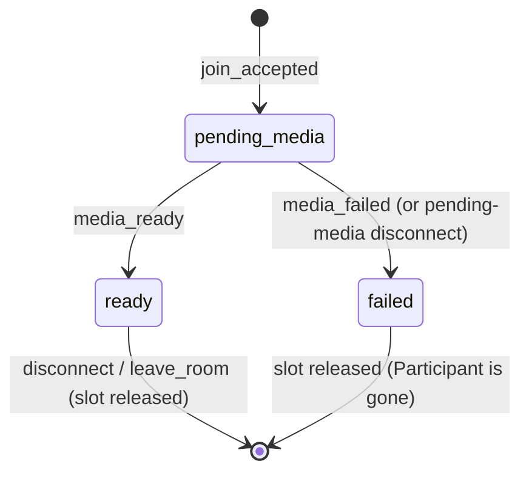
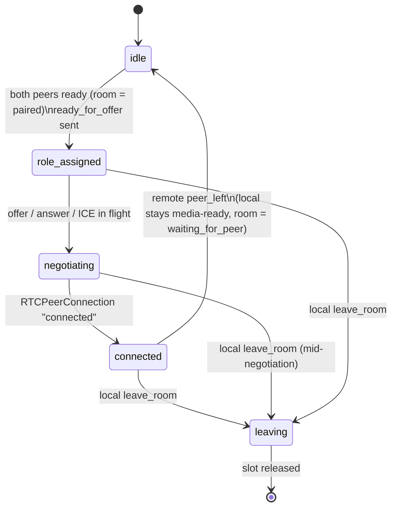
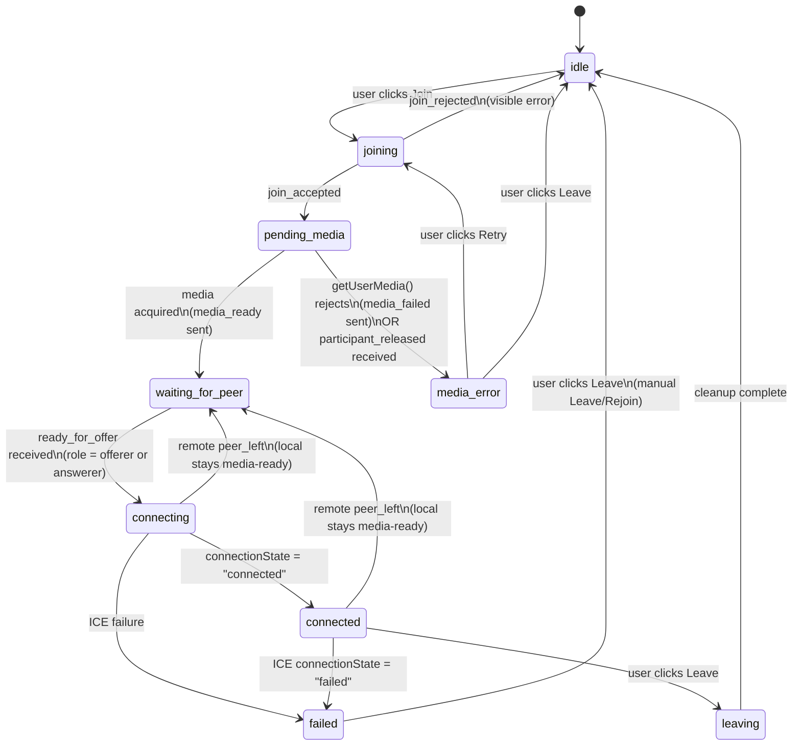

# Phase 1 — Data Model

**Feature**: 1:1 WebRTC Learning Call
**Branch**: `001-webrtc-1to1-call`
**Date**: 2026-04-19

This document defines the **in-memory models** on both sides of the system.
Nothing persists — no database, no disk — per Non-Goals. Every model here
exists to coordinate the signaling handshake and the local WebRTC state
machine; once a room empties, its state is garbage.

All state transitions in this document are exhaustive; unlisted transitions
are invalid and MUST be rejected with an `error occurred` log entry.

---

## Part A — Server state model (Go, in-memory)

### A.1 `RoomManager`

The single top-level service. Holds all active rooms and mediates
admission decisions.

**Fields**:

| Field | Type | Purpose |
|---|---|---|
| `rooms` | `map[string]*Room` | active rooms keyed by `roomId` |
| `mu` | `sync.RWMutex` | protects `rooms` |
| `roomIDRegex` | `*regexp.Regexp` | server-authoritative validation (FR Room-ID) |

**Methods**:

- `Admit(roomID, conn) (*Participant, JoinResult)` — validates,
  creates or reuses a `Room`, enforces capacity (2 reserved slots),
  attaches a new `Participant`, returns the Join Result.
- `Release(roomID, peerID, reason)` — releases a slot (media failure,
  leave, ungraceful disconnect). If the room becomes empty, removes
  it from the map.

### A.2 `Room`

**Fields**:

| Field | Type | Purpose |
|---|---|---|
| `id` | `string` | room identifier |
| `slots` | `[2]*Participant` | fixed-size capacity; nil slots are free |
| `admissionCounter` | `uint64` | monotonic per-room; assigned on admission; establishes offerer ordering |
| `rolesAssigned` | `bool` | set `true` when `ready_for_offer` has been sent for the current pairing; reset to `false` on any slot release |
| `createdAt` | `time.Time` | diagnostic only |
| `mu` | `sync.Mutex` | serializes all room-scoped mutations |

**Derived properties** (computed, not stored — spec Key Entities):

- **Slot occupancy** (for admission decisions):
  - `0 reserved` if all slots nil
  - `1 reserved` if exactly one slot non-nil
  - `2 reserved` if both slots non-nil ⇒ reject further joins with
    `join_rejected_room_full`
- **Call-readiness** (for role assignment + UI broadcast). Defined
  against `mediaReadiness`, **not** `callPhase`:
  - `empty` — no reserved participants
  - `waiting_for_media` — at least one reserved participant where
    `mediaReadiness != ready` (i.e., still `pending-media`)
  - `waiting_for_peer` — exactly one reserved participant with
    `mediaReadiness == ready` AND one nil slot
  - `paired` — both slots non-nil AND both participants have
    `mediaReadiness == ready`, regardless of their `callPhase`. The
    first time the room enters `paired`, the server sends
    `ready_for_offer` to both peers **exactly once**; subsequent
    idempotent re-evaluations do NOT re-send (`Room.rolesAssigned`
    flag tracks this).

**Why this matters**: after `ready_for_offer` is sent both
participants' `callPhase` advances past `idle`, but their
`mediaReadiness` remains `ready`. The room therefore remains `paired`,
which is the correct reading: the pairing is still valid while the
call is ongoing. If the remote peer later leaves, the local
participant stays media-ready; the room drops to `waiting_for_peer`,
and a new joiner can re-pair without the local participant
re-acquiring media.

**Invariants**:

- Capacity for admission is based on reserved slot count, never on
  call-readiness.
- `admissionCounter` is assigned once per successful `join_accepted`
  and never revoked; a released slot does not renumber the remaining
  participant.
- Role assignment (`ready_for_offer`) is sent **exactly once** per
  pairing attempt.

### A.3 `Participant`

**Fields**:

| Field | Type | Purpose |
|---|---|---|
| `peerID` | `string` | server-assigned, UUIDv4 |
| `roomID` | `string` | back-reference |
| `admissionOrder` | `uint64` | from `Room.admissionCounter` at join |
| `mediaReadiness` | `MediaReadiness` | see enum below |
| `callPhase` | `CallPhase` | see enum below |
| `conn` | `*websocket.Conn` | the active WS connection |
| `connMu` | `sync.Mutex` | serializes writes to `conn` |
| `joinedAt` | `time.Time` | diagnostic only |
| `lastSeen` | `time.Time` | updated on each received frame / Pong |

> **State is split into two orthogonal enums** (`MediaReadiness` ×
> `CallPhase`) rather than a single flat enum. This is deliberate: in
> review pass 4 we found that collapsing `ready` and `in-call` into
> one enum broke derived room call-readiness (a `paired` room
> transitioned back out of `paired` the instant roles were assigned).
> Splitting keeps "did this peer finish media?" independent of "what
> phase of the call is this peer in?".

**`MediaReadiness` enum**:

```
pending-media  -- join_accepted sent; awaiting media_ready or media_failed
ready          -- media_ready received; eligible for pairing
failed         -- media acquisition failed (slot released — terminal for this Participant instance)
```

**`CallPhase` enum**:

```
idle            -- not yet paired; media readiness may still be transitioning
role-assigned   -- ready_for_offer delivered; RTCPeerConnection being set up
negotiating     -- offer/answer/ICE in flight
connected       -- peer connection reached "connected"; media flowing
leaving         -- explicit leave_room received; cleanup in progress
```

A participant is **"media-ready"** (for the purpose of room
call-readiness) whenever `mediaReadiness == ready`, **regardless of
`callPhase`**. This means:

- `{ready, idle}` — media-ready, not yet paired.
- `{ready, role-assigned | negotiating | connected}` — media-ready,
  in a call. Still counts toward room `paired`.
- `{pending-media, idle}` — slot reserved, media not done.
- `{failed, *}` — slot has been released (Participant is gone).

**State transitions** — two orthogonal state machines.

**MediaReadiness transitions**:



**CallPhase transitions** (only applicable while
`mediaReadiness == ready`):



> Key consequence: when the remote peer leaves, the local
> participant's `callPhase` drops `connected → idle` while
> `mediaReadiness` stays `ready`. The room then recomputes to
> `waiting_for_peer`, and the next joiner pairs with the same local
> participant without going back through media acquisition.

**Rejected transitions** (MUST produce an `error` response, not a
state change):

- `media_ready` while `mediaReadiness != pending-media`
- `offer` / `answer` / `ice_candidate` while
  `!(mediaReadiness == ready && callPhase in {role-assigned, negotiating, connected})`
- `leave_room` before `join_accepted` (no Participant exists yet)

### A.4 `JoinResult` enum (server → client)

Canonical outcomes of a `join_room` request or of a post-admission
slot release. These values are carried as `payload.result` in the
`join_rejected` and `participant_released` messages — see
`contracts/signaling-protocol.md` §3.3 and §3.13.

```
join_accepted                          -- admission succeeded
join_rejected_room_full                -- pre-admission: 2 slots already reserved
join_rejected_invalid_room             -- pre-admission: room ID failed validation
participant_released_media_failed      -- post-admission: client sent media_failed (or was observed to)
participant_released_disconnect        -- post-admission: pending-media client WS closed before media_ready
```

> Pre-admission rejections (`join_rejected_*`) are delivered via the
> `join_rejected` message. Post-admission releases
> (`participant_released_*`) are delivered via the
> `participant_released` message. A single `join_room` attempt can
> produce only one terminal outcome.

Only one of these is ever sent per `join_room` request (plus follow-up
messages on state changes).

### A.5 `PeerPresence` events (server → both clients)

Whenever any participant's `mediaReadiness` OR `callPhase` changes,
the server broadcasts a **single** `peer_presence_changed` message
to **both** reserved slots (including the subject participant
itself). For clarity and ease of client implementation, the server
also emits the convenience `peer_left` message alongside the
terminating `peer_presence_changed` (presence = `left` | `released`).
This powers FR-022b (bidirectional peer-presence updates).

The earlier separate `peer_joined` / `peer_left` /
`peer_state_changed` designs are superseded — see review-pass 4
notes in `checklists/requirements.md` and
`contracts/signaling-protocol.md §3.4`.

**Not a standalone model** — this is derived from the subject
Participant's `(mediaReadiness, callPhase)` pair; listed here
because it's the only cross-participant signal the server emits on
top of 1:1 message relay.

---

## Part B — Client state model (TypeScript, in-memory)

The client is a React + reducer combination. All long-lived state lives
in one reducer (`rootReducer`) plus a small set of WebRTC-owned
objects (`RTCPeerConnection`, `MediaStream`s, `RTCDataChannel`) stored
in refs (they are not serializable and must not live in React state).

### B.1 `SessionState` — top-level finite state machine



Key distinctions (review-pass-4 clarifications):

- `media_error` is a **retry-able** state reached from
  `pending_media` on local `getUserMedia()` rejection **or** on
  server `participant_released`. It is NOT terminal; the user can
  click Retry to re-enter `joining` without reconnecting the WS.
  Reserved terminal `failed` is only for **local peer-connection
  failure** (ICE failure), not for media-acquisition failure.
- Remote `peer_left` from `connecting` or `connected` drops the local
  peer back to `waiting_for_peer` (local `mediaReadiness` stays
  `ready`, local tracks stay live — see §B.2 and §C.5).
- ICE failure or a fatal PC event enters terminal `failed`. Recovery
  is always manual (spec FR-005 split: no auto-reconnect). From
  `failed`, "Leave" resets to `idle`.

### B.1.1 `SignalingTransportState` — separate from `SessionState`

The WebSocket transport health is modeled **orthogonally** to the
session state. This separation makes it possible for a session to
stay in `connected` (media flowing peer-to-peer) while the WS is
temporarily down (signaling degraded) — which is one of the
project's intended teachable moments about signaling-vs-media
separation.

```
type SignalingTransportState =
  | "disconnected"   // not yet connected, or after clean close
  | "connecting"     // WS handshake in progress
  | "connected"      // WS open, heartbeat healthy
  | "error";         // WS closed unexpectedly
```

**Rules**:

- `connecting → error` DOES NOT automatically promote `SessionState`
  to `failed`. Media that is already flowing P2P continues until the
  PC itself fails.
- While `SignalingTransportState == error` AND
  `SessionState == connected`, the UI MUST surface a
  "signaling disconnected" warning, but the media stays visible /
  audible. The following actions become unavailable until the
  transport recovers or the user Leaves: `media_state` broadcasts,
  screen-share renegotiation paths, graceful `leave_room`.
- During `joining` / `pending_media` / `waiting_for_peer` /
  `connecting`, a WS error DOES bubble into `SessionState = failed`
  (there is no P2P state worth preserving).

**Transitions on failure** (canonical after review-pass-5 — these
supersede any earlier simpler statements elsewhere in this document):

- `join_rejected` → `idle` with a visible error. The WS is closed by
  the server; the client opens a fresh one on the next Join.
- `getUserMedia()` rejects during `pending_media` → client sends
  `media_failed`; when `participant_released` arrives, transition to
  **`media_error`** (retry-able). `media_error` exposes **Retry**
  (re-enters `joining`) and **Leave** (goes to `idle`). This is NOT
  terminal `failed`.
- WebSocket closes unexpectedly during `joining`, `pending_media`,
  `waiting_for_peer`, or `connecting` → **`failed`** (no stable P2P
  media path exists yet; there is nothing to preserve).
- WebSocket closes unexpectedly during `connected` →
  `SignalingTransportState = error`, `SessionState` stays
  `connected` while `RTCPeerConnection.connectionState` is still
  `connected`. The UI surfaces a signaling-disconnected warning;
  media continues via P2P; `media_state` broadcasts, screen-share
  renegotiation, and graceful `leave_room` are unavailable until the
  transport recovers or the user Leaves.
- ICE `connectionState === "failed"` → **`failed`** (terminal local
  peer-connection failure; manual Leave / Rejoin only — see §C.5
  Path C).

**Never-legal transitions** (client asserts impossible):

- `connecting` → `waiting-for-peer` (except via explicit reset)
- Any state → `idle` without cleanup (Phase 1/Phase N contract:
  cleanup MUST run before re-entering `idle`)

### B.2 `LocalMediaState`

| Field | Type | Notes |
|---|---|---|
| `camera` | `"on" \| "off" \| "unavailable"` | reflects track `enabled` and device presence |
| `microphone` | `"on" \| "off" \| "unavailable"` | as above |
| `screenShare` | `"idle" \| "active" \| "stopping"` | reflects screen capture state |
| `localStream` | `MediaStream \| null` | kept in ref, not in reducer state |
| `screenStream` | `MediaStream \| null` | kept in ref |
| `cameraTrack` | `MediaStreamTrack \| null` | held to enable back-swap after screen stops |

Transitions: mutations happen only via user action (toggle mic /
toggle camera / start screen / stop screen) OR device events
(`getUserMedia` resolve/reject, browser `ended` event on screen).
Each transition emits a `media_state` signaling message (FR-014a).

### B.3 `RemoteMediaState`

Mirrors the remote peer's reported state:

| Field | Type | Source |
|---|---|---|
| `microphone` | `"on" \| "off" \| "unknown"` | remote `media_state` signaling |
| `camera` | `"on" \| "off" \| "unknown"` | remote `media_state` signaling |
| `screenShare` | `"active" \| "inactive" \| "unknown"` | remote `media_state` signaling |

`unknown` is the default before the first `media_state` is received.

### B.4 `PeerConnectionState`

Reflects the `RTCPeerConnection` getters, updated from the peer
connection event handlers:

| Field | Type | From |
|---|---|---|
| `connectionState` | `RTCPeerConnectionState` | `oniceconnectionstatechange` + `onconnectionstatechange` |
| `iceConnectionState` | `RTCIceConnectionState` | `oniceconnectionstatechange` |
| `iceGatheringState` | `RTCIceGatheringState` | `onicegatheringstatechange` |
| `signalingState` | `RTCSignalingState` | `onsignalingstatechange` |

All four power persistent UI indicators (FR-022a).

### B.5 `DataChannelState`

| Field | Type | Values |
|---|---|---|
| `state` | string | `"absent" \| "connecting" \| "open" \| "closing" \| "closed"` |
| `dc` | `RTCDataChannel \| null` | kept in ref |

Transitions map 1:1 to `RTCDataChannel.readyState` events.

### B.6 `IceBuffer`

```ts
type IceBuffer = {
  pending: RTCIceCandidateInit[];  // received but not yet addable
  remoteDescriptionSet: boolean;
};
```

**Rules** (from research §6):

- On `ice_candidate` receive: if `remoteDescriptionSet === false`,
  push to `pending`. Else call `addIceCandidate`.
- On `setRemoteDescription` resolve: set `remoteDescriptionSet = true`,
  drain `pending` into `addIceCandidate` in order, clear `pending`.
- On cleanup: clear `pending`.

### B.7 `EventLog`

Append-only, bounded ring buffer (e.g., last 500 entries) of:

```ts
type EventLogEntry = {
  id: string;              // monotonic, for React keys
  ts: number;              // Date.now()
  type: EventType;         // from US5 lists
  direction: "local" | "remote" | "system";
  summary: string;         // human-readable
  details?: object;        // dev-mode expand; never raw secrets
  transport?: "signaling" | "datachannel";  // only for chat events
};
```

Rendered in the UI panel (FR-020/021). Entries are NEVER mutated after
insertion.

### B.8 `ChatMessage` (per message, not a state model)

```ts
type ChatMessage = {
  id: string;
  from: "self" | "peer";
  text: string;              // already validated (FR-015a: trimmed, ≤500 chars)
  ts: number;
  transport: "signaling" | "datachannel";
};
```

Kept in React state; no persistence. Cleared on `idle` re-entry.

### B.9 Validation at client/server boundary

Every incoming WS message is parsed through the Zod schema for its
declared `type` (research §9). Validation failure ⇒ log an
`error occurred` entry AND do NOT update state AND send an `error`
message back to the server.

---

## Part C — Relationships & invariants across both sides

### C.1 `admissionOrder` is the single source of truth for role

- Server stamps `admissionOrder` once at `join_accepted`.
- Server compares admission orders at `paired` transition; lower =
  offerer.
- Client never computes its role locally.

### C.2 `media_ready` is the only signal that advances pairing

- Server MUST ignore any `offer`/`answer` from a participant whose
  `state != in-call`.
- Client MUST NOT create an `RTCPeerConnection` before receiving
  `ready_for_offer` (answerer may create it on receipt of
  `ready_for_offer` before the remote offer arrives).

### C.3 `media_state` is authoritative for remote media UI

- The remote peer's `media_state` message is the ONLY source for
  `RemoteMediaState`. The client does not infer "remote muted" from
  packet-level silence.

### C.4 Contract version (`v: 1`)

- Both sides read `v` from every inbound message. A message with
  `v != 1` is rejected with an `error occurred` log and no state
  change. Contract-version bumps are backward-incompatible changes
  per Constitution G-3.

### C.5 Cleanup ordering (client) — three distinct paths

> Cleanup is **not** one-size-fits-all. "User leaves" and "remote
> peer left" do NOT run the same steps. Running the local-leave
> cleanup in response to a remote `peer_left` causes the remote-gone
> bug where the local user's own camera/mic shut off just because
> the other peer hung up.

#### Path A — Local explicit leave (user clicks Leave)

1. Stop **all** local `MediaStreamTrack`s (camera, mic, screen).
2. Close `RTCDataChannel` (if open).
3. Close `RTCPeerConnection`.
4. Send `leave_room` if the WS is still alive (skip if `SessionState
   == failed` and WS already closed).
5. Drop references (`localStream`, `screenStream`, `dc`, `pc`, ICE
   buffer, remote media state).
6. Close WS.
7. Reset reducer to `idle`.
8. Log `cleanup completed` with `path: "local_leave"`.

Order matters: stopping tracks before closing the PC lets the remote
side receive track `ended` events instead of ICE-disconnect noise.

#### Path B — Remote `peer_left` (other peer departed, we stay)

The local user has NOT left. Only remote-specific state is torn
down; local media stays live so the user can pair with a new peer
without re-acquiring camera/mic.

1. Close `RTCDataChannel` (if open).
2. Close `RTCPeerConnection`.
3. Clear `RemoteMediaState` and remote track references.
4. Clear the ICE buffer.
5. **Do NOT stop local `MediaStreamTrack`s** (camera, mic, screen).
   The device "in-use" indicator intentionally stays on — the local
   user is still media-ready.
6. Transition `SessionState` based on prior state: `connecting |
   connected → waiting_for_peer`.
7. Log `cleanup completed` with `path: "remote_peer_left"`.

The WS remains open — the local peer is still in the room, just
waiting for a new counterpart.

#### Path C — Local terminal failure (ICE failure, fatal PC error)

Same as Path A **except** the local tracks and the session state
handling differ slightly:

1. Close `RTCDataChannel` (if open).
2. Close `RTCPeerConnection`.
3. Clear `RemoteMediaState` and remote track references.
4. Transition `SessionState → failed`. Surface a clear error +
   **Leave / Rejoin** UI.
5. **Do NOT stop local tracks yet** — the user may want the local
   preview visible while they decide, and Rejoin is the preferred
   recovery path (no re-prompt for permission).
6. On user clicking **Leave**: execute Path A from step 1.
7. On user clicking **Rejoin**: **Rejoin is a convenience alias for
   "Leave followed by a fresh Join"** — not an in-place slot
   restart. Concretely:
   a. Execute Path A in full (stop local tracks, close WS, release
      server slot via `leave_room` if possible).
   b. Open a fresh WebSocket.
   c. Re-run the normal Join flow from `idle`. The browser may not
      re-prompt for camera/mic permission if it was previously
      granted, but the app still calls `getUserMedia` again.
   This keeps FR-024 ("Leaving MUST stop all local media tracks")
   honored on every terminal transition and avoids introducing a
   new `release_slot` / `restart_join` message in the MVP contract
   (option B was considered and rejected in review-pass-5 as
   excess machinery for a 1:1 toy).
8. Log `cleanup completed` with `path: "local_failure"`.

#### Quick reference

| Trigger | Stop local tracks? | Close PC / DC? | WS | Resulting state |
|---|---|---|---|---|
| Local Leave click | **yes** | yes | close | `idle` |
| Remote `peer_left` | **no** | yes | keep open | `waiting_for_peer` |
| ICE / fatal PC failure | not immediately | yes | keep open | `failed` (user chooses Leave or Rejoin) |

### C.6 Cleanup (server)

On WS close or `leave_room`:

1. Mark participant `leaving` then `failed`/released (whichever
   applies).
2. Remove from `Room.slots`.
3. Broadcast `peer_left` to the remaining participant (if any) —
   carries the `peerId` and the reason (`graceful_leave` |
   `disconnect` | `media_failed`).
4. If `Room` is now empty, remove it from `RoomManager.rooms`.

---

## Part D — Entities cross-referenced to spec

| Spec entity | Server model | Client model |
|---|---|---|
| Room (server-side) | `Room` | `sessionState` observes, not mirrors |
| Join Result | `JoinResult` enum | derived into `SessionState` transition |
| Participant | `Participant` | `localParticipant` + `remoteParticipant` views |
| Signaling Message | (envelope; handled by codec) | Zod-validated `SignalingMessage` |
| Peer Connection | N/A (never relayed) | `PeerConnectionState` + ref'd `RTCPeerConnection` |
| Event Log Entry | (server log, separate) | `EventLogEntry` |
