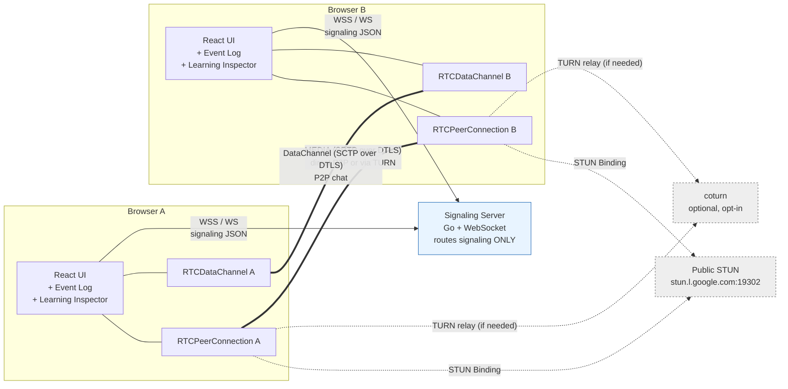
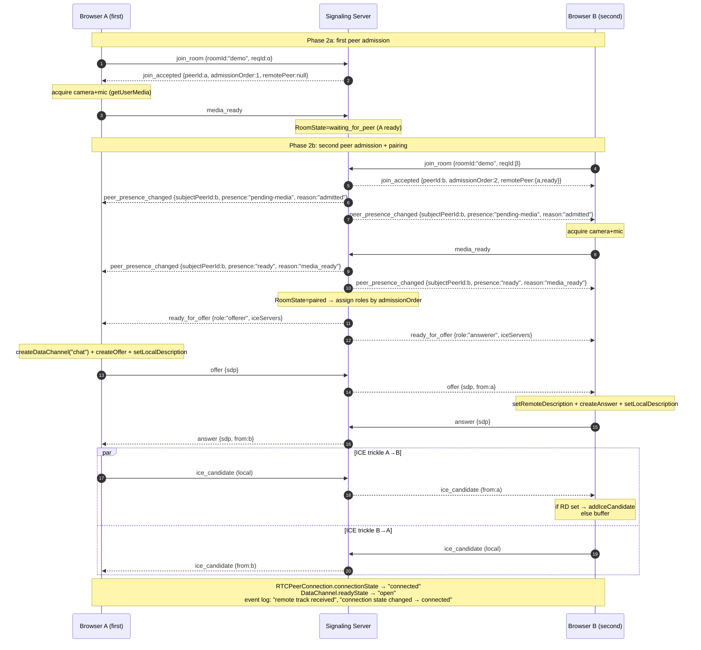
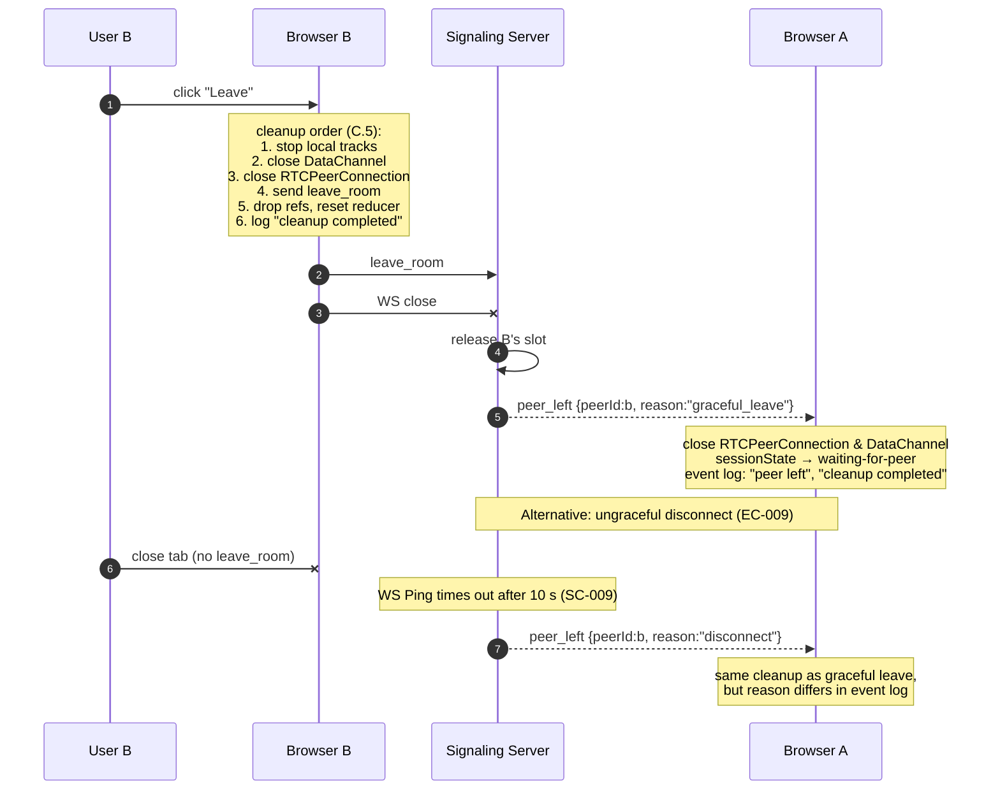

# Implementation Plan: 1:1 WebRTC Learning Call

**Branch**: `001-webrtc-1to1-call` | **Date**: 2026-04-19 | **Spec**: [spec.md](./spec.md)
**Input**: Feature specification from `/specs/001-webrtc-1to1-call/spec.md`

## Summary

Build a two-package `webrtc-lab` learning application that lets two browsers
establish a 1:1 WebRTC call (audio + video + chat + screen share) with the
**full connection lifecycle visible in the UI**. The frontend is React +
TypeScript + Vite calling the browser WebRTC APIs directly (no wrappers).
The signaling server is a small Go + WebSocket service that **only** routes
signaling messages — it never touches media. A `docker-compose.yml` brings
both up on `localhost`; an optional `coturn` service is documented for the
TURN learning outcome. Implementation proceeds as **14 vertical slices**,
each producing a runnable system with its own Definition of Done.

## Technical Context

**Language / Version** — Frontend: **TypeScript 5.4+** (strict) / **React 18**;
Signaling: **Go 1.22+**.
**Primary Dependencies** — Frontend: `react`, `react-dom`, `vite`, `zod`,
`vitest`, `@testing-library/react`. Signaling: `github.com/coder/websocket`,
`github.com/stretchr/testify`, stdlib `net/http`, `log/slog`.
**Storage** — none (spec Non-Goals). In-memory room state on the server; in-
memory reducer + refs on the client.
**Testing** — Backend: `go test` + testify + in-process WS integration tests.
Frontend: Vitest + React Testing Library + JSDOM.
**Target Platform** — Local development (Docker Compose on Linux / macOS /
WSL). Modern Chromium browsers (current & current-1); Firefox & Safari with
documented divergences.
**Project Type** — **Web app with two packages (`frontend/` + `signaling/`)**
coordinated by a root `docker-compose.yml`.
**Performance Goals** — SC-002: ≤ 5 s from `paired` call-readiness to remote
video on `localhost`. SC-009: ≤ 10 s ungraceful-disconnect detection.
**Constraints** — Signaling MUST NOT relay media (FR-029); signaling MUST NOT
log SDP / ICE / credentials (NFR-003); no persistence; no WebRTC wrapper
libraries; single outgoing video slot per peer.
**Scale / Scope** — One signaling process serves N concurrent rooms; each
room caps at 2 participants; MVP target is demonstrable on one laptop with
two browser windows. No multi-process / multi-region considerations.

## Constitution Check

*GATE: Must pass before Phase 0 research. Re-check after Phase 1 design.*
Evaluated against `.specify/memory/constitution.md` v2.0.0.

| Principle | Plan status | Evidence |
|---|---|---|
| **I. Specification-First Development** | ✅ Pass | Spec exists, clarified across 3 sessions, no `[NEEDS CLARIFICATION]` markers, Non-Goals + Assumptions explicit. |
| **II. Contract-First Signaling** | ✅ Pass | `contracts/signaling-protocol.md` v1 is the single source of truth for every message; client (Zod) and server (Go validators) both derive from it. |
| **III. Separate Signaling from Media Transport** | ✅ Pass | FR-011 + FR-029 enforced in the plan: `signaling/` relays JSON only; media flows via `RTCPeerConnection`; TURN only as NAT fallback. |
| **IV. Incremental Vertical Slices** | ✅ Pass | 14 phases below, each runnable, each with a DoD. No big-bang integration. |
| **V. WebRTC Lifecycle Visibility** | ✅ Pass | FR-020..022b (event log + state indicators) built from Phase 2; FR-030 Learning Inspector lives from Phase 6. |
| **VI. Failure-Aware Design** | ✅ Pass | Every EC-001..EC-013 is scheduled into Phase 12; manual verification in `quickstart.md §5`. |
| **VII. Security by Default** | ✅ Pass | `localhost` exemption documented; HTTPS/WSS required outside; no hardcoded secrets; NFR-006 safe-rendering committed; no E2EE claim beyond browser DTLS/SRTP. |
| **VIII. Testing Discipline** | ✅ Pass | Go unit tests for room manager + message validation; WS-level protocol-flow tests; Vitest for reducer/state; `quickstart.md §10` DoD gate per phase. |
| **IX. Simplicity with Extension Points** | ✅ Pass | 1:1 only; no plugin system; no router framework; no wrapper libs; coturn opt-in via comment, not always-on; no workspace tooling unless needed. |

**Governance gates**:
- G-1 (clarify-before-plan): satisfied; spec carries zero clarification markers.
- G-2 (DoD per step): each phase below declares its DoD.
- G-3 (assumptions explicit): see spec `## Assumptions`.
- G-4 (Non-Goals listed): see spec `## Non-Goals`.
- G-5 (diagrams for connection flows): four Mermaid diagrams below.

**Result: all gates pass. No violations. `## Complexity Tracking` is empty.**

## Project Structure

### Documentation (this feature)

```text
specs/001-webrtc-1to1-call/
├── plan.md                               # This file
├── spec.md                               # Feature spec (v3 after 3 clarify passes)
├── research.md                           # Phase 0 decisions
├── data-model.md                         # Phase 1 models (server + client)
├── quickstart.md                         # Phase 1 quickstart + manual test checklist
├── contracts/
│   └── signaling-protocol.md             # Phase 1 signaling contract v1
└── checklists/
    ├── requirements.md                   # /speckit.specify auto-checklist
    └── spec-quality.md                   # /speckit.checklist output (40 items, all pass)
```

### Source Code (repository root)

```text
frontend/
├── src/
│   ├── App.tsx                           # Top-level layout
│   ├── main.tsx                          # Vite entry
│   ├── state/
│   │   ├── session.ts                    # sessionState reducer
│   │   ├── media.ts                      # local + remote media reducers
│   │   ├── peer-connection.ts            # PC state slice
│   │   ├── event-log.ts                  # ring buffer + event-log slice
│   │   └── index.ts                      # root reducer composition
│   ├── webrtc/
│   │   ├── peer-connection.ts            # wraps RTCPeerConnection lifecycle
│   │   ├── ice-buffer.ts                 # pending-remote-candidates buffer
│   │   ├── data-channel.ts               # chat channel open/close/send
│   │   ├── media-acquisition.ts          # getUserMedia + retry
│   │   ├── screen-share.ts               # getDisplayMedia + replaceTrack
│   │   └── learning-inspector.ts         # SDP + ICE summaries (FR-030)
│   ├── signaling/
│   │   ├── client.ts                     # WS connect, send, heartbeat
│   │   ├── schema.ts                     # Zod schemas for every message type
│   │   └── dispatcher.ts                 # inbound message → reducer action
│   ├── components/
│   │   ├── JoinForm.tsx
│   │   ├── LocalVideo.tsx
│   │   ├── RemoteVideo.tsx
│   │   ├── MediaControls.tsx
│   │   ├── Chat.tsx
│   │   ├── ScreenShareButton.tsx
│   │   ├── EventLogPanel.tsx             # FR-020 in-UI log
│   │   ├── StateIndicators.tsx           # FR-022a/b persistent states
│   │   └── LearningInspector.tsx         # FR-030 SDP/ICE/STUN/TURN summaries
│   └── types/
│       └── contract.d.ts                 # types inferred from Zod schemas
└── tests/
    ├── unit/
    │   ├── session.spec.ts
    │   ├── ice-buffer.spec.ts
    │   ├── schema.spec.ts
    │   └── event-log.spec.ts
    └── contract/
        └── dispatcher.spec.ts

signaling/
├── cmd/
│   └── signaling/
│       └── main.go                       # entry point: net/http + slog setup
├── internal/
│   ├── room/
│   │   ├── manager.go                    # RoomManager
│   │   ├── room.go                       # Room + Participant
│   │   └── state.go                      # MediaReadiness + CallPhase enums + transitions
│   ├── signaling/
│   │   ├── envelope.go                   # generic envelope + dispatch
│   │   ├── messages.go                   # per-type structs + validate()
│   │   ├── handler.go                    # WS upgrader + per-conn loop
│   │   └── heartbeat.go                  # 5s ping, 5s pong timeout (≤10s worst case, SC-009)
│   └── logging/
│       └── slog_setup.go                 # JSON default; text selectable via LOG_FORMAT=text
├── tests/
│   ├── room_manager_test.go
│   ├── messages_test.go
│   └── protocol_flow_test.go             # WS-level end-to-end
├── go.mod
└── go.sum

infra/
└── coturn/
    └── turnserver.conf.example           # sample config, disabled by default

docker-compose.yml                        # frontend + signaling + (commented) coturn
.env.example                              # VITE_STUN_URLS, VITE_TURN_*, LOG_FORMAT, ...
CLAUDE.md                                 # agent context (contains SPECKIT markers)
README.md                                 # links into specs/
```

**Structure Decision**: **two-package monorepo** (`frontend/` + `signaling/`
+ `infra/`). The signaling contract in
`specs/001-webrtc-1to1-call/contracts/signaling-protocol.md` is the single
source of truth; `frontend/src/signaling/schema.ts` and
`signaling/internal/signaling/messages.go` both implement it. No workspace
tooling (pnpm/yarn workspaces, nx, turborepo) is introduced — the two
packages are independently built and run by Docker Compose (Principle IX).

## Architecture diagrams

All four mandatory diagrams live here (Constitution G-5). They use Mermaid
so they render directly on GitHub / VS Code / most IDEs.

### Diagram 1 — System context

Shows **every** component and, critically, **two distinct paths**: the
signaling path (WebSocket, JSON) and the media path (WebRTC RTP over
DTLS/SRTP, peer-to-peer or via TURN). The signaling server never sits on
the media path.



**Reading**:

- **Solid double lines (`===`)** = media / data path, peer-to-peer, never
  through the signaling server.
- **Solid arrows (`-->`)** = signaling path, WebSocket JSON.
- **Dotted arrows (`-..->`)** = NAT-traversal helpers (STUN/TURN), used
  only during ICE gathering.

### Diagram 2 — Join & negotiation sequence

Covers US1 + FR-010a (deterministic offerer) + FR-010c (two-phase join) +
FR-010d (media failure reporting) + EC-013 (glare impossible by
construction).



### Diagram 3 — Screen-sharing sequence

Uses `replaceTrack` by default (research §4). Renegotiation is drawn as an
alternative path.

```mermaid
sequenceDiagram
    autonumber
    participant UA as User A
    participant A as Browser A
    participant S as Signaling Server
    participant B as Browser B

    Note over A,S,B: Call is in "connected" state.<br/>Media path is P2P (A ⇄ B directly or via TURN).<br/>media_state change notifications travel the signaling path (A → S → B).

    UA->>A: click "Share screen"
    A->>A: navigator.mediaDevices.getDisplayMedia()
    Note over A: success → screenTrack
    A->>A: sender.replaceTrack(screenTrack)
    Note over A,B: P2P media: the swapped track flows directly<br/>A → B over the existing RTCPeerConnection<br/>(no signaling traffic for the track itself)
    Note over A: event log: "screen share started", "track replaced"
    A->>S: media_state {screenShare:"active"}
    S-->>B: media_state {from:A, screenShare:"active"}
    Note over B: remote media_state slice updated;<br/>remote video already displaying screen content from P2P path<br/>event log: "screen share started (remote)"

    UA->>A: click "Stop sharing" OR browser-native stop
    A->>A: screenTrack.stop()
    A->>A: sender.replaceTrack(cameraTrack)  %% if camera is on
    Note over A: event log: "screen share stopped", "track replaced"
    A->>S: media_state {screenShare:"inactive"}
    S-->>B: media_state {from:A, screenShare:"inactive"}

    alt Alternative path (renegotiation — NOT the default)
      Note right of A: If the plan ever chooses renegotiation instead of<br/>replaceTrack, the flow would be:<br/>removeTrack → addTrack(screen) → createOffer →<br/>offer/answer exchange via the signaling server → SDP updated.<br/>MVP does NOT take this path.
    end
```

**Reading**: note that `media_state` messages travel **A → S → B**
(signaling path), while the actual media tracks swap peer-to-peer
without touching `S`. Signaling and media paths staying distinct is
the whole point of Constitution Principle III.

### Diagram 4 — Leave & cleanup

Covers FR-023..027 (explicit cleanup order), FR-005 (peer-departure vs
local-failure distinction), and EC-012 (leave during negotiation).



## Phased implementation plan

14 vertical slices. Each phase MUST produce a runnable system and ticks its
Definition of Done against the phase-specific items from
`quickstart.md §10`. Phases are intentionally small — "big-bang
implementation in one pass" is forbidden (Principle IV).

### Phase 1 — Project scaffold

**Goal**: `docker compose up` brings up an empty frontend that renders
"hello" and an empty signaling server that logs "listening".

**Work**:
- `frontend/`: Vite + React + TS strict scaffold; placeholder `App.tsx`.
- `signaling/`: Go module, `main.go` starting `net/http` on `:8080` with
  a `/healthz` JSON endpoint.
- `docker-compose.yml` with two services; shared `.env.example`.

**DoD**:
- `docker compose up --build` succeeds.
- `curl http://localhost:8080/healthz` returns `{"status":"ok"}`.
- `http://localhost:5173` renders.
- No dependencies beyond the stack defined in Technical Context.

### Phase 2 — Signaling health + WebSocket connection

**Goal**: frontend connects a WebSocket to the signaling server; server
logs connects/disconnects; no room logic yet.

**Work**:
- `signaling/internal/signaling/handler.go`: WS upgrade at `/ws`, accept
  one connection, read-loop that echoes for now.
- `frontend/src/signaling/client.ts`: connect, reconnect is a no-op
  (MVP — no auto-reconnect).
- Event-log panel stub (FR-020 skeleton).

**DoD**:
- WS connects within 1 s.
- Server logs `ws_connected` / `ws_disconnected` with `peer_id`.
- Event log shows `signaling connected` / `signaling disconnected`.

### Phase 3 — Room join / leave and peer presence (server + client)

**Goal**: Two clients can join the same room; third client is rejected
with `room_full`. No media yet.

**Work**:
- `signaling/internal/room/`: `RoomManager`, `Room`, `Participant`, state
  enum, slot-occupancy admission.
- Contract messages (canonical names per
  `contracts/signaling-protocol.md` v1): `join_room`, `join_accepted`,
  `join_rejected`, `peer_presence_changed`, `peer_left`, `leave_room`,
  `error`.
  - Room-full rejection is `join_rejected` with
    `payload.result = "join_rejected_room_full"` — it is **not** a
    separate message type.
  - Peer admission / readiness transitions flow through
    `peer_presence_changed` — the legacy `peer_joined` /
    `peer_state_changed` types are not in the contract.
- Client: `JoinForm`, session state `idle → joining → waiting-for-peer`.
- Event log: `room joined`, `peer joined`, `peer left`.
- Persistent state indicators (FR-022a) initial version — room state,
  peer presence.

**DoD**:
- Two windows join; third is rejected within 2 s (SC-003).
- US1 AC-7 (third rejected when slot is pending-media) passes once
      Phase 4 provides pending-media. (Document acceptance here, test in
      Phase 4.)
- Explicit Leave cleans both sides (FR-023, FR-026).
- `go test ./internal/room/...` passes.

### Phase 4 — Local media preview + two-phase `media_ready`

**Goal**: Clients acquire camera + microphone, display local preview,
report `media_ready` to the server. Server transitions room through
`waiting_for_media` → `waiting_for_peer` → `paired`. `ready_for_offer`
is sent (but answered with a stub — no PC yet).

**Work**:
- `frontend/src/webrtc/media-acquisition.ts`: `getUserMedia` +
  permission-denial UX + retry button (FR-009).
- Contract messages (canonical names): `media_ready`, `media_failed`,
  `participant_released`, `ready_for_offer`, `peer_presence_changed`
  (emitted on each readiness transition).
  - `participant_released_media_failed` is a **payload result**, not a
    message type:
    `participant_released.payload.result = "participant_released_media_failed"`.
- Pending-media peer-presence updates (FR-022b).
- US1 AC-6 (permission-denied mid-flow) end-to-end tested.

**DoD**:
- Local video preview visible.
- Permission denial shows clear error before any negotiation; slot
      released; remote returns to `waiting_for_peer`.
- `ready_for_offer` is delivered exactly once per pairing with the
      correct role assignment (lower admissionOrder = offerer).
- `quickstart.md §5.1` passes manually.

### Phase 5 — Offer / Answer exchange

**Goal**: Offerer creates `RTCPeerConnection`, attaches local tracks,
creates offer; answerer processes it; both reach
`signalingState === "stable"`. **ICE candidate relay is deferred to
Phase 6.** The browser may begin gathering local ICE candidates after
`setLocalDescription()` — that is unavoidable — but
`onicecandidate` is not yet wired to the signaling transport, and
remote `ice_candidate` messages are not yet consumed. Phase 5 only
validates that offer/answer negotiation succeeds at the SDP layer.

**Work**:
- `frontend/src/webrtc/peer-connection.ts`: wraps lifecycle.
- DataChannel creation by offerer **before** `createOffer` (so SDP has
  data m-line).
- Contract messages: `offer`, `answer`.
- Event log: `offer created`, `offer received`, `answer created`,
  `answer received`, `signaling state changed`.

**DoD**:
- Both peers reach `signalingState === "stable"`.
- Offer SDP contains audio + video + data m-lines.
- Answerer receives `ondatachannel` (kept for Phase 9, not used yet).

### Phase 6 — ICE candidate exchange + buffering

**Goal**: Trickle ICE works both directions; candidates arriving before
remote SDP is set are buffered (research §6).

**Work**:
- `frontend/src/webrtc/ice-buffer.ts`.
- Contract: `ice_candidate` (with null = end-of-candidates).
- Event log entries `ICE candidate sent / received`,
  `ICE state changed`.
- Learning Inspector v1 (FR-030): SDP type, m-sections, ICE candidate
  types (`host` / `srflx` / `prflx` / `relay`), STUN configured +
  observed, TURN configured.

**DoD**:
- `iceConnectionState === "connected"` (or `"completed"`) reached
      within 5 s on localhost (SC-002).
- Learning Inspector shows at least one `host` candidate pair; if
      STUN is reachable, also `srflx`.
- Buffering exercised by a reordered-ice test in protocol-flow
      tests.

### Phase 7 — Remote stream rendering

**Goal**: Both peers render the other's video + play audio.

**Work**:
- `RemoteVideo.tsx` attaches incoming `MediaStream` from `ontrack`.
- Event log: `local track added`, `remote track received`.
- `RTCPeerConnection.connectionState === "connected"` → session state
  `connecting → connected`.

**DoD**:
- `quickstart.md §4.1` passes (two browsers see and hear each
      other).
- SC-001 (first-try two-browser call) passes.
- SC-002 (5 s from `paired` to remote video) passes on localhost.

### Phase 8 — Full connection-state logging + persistent indicators

**Goal**: Event log covers **every** Base lifecycle event from US5; all
nine persistent indicators from FR-022a display live values.

**Work**:
- Wire `onconnectionstatechange`, `oniceconnectionstatechange`,
  `onicegatheringstatechange`, `onsignalingstatechange` into the
  event-log slice.
- `StateIndicators.tsx` finalized with all nine indicator classes.
- Bounded ring buffer (500 entries) with timestamped human-readable
  summary.

**DoD**:
- SC-004 (full ordered lifecycle in UI without devtools) passes.
- FR-021 (no devtools needed for common cases) verifiable by
      review.
- Eleven of the twelve learning outcomes have at least one
      observable moment in the UI (remaining one — DataChannel — lands
      in Phase 9).

### Phase 9 — DataChannel chat

**Goal**: Chat works via `RTCDataChannel` (FR-016a). The optional
Phase 9a (signaling-relayed interim) is **only** scheduled if DataChannel
risk appears high during Phase 5/6.

**Work**:
- `data-channel.ts`: open/close/send, `onmessage` → reducer, backpressure
  check via `bufferedAmount`.
- `Chat.tsx`: input, validation (FR-015a: trim, non-empty, ≤500 chars),
  safe text rendering (NFR-006).
- Event log: `chat message sent` / `chat message received` with
  `transport: "datachannel"`.

**Optional Phase 9a** (skippable if 9 is green on first try):
- Temporary signaling-relayed chat path under a dev-mode toggle, for
  learning the contrast (spec FR-016). MUST be removed before
  declaring MVP complete (FR-016a).

**DoD for 9**:
- Round-trip chat works between two browsers.
- Every chat log entry carries `transport`.
- FR-015a validation tested (empty rejected, 501-char rejected,
      HTML rendered as text).
- `chat-channel state` indicator updates correctly
      (`connecting → open → closed`).

### Phase 10 — Media toggles (mic / camera) with explicit signaling

**Goal**: Mute/unmute mic, toggle camera on/off; remote UI updates via
`media_state` signaling (FR-014a), not inference.

**Work**:
- `MediaControls.tsx`.
- On toggle: flip `track.enabled`, emit `media_state` message.
- Remote: receive `media_state`, update `RemoteMediaState` slice +
  event log (`media toggled`).

**DoD**:
- `quickstart.md §4.2` passes.
- Remote indicator reflects mic/camera within ~1 s of local toggle.
- No renegotiation triggered by toggle (still stable `signalingState`).

### Phase 11 — Screen sharing via `replaceTrack`

**Goal**: Start / stop screen sharing using `RTCRtpSender.replaceTrack`;
handle browser-native Stop-Sharing event.

**Work**:
- `screen-share.ts`: `getDisplayMedia`, `replaceTrack`, revert on stop,
  subscribe to `screenTrack.onended` for browser-native stop.
- `media_state` emits `screenShare: "active" | "inactive"`.
- Event log: `screen share started` / `screen share stopped` with
  source (`app` | `browser`), plus `track replaced` entry.

**DoD**:
- `quickstart.md §4.4` passes for both app-stop and browser-stop.
- SC-007 (2 s stop latency) met.
- Picker cancellation logs `screen share cancelled`.

### Phase 12 — Cleanup + failure hardening

**Goal**: Every EC-001..EC-013 behaves as spec says.

**Work**:
- Cleanup ordering per data-model C.5 applied on every exit path.
- Peer-departure vs local-failure branch in session reducer (FR-005).
- ICE-failure terminal state with manual Leave/Rejoin affordance.
- WebSocket heartbeat + pong-timeout cleanup (server).
- Pending-media disconnect server cleanup (FR-010d).
- Protocol-flow tests: `TestRoomFullRejectsWhilePending`,
  `TestIceFailureEntersFailed`, `TestWSPongTimeoutReleasesSlot`.

**DoD**:
- Every scenario in `quickstart.md §5` passes.
- SC-005 (5 s clean cleanup) met.
- SC-009 (10 s ungraceful detection) met.
- No `go test ./...` failures; no Vitest failures.

### Phase 13 — Docker Compose polish

**Goal**: One-command dev start is production-defaults-safe.

**Work**:
- `docker-compose.yml`: env wiring for `VITE_STUN_URLS` / `VITE_TURN_*`,
  `LOG_FORMAT`, ports.
- `.env.example` with harmless defaults, no real secrets.
- README section linking to `quickstart.md`.
- Confirm that without any env set, the system still works on
  localhost with public STUN.

**DoD**:
- Fresh clone + `docker compose up --build` follows `quickstart.md`
      with no additional setup.
- `.env.example` contains every config variable the system reads.
- No secrets committed.

### Phase 14 — Optional coturn documentation & configuration

**Goal**: A learner who wants to exercise TURN can uncomment one block
and have a working relay.

**Work**:
- `infra/coturn/turnserver.conf.example` with sensible dev defaults.
- `docker-compose.yml`: commented `coturn` service block with clear
  comment explaining how to enable.
- Update `quickstart.md §6` with exact commands (already present —
  verify still accurate).
- Learning-Inspector readout: `TURN configured: yes`, `relay candidate
  present: yes/no`, distinct from `STUN configured`.

**DoD**:
- Uncommenting the coturn block + setting env yields a working
      relay.
- Forcing UDP-block confirms browser falls back to TURN candidate.
- Secrets sourced from env, not file.

---

## Phase sequencing & parallelism

Phases 1 → 2 → 3 are strictly sequential (foundation).
Phases 4 through 8 are sequential because each depends on the previous
state. Phases 9, 10, 11 can be parallelized across two developers after
Phase 8 completes (DataChannel / toggles / screen share touch different
parts of `webrtc/`). Phases 12, 13, 14 are best done sequentially but
each is small.

## Risks and mitigations

| # | Risk | Likelihood | Impact | Mitigation |
|---|---|---|---|---|
| R-1 | ICE gathering returns only `host` on localhost in Chromium, masking STUN functioning | Medium | Learning outcome (STUN) hidden | Learning Inspector explicitly distinguishes `STUN configured` (config) from `srflx observed` (runtime) — makes the localhost case teachable rather than confusing. |
| R-2 | Safari diverges on `getDisplayMedia` prompts and on DataChannel timing | Medium | US4 breakage on Safari | Document divergences in `quickstart.md §7`; acceptance measured on Chromium (spec Assumptions); Safari treated as best-effort. |
| R-3 | Glare if the offerer protocol is incorrectly implemented | Low | Catastrophic — peers can't connect | Deterministic-offerer contract (FR-010a + `ready_for_offer`) eliminates by construction; `TestOnlyOffererSendsOffer` protocol-flow test guards this. |
| R-4 | Pending-media disconnect leaves zombie slots | Medium | Users can't rejoin rooms | FR-010d + WS pong timeout + `TestWSPongTimeoutReleasesSlot` test exercise this explicitly. |
| R-5 | Users can't grant permission per site on Safari → US1 AC-6 flakes | Low | Safari-only learner friction | Document in quickstart; MVP is Chromium-first. |
| R-6 | WebRTC API differences across browsers introduce silent fallbacks that hide a learning outcome | Medium | Learner sees "it works" but doesn't understand what's happening | Event log + Learning Inspector make the actual path taken visible; no silent fallbacks allowed in our own code. |
| R-7 | Developer discovers DataChannel negotiation complexity only at Phase 9 | Low | Phase 9 slips | Optional Phase 9a (signaling-relayed interim) is the escape valve; FR-016a permits it as long as final MVP swaps to DataChannel. |
| R-8 | Someone bypasses the contract and sends an ad-hoc JSON message | Low | Spec violation, Principle II | Both sides validate via the schema (Zod + Go validators); malformed messages are rejected; tests exist for each. |
| R-9 | Raw SDP or ICE strings leak into server logs | Low | NFR-003 violation | Structured slog + review checklist; `TestServerNeverLogsSDP` test reads log output and fails on any `sdp` substring. |
| R-10 | "Quick" WebSocket-relay chat becomes permanent | Medium | FR-016a violation — learning intent erased | Plan flags Phase 9a as optional and strictly temporary; MVP checklist in `spec-quality.md` gates the shipment. |

## Complexity Tracking

Empty — **no Constitution Check violations**. No entry required.

## Generated artifacts summary

- [`research.md`](./research.md) — Phase 0 decisions (14 topics)
- [`data-model.md`](./data-model.md) — Phase 1 models (server + client + cross-cutting invariants)
- [`contracts/signaling-protocol.md`](./contracts/signaling-protocol.md) — Phase 1 signaling contract v1 (envelope + 14 message types + relay semantics + conformance checklist)
- [`quickstart.md`](./quickstart.md) — Phase 1 local-dev quickstart + manual verification checklist + failure-path tests + per-phase DoD checklist
- `plan.md` (this file) — architecture + diagrams + 14-phase implementation plan + risks
