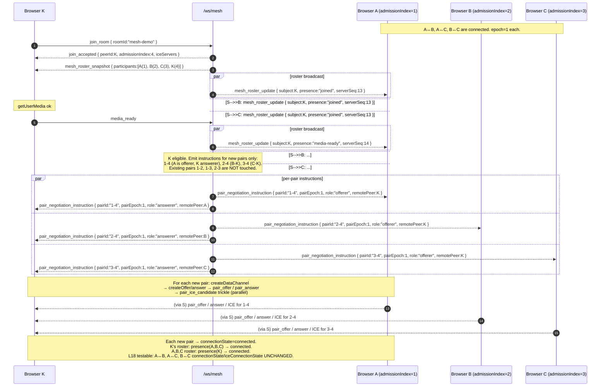

# Mesh Signaling Protocol Contract (v2)

**Feature**: Multi-party Mesh WebRTC Learning Room
**Branch**: `002-webrtc-mesh-room`
**Contract version**: `2`
**Date**: 2026-04-25
**Transport**: WebSocket text frames at `/ws/mesh` (one JSON message per frame)
**Status**: **canonical source of truth** for every mesh-mode signaling
message. Both the Go server (`signaling/internal/mesh/protocol.go`) and
the TypeScript client (`frontend/src/features/mesh/signaling/schema.ts`)
derive their validators from this document.

> Per Constitution Principle II + Governance G-3: **no ad-hoc JSON
> messages are permitted.** Any message whose `type` is not listed
> below, or whose shape does not match its schema here, MUST be
> rejected by both sides with an `error { code: "malformed" }` log
> entry.

> **001 v1 contract is unaffected.** The 001 contract at
> `specs/001-webrtc-1to1-call/contracts/signaling-protocol.md` (`v: 1`)
> is the canonical contract for `/ws` and is **not edited** by this
> document. v2 is additive: a new endpoint, a new envelope version, new
> message types (Spec FR-090 additivity rule).

---

## 1. Message envelope

Every frame on `/ws/mesh` is a JSON object with the following envelope:

```json
{
  "v": 2,
  "type": "<enum>",
  "roomId": "<string, required for all room-scoped messages>",
  "from": "<peerId, server-assigned, set by server on relay>",
  "to": "<peerId, optional unicast target>",
  "requestId": "<uuid-v4, optional, for request correlation>",
  "ts": 1713500000000,
  "payload": { }
}
```

| Field | Type | Required | Notes |
|---|---|---|---|
| `v` | integer | **yes** | mesh contract version; currently `2`. v1 is reserved for 001. |
| `type` | string | **yes** | mesh message-type enum (see §3) |
| `roomId` | string | **yes** for room-scoped messages | validated per Room ID rules |
| `from` | string | server-set on relay | UUIDv4 peer ID |
| `to` | string | optional | set when relaying a unicast pair message |
| `requestId` | string | optional | UUIDv4 generated by sender of request-style messages |
| `ts` | integer | optional | Unix milliseconds; informational |
| `payload` | object | per-type | see each message below |

### 1.1 Room ID validation

Identical to 001 v1 (Spec FR-010 explicitly preserves the rule across
modes):

- trimmed of leading / trailing whitespace before validation;
- case-sensitive;
- length `1..64` after trimming;
- regex `^[A-Za-z0-9._-]{1,64}$`;
- any violation ⇒ `join_rejected` with
  `payload.result = "join_rejected_invalid_room"`.

### 1.2 Peer ID generation

Server generates a UUIDv4 on `join_accepted`. Clients MUST NOT invent
their own `peerId`.

### 1.3 Mesh-room namespace separation

A mesh room and a 1:1 room may share the same `roomId` string without
collision because they are tracked in separate registries reached via
separate endpoints (`/ws` vs `/ws/mesh`). No cross-mode lookup is
performed.

### 1.4 Pair identity

- `pairId` = `"<lo>-<hi>"` where `lo` and `hi` are the two participants'
  `admission_index`es sorted ascending, formatted as decimal strings
  (e.g., `"3-7"`). Server-canonical; stable for the pair's lifetime
  across reconnects.
- `pairEpoch` is a `uint64` issued and incremented exclusively by the
  server. Starts at `1`. Server increments on every `pair_reconnect_instruction`
  by `+1`. Carried in the **payload** of every pairwise message.

---

## 2. Direction legend

- **C→S**: client → server
- **S→C**: server → client (unicast to one peer)
- **S→B**: server → broadcast (to multiple peers in the same mesh room)
- **C→S→C**: relay (server validates envelope + pair epoch, sets `from`, forwards once to `to`)
- **C→S→B**: server-fan-out relay (one client message → server fans out to all other room participants; used for `pair_media_state`)

---

## 3. Message types

### 3.1 `join_room` (C→S)

**Purpose**: client requests admission to a mesh room.

**Required fields**: `v`, `type`, `roomId`, `requestId`
**Optional fields**: `ts`
**Payload**: `{}`

```json
{
  "v": 2,
  "type": "join_room",
  "roomId": "mesh-demo",
  "requestId": "5b3a1e23-...",
  "payload": {}
}
```

**Server validation**:
1. Envelope shape valid; `v == 2`.
2. `roomId` matches the regex.
3. The mesh room has fewer than 4 reserved slots.
4. The source WebSocket is not already in any mesh room (`already_joined` if it is).

**Server response** (exactly one of):
- `join_accepted` (admission OK), or
- `join_rejected` (`result = "join_rejected_room_full" | "join_rejected_invalid_room"`), or
- `error { code: "already_joined" }`.

---

### 3.2 `join_accepted` (S→C)

**Purpose**: tell the joiner admission succeeded. Assigns `peerId` and
`admissionIndex`. The full mesh roster is delivered immediately after
this message via §3.4 `mesh_roster_snapshot`.

**Direction**: S→C (joiner only)
**Required fields**: `v`, `type`, `roomId`, `requestId` (echo), `payload`

```json
{
  "v": 2,
  "type": "join_accepted",
  "roomId": "mesh-demo",
  "requestId": "5b3a1e23-...",
  "payload": {
    "peerId": "8e4c0...",
    "admissionIndex": 3,
    "iceServers": [
      { "urls": ["stun:stun.l.google.com:19302"] }
    ]
  }
}
```

- `peerId` — server-assigned UUIDv4.
- `admissionIndex` — monotonic `uint64` assigned at admission, used by the deterministic offerer rule (FR-022) and to derive `pairId`.
- `iceServers` — exactly the shape `RTCPeerConnection` expects.

**Client validation**: payload matches schema; client stores `peerId` /
`admissionIndex` and waits for `mesh_roster_snapshot`.

---

### 3.3 `join_rejected` (S→C)

**Purpose**: typed pre-admission rejection. Replaces any bare `room_full`
envelope type from earlier draft contract designs.

**Direction**: S→C (rejected joiner only)
**Required fields**: `v`, `type`, `roomId`, `requestId` (echo), `payload`

```json
{
  "v": 2,
  "type": "join_rejected",
  "roomId": "mesh-demo",
  "requestId": "5b3a1e23-...",
  "payload": {
    "result": "join_rejected_room_full",
    "reason": "room_full",
    "message": "Mesh room 'mesh-demo' already has 4 reserved participants."
  }
}
```

`payload.result` ∈ `{
"join_rejected_room_full",
"join_rejected_invalid_room"
}`. `reason` is a short machine-readable tag; `message` is human-readable
and safe to display in the UI (per NFR-006).

**Version mismatch is NOT a `join_rejected` result.** A `join_room` (or
any other message) carrying `v != 2` on `/ws/mesh` is a protocol-level
envelope error; the server replies with `error { code: "unsupported_version" }`
(see §3.19) and does not create or modify any room state. Version mismatch
is therefore handled before admission semantics apply.

**Forbidden**: a bare `room_full` envelope `type` MUST NOT exist in v2.
Pre-admission rejection has exactly one canonical channel: this message.

---

### 3.4 `mesh_roster_snapshot` (S→C)

**Purpose**: deliver the full current roster to a newly-admitted
participant (FR-012a). Sent **once**, immediately after `join_accepted`.

**Direction**: S→C
**Required fields**: `v`, `type`, `roomId`, `payload`

```json
{
  "v": 2,
  "type": "mesh_roster_snapshot",
  "roomId": "mesh-demo",
  "payload": {
    "serverSeq": 12,
    "participants": [
      { "peerId": "a11ce-...", "admissionIndex": 1, "presence": "connected" },
      { "peerId": "b0b00-...", "admissionIndex": 2, "presence": "media-ready" },
      { "peerId": "8e4c0-...", "admissionIndex": 3, "presence": "joined" }
    ]
  }
}
```

- `serverSeq` — monotonic per `MeshRoom`; the snapshot's `serverSeq` is the most recent emitted value at the time of admission. Subsequent `mesh_roster_update` messages carry strictly greater `serverSeq` values.
- `participants` — every participant in the room **including the newly-admitted client**.
- `presence` — exactly one of the 7-element vocabulary from FR-013: `joined | media-ready | connecting | connected | failed | released | left`. (`left` and `released` are typically not in a snapshot because the participant is no longer in the room; included for schema completeness.)

**Client validation**: payload matches schema; client replaces its
`Roster` with the snapshot and emits one `mesh roster snapshot received`
event-log entry (FR-060).

---

### 3.5 `mesh_roster_update` (S→B)

**Purpose**: announce one participant's presence/readiness change to all
participants in the mesh room (FR-012b).

**Direction**: S→B (every participant currently in the room, including the subject)
**Required fields**: `v`, `type`, `roomId`, `payload`

```json
{
  "v": 2,
  "type": "mesh_roster_update",
  "roomId": "mesh-demo",
  "payload": {
    "serverSeq": 17,
    "subjectPeerId": "8e4c0-...",
    "admissionIndex": 3,
    "presence": "media-ready",
    "reason": "media_ready"
  }
}
```

- `serverSeq` — strictly greater than the previously-emitted `serverSeq` for the same room.
- `subjectPeerId` — the peer whose state changed.
- `presence` — one of the 7-element vocabulary (FR-013).
- `reason` — short tag: `admitted | media_ready | media_failed | pair_connecting | pair_connected | pair_failed | graceful_leave | disconnect | pending_released`.

**Client validation**: monotonic `serverSeq` (else `error stale_roster_update`).
Upsert the matching `RemoteParticipant`. If `presence` is `released` or
`left`, drop any `PairContext` with that peer and remove the roster entry.

---

### 3.6 `media_ready` (C→S)

**Purpose**: client reports successful local-media acquisition.

**Direction**: C→S
**Required fields**: `v`, `type`, `roomId`, `payload`

```json
{
  "v": 2,
  "type": "media_ready",
  "roomId": "mesh-demo",
  "payload": {
    "mediaCapabilities": { "audio": true, "video": true }
  }
}
```

Both `audio` and `video` MUST be `true` (mesh inherits 001's no-fallback
assumption per Spec Assumptions). A client that cannot deliver both MUST
send `media_failed` instead.

**Server behavior**: transition the participant `joined → media-ready`,
emit one `mesh_roster_update { presence: "media-ready", reason: "media_ready" }`
to all room participants, then evaluate eligibility for new pair
instructions. For each remote participant currently in `media-ready`
(or higher) the server emits a fresh `pair_negotiation_instruction` for
the pair — see §3.9.

---

### 3.7 `media_failed` (C→S)

**Purpose**: client reports local-media acquisition failure. Triggers
slot release.

**Direction**: C→S
**Required fields**: `v`, `type`, `roomId`, `payload`

```json
{
  "v": 2,
  "type": "media_failed",
  "roomId": "mesh-demo",
  "payload": {
    "reason": "permission_denied",
    "detail": "camera_permission_denied"
  }
}
```

`reason` ∈ `{ permission_denied, device_not_found, device_in_use, other }`.

**Server behavior**:
1. Release the sender's slot (free `admission_index`'s slot but preserve the index value — never reused).
2. Send `participant_released` to the sender (§3.8) with `result = "participant_released_media_failed"`.
3. Broadcast `mesh_roster_update { subjectPeerId, presence: "released", reason: "media_failed" }` to all remaining room participants.

---

### 3.8 `participant_released` (S→C)

**Purpose**: tell a previously-admitted client its **own** slot was
released without ever reaching `connected` on any pair.

**Direction**: S→C (released peer only)
**Required fields**: `v`, `type`, `roomId`, `payload`

```json
{
  "v": 2,
  "type": "participant_released",
  "roomId": "mesh-demo",
  "payload": {
    "result": "participant_released_media_failed",
    "reason": "media_failed",
    "detail": "camera_permission_denied"
  }
}
```

`result` ∈ `{ "participant_released_media_failed", "participant_released_disconnect" }`.

**Client behavior**: media-acquisition failure is **retry-able**. The
client transitions `LocalParticipant.fsm = released` (or `media-error`),
shows a clear permission/media-error UI with a Retry affordance, and
keeps the WS alive so the user can re-attempt `join_room` without
reconnecting.

---

### 3.9 `pair_negotiation_instruction` (S→B per pair)

**Purpose**: server tells both endpoints of a new (or reconnecting) pair
their role, the canonical `pairId`, and the current `pairEpoch`.

**Direction**: S→B (the two participants of the pair only)
**Required fields**: `v`, `type`, `roomId`, `to`, `payload`

```json
{
  "v": 2,
  "type": "pair_negotiation_instruction",
  "roomId": "mesh-demo",
  "to": "a11ce-...",
  "payload": {
    "pairId": "1-3",
    "pairEpoch": 1,
    "role": "offerer",
    "remotePeer": { "peerId": "8e4c0-...", "admissionIndex": 3 },
    "iceServers": [ { "urls": ["stun:stun.l.google.com:19302"] } ]
  }
}
```

- `role` ∈ `{ "offerer", "answerer" }`. The participant with the lower `admissionIndex` in the pair is `offerer`; the higher is `answerer` (FR-022, plan §11).
- `iceServers` — exactly the `RTCPeerConnection` shape; the server reads from env and relays; never cached / logged.

**Client behavior**:
- Both peers create a fresh `RTCPeerConnection(iceServers)`, attach their existing audio + video senders, store `pairId` and `pairEpoch` on the new `PairContext`.
- **Offerer**: `pc.createDataChannel("mesh-chat", { ordered: true })` → `createOffer` → `setLocalDescription` → emit `pair_offer` (§3.10).
- **Answerer**: register `pc.ondatachannel`; await `pair_offer`.

The instruction MUST arrive **exactly once** per pair per attempt. Receiving
a second instruction with the same `pairEpoch` MUST be dropped (no-op,
log peer-scoped). A second instruction with a higher `pairEpoch` is a
reconnect (treated as §3.15).

---

### 3.10 `pair_offer` (C→S→C)

**Purpose**: deliver the offerer's SDP to the answerer.

**Direction**: C→S (from offerer) then S→C (to answerer; `from` set by server).
**Required fields**: `v`, `type`, `roomId`, `to`, `payload`

```json
{
  "v": 2,
  "type": "pair_offer",
  "roomId": "mesh-demo",
  "to": "8e4c0-...",
  "payload": {
    "pairId": "1-3",
    "pairEpoch": 1,
    "sdp": { "type": "offer", "sdp": "v=0\r\n..." }
  }
}
```

**Server validation**:
- Sender is in the pair named by `pairId`; sender's role for this pair is `offerer`.
- `payload.pairEpoch` matches the server's current epoch for `pairId` (see §3.16); else `error { code: "stale_pair_epoch", ... }` to the sender; the server does NOT forward.
- `payload.sdp.type === "offer"`.

**Client (answerer) validation**:
- `payload.pairId` and `payload.pairEpoch` match the answerer's `PairContext`.
- `payload.sdp.type === "offer"`.

A second `pair_offer` for the same `pairEpoch` is `unexpected_offer`
(EC-014 protocol-bug guard).

---

### 3.11 `pair_answer` (C→S→C)

**Purpose**: deliver the answerer's SDP back to the offerer.

```json
{
  "v": 2,
  "type": "pair_answer",
  "roomId": "mesh-demo",
  "to": "a11ce-...",
  "payload": {
    "pairId": "1-3",
    "pairEpoch": 1,
    "sdp": { "type": "answer", "sdp": "v=0\r\n..." }
  }
}
```

**Validation**: symmetric to `pair_offer`; sender's role is `answerer`,
`payload.sdp.type === "answer"`.

---

### 3.12 `pair_ice_candidate` (C→S→C)

**Purpose**: relay one ICE candidate (or end-of-candidates) for a pair.

```json
{
  "v": 2,
  "type": "pair_ice_candidate",
  "roomId": "mesh-demo",
  "to": "8e4c0-...",
  "payload": {
    "pairId": "1-3",
    "pairEpoch": 1,
    "candidate": {
      "candidate": "candidate:1 1 UDP ...",
      "sdpMid": "0",
      "sdpMLineIndex": 0,
      "usernameFragment": "abcd1234"
    }
  }
}
```

`candidate: null` signals end-of-candidates (trickle complete). The
empty-string form `candidate: ""` is **invalid** and must be rejected as
`error { code: "malformed" }`. (Same convention as 001 v1.)

**Server validation**: `pairId` + `pairEpoch` checks; body relayed as-is
(server does not parse the candidate string).

**Client validation**: on receive, either call `pc.addIceCandidate(...)`
if remote description is set, or buffer per `iceBuffer` rules.

---

### 3.13 `pair_media_state` (C→S→B)

**Purpose**: announce sender's mic / camera / screen-share state. Server
**fans out** to all other participants in the same mesh room (FR-032
server-side fan-out).

**Direction**: C→S→B (server fan-out)
**Required fields**: `v`, `type`, `roomId`, `payload`

```json
{
  "v": 2,
  "type": "pair_media_state",
  "roomId": "mesh-demo",
  "payload": {
    "microphone": "on",
    "camera": "on",
    "screenShare": "active"
  }
}
```

All three fields are **required** in every message; partial updates are
not supported (MVP simplicity, mirrors 001 v1).

**Server behavior**:
1. Validate the sender is `connected` (in the mesh-room sense) — i.e., has reached `media-ready`. Reject if `Participant.readiness ∉ {media-ready}` ⇒ `error not_in_room` (a `released` or `left` sender must not be able to leak media-state to the room).
2. For every other participant in the room, emit one envelope with `from = sender.peerId` and the same payload. Do NOT mutate the payload.
3. Do NOT log mic/cam/screen state values beyond a count + correlation ID.

**Forbidden**: client-side fan-out for media state. Clients MUST send
exactly **one** `pair_media_state` per state change.

> Note on naming: this message is named `pair_media_state` for parallelism with the rest of the pair-prefixed family, but its semantics are **per-participant**, not per-pair. The single message announces the sender's state to every other room member; no `pairId` is carried on the wire because the server fans out to all peers regardless of pair.

---

### 3.14 `reconnect_pair` (C→S)

**Purpose**: requester asks the server to fresh-attempt this pair after
a `failed` state (FR-026 manual reconnect-this-pair).

**Direction**: C→S
**Required fields**: `v`, `type`, `roomId`, `payload`

```json
{
  "v": 2,
  "type": "reconnect_pair",
  "roomId": "mesh-demo",
  "payload": {
    "pairId": "1-3",
    "observedEpoch": 1
  }
}
```

- `observedEpoch` — the requester's currently-known epoch for the pair. Used to detect simultaneous reconnect clicks (§3.15 race resolution).

**Server validation**:
1. Requester is in the pair named by `pairId`.
2. Pair is in `failed` state.
3. `observedEpoch == server.currentEpoch[pairId]`. If less, the server has already begun a fresh attempt and the requester is racing — return `error { code: "stale_pair_epoch", expected: <newEpoch> }` and do NOT increment again.

**Server behavior** (on success):
1. Increment `pairEpoch[pairId]` by `+1`.
2. Mark pair state `failed → reconnecting`.
3. Emit `pair_reconnect_instruction` to both peers (§3.15).

---

### 3.15 `pair_reconnect_instruction` (S→B per pair)

**Purpose**: tell both peers to tear down their existing
`PairContext` for `pairId` and fresh-attempt under the new `pairEpoch`.

**Payload schema is identical to `pair_negotiation_instruction` (§3.9)** —
this message is the reconnect-flavored carrier. The only differences
are the `type` value and the implication on the recipient: it MUST
tear down any existing `PairContext` for `pairId` before creating the
new one.

```json
{
  "v": 2,
  "type": "pair_reconnect_instruction",
  "roomId": "mesh-demo",
  "to": "a11ce-...",
  "payload": {
    "pairId": "1-3",
    "pairEpoch": 2,
    "role": "offerer",
    "remotePeer": { "peerId": "8e4c0-...", "admissionIndex": 3 },
    "iceServers": [ { "urls": ["stun:stun.l.google.com:19302"] } ]
  }
}
```

**Client behavior**:
1. `pairManager.tearDown(pairId)` — close existing DC, close existing PC, drop refs, clear `iceBuffer`.
2. Create a fresh `PairContext` with the new `pairEpoch`.
3. Run the same flow as §3.9 (offerer creates DC + offer; answerer awaits).

After this point, any inbound message carrying `pairEpoch < newEpoch`
for `pairId` is dropped + logged.

---

### 3.16 `pair_failed` (C→S→C)

**Purpose**: endpoint-detected pair failure (e.g., `pc.connectionState === "failed"`). Server unicasts to the other endpoint of the pair only (the originator already knows); does NOT fan out to the rest of the room (the §2 legend reserves `C→S→B` for `pair_media_state`).

**Direction**: C→S then S→C (to the other peer of the pair). Server does
NOT fan out to other room members and MUST NOT emit a
`mesh_roster_update { presence: "failed" }` in response — presence
`failed` is per-(viewer, subject) and each client derives its own remote
tile's `failed` state locally from `PairContext.states.connection`
(data-model §A.6).

**Required fields**: `v`, `type`, `roomId`, `to`, `payload`

```json
{
  "v": 2,
  "type": "pair_failed",
  "roomId": "mesh-demo",
  "to": "8e4c0-...",
  "payload": {
    "pairId": "1-3",
    "pairEpoch": 1,
    "reason": "ice_failure",
    "detail": "iceConnectionState=failed"
  }
}
```

`reason` ∈ `{ ice_failure, dtls_failure, transport_drop, connection_state_failed, application }`.

**Server behavior**:
1. Validate `pairId` + `pairEpoch`.
2. Update server-side `Pair.state = failed` for bookkeeping only.
3. Forward `pair_failed` to the **other endpoint of the pair only**.
4. Do NOT fan out `pair_failed` or any roster update to unrelated room members. The server MUST NOT emit a `mesh_roster_update { presence: "failed" }` in response to a `pair_failed`: presence `failed` is per-(viewer, subject) and each client derives its own remote tile's `failed` state locally from its `PairContext.states.connection` (data-model §A.6).

Failure isolation guarantee: this message MUST NOT cause the server to
touch other pairs and MUST NOT alter any third party's roster (FR-025,
L15).

---

### 3.17 `peer_left` (S→C)

**Purpose**: convenience cleanup trigger for a remote peer's departure.
Mirrors 001 v1 §3.12 narrowing rule: **only sent for in-call
departures**, i.e., the leaving peer had at least one pair in
`connected` or `connecting`. Pre-pairing departures (peer was only
`joined` or `released`) use `mesh_roster_update` only.

**Direction**: S→C (each remaining participant in the room)
**Required fields**: `v`, `type`, `roomId`, `payload`

```json
{
  "v": 2,
  "type": "peer_left",
  "roomId": "mesh-demo",
  "payload": {
    "peerId": "8e4c0-...",
    "reason": "graceful_leave"
  }
}
```

`reason` ∈ `{ "graceful_leave", "disconnect" }`.

**Client behavior**:
1. For every `PairContext` with `remotePeerId === peerId`: close DC, close PC, drop refs.
2. Remove the `RemoteParticipant` from the `Roster` (also driven by the accompanying `mesh_roster_update { presence: "left" }`).
3. Keep local `MediaStreamTrack`s running — only the remote left.
4. Do NOT enter terminal `failed` — `peer_left` is not a local failure.
5. Log `peer left` with `reason`.

---

### 3.18 `leave_room` (C→S)

**Purpose**: explicit, graceful departure.

```json
{
  "v": 2,
  "type": "leave_room",
  "roomId": "mesh-demo",
  "payload": {}
}
```

**Server behavior**:
1. Classify the departure: in-call if the leaver had ≥1 pair in `connected` or `connecting`; otherwise pre-pairing.
2. Release the leaver's slot (preserve the `admissionIndex` value; do not reuse).
3. For every remaining participant: emit `mesh_roster_update { presence: "left", reason: "graceful_leave" }`. If in-call, additionally emit `peer_left`.
4. For every pair the leaver was in, mark the pair `closed` server-side.
5. Close the leaver's WS.

---

### 3.19 `error` (S→C or bidirectional)

**Purpose**: typed protocol-level error.

```json
{
  "v": 2,
  "type": "error",
  "payload": {
    "code": "stale_pair_epoch",
    "message": "Pair 1-3 epoch 2 expected; got 1.",
    "correlates": "5b3a1e23-...",
    "context": { "pairId": "1-3", "expected": 2, "observed": 1 }
  }
}
```

**Error codes**:

| Code | Meaning |
|---|---|
| `already_joined` | same WS tried to join two mesh rooms |
| `unsupported_version` | `v != 2` on `/ws/mesh` |
| `malformed` | envelope or payload failed schema validation (includes `pair_ice_candidate` with `candidate: ""`) |
| `not_in_room` | protocol action requires room membership |
| `unexpected_media_ready` | `media_ready` received while sender's readiness is not `joined` |
| `unsupported_media_capability` | `media_ready.mediaCapabilities` missing `audio` or `video` |
| `unexpected_offer` | `pair_offer` from non-offerer or with wrong epoch / state |
| `unexpected_answer` | `pair_answer` from non-answerer or with wrong epoch / state |
| `stale_pair_epoch` | inbound pair message's `payload.pairEpoch` < server's current epoch for the pair |
| `stale_roster_update` | `serverSeq` was less than the previously-broadcast value (server invariant violation) |
| `internal_error` | server-side fault (no detail leaked) |

> **`room_full` and `invalid_room_id` are NOT `error` codes.**
> Pre-admission rejection is delivered exclusively via `join_rejected`
> (§3.3) with `payload.result` set accordingly. This keeps admission
> outcomes on one canonical channel (Spec FR-011 + plan-prompt
> "no bare room_full envelope type").

> **`screen_share_busy` is NOT a code, NOT a message type.** Mesh has
> no room-level current-sharer concept (Spec FR-041 + Non-Goals +
> plan-prompt).

---

### 3.20 WebSocket-level Ping / Pong (out of band)

**Purpose**: ungraceful-disconnect detection (SC-005a).

- Server-initiated WS Ping frames (control frames, not JSON).
- Ping interval: `5 s`. Pong timeout: `5 s` after each Ping send.
- Worst case: ≤ `10 s` total.
- Configurable via `PING_INTERVAL_MS` / `PONG_TIMEOUT_MS` env vars (5000 ms defaults; shared with 001 server config).

Clients do NOT send app-level ping JSON. Browser auto-Pongs.

On Pong timeout:
1. Server closes the WS.
2. Server releases the leaver's slot (preserve `admissionIndex`).
3. Server emits `mesh_roster_update { presence: "left", reason: "disconnect" }` to remaining participants.
4. If in-call, server additionally emits `peer_left { reason: "disconnect" }`.

---

## 4. Relay semantics

The mesh server is a **pure signaling relay** for these types:

- `pair_offer`, `pair_answer`, `pair_ice_candidate`, `pair_failed` (unicast pair relay), and `pair_media_state` (server-fan-out).

For each relay:
1. Validate envelope + sender state + (for pair messages) `pairId` + `pairEpoch`.
2. Set `from = sender.peerId`.
3. Forward the JSON to the matched recipient (`to`) for unicast, or to all other room participants for `pair_media_state` fan-out.
4. Do NOT parse, mutate, cache, or persist the SDP / ICE / media-state body.
5. Do NOT log SDP bodies, ICE candidate strings, or TURN credentials. Only counts + correlation IDs.

This implements Spec FR-024 (media is peer-to-peer) and FR-091
(signaling server does not handle media payloads).

---

## 5. Message sequence — happy path (newcomer K joins existing A/B/C mesh)



---

## 6. Conformance checklist

A compliant mesh implementation MUST:

- [ ] Validate every inbound message against its schema in §3.
- [ ] Reject any message with `v != 2` on `/ws/mesh` (`error unsupported_version`).
- [ ] Use **one** pre-admission rejection message (`join_rejected`) and **one** post-admission release message (`participant_released`). Do not implement a separate `room_full` message type.
- [ ] Use **one** roster snapshot at admission (§3.4) and ordered `mesh_roster_update` messages thereafter (§3.5). No out-of-band roster channels.
- [ ] Emit `pair_negotiation_instruction` exactly once per pair per attempt; emit `pair_reconnect_instruction` exactly once per server-incremented epoch.
- [ ] Carry `pairId` AND `pairEpoch` on every pairwise message (§3.10–§3.16).
- [ ] Drop any pair message whose `pairEpoch` is less than the recipient's currently-known epoch for the pair. Log peer-scoped.
- [ ] Server-fan-out for `pair_media_state` (§3.13). The client MUST send exactly one signaling message per state change.
- [ ] Refuse to create an `RTCPeerConnection` before receiving a `pair_negotiation_instruction` (or `pair_reconnect_instruction`) for that pair.
- [ ] Refuse to `createOffer` unless `role === "offerer"` for the pair; refuse `createAnswer` unless `role === "answerer"`.
- [ ] Offerer MUST call `createDataChannel` BEFORE `createOffer` for the pair (FR-050).
- [ ] Buffer remote ICE candidates per pair until `setRemoteDescription` completes.
- [ ] Forward `pair_ice_candidate` end-of-candidates as `candidate: null` exactly. Reject `candidate: ""` as `malformed`.
- [ ] Send a `pair_media_state` on every local mic / cam / screen transition.
- [ ] On a remote `peer_left`, **keep local `MediaStreamTrack`s running** — only the remote left.
- [ ] Reject `media_ready` payloads where either `audio` or `video` is not `true`.
- [ ] On WS-level Pong timeout, close the WS within the configured window (default 5 s after Ping; ≤ 10 s total).
- [ ] Tag every chat event in the UI event log with `transport: "datachannel" | "signaling"` (only the latter during interim builds; final MVP MUST be `datachannel`).
- [ ] Omit envelope `from` on system-originated S→C messages (`join_accepted`, `join_rejected`, `mesh_roster_snapshot`, `mesh_roster_update`, `pair_negotiation_instruction`, `pair_reconnect_instruction`, `participant_released`, `peer_left`). Carry `from = sender.peerId` only on relay messages (`pair_offer`, `pair_answer`, `pair_ice_candidate`, `pair_media_state`, `pair_failed`).
- [ ] Never log SDP bodies, ICE candidate strings, or TURN credentials (NFR-003).
- [ ] Never relay audio / video / screen-share media payloads through the server (FR-024 / FR-091); inspections MUST find no media bytes anywhere in the server's I/O paths. (Server `mesh_no_media_relay_test.go` enforces this.)
- [ ] Never introduce a `screen_share_busy` (or equivalent) message or error code.
- [ ] Maintain `admissionIndex` monotonic and **never reused** within a `MeshRoom`'s lifetime.

---

## 7. Versioning & evolution

- The mesh contract is `v: 2`. Any future incompatible change to the
  mesh contract MUST be issued as `v: 3` (or namespaced subtype) to
  preserve in-flight clients.
- Additive evolution rule: new optional fields on existing types are
  permitted as long as both sides can ignore them; new message types
  require a contract revision PR.
- Cross-mode compatibility: v1 (001) and v2 (mesh) coexist by living
  on different endpoints (`/ws` and `/ws/mesh`). They MUST NOT share
  message types.
