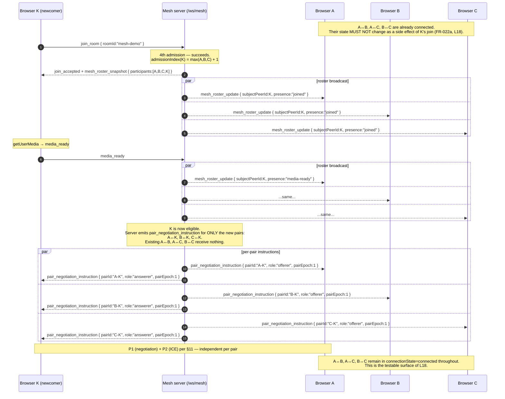
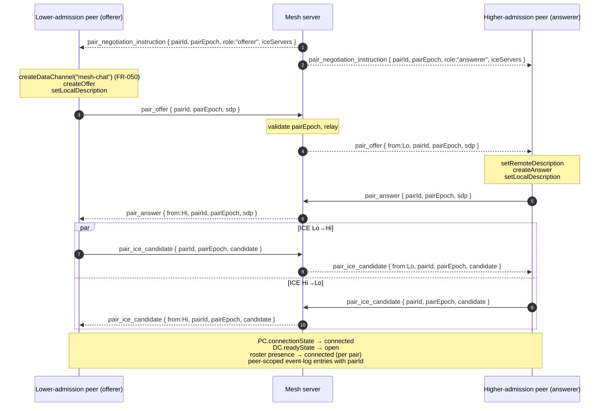

# Implementation Plan: Multi-party Mesh WebRTC Learning Room

**Branch**: `002-webrtc-mesh-room` | **Date**: 2026-04-25 | **Spec**: [spec.md](./spec.md)
**Input**: Feature specification from `/specs/002-webrtc-mesh-room/spec.md`
**Constitution**: `.specify/memory/constitution.md` v2.0.0
**Reference plan**: `specs/001-webrtc-1to1-call/plan.md` (implementation patterns only)

## 1. Summary

Add a **mesh mode** alongside the preserved 001 1:1 mode so a learner can directly
compare a single peer-pair against an `N = 4` full-mesh topology and observe, in
the running app, why mesh scales as O(N²) and motivates SFU. The frontend lives
in a feature-scoped module (`frontend/src/features/mesh/`) reachable at
`/mesh/:roomId`; the existing 001 codepath at `/` and `/ws` remains
behaviorally frozen. The mesh signaling lives at a **separate** `/ws/mesh`
endpoint backed by `signaling/internal/mesh/` and is governed by a **new v2
contract** (`specs/002-webrtc-mesh-room/contracts/signaling-protocol.md`)
that is additive to — and does not edit — the 001 v1 contract. Each
participant maintains `N − 1` `RTCPeerConnection`s, one per remote peer; the
mesh has `N × (N − 1) / 2 = 6` peer-pairs at `N = 4`. Pair negotiation is
deterministic (lower `admission_index` is offerer; same rule generalized
from 001 FR-010a), every pairwise message carries a **`pairEpoch`** so a
fresh pairing attempt cannot be poisoned by stale messages from a failed
attempt, and `media_state` is **server-fan-out** (one client update → server
fans out to N − 1 peers; signaling server still relays metadata only,
never media). Group chat uses **RTCDataChannel mesh fan-out** (one channel
per peer-pair, sender local-echoes once, event log records `N − 1`
per-channel send attempts). Screen share is per-peer outgoing-track
replacement; multiple concurrent sharers are first-class (no room-level
mutex, no `screen_share_busy` error). Failure isolation is per
`RTCPeerConnection`; one failed pair never fails the room. **Manual
reconnect-this-pair** creates a fresh PC + new `pairEpoch` (NOT an ICE
restart). Implementation proceeds as **12 vertical slices (M1–M12)**, each
runnable, each with a Definition of Done and explicit L13–L18 mapping.

## 2. Technical Context

**Language / Version** — Frontend: TypeScript 5.4+ (strict), React 18, Vite. Signaling: Go 1.23+ pinned by `github.com/coder/websocket` v1.8.14 (same as 001).
**Primary Dependencies** — Frontend: `react`, `react-dom`, `vite`, `zod`, `vitest`, `@testing-library/react`, `react-router-dom` (added; thin route shell). Signaling: `github.com/coder/websocket`, `github.com/stretchr/testify`, stdlib `net/http`, `log/slog`. **No WebRTC wrapper libraries on either side.**
**Storage** — None. In-memory state on both sides (mesh room registry on the server; reducers + refs on the client).
**Testing** — Backend: `go test` + testify + WS-level protocol-flow tests. Frontend: Vitest + React Testing Library + JSDOM. Manual: 3-/4-browser checklist in `quickstart.md`.
**Target Platform** — Local Docker Compose on Linux / macOS / WSL. Modern Chromium (current & current-1) primary; Firefox / Safari best-effort with documented divergences.
**Project Type** — Two-package monorepo (`frontend/` + `signaling/`); 002 adds new feature-scoped subtrees inside each, with the existing 001 subtrees behaviorally frozen.
**Performance Goals** — SC-003: `< 10 s` from a participant's `media-ready` to all-peer `connected` on localhost. SC-004: 5th-peer rejection within `2 s`. SC-005a: ungraceful-disconnect detection within `10 s` from remaining peers' viewpoint. SC-005b: `signaling-error` surfaces within `5 s` on the dropping client. The plan-prompt's stricter "3 browsers reach all-pairs-connected within 7 s" is treated as an internal local-dev target on top of SC-003.
**Constraints** — Mesh signaling MUST NOT relay media (FR-024, FR-091), MUST NOT log SDP / ICE / TURN credentials (NFR-003); mesh MUST not behavior-modify 001; mesh MUST NOT introduce a `screen_share_busy` concept (FR-041, Non-Goals); no automatic ICE restart proper, no automatic reconnect; chat over signaling is interim-only, never the final MVP transport (FR-053).
**Scale / Scope** — One signaling process serves N concurrent mesh rooms; each mesh room caps at 4 reserved slots (FR-011); MVP target is one laptop with up to 4 browser windows.

**No `[NEEDS CLARIFICATION]` markers remain.** Spec is plan-ready per requirements.md Validation pass 3 and mesh.md pass-2 (`53 / 53 PASS`).

## 3. Constitution Check

*GATE: Must pass before Phase 0 research. Re-checked after Phase 1 design.*
Evaluated against `.specify/memory/constitution.md` v2.0.0.

| Principle | Plan status | Evidence |
|---|---|---|
| **I. Specification-First Development** | ✅ Pass | Spec exists, clarified across reviewer passes 1 + 2 (25 Q→A bullets in §Clarifications), no `[NEEDS CLARIFICATION]` markers, Non-Goals + Assumptions explicit, mesh.md `53 / 53 PASS`. |
| **II. Contract-First Signaling** | ✅ Pass | `contracts/signaling-protocol.md` (v2, this feature) is the single source of truth for every mesh signaling message; client (Zod) and server (Go validators) both derive from it. The 001 v1 contract is referenced but not edited (additive-only per FR-090). |
| **III. Separate Signaling from Media Transport** | ✅ Pass | FR-024 + FR-091 enforced: `signaling/internal/mesh/` is a pure relay/router; media flows P2P over `RTCPeerConnection`; TURN remains a NAT fallback only. **`media_state` is server-fan-out for metadata** (FR-032) — still metadata-only, never a media payload. |
| **IV. Incremental Vertical Slices** | ✅ Pass | 12 phases (M1–M12) below, each runnable, each with a written DoD and manual verification step in `quickstart.md`. No big-bang integration. |
| **V. WebRTC Lifecycle Visibility** | ✅ Pass | All four lifecycle states (`connectionState`, `iceConnectionState`, `iceGatheringState`, `signalingState`) per remote peer (FR-023, FR-064) — phased in M7. Peer-scoped event log (FR-060/FR-061) phased from M4. Mesh cost summary (FR-070/FR-071) phased in M7/M9. SC-010 reviewer walkthrough binds these to L13–L18. |
| **VI. Failure-Aware Design** | ✅ Pass | EC-001..EC-015 each scheduled into a phase (most into M11/M12); `quickstart.md §5` documents manual verification for each. SC-005a/b split (remote-vs-local viewpoint) testable. Reconnect-this-pair (FR-026) is explicit. |
| **VII. Security by Default** | ✅ Pass | `localhost` development unchanged; HTTPS/WSS required outside (NFR-001 same as 001 NFR-001); no hardcoded secrets (NFR-002); no E2EE claims beyond browser DTLS/SRTP (NFR-005); raw SDP / ICE / TURN credentials never logged (NFR-003). |
| **VIII. Testing Discipline** | ✅ Pass | Go unit tests (mesh room manager, pair epoch, roster ordering, server-fan-out media_state); WS protocol-flow tests (5th-peer rejection, stale-pairEpoch rejection, reconnect race); Vitest reducer tests (roster, pair, cost summary, chat local-echo); manual 3-/4-browser checklist in `quickstart.md`. |
| **IX. Simplicity with Extension Points** | ⚠ Acknowledged extension | Constitution Principle IX scopes the **MVP** as 1:1 and explicitly preserves "extension points for a future migration to mesh or SFU". This feature **realizes that extension point** in a separate codepath (Spec §"Constitutional alignment"). The 001 1:1 codepath is behaviorally frozen (Assumption "001 codepath untouched (behavioral freeze, not implementation freeze)"); no multi-party semantics enter the 001 codepath. **No premature abstractions added** — no plugin system, no generic `Transport` interface, no shared "topology" abstraction with one implementation. SFU stays out of scope. |

**Governance gates**:
- **G-1 (clarify-before-plan)**: satisfied; spec carries zero clarification markers (requirements.md pass 3, mesh.md pass 2 confirm plan-ready).
- **G-2 (DoD per phase)**: each of M1–M12 declares its DoD below.
- **G-3 (contract-first)**: every mesh signaling message is defined in `contracts/signaling-protocol.md` v2 before any handler / Zod schema is written.
- **G-4 (visible WebRTC behavior)**: every lifecycle event has a peer-scoped event-log entry (FR-060) and a per-peer indicator (FR-064).
- **G-5 (1:1 MVP boundary preserved)**: Mesh is a separately-scoped feature; 001 codepath is behaviorally frozen; no multi-party code is introduced into the 001 modules. **Constitution amendment is not required** because Principle IX already names mesh as a permitted future extension and Spec §Constitutional-alignment narrows the new scope to a separate codepath.

**Result: all gates pass.** No unjustified violations. `## 4 Complexity Tracking` records one acknowledged extension below.

## 4. Complexity Tracking

| Item | Why needed | Simpler alternative rejected because |
|---|---|---|
| Adding a second WebSocket endpoint `/ws/mesh` (instead of multiplexing on `/ws`) | Keeps 001 v1 contract semantically frozen; no `mode` discriminant has to be added to v1 messages; the mesh v2 contract is free to use a clean envelope without breaking 001 validators. | Multiplexing on `/ws` with a `mode: "mesh"` field would force the v1 envelope to admit an unknown discriminant and would either (a) break 001 validators (Principle II violation) or (b) require editing the 001 contract (Spec FR-002, Assumption "behavioral freeze"). Simpler in code, much more invasive on the 001 contract. |
| Adding `react-router-dom` to the frontend (vs. ad-hoc `location.pathname` switch) | A real router is the smallest correct way to express "001 lives at `/`, mesh lives at `/mesh/:roomId`, and the two never share state" while keeping the routes obvious to a learner. | An ad-hoc string switch in `App.tsx` plus duplicated mode plumbing in shared components would smear mesh awareness through 001 components; that risks accidental 001 behavior changes (Principle IX, G-5). The router is one tiny dependency that contains the boundary cleanly. |
| Pair-attempt identity (`pairEpoch`) on every pairwise signaling message | FR-021a requires it; without it, a fresh manual reconnect attempt (FR-026) is poisonable by late-arriving stale offers / answers / ICE / DataChannel-meta messages. | Tearing down only the failed PC and creating a new one without an epoch would leave the contract racey (R-M2); reusing the 001 model has no analog because 001 does not support reconnect. Required by spec. |
| Acknowledged extension (Constitution Principle IX) | This entire feature **is** the mesh extension Principle IX preserves. | Not adding mesh would mean the project never exercises the multi-party learning the constitution explicitly anticipates. |

## 5. Project Structure

### 5.1 Documentation (this feature)

```text
specs/002-webrtc-mesh-room/
├── plan.md                                # This file (/speckit.plan output)
├── spec.md                                # Feature spec (plan-ready)
├── research.md                            # Phase 0 (this run)
├── data-model.md                          # Phase 1 (this run)
├── quickstart.md                          # Phase 1 (this run)
├── contracts/
│   └── signaling-protocol.md              # v2 mesh contract (Phase 1)
└── checklists/
    ├── requirements.md                    # /speckit.specify validation (pass 3)
    └── mesh.md                            # reviewer-supplied 53-item checklist (pass 2: 53 / 53 PASS)
```

### 5.2 Source code (repository root)

The 001 modules listed under `frontend/src/{webrtc,signaling}/` and
`signaling/internal/{room,signaling}/` are **behaviorally frozen** (see §6).
Mesh code lives in feature-scoped subtrees and never edits those modules in
behavior-changing ways.

```text
frontend/
├── src/
│   ├── App.tsx                            # 001-frozen layout, hosts the route shell  (mode router)
│   ├── main.tsx                           # 001-frozen Vite entry  (no behavior change beyond <BrowserRouter>)
│   ├── routes/                            # NEW (route shell)
│   │   ├── index.tsx                      # `/` → 001 OneToOneApp; `/mesh/:roomId` → MeshApp
│   │   └── modeBadge.tsx                  # global "1:1 mode" / "Mesh mode (capacity 4)" badge (FR-004)
│   ├── webrtc/                            # 001-frozen
│   ├── signaling/                         # 001-frozen
│   ├── state/                             # 001-frozen
│   ├── components/                        # 001-frozen (1:1-mode UI)
│   └── features/
│       └── mesh/                          # NEW — all mesh code
│           ├── routes/
│           │   └── MeshApp.tsx            # top-level mesh page bound to `/mesh/:roomId`
│           ├── components/
│           │   ├── MeshRoster.tsx         # FR-012 / FR-012a / FR-012b
│           │   ├── RemoteTile.tsx         # one tile per remote peer (FR-023, FR-033, FR-043)
│           │   ├── MeshChat.tsx           # FR-050..FR-055, FR-052a local echo
│           │   ├── MeshControls.tsx       # mic / cam / screen toggles (FR-031, FR-040..FR-042)
│           │   ├── PartialMeshBadge.tsx   # FR-065 partial-mesh indicator
│           │   ├── ReconnectButton.tsx    # FR-026 per-pair manual reconnect
│           │   ├── MeshCostSummary.tsx    # FR-070, FR-071 — L14
│           │   └── MeshEventLogPanel.tsx  # FR-060/FR-061, peer-scoped
│           ├── signaling/
│           │   ├── client.ts              # WS connect to /ws/mesh, send, heartbeat
│           │   ├── schema.ts              # Zod schemas for v2 mesh messages
│           │   └── dispatcher.ts          # inbound v2 message → reducer action
│           ├── state/
│           │   ├── local.ts               # local participant FSM (FR-013a #1)
│           │   ├── roster.ts              # roster + remote presence/readiness FSM (FR-013, FR-013a #2)
│           │   ├── pair.ts                # peer-pair FSM, indexed by pairId (FR-013a #3)
│           │   ├── chat.ts                # chat list + per-message fan-out summary
│           │   ├── eventLog.ts            # bounded ring buffer; every entry carries peerId / pairId
│           │   ├── cost.ts                # mesh cost summary selectors
│           │   └── index.ts               # root reducer composition (mesh-only, isolated from 001)
│           ├── webrtc/
│           │   ├── pairContext.ts         # PairContext (per-pair PC, DC, sender refs, ICE buffer, epoch)
│           │   ├── pairManager.ts         # opens / closes / reconnects pairs; key = pairId
│           │   ├── iceBuffer.ts           # per-pair candidate buffer (mirrors 001 ice-buffer pattern)
│           │   ├── dataChannel.ts         # offerer-side createDataChannel; answerer ondatachannel
│           │   ├── screenShare.ts         # replaceTrack across active senders (FR-040, FR-042)
│           │   └── senders.ts             # 2 × (N − 1) sender accounting helpers (SC-008)
│           └── tests/
│               ├── roster.spec.ts
│               ├── pair.spec.ts
│               ├── pairEpoch.spec.ts
│               ├── chatFanOut.spec.ts
│               ├── costSummary.spec.ts
│               ├── screenShareSenders.spec.ts
│               ├── reconnect.spec.ts
│               └── eventLog.spec.ts
└── tests/                                 # 001-frozen unit + contract suites unchanged

signaling/
├── cmd/
│   └── signaling/
│       └── main.go                        # adds /ws/mesh registration ONLY; /ws path / handler unchanged
├── internal/
│   ├── room/                              # 001-frozen
│   ├── signaling/                         # 001-frozen
│   ├── logging/                           # 001-frozen
│   └── mesh/                              # NEW — all mesh server code
│       ├── manager.go                     # MeshRoomManager (concurrent rooms by mesh roomId)
│       ├── room.go                        # MeshRoom — 4 reserved slots, admission_index
│       ├── participant.go                 # Participant FSM (joined / media-ready / released / left)
│       ├── pair.go                        # Pair FSM + pairId / pairEpoch
│       ├── pairing.go                     # newcomer pairing instructions; lower admission_index = offerer
│       ├── reconnect.go                   # reconnect_pair handling + epoch increment
│       ├── roster.go                      # initial snapshot + ordered update broadcasts (FR-012a/b)
│       ├── protocol.go                    # v2 envelope + per-type structs + validate()
│       ├── handler.go                     # /ws/mesh upgrader + per-conn loop
│       └── heartbeat.go                   # ping/pong (5s interval, 5s timeout, ≤10s detection — SC-005a)
└── tests/
    ├── mesh_admission_test.go
    ├── mesh_roster_test.go
    ├── mesh_pair_instruction_test.go
    ├── mesh_pair_epoch_test.go
    ├── mesh_reconnect_test.go
    ├── mesh_media_state_fanout_test.go
    └── mesh_no_media_relay_test.go        # asserts no audio/video/screen body ever traverses the server
```

**Structure decision**: keep the existing two-package monorepo. **All mesh
code is feature-scoped** — frontend under `frontend/src/features/mesh/`,
server under `signaling/internal/mesh/` — so the 001 directories never
need behavior-changing edits. The route shell at `frontend/src/routes/`
is the only top-level addition that touches existing modules; its sole
job is to delegate `/` to the existing 001 app and `/mesh/:roomId` to
`MeshApp`. The new `react-router-dom` dependency is justified in §4
above. No workspace tooling (pnpm/yarn workspaces, nx, turborepo) is
added; the mesh feature follows the same one-build-per-package convention
as 001 (Principle IX).

## 6. 001 Preservation Boundary

This section is the operational form of Spec §FR-001..FR-003 + Assumption
"001 codepath untouched (behavioral freeze, not implementation freeze)".

### 6.1 Behavioral freeze (mandatory)

Every one of the following 001 surfaces MUST behave identically after this
feature ships:

- 001 functional requirements FR-001..FR-030, every acceptance scenario,
  every success criterion (001 spec).
- 001 v1 signaling contract semantics (`specs/001-webrtc-1to1-call/contracts/signaling-protocol.md`),
  including envelope shape, message types, validation rules, error codes.
- 001 room model (two reserved slots, third-peer rejection,
  pending-media + ready + paired transitions).
- 001 UI behavior at `/`: JoinForm, LocalVideo, RemoteVideo,
  MediaControls, Chat, ScreenShareButton, EventLogPanel, StateIndicators,
  LearningInspector.
- 001 WebRTC lifecycle visibility (all four lifecycle states; the existing
  event log).
- 001 quickstart `quickstart.md §4` and `§5` manual checklists.

### 6.2 Allowed implementation-shell changes (non-behavioral)

The following ARE permitted because they preserve all 001 externally
observable behavior:

- Wrapping `App.tsx` in a `<BrowserRouter>` and registering a default
  route (`/`) that renders the existing 001 component tree exactly as before.
- Hoisting any genuinely-shared utility into a common module **only if**:
  (a) 001 behavior is byte-for-byte identical after the move; (b) 001
  unit tests pass unchanged; (c) the plan flags the move as
  shared-infra (logged in the relevant phase's DoD).
- Registering an additional WebSocket endpoint `/ws/mesh` in
  `signaling/cmd/signaling/main.go`. The existing `/ws` registration is
  not touched.

If at any point a phase's work requires editing a 001 module in a way
that changes 001 behavior, the phase MUST stop and a Constitution Check
violation MUST be recorded in §4 Complexity Tracking before resuming.

### 6.3 Forbidden

- Changing v1 signaling message names, fields, validation, or semantics.
- Reusing v1 message names with different semantics in the v2 contract.
- Editing `specs/001-*` except for an explicitly justified cross-reference note.
- Making 001 depend on mesh-specific state, modules, or contract.
- Introducing multi-party semantics into 001's room model.

### 6.4 Endpoint and route policy

- `/` → 001 (existing 1:1 app).
- `/mesh/:roomId` → 002 (`MeshApp`).
- `/ws` → 001 v1 signaling endpoint (unchanged).
- `/ws/mesh` → 002 v2 mesh signaling endpoint (new).

### 6.5 Regression checklist (M12 DoD)

- 001 quickstart `§4.1`–`§4.7` (room entry, media, chat, screen share,
  third-peer rejection, leave, lifecycle) all pass unchanged.
- 001 quickstart `§5.1`–`§5.7` (failure paths) all pass unchanged.
- Every Vitest and Go test under the 001 directories passes unchanged.
- `quickstart.md §10` 001-row regression all green.

## 7. Mesh Architecture

```text
┌────────────────────────── Browser N (1..4) ──────────────────────────┐
│  React UI                                                            │
│  ├─ ModeBadge ("Mesh mode (capacity 4)") — FR-004                    │
│  ├─ MeshRoster (presence/readiness × N) — FR-012, FR-013, FR-013a    │
│  ├─ RemoteTile × (N − 1) — FR-023, FR-033, FR-043                    │
│  ├─ MeshChat (chat UI, local echo once) — FR-052a                    │
│  ├─ MeshControls (mic / cam / screen) — FR-031, FR-040               │
│  ├─ PartialMeshBadge — FR-065                                        │
│  ├─ MeshCostSummary — FR-070, FR-071, L14                            │
│  └─ MeshEventLogPanel (peer-scoped) — FR-060, FR-061                 │
│  ┃                                                                   │
│  ▼                                                                   │
│  features/mesh/state (local | roster | pair | chat | cost | log)     │
│  ┃                                                                   │
│  ▼                                                                   │
│  features/mesh/webrtc/pairManager  ↔ Map<pairId, PairContext>        │
│       │                                                              │
│  PairContext × (N − 1) ─ each owns:                                  │
│       RTCPeerConnection, RTCDataChannel, IceBuffer, pairEpoch,       │
│       audio sender, video sender (replaceTrack target)               │
│  ┃               ┃               ┃                                   │
│  ▼ media P2P     ▼               ▼                                   │
└────┃─────────────┃───────────────┃───────────────────────────────────┘
     ┃             ┃               ┃                                   
   media        media            media   (DTLS/SRTP, peer-to-peer)     
     ┃             ┃               ┃                                   
┌────▼─────────────▼───────────────▼───────────────────────────────────┐
│  Other browsers (peer-pair endpoints)                                │
└──────────────────────────────────────────────────────────────────────┘

                  WSS (mesh v2) — JSON only, never media                
┌────────────────────────────────────────────────────────────────────┐  
│  signaling/internal/mesh                                           │  
│  /ws/mesh handler                                                  │  
│  ├─ MeshRoomManager → MeshRoom × M                                 │  
│  ├─ MeshRoom: 4 reserved slots, admission_index, roster broadcast  │  
│  ├─ Pairing: lower admission_index = offerer                       │  
│  ├─ Pair epoch ledger (per (roomId, pairId))                       │  
│  ├─ Reconnect: increments pairEpoch; instructs both sides          │  
│  ├─ media_state fan-out (one in → N − 1 out, metadata only)        │  
│  └─ Heartbeat: 5 s ping / 5 s pong → ≤ 10 s SC-005a detection      │  
└────────────────────────────────────────────────────────────────────┘  
```

**Key invariants**
- Per browser: `|PairContextMap| = N − 1` and `|outgoing senders| = 2 × (N − 1)`.
- Per room (server): `|Pairs| = N × (N − 1) / 2` (= 6 at N = 4).
- Mesh signaling is **metadata-only** (envelope, SDP/ICE blobs forwarded as opaque payload to the other peer; never parsed or stored).
- Server **never** forwards media bytes (FR-024, FR-091).
- Roster derivation on every client: `roster = applySnapshot(snapshot) then applyOrderedUpdates(updates)` (FR-012a/b).

### 7.1 Required mermaid diagrams (D1–D6)

D6 is rendered inline in §14 Reconnect-This-Pair Lifecycle. D1–D5 follow.

#### D1 — System context (4 browsers, 6 PCs, signaling vs media)

```mermaid
graph LR
    subgraph BA["Browser A"]
      AUI[React UI<br/>+ Mesh event log<br/>+ Cost summary]
      APC1[PC A↔B]
      APC2[PC A↔C]
      APC3[PC A↔D]
    end
    subgraph BB["Browser B"]
      BUI[React UI]
      BPC1[PC A↔B]
      BPC2[PC B↔C]
      BPC3[PC B↔D]
    end
    subgraph BC["Browser C"]
      CUI[React UI]
      CPC1[PC A↔C]
      CPC2[PC B↔C]
      CPC3[PC C↔D]
    end
    subgraph BD["Browser D"]
      DUI[React UI]
      DPC1[PC A↔D]
      DPC2[PC B↔D]
      DPC3[PC C↔D]
    end

    SIG001[Signaling Server<br/>/ws v1 — 001 1:1<br/>frozen]
    SIGMESH[Signaling Server<br/>/ws/mesh v2 — mesh<br/>routes signaling ONLY]
    STUN[Public STUN]
    TURN[coturn — optional fallback]

    AUI -- "WSS<br/>v2 mesh JSON" --> SIGMESH
    BUI -- "WSS<br/>v2 mesh JSON" --> SIGMESH
    CUI -- "WSS<br/>v2 mesh JSON" --> SIGMESH
    DUI -- "WSS<br/>v2 mesh JSON" --> SIGMESH

    APC1 == "MEDIA P2P" === BPC1
    APC2 == "MEDIA P2P" === CPC1
    APC3 == "MEDIA P2P" === DPC1
    BPC2 == "MEDIA P2P" === CPC2
    BPC3 == "MEDIA P2P" === DPC2
    CPC3 == "MEDIA P2P" === DPC3

    APC1 -. "STUN/TURN as needed" .-> STUN
    BPC1 -. .-> STUN
    APC1 -. .-> TURN

    classDef sig fill:#e8f4ff,stroke:#2a6fb8;
    classDef infra fill:#eee,stroke:#666,stroke-dasharray:3 3;
    class SIG001,SIGMESH sig;
    class STUN,TURN infra;
```

**Reading**: 6 solid double-line edges (`===`) = the 6 unordered peer-pairs;
each carries SRTP / DTLS / SCTP P2P. The mesh server **never** sits on
those edges. The 001 v1 endpoint and the mesh v2 endpoint are distinct
processes-of-handlers within the same Go binary; their contracts are
independent.

#### D2 — Newcomer join (K joins existing A/B/C)



#### D3 — Pairwise offer/answer + ICE for one pair



#### D4 — DataChannel group chat fan-out (sender's view in 4-person room)

```mermaid
sequenceDiagram
    autonumber
    participant U as User A
    participant A as Browser A (sender)
    participant B as Browser B
    participant C as Browser C
    participant D as Browser D

    U->>A: type "hi everyone" → submit
    Note over A: Chat UI renders the message ONCE (local echo, FR-052a)
    par fan-out over open DataChannels
      A-->>B: dc_AB.send("hi everyone")
      Note over A: event log: "chat message sent" pairId=A-B
      and
      A-->>C: dc_AC.send("hi everyone")
      Note over A: event log: "chat message sent" pairId=A-C
      and
      A-->>D: dc_AD.send("hi everyone")
      Note over A: event log: "chat message sent" pairId=A-D
    end
    Note over A: MeshChat fan-out summary: "3 / 3 delivered"
    Note over B: chat UI renders received message; event log: "chat message received" pairId=A-B
    Note over C: ...same...
    Note over D: ...same...
```

#### D5 — Concurrent screen share (B and C share simultaneously)

```mermaid
sequenceDiagram
    autonumber
    participant B as Browser B
    participant S as Mesh server
    participant A as Browser A
    participant C as Browser C
    participant D as Browser D

    Note over B: getDisplayMedia → screenTrack_B
    par replaceTrack across B's PCs
      B->>B: pc_BA.videoSender.replaceTrack(screenTrack_B)
      and
      B->>B: pc_BC.videoSender.replaceTrack(screenTrack_B)
      and
      B->>B: pc_BD.videoSender.replaceTrack(screenTrack_B)
    end
    B->>S: pair_media_state { from:B, screen:"active" }
    Note over S: server-fan-out (FR-032)
    par
      S-->>A: pair_media_state { from:B, screen:"active" }
      and
      S-->>C: pair_media_state { from:B, screen:"active" }
      and
      S-->>D: pair_media_state { from:B, screen:"active" }
    end

    Note over A,D: A's, C's, D's tile-of-B render B's screen via the existing PCs (P2P).<br/>NO room-level mutex. NO `screen_share_busy` message. (FR-041, Non-Goals)

    Note over C: getDisplayMedia → screenTrack_C
    par replaceTrack across C's PCs
      C->>C: pc_CA.videoSender.replaceTrack(screenTrack_C)
      and
      C->>C: pc_CB.videoSender.replaceTrack(screenTrack_C)
      and
      C->>C: pc_CD.videoSender.replaceTrack(screenTrack_C)
    end
    C->>S: pair_media_state { from:C, screen:"active" }
    par
      S-->>A: pair_media_state { from:C, screen:"active" }
      and
      S-->>B: pair_media_state { from:C, screen:"active" }
      and
      S-->>D: pair_media_state { from:C, screen:"active" }
    end

    Note over A,D: Each viewer's tile-of-B independently shows B's screen,<br/>each viewer's tile-of-C independently shows C's screen.<br/>B's share is NOT auto-stopped. (L16)

    Note over B: User clicks Stop OR browser-native stop<br/>screenTrack_B.stop() + replaceTrack(cameraTrack_B)
    B->>S: pair_media_state { from:B, screen:"inactive" }
    par
      S-->>A: pair_media_state { from:B, screen:"inactive" }
      and
      S-->>C: pair_media_state { from:B, screen:"inactive" }
      and
      S-->>D: pair_media_state { from:B, screen:"inactive" }
    end
    Note over A,D: Each viewer's tile-of-B reverts to camera (or camera-off);<br/>tile-of-C still shows C's screen — independent (FR-043).
```

D6 (per-pair failure isolation + reconnect) is rendered in **§14
Reconnect-This-Pair Lifecycle** above.

## 8. Mesh Server Data Model

Full schema in `data-model.md`. Summary here for plan readability.

| Type | Purpose | Key fields |
|---|---|---|
| `MeshRoomManager` | Top-level registry of mesh rooms keyed by `roomId`; concurrent-safe. | `mu sync.Mutex`, `rooms map[string]*MeshRoom`, `cfg Config` |
| `MeshRoom` | One mesh room with up to 4 reserved slots. | `roomId`, `slots [4]ReservedSlot`, `participants map[peerId]*Participant`, `admissionCounter uint64`, `pairs map[PairId]*Pair`, `nextPairEpoch map[PairId]uint64` |
| `ReservedSlot` | One of 4 capacity slots; tracks reservation only (admission_index bound at admit time). | `index uint8`, `state {free \| reserved}`, `peerId` |
| `Participant` | One admitted browser session. | `peerId`, `admissionIndex uint64`, `readiness {joined \| media-ready \| released \| left}`, `ws *Conn`, `lastPongAt time.Time` |
| `PairId` | Canonical pair key — deterministic across both endpoints. | `lo` = lower `admission_index`, `hi` = higher; serialized as `"<lo>-<hi>"` |
| `Pair` | One peer-pair record on the server. | `id PairId`, `loPeerId`, `hiPeerId`, `epoch uint64`, `state {idle \| pairing \| connected \| failed \| reconnecting \| closed}` |
| `RosterSnapshot` | Sent **once** at admission per FR-012a. | `roomId`, `participants []RosterEntry` (each: `peerId`, `admissionIndex`, `readiness`) |
| `RosterUpdate` | Broadcast on every readiness change per FR-012b. | `roomId`, `subjectPeerId`, `newReadiness`, `serverSeq uint64` |
| `PairAttempt` (server-side bookkeeping) | The active attempt for a pair. | `id PairId`, `epoch uint64`, `startedAt time.Time` |
| `Config` | Loaded from env. | `MaxParticipants = 4`, `PingIntervalMs`, `PongTimeoutMs`, `IceServers []ice.Server` |

**Lifecycle invariants**
- `admissionIndex` is monotonic per `MeshRoom` and never reused for the
  lifetime of that room (a freed slot does NOT reuse the index — this
  differs from 001 where two slots reuse 1/2; mesh has 4 slots and we
  pay one extra integer to keep the offerer rule globally stable across
  joins/leaves).
- A `Participant` reaches `media-ready` only after the server receives
  `media_ready` (§Mesh Signaling Protocol Outline).
- `Pair.epoch` is incremented exclusively on the server side at each
  `reconnect_pair` instruction or when the server initiates a fresh
  pairing for a newcomer-existing-peer pair. Clients echo it; clients
  do not invent it.
- A `Pair` whose state is `failed` may transition only to `reconnecting`
  (via client `reconnect_pair`) or `closed` (via either peer's `leave_room`
  or disconnect). It MUST NOT transition back to `connected` without an
  intervening `pairing` state under a new `epoch`.
- Server NEVER stores SDP / ICE bodies; pair messages are forwarded
  envelope-and-payload as-is (relay semantics, §10.4).

## 9. Mesh Client State Model

Three **separate** state surfaces (FR-013a). They MUST NOT be collapsed.

### 9.1 Local participant state

```text
LocalParticipant {
  peerId?: string                          // server-assigned on join_accepted
  admissionIndex?: number                  // server-assigned
  fsm: 'idle' | 'joining' | 'joined' | 'media-ready' | 'in-room' | 'leaving' | 'left' | 'failed' | 'released' | 'media-error' | 'signaling-error'
  signalingTransport: 'connecting' | 'open' | 'closed'
  localMedia: { mic: 'on' | 'off', camera: 'on' | 'off', screen: 'inactive' | 'active' }
}
```

`released` is the side-exit from `joined` when local media acquisition
fails post-admission (mirrors 001's `participant_released_media_failed`).
`signaling-error` corresponds to EC-012 / SC-005b.

### 9.2 Roster + remote-presence state (one entry per other participant)

```text
RemoteParticipant {
  peerId: string
  admissionIndex: number
  presence: 'joined' | 'media-ready' | 'connecting' | 'connected' | 'failed' | 'released' | 'left'
  remoteMedia?: { mic: 'on' | 'off', camera: 'on' | 'off', screen: 'inactive' | 'active' }
}
Roster = Map<peerId, RemoteParticipant>
```

Updated by `mesh_roster_snapshot` (FR-012a) and `mesh_roster_update`
(FR-012b). The `presence` enum is the 7-state vocabulary from FR-013.

### 9.3 Peer-pair state (one entry per remote peer)

```text
PairContext {
  pairId: string                           // "<loIdx>-<hiIdx>"
  pairEpoch: number                        // monotonic per pair, server-assigned
  remotePeerId: string
  role: 'offerer' | 'answerer'
  pc: RTCPeerConnection
  dc: RTCDataChannel | null                // offerer creates; answerer receives via ondatachannel
  audioSender: RTCRtpSender | null
  videoSender: RTCRtpSender | null         // replaceTrack target
  iceBuffer: RTCIceCandidateInit[]         // remote candidates buffered until setRemoteDescription
  states: {
    connection: RTCPeerConnectionState
    iceConnection: RTCIceConnectionState
    iceGathering: RTCIceGathererState
    signaling: RTCSignalingState
    dataChannel: 'connecting' | 'open' | 'closing' | 'closed' | 'absent'
  }
}
PairMap = Map<pairId, PairContext>
```

The roster's `presence` for a remote peer is **derived** from this pair's
`states` (e.g., `connectionState === 'connected'` ⇒ presence `connected`)
**plus** any roster-level signal (`released`, `left`); the source of truth
remains roster events from the server. The mesh cost summary (FR-070) reads
directly from `PairMap`.

### 9.4 Cross-cutting reducers

- `chat`: `messages: ChatMessage[]` plus per-message `fanOut: { attempted: number, succeeded: number, skipped: PeerLabel[] }`.
- `cost`: pure selector over `Roster` and `PairMap`; produces the FR-070 numbers including `outgoingMediaSenders = 2 × (N − 1)` invariant.
- `eventLog`: bounded ring buffer (default 1000 entries); every entry carries `{ ts, scope: 'room' | 'peer' | 'pair', peerId?, pairId?, type, summary }`.

### 9.5 Action / message → state mapping (high-level)

| Inbound | Mutates |
|---|---|
| `join_accepted` | `LocalParticipant.peerId`, `admissionIndex`, fsm → `joined` |
| `join_rejected` | `LocalParticipant.fsm → idle` + `eventLog.error` |
| `mesh_roster_snapshot` | replace `Roster` with snapshot; fsm → `joined` (if was `joining`) |
| `mesh_roster_update` | upsert one `RemoteParticipant`; if `released`/`left`, drop pair context for that peer |
| `participant_released` | `LocalParticipant.fsm → released` (own slot release) |
| `pair_negotiation_instruction` | create new `PairContext` with role + pairEpoch; offerer creates DC then offer |
| `pair_offer` / `pair_answer` | dispatch to matching `PairContext` after `pairEpoch` validation |
| `pair_ice_candidate` | dispatch to matching `PairContext`; buffer if RD not set |
| `pair_media_state` | update `RemoteParticipant.remoteMedia` for the matching peer |
| `pair_failed` | `PairContext.states.connection = 'failed'`; roster presence → `failed` |
| `peer_left` / roster `left` | tear down `PairContext`; remove `RemoteParticipant`; tear down dc + pc; do NOT touch other pairs |
| `error` | `eventLog.error`; non-mutating unless terminal |

Outbound is the symmetric set (`media_ready`, `media_failed`, `pair_offer`,
`pair_answer`, `pair_ice_candidate`, `pair_media_state`, `reconnect_pair`,
`leave_room`).

## 10. Mesh Signaling Protocol Outline

Authoritative document: **`specs/002-webrtc-mesh-room/contracts/signaling-protocol.md`** (created in this `/speckit.plan` run; v2). This section is a summary; the contract is the source of truth.

### 10.1 Envelope and version

- `v: 2` on every mesh message (orthogonal to 001's `v: 1`; the dedicated
  `/ws/mesh` endpoint also distinguishes the namespace).
- Required fields: `v`, `type`, `roomId`, `from?` (server fills on relay),
  `to?` (server uses on unicast), `requestId?`, `ts?`, `payload`.
- **No ad-hoc JSON.** Any unknown `type` or any payload that fails its
  schema MUST be rejected with `error { code: "malformed" }`.

### 10.2 Pair identity

- `pairId` (server-canonical) = `"<lo>-<hi>"` where `lo` and `hi` are the
  two participants' `admission_index`es (sorted ascending). Stable for the
  lifetime of the pair across reconnects.
- `pairEpoch` (server-canonical) = monotonic `uint64`, starting at `1` for
  the first attempt of a pair, incremented by **+1** on every
  server-issued `reconnect_pair`. It is carried by every pairwise message
  (`pair_offer`, `pair_answer`, `pair_ice_candidate`, `pair_media_state`,
  `pair_failed`, `pair_negotiation_instruction`).
- Stale-message rule: a recipient MUST **drop** any pairwise message
  whose `payload.pairEpoch` is less than its currently-known `pairEpoch`
  for the pair. The server enforces the same rule on inbound C→S pair
  messages.

### 10.3 Message types (canonical names)

| # | Type | Direction | Purpose |
|---|---|---|---|
| 1 | `join_room` | C→S | request admission (`payload.mode = "mesh"` is a redundant check; the endpoint already implies mesh) |
| 2 | `join_accepted` | S→C | admission OK — assigns `peerId`, `admissionIndex`, embeds `mesh_roster_snapshot` (or sent immediately after) |
| 3 | `join_rejected` | S→C | typed pre-admission rejection — `payload.result ∈ {"join_rejected_room_full", "join_rejected_invalid_room", "join_rejected_unsupported_version"}` |
| 4 | `mesh_roster_snapshot` | S→C | initial full roster (FR-012a) |
| 5 | `mesh_roster_update` | S→B | incremental roster change (FR-012b) — `presence` ∈ FR-013 7-state set |
| 6 | `media_ready` | C→S | local media acquired; transitions own readiness; triggers pair instructions |
| 7 | `media_failed` | C→S | local media failed → `participant_released` + roster update `released` |
| 8 | `participant_released` | S→C | post-admission release (own slot) — typed payload |
| 9 | `pair_negotiation_instruction` | S→B (per pair) | server tells both peers their role for this pair, with `pairId`, `pairEpoch`, `iceServers`, `remotePeer` |
| 10 | `pair_offer` | C→S→C | offerer's SDP, carries `pairId`, `pairEpoch`, `sdp` |
| 11 | `pair_answer` | C→S→C | answerer's SDP, carries `pairId`, `pairEpoch`, `sdp` |
| 12 | `pair_ice_candidate` | C→S→C | one ICE candidate (or `null` for end-of-candidates), carries `pairId`, `pairEpoch` |
| 13 | `pair_media_state` | C→S→B | sender's mic/cam/screen state — server **fans out** to all other room peers (FR-032 server-fan-out) |
| 14 | `reconnect_pair` | C→S | requester asks to fresh-attempt this pair (FR-026) |
| 15 | `pair_reconnect_instruction` | S→B (per pair) | server's response to `reconnect_pair`: increments `pairEpoch`, sends both peers a fresh `pair_negotiation_instruction` payload semantics |
| 16 | `pair_failed` | C→S→B | endpoint-detected pair failure; carries `pairId`, `pairEpoch`, `reason` |
| 17 | `peer_left` | S→C | convenience cleanup trigger when a remote peer leaves while in-call (mirrors 001's narrowed `peer_left`) |
| 18 | `leave_room` | C→S | explicit graceful departure |
| 19 | `error` | S↔C | typed error code + correlation |

(Plus WebSocket-level Ping/Pong for ungraceful-disconnect detection per
SC-005a — same 5 s + 5 s layout as 001 so worst case ≤ 10 s.)

### 10.4 Relay semantics

The mesh server is a **pure signaling relay** for `pair_offer`,
`pair_answer`, `pair_ice_candidate`, `pair_media_state`, and
`pair_failed`. It validates envelope + sender + `pairEpoch` only; it
does NOT parse SDP / ICE bodies, does NOT cache them, does NOT log
their contents. It forwards the JSON to the matched `to` peer (for
unicast pair messages) or fans out to N − 1 peers (for `pair_media_state`).

### 10.5 Stale-message rejection

- Server: on every inbound pair message, server checks the pair's
  current `epoch`; if `payload.pairEpoch < currentEpoch`, the server
  drops the message and emits `error { code: "stale_pair_epoch", pairId, observed, expected }` to the sender. The server does NOT
  forward stale messages to the other side.
- Client: on every inbound pair message, client checks its own
  `PairContext.pairEpoch`; if smaller, the message is dropped and a
  `pair_stale_message_dropped` event-log entry is emitted (peer-scoped).

### 10.6 Room-full rejection

- 5th `join_room` ⇒ S→C `join_rejected` with `payload.result = "join_rejected_room_full"`. **Bare `room_full` envelope type is forbidden** in v2 (per 001 v1 cleanup pass 4 + Spec FR-011 + plan-prompt).

### 10.7 Forbidden in v2

- No bare `room_full` type. (FR-011 + plan-prompt.)
- No `screen_share_busy` or any room-level "current-sharer" message. (FR-041 + Non-Goals.)
- No client-side fan-out for `pair_media_state` — the client sends ONE message; the server fans out (FR-032 + plan-prompt).
- No media payload bytes anywhere in the contract. (FR-024, FR-091.)
- No ad-hoc JSON. (Constitution Principle II + Governance G-3.)

## 11. Pairwise RTCPeerConnection Lifecycle

For each `(local, remote)` pair the mesh frontend owns one `PairContext`
keyed by `pairId`. The lifecycle has four major phases.

### 11.1 Phase P0 — Eligibility

- Triggered when both participants of the pair have entered roster
  presence `media-ready` (driven by `mesh_roster_snapshot` /
  `mesh_roster_update`).
- Server emits `pair_negotiation_instruction` to both peers with `role`,
  `pairId`, `pairEpoch = 1`, `iceServers`, `remotePeer`.
- Existing pairs whose state is `connected` or `connecting` MUST NOT
  receive any new instruction or any state change as a side effect of
  this newcomer's eligibility (FR-022a, L18).

### 11.2 Phase P1 — Negotiation

- Both peers create an `RTCPeerConnection(iceServers)`.
- Both peers attach `audioSender` and `videoSender` from the local media
  stream (the same local tracks reused across all pairs — `2 × (N − 1)`
  senders total, FR-070).
- **Offerer only** (lower `admission_index`): calls `pc.createDataChannel("mesh-chat")` BEFORE `createOffer` so SDP carries a data m-line (FR-050). Then `createOffer` → `setLocalDescription` → emit `pair_offer { pairId, pairEpoch, sdp }`.
- **Answerer only** (higher `admission_index`): registers `pc.ondatachannel = (e) => attachDataChannel(e.channel)`; on `pair_offer`, `setRemoteDescription` → `createAnswer` → `setLocalDescription` → emit `pair_answer { pairId, pairEpoch, sdp }`.
- Glare is impossible by construction (each pair has exactly one
  deterministic offerer; EC-014 is a protocol-bug guard, not a
  recoverable state).

### 11.3 Phase P2 — ICE trickle

- Each peer emits `pair_ice_candidate { pairId, pairEpoch, candidate }`
  on every `onicecandidate` (including the final `candidate: null` for
  end-of-candidates).
- Inbound candidates are applied via `pc.addIceCandidate` if
  `setRemoteDescription` has completed; otherwise they are appended to
  `iceBuffer` and flushed on `srd_complete` (mirrors 001 ice-buffer pattern).
- `pair_ice_candidate { candidate: "" }` is **invalid** and must be
  rejected as `malformed` — same convention as 001 v1.

### 11.4 Phase P3 — Connected runtime

- `pc.connectionState === "connected"` ⇒ roster presence `connected`
  ⇒ event-log entry with `pairId`.
- `dc.readyState === "open"` ⇒ chat fan-out for this pair becomes
  active (§12).
- Local media toggles emit `pair_media_state` once and the server fans
  it out (server-fan-out, §10.3 #13).

### 11.5 Failures

- ICE failure / DTLS failure / `connectionState === "failed"` ⇒ emit
  `pair_failed { pairId, pairEpoch, reason }` and roster presence →
  `failed`.
- Other pairs are not affected (FR-025, L15).

### 11.6 Stale-message guard

Every inbound pair message validates `pairEpoch` against the
`PairContext.pairEpoch`; a stale message is dropped + logged
peer-scoped (FR-021a, R-M2).

## 12. Pairwise DataChannel Lifecycle

| Stage | Behavior |
|---|---|
| Creation | **Offerer only** calls `pc.createDataChannel("mesh-chat", { ordered: true })` BEFORE `createOffer` so the SDP contains a data m-line (FR-050). |
| Opening | Both sides observe `dc.readyState` transitions (`connecting → open`); event log records `DataChannel opened` peer-scoped (FR-060). |
| Sending | Group chat fan-out (§13). Per-pair ordering is a property of `RTCDataChannel` default ordered/reliable mode; cross-pair global ordering is **not** required (FR-055). |
| Closing | Triggered by `peer_left`, `leave_room`, terminal `failed`, or `reconnect_pair` (which closes-then-recreates the whole pair). Cleanup order: stop receiving (`onmessage = null`), `close()`, drop ref. |
| Reconnect | A fresh PC + DC is created under a new `pairEpoch`; the old DC is closed before the new PC is built. The chat list does not replay; chat is ephemeral (Assumption "No persistent chat history"). |

### 12.1 Group-chat fan-out semantics (FR-051..FR-055, L17)

```text
sendGroupChat(text):
    1. validate(text)       # trim, non-empty, ≤500 chars; never raw HTML (FR-054)
    2. localEcho(text)      # render once in own chat UI (FR-052a)
    3. for pair in PairMap.values():
         if pair.dc.readyState === "open":
             pair.dc.send(serialize(text))
             eventLog.append(pair.pairId, "chat message sent (datachannel)")
             counters.attempted++; counters.succeeded++
         else:
             eventLog.append(pair.pairId, "chat message send skipped (dc not open)")
             counters.attempted++; counters.skipped++
    4. surface fanOut summary in MeshChat: "<succeeded> / <attempted> delivered"
```

**Invariants** (validated by tests):
- chat UI shows the sent message **exactly once** per send (FR-052a).
- event log shows **one** `chat message sent` entry per active pair (i.e., `succeeded` entries) and one `chat message send skipped` entry per skipped pair.
- in the happy path at `N = 4`, the fan-out summary reads `3 / 3 delivered`.

## 13. Mesh Screen-Share Lifecycle

Spec FR-040..FR-043, L16, EC-009..EC-011, plan-prompt screen-share section.

### 13.1 Start

```text
onStartScreenShare():
    1. screenStream = await navigator.mediaDevices.getDisplayMedia({ video: true })
    2. screenTrack = screenStream.getVideoTracks()[0]
    3. for pair in PairMap.values():
         if pair.videoSender:
             pair.videoSender.replaceTrack(screenTrack)   # FR-040
             eventLog.append(pair.pairId, "local track replaced (camera→screen)")
    4. localMedia.screen = "active"
    5. emit pair_media_state once → server fans out (§10.3 #13, FR-032)
    6. screenTrack.onended = onStopScreenShare              # browser-native stop
```

**Sender count invariant**: `replaceTrack` does NOT change the sender
count; it remains `2 × (N − 1)` (one audio + one video per remote peer).
The MVP MUST NOT call `addTransceiver` for screen share (Spec FR-070
note + plan-prompt).

### 13.2 Stop

```text
onStopScreenShare():
    1. if screenTrack: screenTrack.stop()
    2. for pair in PairMap.values():
         if pair.videoSender:
             pair.videoSender.replaceTrack(localCameraTrack ?? null)  # FR-042
             eventLog.append(pair.pairId, "local track replaced (screen→camera)")
    3. localMedia.screen = "inactive"
    4. emit pair_media_state once → server fans out
```

### 13.3 Concurrent sharers

No room-level mutex (FR-041). When B and C share simultaneously, each
`pair_media_state` update is independently fanned out by the server;
each viewer's `RemoteTile` reflects whatever the remote's current
outgoing source is (FR-043). The signaling contract has **no**
`screen_share_busy` message type and the application MUST NOT introduce
one (Non-Goals + plan-prompt).

## 14. Reconnect-This-Pair Lifecycle

Spec FR-026 + FR-021a + plan-prompt failure isolation section.

```mermaid
sequenceDiagram
    autonumber
    participant A as Browser A
    participant S as Mesh Server
    participant B as Browser B

    Note over A,B: A↔B is in failed state; A↔C, A↔D are connected
    A->>S: reconnect_pair { pairId, observedEpoch }
    Note over S: server validates observedEpoch == currentEpoch<br/>(otherwise: error stale_pair_epoch)<br/>increments epoch: epoch += 1<br/>marks pair state: failed → reconnecting
    S-->>A: pair_reconnect_instruction { pairId, pairEpoch=epoch+1, role:"offerer", iceServers }
    S-->>B: pair_reconnect_instruction { pairId, pairEpoch=epoch+1, role:"answerer", iceServers }

    Note over A: pairManager.tearDown(pairId)<br/>(close DC, close PC, drop refs, clear iceBuffer)
    Note over B: pairManager.tearDown(pairId)
    Note over A: pairManager.create(pairId, pairEpoch, role:"offerer")<br/>createDataChannel → createOffer → setLocalDescription
    A->>S: pair_offer { pairId, pairEpoch=epoch+1, sdp }
    S-->>B: pair_offer { pairId, pairEpoch=epoch+1, sdp }
    Note over B: setRemoteDescription → createAnswer → setLocalDescription
    B->>S: pair_answer { pairId, pairEpoch=epoch+1, sdp }
    S-->>A: pair_answer { pairId, pairEpoch=epoch+1, sdp }

    par ICE A→B and B→A
      A->>S: pair_ice_candidate (...)
      S-->>B: pair_ice_candidate (...)
      and
      B->>S: pair_ice_candidate (...)
      S-->>A: pair_ice_candidate (...)
    end

    Note over A,B: PC.connectionState → connected → roster presence connected<br/>only this pair is touched; A↔C / A↔D unaffected
```

### 14.1 Race resolution

- **Both endpoints click reconnect simultaneously**: the server
  serializes by pair (per-`PairId` mutex). The first request increments
  the epoch; the second request — which carries an `observedEpoch` now
  stale — is rejected with `error { code: "stale_pair_epoch" }`. The
  rejected client refreshes from `pair_reconnect_instruction` already
  in flight; user sees a single reconnect cycle. (R-M3)
- **Stale messages from the prior failed attempt** arrive after the
  fresh PC exists: each carries the old `pairEpoch`, fails the client's
  epoch check, is dropped + logged. (R-M2)

### 14.2 Forbidden

- ICE restart on the existing PC (`createOffer({ iceRestart: true })`) — out of scope (Spec Non-Goals + Assumption).
- Any side effect on other pairs (FR-025, FR-022a invariants applied to non-newcomer pairs as well per US7 AS#3).

## 15. Failure Isolation Behavior

| Failure | Detected | UI surface | Event-log entry | Effect on other pairs |
|---|---|---|---|---|
| `pc.connectionState === "failed"` (one pair) | client | `RemoteTile` → `failed`; `MeshCostSummary.failed += 1`; `PartialMeshBadge` toggles if at least one other pair `connected` (FR-065) | `peer pair failed` (with `pairId`, reason) | None |
| ICE failure / DTLS failure (one pair) | client | same as above | `ICE state changed → failed` + `peer pair failed` | None |
| Remote `peer_left` / roster update `left` | server → client | `RemoteTile` removed; cost summary recomputes | `peer left` | None |
| Local signaling drop (EC-012, SC-005b) | client | `LocalParticipant.fsm = signaling-error` (top-level banner) | `signaling error` | Already-connected P2P pairs MAY keep flowing media until they fail on their own; new pair instructions cannot arrive |
| Remote signaling drop (other peer's view, SC-005a) | server detects via Ping/Pong (5 s + 5 s) | gone peer's tile transitions to `left` within ≤ 10 s | `peer left (disconnect)` | None |
| Manual `reconnect_pair` (FR-026) | client → server → both peers | failed tile re-enters `connecting`; success → `connected` | `peer pair reconnect requested`, `peer pair fresh attempt started` | None |
| Whole-room signaling outage | server | every client's `LocalParticipant.fsm = signaling-error` | `signaling error` | Each client's pairs may continue until natural failure; manual leave/rejoin is the recovery (Non-Goals "no auto-reconnect") |

**Hard guarantee**: the mesh room itself NEVER enters a terminal failed
state because of one (or several, but not all) failed pairs (FR-065).
The room is "dead" only when **every** pair is `failed` AND the local
signaling socket is also lost — and even then, the UI distinguishes
"all pairs failed" from "whole-room failure" by counting `connected`
pairs in the cost summary.

## 16. Observability and Learning Dashboard Strategy

Bound to Constitution Principle V + V's required UI visibility, and to L13–L18.

### 16.1 Peer-scoped event log (FR-060, FR-061)

Every entry: `{ ts, scope, peerId?, pairId?, type, summary }`. Categories:

- **Room events**: `room joined`, `mesh roster snapshot received`, `mesh roster updated`, `signaling error`, `error occurred`.
- **Peer events**: `peer joined`, `peer ready`, `peer released`, `peer left`.
- **Pair events**: every `peer pair *` and lifecycle transition listed in Spec FR-060.
- **Chat events**: `chat message sent (datachannel | signaling)`, `chat message received`, `chat message send skipped`.
- **Media events**: `local track replaced`, `remote track received`, `remote media state changed`, `screen share started/stopped`.

Implementation: bounded ring buffer (default 1000 entries) with a UI
filter strip (`all | room | peer:<id> | pair:<id>`).

### 16.2 Per-pair persistent indicators (FR-064)

For each `RemoteTile` (one per remote peer):
- `connectionState`, `iceConnectionState`, `iceGatheringState`, `signalingState`, `dataChannel.readyState` — five pills updating live.
- Remote media state (mic, camera, screen) icons.
- Peer label / `peerId` short form.
- Per-pair **Reconnect** button visible only when this pair's state is `failed` (FR-026).

### 16.3 Mesh cost summary (FR-070, FR-071) — L14 carrier

Live panel; updates on every roster / pair change. Fields:

- participant count `N`, local peer count `N − 1`
- local RTCPeerConnections (= `|PairMap|`)
- local RTCDataChannels (= sum of pairs whose `dc !== null`)
- outgoing audio senders, outgoing video senders (sum independently), total = `2 × (N − 1)`
- active screen sharers (= count of remotes whose `remoteMedia.screen === "active"`, plus self if local screen is active)
- pairs by state: `connected`, `connecting`, `failed`, `released`, `left`
- room-wide pair total (computed from roster size: `N × (N − 1) / 2`)

### 16.4 L13–L18 → UI/event-log map (SC-010 walkthrough)

| Outcome | Always-on indicator | Event-log moment | Acceptance scenario |
|---|---|---|---|
| **L13** Per-PC connection independence | Per-tile `connectionState` / `iceConnectionState` / `iceGatheringState` / `signalingState` pills | Two pairs' `ICE state changed` entries with different timestamps and different `pairId`s, observed simultaneously | US3 AS#1, AS#3 |
| **L14** Mesh fan-out cost | `MeshCostSummary` (PCs, DCs, senders, pair total) | Counts grow as participants join (1 → 0/0; 2 → 1/1; 3 → 2/3; 4 → 3/6) | US8 AS#3, SC-008 |
| **L15** Per-PC failure isolation | `RemoteTile.failed` + `PartialMeshBadge` + `MeshCostSummary.failed` | `peer pair failed` with `pairId`, `connected` count unchanged for other pairs | US7 AS#1, SC-007 |
| **L16** Per-peer single outgoing video slot | `MeshCostSummary.outgoingVideoSenders` stable across screen toggles; `RemoteTile` mirrors current source | `local track replaced (camera→screen)` × `(N − 1)` per share start | US6 AS#1, EC-009..EC-011 |
| **L17** DataChannel fan-out | `MeshChat` per-message fan-out summary "X / Y delivered" | `N − 1` `chat message sent` entries per send + ONE chat-UI rendering | US4 AS#1, SC-006 |
| **L18** Newcomer pairing-order independence | Existing tiles stay `connected` when newcomer joins; only newcomer-tile lifecycle indicators progress | Newcomer pair's `connection state changed → connected` entries land WITHOUT any state-change entries for existing pairs | US1 AS#5, FR-022a |

## 17. Test Strategy

### 17.1 Backend (Go)

Under `signaling/tests/`:

| Suite | What it asserts |
|---|---|
| `mesh_admission_test.go` | First 4 `join_room` get `join_accepted`; 5th gets `join_rejected { result: "join_rejected_room_full" }` within 2 s (SC-004). |
| `mesh_roster_test.go` | After admission, server emits one `mesh_roster_snapshot` with all current participants; every readiness change emits one ordered `mesh_roster_update` to all participants. |
| `mesh_pair_instruction_test.go` | When two peers reach `media-ready`, the server emits `pair_negotiation_instruction` to both with role assigned by `admission_index`; existing connected pairs are not touched (FR-022a guard). |
| `mesh_pair_epoch_test.go` | New pair → `pairEpoch = 1`; first `reconnect_pair` ⇒ `pairEpoch = 2`; a `pair_offer` carrying `pairEpoch = 1` after the bump returns `error { code: "stale_pair_epoch" }` and is NOT forwarded. |
| `mesh_reconnect_test.go` | Simultaneous `reconnect_pair` from both endpoints serializes; only one fresh attempt occurs; the loser receives `error stale_pair_epoch`. |
| `mesh_media_state_fanout_test.go` | One `pair_media_state` from a sender produces N − 1 outbound `pair_media_state` envelopes (one per other participant), no payload mutation, `from = sender.peerId`. |
| `mesh_no_media_relay_test.go` | Sweeps all message types and asserts no message body in transit ever contains an audio / video / screen frame field; only SDP / ICE strings (which the server does NOT parse) are present. |

Plus protocol-flow tests covering the §10.3 happy paths and 5th-rejection.

### 17.2 Frontend (Vitest + RTL)

Under `frontend/src/features/mesh/tests/`:

| Suite | What it asserts |
|---|---|
| `roster.spec.ts` | Snapshot replaces; updates upsert; `released` and `left` remove; out-of-order `serverSeq` is rejected. |
| `pair.spec.ts` | `pair_negotiation_instruction` creates a `PairContext` with role, `pairEpoch`, role-correct DC handling; `pair_failed` flips state; `peer left` tears down only that `PairContext`. |
| `pairEpoch.spec.ts` | Inbound pair message with `pairEpoch < currentEpoch` is dropped + log-emitted; a `pair_reconnect_instruction` bumps the epoch on the client. |
| `chatFanOut.spec.ts` | One sender `send` ⇒ chat UI renders the message exactly once (FR-052a) AND event log gets `N − 1` `chat message sent` entries. Skipped pair (DC not open) emits one `chat message send skipped` entry. |
| `costSummary.spec.ts` | At `N ∈ {1, 2, 3, 4}` the selector returns the correct `(pcs, dcs, audioSenders, videoSenders, totalSenders, pairsByState, roomWidePairTotal)`; total senders == `2 × (N − 1)` invariant. |
| `screenShareSenders.spec.ts` | Toggling screen via `replaceTrack` does not change `videoSender` count; the DOM emits `local track replaced` `(N − 1)` times. |
| `reconnect.spec.ts` | Clicking `Reconnect` on a `failed` tile tears down only that pair's PC + DC, creates a new PC under the bumped `pairEpoch`, leaves other pairs' PC refs unchanged. |
| `eventLog.spec.ts` | Every appended entry carries `peerId` or `pairId` for peer/pair-scoped events; ring buffer eviction works at the cap. |

Plus contract tests for `signaling/schema.ts` (Zod) round-tripping every v2 message defined in §10.

### 17.3 Manual (`quickstart.md` checklist)

- 3-browser mesh join (P0, P1 paths complete).
- 4-browser mesh join — confirm SC-001 + cost summary at `N = 4`.
- 5th-participant rejection within 2 s — confirm SC-004.
- DataChannel fan-out — send a chat in 4-person room; verify "3 / 3 delivered" and 3 event-log entries (SC-006).
- Concurrent screen share (B + C) — verify each viewer's tiles independently update (SC-009).
- Per-pair failure isolation — kill A↔B (e.g., DevTools "Offline" on one tab's WebRTC connection or `chrome://webrtc-internals` close); verify only A↔B fails (SC-007).
- Reconnect-this-pair — click Reconnect on a `failed` tile; verify fresh PC and `pairEpoch` increment in the event log; verify no other pair was disturbed.
- Ungraceful disconnect (close tab) — verify remaining peers see `left` within 10 s (SC-005a).
- Local signaling loss — block `/ws/mesh` via DevTools; verify `signaling-error` banner within 5 s (SC-005b); verify already-connected P2P pairs may continue (until they fail on their own).
- 001 regression checklist — every quickstart `§4` and `§5` item from 001 still passes.

## 18. Phased Implementation Plan

12 vertical slices. Each phase produces a runnable system and ticks its
DoD against the phase-specific items in `quickstart.md §10`. Phases are
intentionally small (Constitution Principle IV).

### M1 — Route shell + `/ws/mesh` endpoint (foundation)

**Goal**: `/` still loads 001; `/mesh/:roomId` loads a placeholder
"Mesh mode (capacity 4)" page; `/ws/mesh` echoes connect / disconnect
in server logs. No mesh logic yet.

**Work**:
- Add `react-router-dom`. Wrap `App.tsx` with `<BrowserRouter>` + two routes.
- `frontend/src/routes/modeBadge.tsx`: persistent header badge driven by current route.
- Add `signaling/internal/mesh/handler.go` with WS upgrade and a no-op read loop.
- Register `/ws/mesh` in `signaling/cmd/signaling/main.go` next to `/ws`.

**DoD** (manual + automated):
- 001 quickstart `§4.1` (room entry) + 001 unit tests + 001 protocol tests pass unchanged.
- Visiting `/mesh/demo` shows "Mesh mode (capacity 4)" badge.
- `wscat -c ws://localhost:8080/ws/mesh` connects; server logs `mesh_ws_connected` / `mesh_ws_disconnected`.
- L-mapping: foundation, no L13–L18 surface yet.

### M2 — Mesh v2 signaling contract (Phase 1 Phase-1 deliverable already produced by `/speckit.plan`; M2 is the implementation pass)

**Goal**: every v2 message type defined in §10.3 has both a Go validator
(`signaling/internal/mesh/protocol.go`) and a Zod schema
(`frontend/src/features/mesh/signaling/schema.ts`); both sides are
contract tests.

**Work**:
- Implement Go structs + `validate()` for every v2 type.
- Implement Zod schemas; export `MeshClientMessage` / `MeshServerMessage` discriminated unions.
- Add Go tests that round-trip every example from `contracts/signaling-protocol.md`.
- Add Vitest contract tests that round-trip every example.

**DoD**:
- Both contract test suites green.
- No ad-hoc JSON sent or accepted (Principle II / G-3).
- L-mapping: foundation; no UI surface yet.

### M3 — Mesh room admission + roster + 4-slot cap + 5th rejection

**Goal**: server admits up to 4; 5th rejected with typed `join_rejected`;
roster snapshot emitted on admission; ordered `mesh_roster_update` on
each readiness change.

**Work**:
- `signaling/internal/mesh/{manager,room,participant,roster}.go`.
- Admission allocates `admission_index` monotonically; emits `join_accepted` + `mesh_roster_snapshot`.
- Backend tests: `mesh_admission_test`, `mesh_roster_test`.

**DoD**:
- 4 connections from `wscat` are admitted; 5th gets `join_rejected { result: "join_rejected_room_full" }` within 2 s (SC-004 server-side).
- Roster updates ordered by `serverSeq` per Spec FR-012b.
- L-mapping: prepares L18 (newcomer pairing-order independence) by guaranteeing existing roster is never invalidated by a new join; visible in M5+.

### M4 — Mesh frontend shell + roster UI + peer-scoped event log

**Goal**: `MeshApp` renders local participant placeholder + `MeshRoster`
(presence/readiness pills) + bounded `MeshEventLogPanel`. No media yet.

**Work**:
- `features/mesh/state/{local,roster,eventLog}.ts` reducers.
- `features/mesh/signaling/{client,dispatcher}.ts` connecting to `/ws/mesh`.
- `MeshApp.tsx`, `MeshRoster.tsx`, `MeshEventLogPanel.tsx`.
- Vitest: `roster.spec.ts`, `eventLog.spec.ts`.

**DoD**:
- 4 windows joining `/mesh/demo` see each other in the roster within 1 s.
- Every roster change appears as a peer-scoped log entry (`peer joined`, etc.).
- L-mapping: L13's foundation (peer-scoped log surface present, even before pair states exist).

### M5 — Two-phase join + `getUserMedia` + readiness roster updates

**Goal**: each browser acquires camera + mic, sends `media_ready`; on
failure sends `media_failed`; server emits the corresponding roster
updates (`media-ready` / `released`).

**Work**:
- `features/mesh/state/local.ts` adds `joining → joined → media-ready` flow.
- Frontend `getUserMedia` with permission-denial UX.
- Server: `media_ready` / `media_failed` handlers + `participant_released`.

**DoD**:
- Refusing camera permission yields `released` on the joiner's roster on every other client; the joiner sees a media-error UX with retry.
- 4 windows reach `media-ready` within typical local timing.
- L-mapping: L13 foundation (per-peer presence states begin appearing).

### M6 — Pairwise negotiation: `pair_negotiation_instruction`, `pair_offer`, `pair_answer`

**Goal**: when two peers are `media-ready`, the server issues per-pair
role instructions; both endpoints negotiate via `pair_offer` /
`pair_answer`. ICE candidates are exchanged starting M7.

**Work**:
- `signaling/internal/mesh/pairing.go` + `pair.go` (state machine + epoch).
- Frontend `features/mesh/webrtc/pairManager.ts` + `pairContext.ts` (with `pairEpoch` validation).
- Vitest: `pair.spec.ts`, `pairEpoch.spec.ts`.

**DoD**:
- `signalingState` reaches `stable` on every pair in 4-person rooms.
- Stale `pair_offer` carrying old `pairEpoch` is dropped and surfaced as `error stale_pair_epoch` (server) and event log (client).
- L-mapping: L13 (per-pair `signalingState` begins differing across pairs); L18 (existing pairs unaffected when newcomers arrive — first observable here).

### M7 — Pairwise ICE exchange + buffering + remote tiles + per-pair indicators

**Goal**: `pair_ice_candidate` round-trips end to end; remote video and
audio render; per-pair lifecycle indicators (FR-023, FR-064) light up.

**Work**:
- `features/mesh/webrtc/iceBuffer.ts` (per-pair).
- `features/mesh/components/RemoteTile.tsx` with `connectionState`, `iceConnectionState`, `iceGatheringState`, `signalingState`, `dataChannel.readyState` pills.
- Server: `pair_ice_candidate` relay (envelope-only, no body parsing).

**DoD**:
- 4 browsers see and hear each other (SC-001).
- All four lifecycle states display per remote peer (FR-064).
- SC-003 met: `< 10 s` from a participant's `media-ready` to all-pair `connected`.
- L-mapping: **L13 directly demonstrable** (two pairs in different states observable simultaneously).

### M8 — DataChannel mesh chat fan-out

**Goal**: group chat works over per-pair RTCDataChannels with local echo,
fan-out summary, and skipped-peer log entries.

**Work**:
- Offerer creates DC before offer (already in M6's PC build but explicitly tested here).
- `MeshChat.tsx`, `state/chat.ts`, `dataChannel.ts`.
- Vitest: `chatFanOut.spec.ts`.

**DoD**:
- A 4-person room sends "hi everyone"; sender sees `3 / 3 delivered`; chat UI shows the message once; event log shows three `chat message sent` entries.
- Closing one peer's DC and re-sending shows `2 of 3 delivered` with one `chat message send skipped` entry.
- SC-006 satisfied.
- L-mapping: **L17** directly demonstrable.

### M9 — Media controls + server-fan-out `pair_media_state`

**Goal**: mic / camera toggles update remote tiles per peer; one
client → server → N − 1 fan-out direction (FR-032).

**Work**:
- `MeshControls.tsx`.
- Server: receive one `pair_media_state` from sender, fan out to all other room participants with `from = sender.peerId`, no body mutation.
- Backend test: `mesh_media_state_fanout_test.go`.

**DoD**:
- Toggling mic/camera on one browser updates the other 3 within ~1 s.
- Verification that the sender emitted exactly **one** signaling message per toggle (test asserts).
- L-mapping: prerequisite for L16 in M10.

### M10 — Concurrent screen share via `replaceTrack`

**Goal**: any participant can start/stop screen share; sender count
remains `2 × (N − 1)`; multiple concurrent sharers are first-class.

**Work**:
- `features/mesh/webrtc/screenShare.ts`.
- `features/mesh/components/MeshControls.tsx` adds Share / Stop buttons.
- `features/mesh/webrtc/senders.ts` invariant helpers.
- Vitest: `screenShareSenders.spec.ts`.

**DoD**:
- B and C can screen-share simultaneously; A sees both screens (SC-009).
- Sender-count invariant holds across toggles (test asserts; L16).
- Browser-native stop reverts correctly (EC-010).
- L-mapping: **L16** directly demonstrable.

### M11 — Per-PC failure isolation + reconnect-this-pair (FR-026)

**Goal**: a single pair failure surfaces as failed tile + partial-mesh
badge without disturbing other pairs; per-pair Reconnect rebuilds only
that pair under a new `pairEpoch`.

**Work**:
- Frontend `pair_failed` handling, `PartialMeshBadge`, per-pair `ReconnectButton`.
- Server: `reconnect_pair` handler, epoch increment, dual `pair_reconnect_instruction`.
- Vitest: `reconnect.spec.ts`. Backend: `mesh_reconnect_test.go`, `mesh_pair_epoch_test.go`.

**DoD**:
- Inducing a pair failure (e.g., DevTools "Offline" on one peer-pair, or kill the remote PC) surfaces only on that tile (SC-007).
- Reconnect button rebuilds only that PC + DC; other pairs' indicators unchanged in the event log.
- Simultaneous reconnect clicks resolve deterministically; loser logs `error stale_pair_epoch` (R-M2, R-M3).
- L-mapping: **L15** directly demonstrable.

### M12 — Cleanup + ungraceful disconnect + quickstart + 001 regression

**Goal**: every EC-001..EC-015 has the expected observable; 001
regression checklist passes; `quickstart.md` is finalized.

**Work**:
- WS heartbeat (5 s ping / 5 s pong) on `/ws/mesh`; `peer_left` on timeout.
- `signaling-error` banner on local socket loss (SC-005b).
- Cleanup ordering: stop local tracks on Leave, close PCs/DCs in `pairManager.dispose()`, drop refs.
- Cross-cutting checklist run.

**DoD**:
- Every quickstart `§5` item passes.
- SC-005a (`≤ 10 s`), SC-005b (`≤ 5 s`) met.
- 001 regression checklist (`§6.5`) green.
- All Vitest suites + `go test ./...` green.
- L-mapping: ensures L13–L18 walkthrough (SC-010) is reproducible end to end.

### Phase sequencing & parallelism

M1 → M2 → M3 → M4 → M5 → M6 → M7 are strictly sequential
(foundation). M8 (chat) and M9 (media controls) depend only on M7 and
can be parallelized across two contributors after M7 completes. M10
depends on M9. M11 depends on M7 (PC lifecycle). M12 closes everything.

## 19. Risks and Mitigations

| # | Risk | Likelihood | Impact | Mitigation |
|---|---|---|---|---|
| **R-M1** | `peerId` / `pairId` churn when a participant leaves and rejoins (new index, new pair) confuses event log readers. | Medium | Learning signal noise (L13 / L18 hard to follow) | `pairId = "<lo>-<hi>"` is server-canonical and stable for a pair's lifetime; rejoiners get a new `peerId` and new `pairId`, but event log makes the transition explicit (`peer joined`, `peer left`). Cost summary's room-wide pair total is the unambiguous global invariant. |
| **R-M2** | `pairEpoch` stale-message handling not enforced uniformly by both sides → race on reconnect. | Medium | Catastrophic for FR-026; reconnect can crash | Server-side and client-side stale-epoch checks are both required (§10.5); contract tests + `mesh_pair_epoch_test.go` + `pairEpoch.spec.ts` enforce. |
| **R-M3** | Simultaneous reconnect clicks from both endpoints cause a glare-like state. | Low | Manual reconnect feels broken | Server serializes per `PairId`; the loser receives `error stale_pair_epoch` and is told to wait for the winner's `pair_reconnect_instruction` (§14.1). |
| **R-M4** | Per-channel ordering ≠ globally consistent ordering — learner sees out-of-order chats and concludes the system is buggy. | Medium | L17 misread | UI shows per-message **send timestamp** (sender clock) and **receive timestamp** (recipient clock); FR-055 explicitly documents the absence of a global order; quickstart §4 calls this out. |
| **R-M5** | Concurrent screen sharers (FR-041) overload weak machines, masking other learning outcomes. | Medium | Demo regresses | Document in `quickstart.md §7` (browser/host notes); recommend a max of 2 concurrent sharers in demo; the cost summary shows `active screen sharers` so a learner can self-throttle. |
| **R-M6** | Implementation accidentally edits a 001 module or v1 contract. | Medium | G-5 violation; 001 regression | §6 Preservation Boundary lists every frozen module; M12 includes a 001 regression checklist; M1 DoD verifies 001 quickstart `§4.1` unchanged before any mesh work proceeds; CI optional: a unit test asserts `specs/001-*` files are unchanged on the branch. |
| **R-M7** | Event log cardinality explosion at `N = 4` (every transition `× 6` pairs) drowns the learner. | Medium | Learning regression | Bounded ring buffer (1000 entries) + UI filter (`all | room | peer:<id> | pair:<id>`) + per-pair tile state pills as the always-on first surface; the log is the deep dive, not the default view. |
| **R-M8** | Premature SFU abstractions creep in ("we might need it later"). | Low | Principle IX violation; constitution review block | This plan adds **no** generic Topology / Transport / Router interface; mesh is built directly. SFU stays in a future spec (Spec §"Constitutional alignment"). Any PR introducing such abstractions is a Principle IX rejection. |

## 20. Generated artifacts summary

- [`research.md`](./research.md) — Phase 0 decisions for mesh-specific topics (this run)
- [`data-model.md`](./data-model.md) — Phase 1 mesh server + client data models (this run)
- [`contracts/signaling-protocol.md`](./contracts/signaling-protocol.md) — v2 mesh signaling contract (this run; Phase 1)
- [`quickstart.md`](./quickstart.md) — Phase 1 mesh quickstart + manual verification + per-phase DoD checklist (this run)
- `plan.md` (this file) — architecture + 6 mermaid diagrams + 12-phase plan + risks
