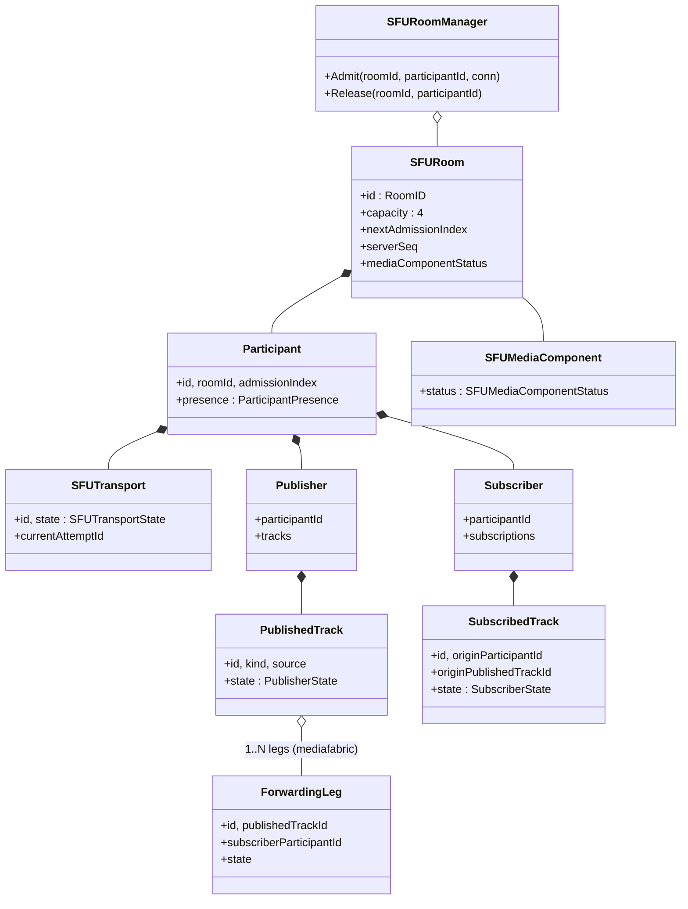

# Phase 1 Data Model — SFU Learning Room (003)

**Branch**: `003-webrtc-sfu-room` | **Date**: 2026-05-03
**Plan**: [plan.md](./plan.md) | **Spec**: [spec.md](./spec.md)
**Contract**: [contracts/signaling-protocol.md](./contracts/signaling-protocol.md)

> Scope: defines the server-side and frontend state entities required
> for SFU mode (003). Strictly additive; does not alter the 001 1:1
> data model or the 002 mesh data model.

---

## 0. Identifiers

| ID | Issuer | Format | Carried where |
|---|---|---|---|
| `participantId` (a.k.a. `peerId`) | Server on `join_accepted` | UUIDv4 | every message with participant scope |
| `roomId` | URL parameter; validated server-side | string, trimmed, 1–64, `[A-Za-z0-9._-]` | envelope `roomId` |
| `admissionIndex` | Server on `join_accepted` | uint64, monotonic per room, never reused | `join_accepted.payload.admissionIndex`; roster |
| `transportId` | Server on `join_accepted` | UUIDv4 | implicit (one per participant); referenced by `transport_state_update` |
| `transportAttemptId` | Both sides; monotonic uint64; server authoritative when starting renegotiation | uint64 | every transport-negotiation message |
| `publishedTrackId` | Server (`mediafabric`) on ingress track observed | UUIDv4 | `published_track_*`, `media_state_update` (track scope) |
| `subscribedTrackId` | Server (`mediafabric`) on forwarding leg established | UUIDv4 | `subscribed_track_*`, `subscription_state_changed` |
| `forwardingLegId` | Server (`mediafabric`); per (publishedTrackId, subscriberParticipantId) | UUIDv4 | inspector summary only; not on the wire |
| `requestId` | Sender-issued UUIDv4 for request/response correlation | UUIDv4 | `join_room`, `error`, etc. |
| `serverSeq` | Monotonic per `SFURoom` | uint64 | `roster_snapshot`, `roster_update` |

`participantId` = `peerId`. The contract uses `participantId` in v3
payloads; it is the same value as `peerId` in v1/v2 envelope semantics
where useful.

---

## A. Server-side entities (`signaling/internal/modes/sfu/`)

### A.1 `SFURoomManager` (`room/manager.go`)

| Field | Type | Notes |
|---|---|---|
| `rooms` | `map[RoomID]*SFURoom` | guarded by mutex; `RoomID` is the validated string |

Methods:

- `Admit(roomID, participantId, conn) (*Participant, AdmissionOutcome)` — creates the `SFURoom` if absent (subject to a future room-create policy; for MVP the route URL is the room key); rejects if room is at capacity.
- `Release(roomID, participantId) ReleaseOutcome` — removes the participant; deletes the room when empty.
- `Room(roomID) *SFURoom` — lookup; nil if absent.

### A.2 `SFURoom` (`room/room.go`)

| Field | Type | Notes |
|---|---|---|
| `id` | `RoomID` | route URL parameter, validated |
| `capacity` | `int` | constant `4` (FR-011) |
| `participants` | `map[ParticipantID]*Participant` | size ≤ capacity |
| `nextAdmissionIndex` | `uint64` | monotonic; incremented on each admission; never reused |
| `serverSeq` | `uint64` | monotonic per room; `roster_update` carries `serverSeq + 1` etc. |
| `mediaComponentStatus` | `SFUMediaComponentStatus` | room-scoped view of mediafabric availability for this room |
| `mu` | `sync.Mutex` | guards mutations |

Invariants:

- `len(participants) ≤ 4` at all times.
- A 5th `Admit` returns `room_full`.
- Removing a participant is final for that participant; the same
  participant ID is never reused.
- `admissionIndex` values are never reused within a room's lifetime.

### A.3 `Participant` (`room/participant.go`)

| Field | Type | Notes |
|---|---|---|
| `id` | `ParticipantID` | UUIDv4, server-assigned |
| `roomId` | `RoomID` |  |
| `admissionIndex` | `uint64` |  |
| `presence` | `ParticipantPresence` | `joined / media-ready / released / left` |
| `transport` | `*SFUTransport` | one per participant (DD-002 = A) |
| `publisher` | `*Publisher` | role-aggregate of PublishedTracks |
| `subscriber` | `*Subscriber` | role-aggregate of SubscribedTracks (one set per remote) |
| `conn` | `signaling.Conn` | per-conn write surface (mode root) |
| `joinedAt` | `time.Time` |  |

`ParticipantPresence` (FR-013 surface 1):

```text
joined
  → media-ready   (after media_ready)
  → released      (media_failed / camera-mic acquisition fail / leave before media-ready)
  → left          (after leave_room or ungraceful disconnect)
```

Released and left are terminal; the slot is freed in either case. A
released participant MAY rejoin from the route (issues a fresh
`participantId`).

### A.4 `Publisher` (`room/publisher.go`)

| Field | Type | Notes |
|---|---|---|
| `participantId` | `ParticipantID` |  |
| `tracks` | `map[PublishedTrackID]*PublishedTrack` | up to 2 (1 audio + 1 video) |

### A.5 `Subscriber` (`room/subscriber.go`)

| Field | Type | Notes |
|---|---|---|
| `participantId` | `ParticipantID` |  |
| `subscriptions` | `map[SubscribedTrackID]*SubscribedTrack` | one per (remote PublishedTrack, this participant) |

### A.6 `SFUTransport` (`room/transport.go`)

| Field | Type | Notes |
|---|---|---|
| `id` | `TransportID` |  |
| `participantId` | `ParticipantID` |  |
| `state` | `SFUTransportState` |  |
| `currentAttemptId` | `uint64` | monotonic; incremented on every renegotiation |
| `mediaHandle` | `mediafabric.TransportHandle` | opaque to `room/`; used by `signaling/` to call `mediafabric` |

`SFUTransportState` (FR-013 surface 2):

```text
new
  → connecting
  → connected
  → disconnected
  → failed
  → closed
```

Transitions reflect Pion's composite state on the server side and are
reported to the client as `transport_state_update` events. The four
Principle V states (`signalingState`, `iceGatheringState`,
`iceConnectionState`, `connectionState`) are observed on the **browser**
side only — the server reports its own composite `SFUTransportState`
via `transport_state_update`, but the four Principle V states are
surfaced by the browser-side store.

### A.7 `PublishedTrack` (`room/publisher.go`)

| Field | Type | Notes |
|---|---|---|
| `id` | `PublishedTrackID` |  |
| `participantId` | `ParticipantID` | publisher |
| `kind` | `audio` / `video` |  |
| `source` | `microphone` / `camera` / `screen` (video only) |  |
| `state` | `PublisherState` |  |
| `mediaHandle` | `mediafabric.PublishedTrackHandle` | opaque |

`PublisherState` (FR-013 surface 3):

```text
not-publishing
  → publishing
  → muted        (mute=true via media_state_update; no renegotiation)
  → publishing   (mute=false)
  → track-ended  (RTCRtpSender.track.ended; e.g. camera unplugged; EC-002, EC-006)
  → failed       (sender failure)
  → not-publishing  (on leave)
```

Source labels:

- `microphone` (audio kind only).
- `camera` / `screen` / `camera-off` (video kind only). `camera-off`
  is a UX label used when the video sender's track is `null` or
  `enabled=false`.

### A.8 `SubscribedTrack` (`room/subscriber.go`)

| Field | Type | Notes |
|---|---|---|
| `id` | `SubscribedTrackID` |  |
| `subscriberParticipantId` | `ParticipantID` |  |
| `originParticipantId` | `ParticipantID` |  |
| `originPublishedTrackId` | `PublishedTrackID` |  |
| `kind` | `audio` / `video` |  |
| `source` | mirrored from origin's PublishedTrack |  |
| `state` | `SubscriberState` |  |
| `legHandle` | `mediafabric.ForwardingLegHandle` | opaque |

`SubscriberState` (FR-013 surface 4):

```text
not-subscribed
  → subscribing
  → subscribed
  → track-ended  (origin published_track_removed / EC-006)
  → failed       (subscriber-side receiver failure)
  → not-subscribed  (on remote leave or local leave)
```

### A.9 `ForwardingLeg` (`mediafabric/forwarder.go`)

Per (publishedTrack, subscriberParticipant) pair. Owns the egress
RTP loop. Does not appear in `room/` (kept inside `mediafabric/` as
opaque state); referenced from `room.SubscribedTrack.legHandle`.

| Field | Type | Notes |
|---|---|---|
| `id` | `ForwardingLegID` |  |
| `publishedTrackId` | `PublishedTrackID` |  |
| `subscriberParticipantId` | `ParticipantID` |  |
| `egressTrack` | `*webrtc.TrackLocalStaticRTP` | Pion sendonly track |
| `subscriberPC` | `*mediafabric.PeerConn` |  |
| `state` | `active` / `closed` |  |

### A.10 `SFUMediaComponent` (`mediafabric/fabric.go`)

The room-scoped media-plane state. One per running process at MVP
(no clustering). Status applies room-by-room.

`SFUMediaComponentStatus`:

```text
available     — normal forwarding works
impaired      — partial degradation; surfaced as `unavailable` in MVP
unavailable   — broadcast `sfu_status_changed { status: "unavailable" }`
```

The MVP collapses `impaired` and `unavailable` into one user-facing
status (`unavailable`) for FR-083 (a). The internal distinction is
retained for future telemetry; the MVP UI shows one banner.

### A.11 `SignalingSession` / per-WS state (`mode root`)

`SessionSFU` per-WS struct (mirrors 001/002):

| Field | Type | Notes |
|---|---|---|
| `connID` | `string` | from `wsserver` |
| `service` | `*signaling.Service` |  |
| `participantId` | `ParticipantID` | populated on `join_accepted` |
| `roomId` | `RoomID` | populated on `join_accepted` |
| `released` | `atomic.Bool` | release latch |

Implements both `wsserver.SessionHandler` and `signaling.Conn` (per
`specs/signaling-architecture.md` §3.4 pattern).

### A.12 `TransportAttempt` (logical)

Not a struct; a monotonic uint64 per `SFUTransport`. Server authoritative
on the value when it sends `transport_renegotiation_needed`; both sides
update their local counter. Stale messages discarded (EC-009).

### A.13 `EventLogSummary` source model

The server does NOT keep an event log of its own (mirrors 001/002).
Event-log entries are emitted by the **client** based on the
client-observed sequence; the server's role is to send `participant_left`,
`subscribed_track_*`, `transport_state_update`, etc. The client
constructs `EventLogEntry` (frontend B.10) from those.

### A.14 Capacity invariants

- `SFURoom.capacity == 4` is constant (FR-011).
- 5th admission returns `join_rejected { result: "join_rejected_room_full" }`.
- No queue.
- No subscribe-only observer mode (FR-031, EC-001, Non-Goals).
- Media acquisition failure releases the slot
  (`participant_released { result: "participant_released_media_failed" }`)
  and frees capacity for a future joiner.

---

## B. Frontend entities (`frontend/src/modes/sfu/state/`)

Each store slice is defined in its own file under `state/`. The
Zustand store composes them all (see `state/store.ts`).

### B.1 `LocalParticipant` (`state/session.ts`)

| Field | Type | Notes |
|---|---|---|
| `roomId` | `string` |  |
| `participantId` | `string` | populated on `join_accepted` |
| `admissionIndex` | `number` |  |
| `presence` | `ParticipantPresence` | mirrors A.3 |
| `joinPhase` | `idle / requesting / joined / media-ready / released / left / signaling-error` | combines presence with WS state |
| `joinError` | discriminated union (or null) | on `join_rejected` / `media_failed` |

### B.2 `SFUTransportState` (`state/transport.ts`)

| Field | Type | Notes |
|---|---|---|
| `transportId` | `string \| null` |  |
| `state` | `SFUTransportState` (A.6) | server-reported composite |
| `signalingState` | `RTCSignalingState` | browser-observed |
| `iceConnectionState` | `RTCIceConnectionState` | browser-observed |
| `iceGatheringState` | `RTCIceGatheringState` | browser-observed |
| `connectionState` | `RTCPeerConnectionState` | browser-observed |
| `currentAttemptId` | `number` | monotonic; client mirrors server |
| `lastError` | `string \| null` |  |

Exactly one row per local participant (FR-064). Renders as
`SfuTransportPanel.tsx`.

### B.3 `LocalMediaState` (`state/session.ts` or dedicated slice)

| Field | Type | Notes |
|---|---|---|
| `cameraTrackId` | `string \| null` |  |
| `microphoneTrackId` | `string \| null` |  |
| `screenTrackId` | `string \| null` | non-null while screen share active |
| `cameraEnabled` | `boolean` |  |
| `microphoneEnabled` | `boolean` |  |
| `videoSource` | `camera / screen / camera-off` | label sent to remote tiles via metadata |
| `mediaError` | discriminated union (or null) |  |

### B.4 `PublisherState` (`state/publisher.ts`)

`Map<PublishedTrackID, PublishedTrackView>`:

| Field | Type | Notes |
|---|---|---|
| `id` | `string` |  |
| `kind` | `'audio' \| 'video'` |  |
| `source` | `'microphone' \| 'camera' \| 'screen' \| 'camera-off'` |  |
| `state` | `PublisherState` (A.7) |  |
| `senderMid` | `string \| null` | for transceiver bookkeeping |

### B.5 `RemoteParticipant` (`state/remote-participants.ts`)

`Map<ParticipantID, RemoteParticipant>`:

| Field | Type | Notes |
|---|---|---|
| `participantId` | `string` |  |
| `admissionIndex` | `number` |  |
| `presence` | `ParticipantPresence` |  |
| `subscriptions` | `Map<SubscribedTrackID, SubscribedTrackView>` |  |

`SubscribedTrackView` (B.6) mirrors A.8.

### B.6 `SubscriberState` (`state/subscriber.ts`)

`Map<SubscribedTrackID, SubscribedTrackView>`:

| Field | Type | Notes |
|---|---|---|
| `id` | `string` |  |
| `originParticipantId` | `string` |  |
| `kind` | `'audio' \| 'video'` |  |
| `source` | `'microphone' \| 'camera' \| 'screen' \| 'camera-off'` |  |
| `state` | `SubscriberState` (A.8) |  |
| `renderState` | `'active' \| 'track-ended' \| 'failed'` | for tile UX |
| `receiverMid` | `string \| null` | for transceiver bookkeeping |
| `mediaStreamTrackId` | `string \| null` | rendered into `<video>` / `<audio>` |

### B.7 `RemoteTrackState`

Same data as `SubscribedTrackView` (B.6), but viewed per remote tile
(grouped by `originParticipantId`).

### B.8 `PublishedTrackView` / `SubscribedTrackView`

Already defined under B.4 / B.6.

### B.9 `SFUCostSummary` (`state/cost.ts`)

| Field | Type | Notes |
|---|---|---|
| `participantCount` | `number` |  |
| `localTransportCount` | `1` | constant per DD-002 |
| `subscribedRemoteCount` | `number` | `participantCount - 1` |
| `activePublishedTrackCount` | `number` |  |
| `outgoingSendersCount` | `number` | 2 per fully-publishing participant |
| `uplinkCopiesPerPublishedTrack` | `1` | constant |
| `forwardingDeliveriesPerPublishedTrack` | `number` | `subscribedRemoteCount` |
| `forwardingDeliveriesFromThisParticipant` | `number` | `activePublishedTrackCount * subscribedRemoteCount` |
| `serverMediaRole` | `'forwarding (SFU)'` | constant |
| `mediaPath` | `'browser ↔ SFU'` | constant |
| `topologyLabel` | `'SFU (1 bidirectional PC per participant)'` | constant |

### B.10 `LearningInspectorState` (`state/inspector.ts`)

| Field | Type | Notes |
|---|---|---|
| `sdpSummary` | `{ mediaSections: number, lastDescriptionType: 'offer' \| 'answer' \| null, transceivers: { mid: string, direction: RTCRtpTransceiverDirection, kind: 'audio' \| 'video' }[] }` | derived browser-side; raw SDP never stored |
| `iceSummary` | `{ candidateTypes: ('host' \| 'srflx' \| 'relay')[], anyRelay: boolean, stunUrls: string[], turnUrlsConfigured: boolean }` | TURN credentials excluded |
| `forwardingPerPublishedTrack` | `Map<PublishedTrackID, { kind, source, subscriberDeliveryCount, subscriberOriginLabels: string[] }>` | from `forwarding_summary_update` |
| `failureDomainSummary` | `{ participantLeft, transportFailed, publishedTrackFailed, subscribedTrackFailed, sfuUnavailable, signalingError }` | counters and last-occurrence labels |

Validation guard: any payload field whose value matches `/^v=0/m`, or
contains `"candidate:"` outside an enum match, or matches a TURN
credential URL, is rejected by the slice's setter (NFR-004 + EC-016 +
SC-S08).

### B.11 `EventLogEntry` (`state/eventLog.ts`)

| Field | Type | Notes |
|---|---|---|
| `id` | `string` |  |
| `ts` | `number` | epoch ms |
| `type` | enum (FR-062 vocabulary) |  |
| `scope` | one or more of `'local' \| 'remote-participant' \| 'SFU' \| 'publisher' \| 'subscriber' \| 'media-track' \| 'signaling' \| 'media-path'` |  |
| `participantId` | `string \| null` |  |
| `publishedTrackId` | `string \| null` |  |
| `subscribedTrackId` | `string \| null` |  |
| `summary` | `string` | human-readable; FR-063 |
| `code` | `string \| null` | e.g. `unsupported_version` |
| `reason` | `string \| null` | short message |

Forbidden in `summary` / `reason` / any field: raw SDP, raw ICE
candidate strings, raw RTP payloads, TURN credentials, raw SSRC hex
(NFR-004, SC-S08, EC-016). The append-action validates this.

### B.12 `SignalingState` (`state/signaling-error.ts`)

| Field | Type | Notes |
|---|---|---|
| `wsState` | `'closed' \| 'connecting' \| 'open' \| 'closing'` |  |
| `signalingError` | `null \| { reason: string, since: number }` | populated when WS lost; surfaces banner |

### B.13 Distinct state surfaces (FR-013 hard constraint)

The following surfaces MUST NOT be collapsed into one enum. Each lives
in its own slice (filenames in parens):

- **ParticipantPresence** — A.3 / `state/session.ts`,
  `state/remote-participants.ts`.
- **SFUTransportState** — A.6 / `state/transport.ts`.
- **PublisherState** (per PublishedTrack) — A.7 / `state/publisher.ts`.
- **SubscriberState** (per SubscribedTrack) — A.8 / `state/subscriber.ts`.
- **PublishedTrack state** — included in `state/publisher.ts` (kind,
  source, render).
- **SubscribedTrack state** — included in `state/subscriber.ts`.
- **SFUMediaComponentStatus** — `state/inspector.ts` (room-level
  banner state) or `state/session.ts`.

Remote tiles compose these as required (FR-013, FR-065): a remote tile
renders the **remote participant's** presence + the local
SubscriberState for each subscription + per-track render state. A
remote tile MUST NOT render `SFUTransportState` as if it were a
per-remote indicator.

---

## C. Data-flow examples

### C.1 Join + initial publish (Alice alone in room)

```text
Browser                         /ws/sfu              mediafabric
-------                         -------              -----------
join_room        ───────────▶
                                join_accepted ◀──────
                                roster_snapshot ◀────
media_ready (after gUM ok) ──▶
                                roster_update ◀──────
transport_offer (a:1) ───────▶
                                                 NewTransport
                                                 HandleClientOffer
                                ◀──── transport_answer (a:1)
transport_ice_candidate ─────▶ ─── HandleClientICE
                                ◀── transport_ice_candidate
                                ───── ↳ Pion session connected
                                transport_state_update connected
published_track_added (audio) ◀──── (mediafabric.OnTrack fires)
published_track_added (video) ◀──── (mediafabric.OnTrack fires)
```

`transport_state_update` is server-reported. The four Principle V
states are observed on the browser side and surfaced in
`SFUTransportPanel`.

### C.2 Subscriber renegotiation when Bob joins existing Alice

For Alice (already connected):

```text
Browser                         /ws/sfu              mediafabric
                                roster_update {Bob: joined}
                                roster_update {Bob: media-ready}
                                ◀── transport_renegotiation_needed
                                     (a:2, intent: add, [Bob audio, Bob video])
transport_offer (a:2) ───────▶
                                ◀── transport_answer (a:2)
                                subscribed_track_added (audio) ◀────
                                subscribed_track_added (video) ◀────
                                subscription_state_changed ◀───── (subscribing → subscribed)
```

Existing `iceConnectionState` / `connectionState` indicators MUST NOT
regress (FR-025). `signalingState` excursions are expected (visible).

### C.3 Mute publisher

```text
Browser                         /ws/sfu              mediafabric
local mute toggle               
media_state_update ──────────▶  (no transportAttemptId; carries
{ participantId, publishedTrackId, mute: true })
                                media_state_update ◀──── (fan-out)
                                ─── (no Pion call; mediafabric unchanged)
```

No SDP renegotiation. Remote tile updates within 2 s (US5).

### C.4 Screen share

```text
Browser                         /ws/sfu              mediafabric
RTCRtpSender.replaceTrack(screen)
media_state_update ──────────▶  { source: "screen" }
                                media_state_update (fan-out) ─────▶
                                ─── (no Pion call; same egress track)
```

The video PublishedTrack's `source` flips from `camera` to `screen`.
`subscriberDeliveryCount` unchanged (still 1 inbound copy, N−1
forwarded).

### C.5 Graceful leave

```text
Browser                         /ws/sfu              mediafabric
leave_room ──────────────────▶
                                ─── room.Release(participantId)
                                ─── mediafabric.CloseTransport(handle)
                                ─── tear down all forwarding legs
                                participant_left ◀──── (broadcast)
                                subscribed_track_removed ◀──── (per leg)
                                subscription_state_changed (track-ended) ◀────
```

---

## D. Validation rules

| Rule | Site | Notes |
|---|---|---|
| `roomId` matches regex | server (admission) + client (route) | FR-010, EC-013 |
| `v == 3` on `/ws/sfu` | server (envelope decode) | otherwise `error unsupported_version` |
| Capacity ≤ 4 | server (admission) | FR-011 |
| `media_ready` only when `presence == joined` | server | else `error unexpected_media_ready` |
| Transport-negotiation messages carry `transportAttemptId` matching current attempt | server + client | EC-009 |
| Media-state messages carry participant/track scope, never `transportAttemptId` | server (validator) + client | FR-090 (a) |
| `transport_ice_candidate.candidate == ""` | server | reject as `malformed` (mirrors v1/v2) |
| `transport_ice_candidate.candidate == null` | server | accept as end-of-candidates |
| Chat message types | server + client | reject schema-time (DD-003 = A) |
| Raw RTP / media payloads / TURN credentials in any v3 payload | server (validator) | reject as `malformed` |
| Inspector slice payload contains `v=0` / `candidate:` outside enum / TURN credential | client (slice setter) | reject (NFR-004, EC-016) |
| Event-log entry summary contains raw SDP/ICE/RTP/TURN | client (append action) | reject |

---

## E. Summary diagram



The frontend mirrors these entities as `LocalParticipant`,
`RemoteParticipant`, `PublishedTrackView`, `SubscribedTrackView`,
`SFUTransportState`, `SFUCostSummary`, `LearningInspectorState`,
`EventLogEntry`, `SignalingState` — each with the surface-distinctness
guarantees of §B.13.
