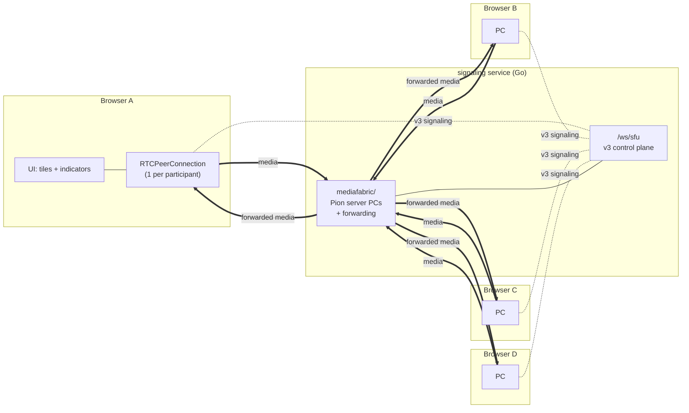
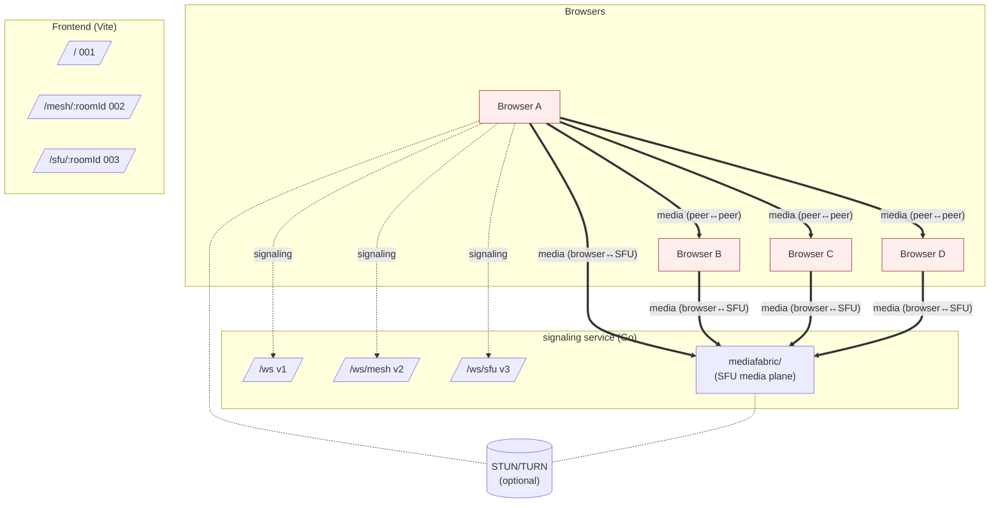
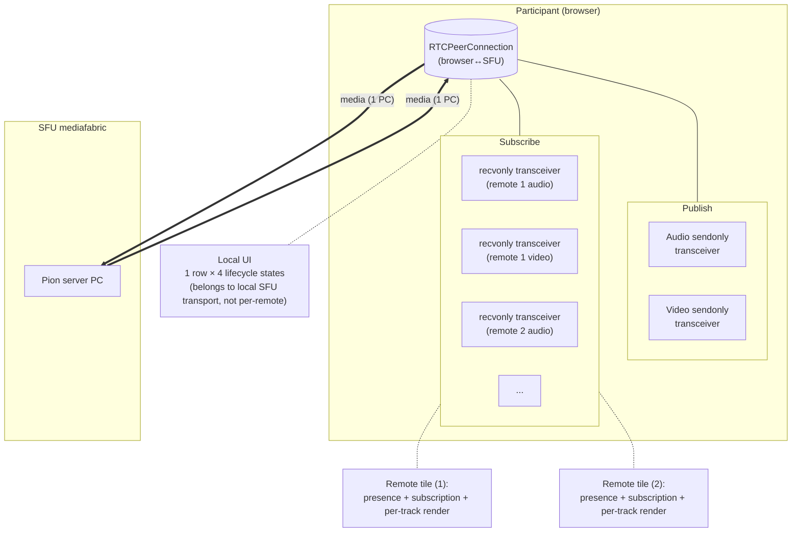
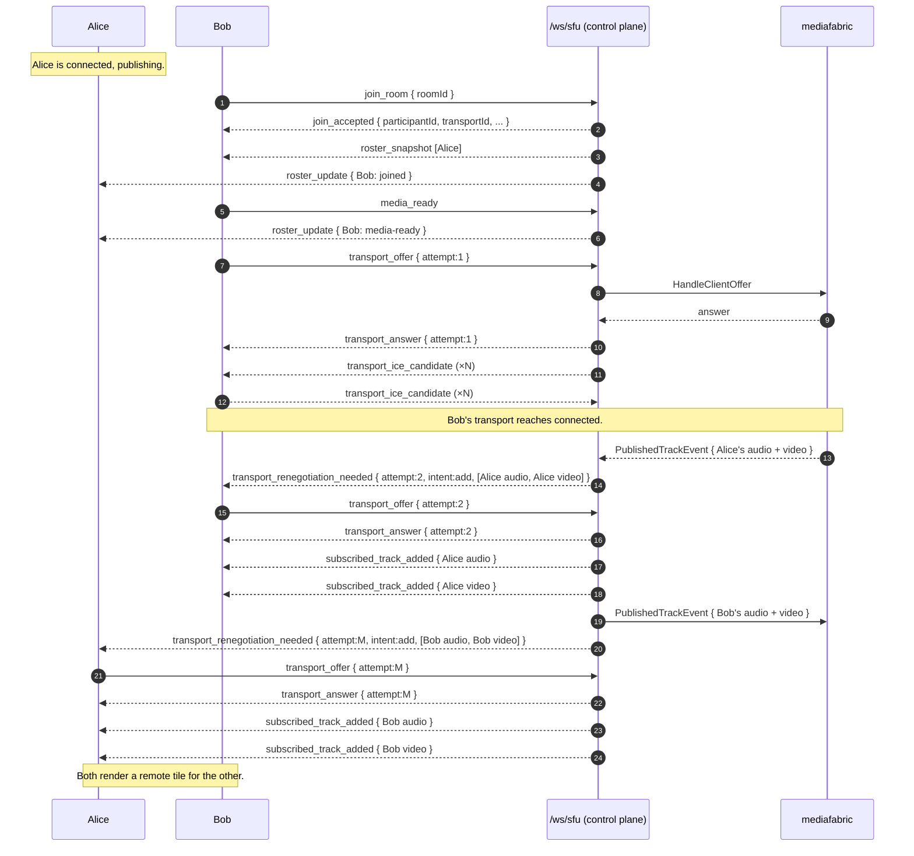
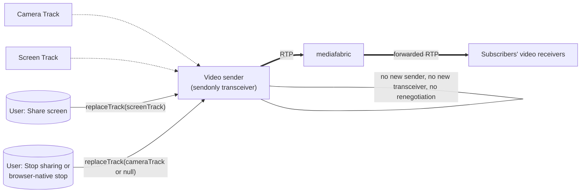
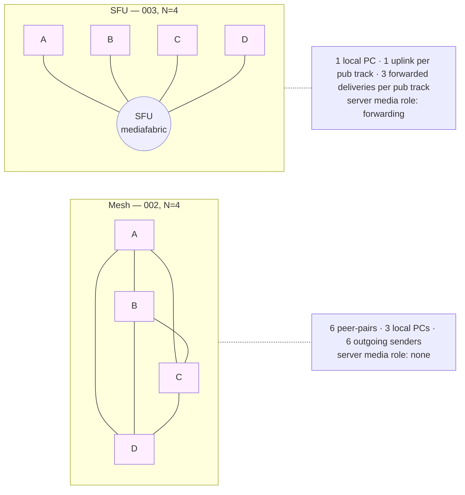

# Implementation Plan: SFU Learning Room (003)

**Branch**: `003-webrtc-sfu-room` | **Date**: 2026-05-03 | **Spec**: [spec.md](./spec.md)
**Input**: Feature specification at `specs/003-webrtc-sfu-room/spec.md`

> **Source priority** (this plan derives only from these, in order):
> 1. `specs/003-webrtc-sfu-room/spec.md` — current 003 spec, post-2026-05-03 clarify pass.
> 2. `specs/architecture.md` — cross-mode boundary rules.
> 3. `specs/signaling-architecture.md` — per-mode three-ring layout (and §5.2 SFU media-plane question).
> 4. `specs/frontend-architecture.md` — per-mode frontend three-ring layout.
> 5. 002 mesh artifacts — comparison and regression boundary only.
> 6. 001 1:1 artifacts — regression boundary only.
>
> The 001 and 002 `tasks.md` are NOT inputs.

---

## 1. Summary

SFU Learning Room is the third learning mode. It adds a self-contained **SFU
mode** at frontend route `/sfu/:roomId` and backend endpoint `/ws/sfu`,
talking a new **v3 signaling contract**. Each participant maintains exactly
**one bidirectional `RTCPeerConnection`** to a server-side **SFU media
component**; that component lives **in-process** in the existing Go
signaling binary as a Pion-based `mediafabric` package under
`signaling/internal/modes/sfu/mediafabric/`. The SFU receives one uplink
copy per published track and forwards it to every other participant's
subscriber. Capacity is **4 reserved participants** with a 5th rejection;
no observer mode; no chat; screen share is implemented as published
video-source replacement; failure recovery is **leave/rejoin only**. 001
1:1 mode (`/`, `/ws`, v1) and 002 mesh mode (`/mesh/:roomId`, `/ws/mesh`,
v2) remain frozen and reachable.

The architectural decisions DD-001..DD-005 were locked by the 2026-05-03
clarify pass; this plan does **not** reopen them. The remaining
plan-level decision — manual reconnect-to-SFU button vs. leave/rejoin —
is resolved here as **leave/rejoin only**, in alignment with FR-026 and
Non-Goals.

---

## 2. Technical Context

**Language / Versions**

- Backend: **Go 1.23** (per `signaling/go.mod`).
- Frontend: **TypeScript 5.6** + **React 18.3** + **Vite 5** (per
  `frontend/package.json`). State: Zustand 5.0; schema validation: Zod 3.23.
- Tests: **Vitest 2.1** (frontend unit), **Playwright 1.59** (frontend e2e),
  **`go test`** (backend unit + protocol-flow).

**Primary dependencies (new for 003)**

- **Pion WebRTC v4** (`github.com/pion/webrtc/v4`) for the in-process
  `mediafabric` Go package. Pion is the only Go-native, low-level
  RTCPeerConnection / DTLS-SRTP / RTP / ICE library that exposes the
  media path to the learner without wrapping a product-style SFU.
- No new frontend dependencies. The SFU frontend uses the same browser
  primitives (`RTCPeerConnection`, `RTCRtpSender`, `RTCRtpReceiver`,
  `getUserMedia`, `getDisplayMedia`) used by 001/002 (NFR-007).

**Storage**: none. No persistence, no recording, no media archiving
(Non-Goals, NFR-003, SC-S07).

**Target platform**: modern evergreen browsers (Chromium/Firefox/Safari,
current and current-1) connecting to the local Docker Compose stack on
`localhost`. No production deployment.

**Project type**: web application — `frontend/` (React+Vite) +
`signaling/` (Go) + `docker-compose.yml`.

**Performance goals (learning indicators, not SLOs)**

- 4-browser SFU room established with all three remote tiles rendering
  within 30 s of the 4th join (SC-S01).
- Roster/cleanup propagation within 10 s of an ungraceful disconnect
  (SC-S04). Local `signaling-error` within 5 s (SC-S04b).
- Mute/camera-toggle reflected on remote tiles within 2 s (US5).
- Screen-share appears on remote tiles within 5 s (US6).

**Constraints**

- Capacity = 4 (FR-011). 5th = structured `join_rejected_room_full`.
- One bidirectional PC per participant (DD-002 = A; FR-020).
- One audio + one video sender per fully-publishing participant; screen
  share replaces video-sender's track via `replaceTrack` (DD-004 = A; FR-042).
- v3 wire MAY carry raw SDP / raw ICE; UI / event log / inspector / app
  logs MUST NOT render or log raw SDP / ICE / RTP / TURN credentials
  (NFR-004, SC-S08, EC-016).
- 001 v1 and 002 v2 contracts are frozen byte-for-byte (NFR-005, SC-S06).
- No automatic reconnect, no ICE restart proper, no manual
  reconnect-to-SFU button in MVP (FR-026, this-plan decision §5).

**Scale / scope**

- One SFU room of capacity 4. One Docker Compose stack. No clustering,
  no multi-region, no autoscaling (Non-Goals, NFR-010).

---

## 3. Constitution Check

> Gate evaluated against `.specify/memory/constitution.md` v2.0.0,
> Principles I–IX and Governance G-1..G-5. Re-evaluated post-design.

| Principle | Verdict | Evidence |
|-----------|---------|----------|
| **I. Specification-First Development** | ✅ Pass | `spec.md` resolved DD-001..DD-005 on 2026-05-03; this plan does not introduce requirements absent from the spec. Non-Goals section is explicit. Every behavior maps to FR/EC/SC IDs. |
| **II. Contract-First Signaling** | ✅ Pass | v3 contract authored as a sibling artifact (`contracts/signaling-protocol.md`) before any verb code. Both the Go validators and the TS Zod schemas derive from the contract; ad-hoc JSON is forbidden by Governance G-3 and enforced by §11 wire validation. |
| **III. Separate Signaling from Media Transport** | ⚠️ Scoped divergence | Per spec §"Constitutional alignment", SFU mode introduces a server-side WebRTC endpoint (`mediafabric`) — that is the educational point (L19, L21, L23). The divergence is **confined to** `signaling/internal/modes/sfu/mediafabric/`; 001 and 002 server code MUST NOT receive or forward media (NFR-005, NFR-008). 001 and 002 cannot import `mediafabric/` (boundary audit). Tracked in §4 Complexity Tracking. |
| **IV. Incremental Vertical Slices** | ✅ Pass | §25 phased plan decomposes into 14 phases (S0..S13 plus quickstart S14), each runnable, each with DoD + manual verification. No giant "implement SFU" phase. |
| **V. WebRTC Lifecycle Visibility** | ✅ Pass | The four Principle V states are surfaced for the local SFU transport (FR-022, FR-064). Event log is always visible without devtools (FR-060). Learning inspector summarizes SDP/ICE/RTP/forwarding without raw payloads (FR-072, DD-005). Cost summary surfaces topology shape (FR-070). |
| **VI. Failure-Aware Design** | ✅ Pass | EC-001..EC-016 enumerate the failure surface; FR-080..FR-084 + L25 lock the SFU failure-domain vocabulary; §22 maps each failure to a UI surface and a cleanup. Recovery scope is leave/rejoin only by design. |
| **VII. Security by Default (Honest Scope)** | ✅ Pass | NFR-001/002/003 enforce HTTPS-or-localhost, no committed secrets, and an explicit "SFU media is not E2EE" statement in the learning panel. NFR-004 + EC-016 + SC-S08 forbid rendering or logging raw SDP / ICE / RTP / TURN credentials. The wire MAY carry SDP/ICE because WebRTC negotiation requires them; nothing else. |
| **VIII. Testing Discipline** | ✅ Pass | §23 testing strategy enumerates protocol-flow tests, contract validation tests, room/state-machine tests, mediafabric lifecycle tests, plus manual quickstart steps for SC-S01..SC-S08 + L19..L25. Frontend tests cover the v3 schemas, the SFU stores, the lifecycle indicators, the cost summary, the inspector redaction, and the failure UI. |
| **IX. Simplicity with Extension Points** | ✅ Pass | The 1:1 MVP and the mesh extension remain unchanged. SFU is the next extension realized as a separate mode subtree. **No generic "topology engine"** is introduced (`specs/architecture.md` rule 6); each mode keeps its own state machines, contract, and verbs (`specs/signaling-architecture.md` §5). |

**Governance gates**

| Gate | Verdict |
|------|---------|
| **G-1 — no premature tech.** | ✅ Pass: spec was clarified before this plan; this plan only chooses tech (Pion) for an explicitly required capability. |
| **G-2 — DoD on every task.** | ✅ Each phase in §25 carries an explicit DoD. tasks.md (separate `/speckit.tasks` step) will inherit this requirement. |
| **G-3 — no undocumented signaling messages.** | ✅ Every wire message in §11 is in `contracts/signaling-protocol.md`. |
| **G-4 — no invisible WebRTC behavior.** | ✅ Every WebRTC behavior maps to an event log entry (FR-062), a lifecycle indicator (FR-064/FR-065), and/or a learning-inspector summary (FR-072). |
| **G-5 — guard 1:1 MVP boundary.** | ✅ 001 / 002 codepaths and contracts unchanged (NFR-005). 003 is additive. The boundary audit (NFR-006) extended to recognize `sfu` enforces this in CI. |

Result: **Gate passes.** Single tracked complexity (Principle III scoped
divergence) is documented in §4 with no simpler alternative.

---

## 4. Complexity Tracking

| Violation / divergence | Why needed | Simpler alternative rejected because |
|---|---|---|
| **Server-side WebRTC endpoint inside the Go signaling process (`mediafabric/`)** — Principle III scoped divergence. | The educational point of an SFU is that the server is a WebRTC participant. Without server-side PCs, no SFU at all (L19, L21, L23). Confined to the `sfu` mode subtree; 001/002 cannot import. | (a) Wrapping a product-style SFU (LiveKit / mediasoup) hides the media path and defeats the learning goal. (b) Out-of-process Go SFU service adds Docker Compose surface, multi-process state, and cross-service signaling glue with no learning gain at N=4. (c) Implementing ICE/DTLS/SRTP/RTP/RTCP from scratch is wildly out of scope. Pion is a low-level Go library that exposes the protocol mechanics directly. |
| **Pion WebRTC v4 dependency on the backend** — new third-party library. | Required to host server-side `RTCPeerConnection` objects, terminate DTLS-SRTP, parse RTP, and forward packets. There is no Go-native, low-level alternative that exposes the media path to a learner. | Building from scratch is out of scope (NFR-010). Other Go libraries either wrap Pion or wrap a higher-level SFU. |

No further divergences are introduced. No "topology engine," no shared
SFU base class, no generics over contract version (`specs/architecture.md`
rule 6, `specs/signaling-architecture.md` §5.1).

---

## 5. Source-of-Truth Decisions

The following are **locked** by the spec's 2026-05-03 clarify pass and
are not reopened by this plan:

- **DD-001 — SFU media-plane placement** = **Option A**. In-process Go
  `mediafabric` package under `signaling/internal/modes/sfu/mediafabric/`.
  Single binary; isolated from 001/002 by package boundary; not a
  product-style SFU wrapper; not a from-scratch ICE/DTLS/SRTP
  implementation. Pion is the implementation library (chosen in
  research §1).
- **DD-002 — Browser↔SFU PeerConnection model** = **Option A**. Exactly
  one bidirectional `RTCPeerConnection` per participant; carries publish
  sendonly transceivers + subscribe recvonly transceivers; subscriber
  add/remove triggers SDP renegotiation on the same PC.
- **DD-003 — Chat scope** = **Option A**. Chat omitted from SFU MVP.
  No chat panel, no chat event-log entries, no chat message types in v3.
- **DD-004 — Screen share scope** = **Option A**. Screen share is
  published video-source replacement on the existing video sender via
  `RTCRtpSender.replaceTrack`. No new transceiver, no second video
  sender, no renegotiation solely for screen share. Concurrent sharers
  allowed; no `screen_share_busy`.
- **DD-005 — Learning inspector depth** = **Option B**. Derived
  summaries of SDP / ICE / track / forwarding metadata; never raw
  SDP / ICE / RTP / TURN credentials in UI or logs.

**Plan-level decision (resolves spec §Assumptions residual UI choice):**

- **PD-001 — Failure recovery scope = leave/rejoin only.** No manual
  per-transport "Reconnect to SFU" button in MVP. No automatic
  reconnect, no ICE restart proper, no automatic signaling reconnect
  (FR-026, NFR-010, Non-Goals). Rationale: 002 already teaches
  reconnect-this-pair via fresh PC; 003 should focus on SFU topology,
  media path, publisher/subscriber model, forwarding, and SFU failure
  domains. Reconnect-to-SFU can be a future feature.

---

## 6. Preservation Boundary for 001 and 002

This feature is **strictly additive**. The following are frozen for the
duration of 003 development:

- **001 v1 contract** at `specs/001-webrtc-1to1-call/contracts/signaling-protocol.md`.
- **002 v2 contract** at `specs/002-webrtc-mesh-room/contracts/signaling-protocol.md`.
- **Routes**: `/` and `/ws` belong to 001; `/mesh/:roomId` and
  `/ws/mesh` belong to 002. v1 messages MUST NOT appear on `/ws/sfu`;
  v3 messages MUST NOT appear on `/ws` or `/ws/mesh` (FR-021, contract
  rule §1.0).
- **Source trees**: `frontend/src/modes/one-to-one/`,
  `frontend/src/modes/mesh/`, `signaling/internal/modes/onetoone/`,
  `signaling/internal/modes/mesh/` are not edited except for the
  cross-mode registration plumbing explicitly listed in §7 (route
  registration in `frontend/src/app/modes.tsx`, endpoint registration
  in `signaling/internal/app/routes.go`, mode list update in
  `scripts/audit-boundaries.sh`).
- **Quickstarts**: 001 and 002 quickstarts pass unchanged (SC-S06).

Any shared-infra change beyond the three explicit registration sites
above MUST be flagged as a regression-gated edit and verified by
re-running 001 + 002 quickstart procedures before this plan ships.

---

## 7. Project Structure

### 7.1 Documentation (this feature)

```text
specs/003-webrtc-sfu-room/
├── spec.md                       # source of truth (do not edit in this plan)
├── plan.md                       # this file
├── research.md                   # Phase 0 — implementation choices
├── data-model.md                 # Phase 1 — server + frontend entities
├── contracts/
│   └── signaling-protocol.md     # v3 wire contract
├── quickstart.md                 # manual verification flow
├── checklists/
│   └── requirements.md           # already authored
└── tasks.md                      # generated separately by /speckit.tasks
```

### 7.2 Source-code structure

Mirroring the existing 001/002 mode/ring conventions in
`specs/architecture.md` and `specs/signaling-architecture.md` (and the
`specs/signaling-architecture.md` §5.2 "same-Go-service" SFU shape).

#### Backend additions

```text
signaling/
  internal/
    app/
      routes.go                         (EDIT: + mux.Handle("/ws/sfu", sfu.NewHandler(deps.Logger)))
    modes/
      sfu/                              (NEW — entire subtree)
        handler.go                      # wsserver.Mode adapter; SessionSFU per-WS
        heartbeat.go                    # per-mode pong-timeout label constants
        protocol/                       # Ring 2 — wire schema (v3)
          envelope.go                   # Envelope, Type enum, ContractVersion=3
          decode.go                     # Decode + per-type validators + ValidateRoomID
          messages.go                   # per-type payload structs + Validate()
          errors.go                     # ErrorCode enum, DecodeError, sentinels
          wire.go                       # IceServer (JSON-tagged), wire enums
        room/                           # Ring 2 — SFU room state machine
          conn.go                       # room.Conn interface (BaseContext + SendJSON)
          manager.go                    # SFURoomManager registry (Admit/Release)
          room.go                       # SFURoom (capacity 4, roster, presence)
          participant.go                # Participant struct + ParticipantPresence FSM
          publisher.go                  # PublisherState per PublishedTrack
          subscriber.go                 # SubscriberState per SubscribedTrack
          transport.go                  # SFUTransportState (per local PC)
          track_ids.go                  # publishedTrackId / subscribedTrackId issuance
        signaling/                      # Ring 3 — v3 verbs (one file per concept)
          conn.go                       # signaling.Conn interface, ConnState
          service.go                    # Service struct, NewService
          dispatch.go                   # Service.Dispatch (top-level switch)
          errorframe.go                 # writeError helper
          admission.go                  # join_room / join_accepted / join_rejected
          presence.go                   # leave_room / participant_left / participant_released
          roster.go                     # roster_snapshot / roster_update
          media.go                      # media_ready / media_failed
          transport_negotiation.go      # transport_offer_requested / offer / answer / renegotiation_needed
          transport_trickle.go          # transport_ice_candidate (incl. end-of-candidates)
          transport_state.go            # transport_state_update
          publish_subscribe.go          # published_track_added/removed, subscribed_track_added/removed,
                                        #   subscription_state_changed, media_state_update
          sfu_status.go                 # sfu_status_changed
          inspector.go                  # forwarding_summary_update / learning_inspector_update
        mediafabric/                    # SFU media plane (Pion-backed)
          fabric.go                     # MediaFabric: room-scoped Pion lifecycle
          peerconn.go                   # per-participant Pion RTCPeerConnection wrapper
          publish.go                    # ingress: receive PublishedTracks, register SSRCs
          subscribe.go                  # egress: add forwarding leg per (track, subscriber)
          forwarder.go                  # RTP/RTCP forwarding loops (no payload logging)
          summary.go                    # derived per-track / per-leg summaries (DD-005)
          status.go                     # SFUMediaComponentStatus + impairment hooks
          identifiers.go                # transportId / publishedTrackId / subscribedTrackId / forwardingLegId
  tests/
    modes/
      sfu/                              (NEW)
        handler_test.go                 # /ws/sfu version handshake; unsupported_version
        admission_test.go               # capacity 4, 5th rejected, invalid room id
        media_failed_test.go            # media_failed releases slot
        roster_test.go                  # snapshot + update ordering
        transport_negotiation_test.go   # offer/answer / renegotiation / stale transportAttempt
        publish_subscribe_test.go       # published_track_added → subscribed_track_added
        media_state_test.go             # media_state metadata is participant/track-scoped
        screen_share_test.go            # source label switch via media_state, no renegotiation
        sfu_status_test.go              # sfu_status_changed when control plane alive
        cleanup_test.go                 # graceful leave + ungraceful disconnect cleanup
        no_media_in_logs_test.go        # log surface contains no SDP/ICE/RTP/TURN
        no_001_002_import_test.go       # mediafabric is not importable from onetoone/mesh
```

#### Frontend additions

```text
frontend/
  src/
    app/
      modes.tsx                         (EDIT: + { id: "sfu", label: "SFU mode (capacity 4)",
                                        #          path: "/sfu/:roomId", component: SfuApp,
                                        #          signalingPath: "/ws/sfu" })
    modes/
      sfu/                              (NEW — entire subtree)
        route/
          SfuApp.tsx                    # /sfu/:roomId entry; composes runtime + AppShell
        mode/
          runtime.ts                    # createRuntime(): store + signaling + pcManager + dispatcher
          dispatcher.ts                 # one Zod parse → switch on msg.type → call verb
        protocol/                       # Ring 2 — wire schema (v3 client)
          envelope.ts                   # Envelope, ContractVersion=3 primitives
          messages.ts                   # per-type payload schemas + types
          errors.ts                     # error code enum
          schema.ts                     # top-level discriminated union, re-exports
        state/                          # Ring 2 — Zustand store + slices
          store.ts                      # createSfuStore()
          session.ts                    # LocalParticipant FSM (joined/media-ready/released/left)
          transport.ts                  # SFUTransportState slice (4 lifecycle states)
          publisher.ts                  # PublisherState per PublishedTrack
          subscriber.ts                 # SubscriberState per SubscribedTrack per remote
          remote-participants.ts        # roster + remote tile state
          eventLog.ts                   # event log slice + ring buffer (FR-061/FR-062)
          cost.ts                       # SFUCostSummary slice (FR-070)
          inspector.ts                  # LearningInspectorState (FR-072 derived summaries)
          signaling-error.ts            # signaling-error banner state
        signaling/                      # /ws/sfu client glue
          client.ts                     # WS client (one Zod parse per inbound frame)
        webrtc/                         # Ring 3 — verbs + browser primitives
          log.ts                        # log.signaling/system/error helpers (~80 callsites)
          peer-connection.ts            # browser RTCPeerConnection wrapper (single PC)
          transceivers.ts               # init + add/remove recvonly transceivers
          ice-buffer.ts                 # remote ICE buffer (per transportAttempt)
          screen-share.ts               # ScreenShareController (replaceTrack on video sender)
          local-media.ts                # getUserMedia driver
          learning-inspector.ts         # SDP/ICE/forwarding summary computation
          admission.ts                  # handleJoinAccepted/Rejected
          presence.ts                   # handleParticipantLeft/Released, handleLeave
          media.ts                      # acquire/mute/camera-off → send media_state_update
          transport_negotiation.ts      # handleTransportOfferRequested/RenegotiationNeeded;
                                        #   sendOffer/Answer; transportAttemptId management
          transport_trickle.ts          # send/receive transport_ice_candidate (incl. null)
          transport_state.ts            # broadcast SFUTransportState transitions
          publish_subscribe.ts          # handlePublishedTrackAdded/Removed, SubscribedTrack
          sfu_status.ts                 # handleSfuStatusChanged → room-level banner
          inspector.ts                  # handleForwardingSummaryUpdate/LearningInspectorUpdate
        components/
          JoinForm.tsx
          LocalPreview.tsx
          MediaErrorBanner.tsx
          SfuControls.tsx               # mic / camera / screen-share buttons
          SfuRoster.tsx                 # remote participant grid
          RemoteTile.tsx                # subscription + per-track + remote-presence indicators only
          SfuTransportPanel.tsx         # 1 row × 4 lifecycle states (FR-064)
          PublisherPanel.tsx            # local published tracks (FR-040)
          EventLogPanel.tsx
          SfuCostSummary.tsx            # FR-070 fields, mesh-vs-SFU comparison link
          MeshVsSfuComparison.tsx       # cross-mode summary (US2 / L24)
          LearningInspectorPanel.tsx    # FR-072 derived summaries; redaction-safe
          SfuStatusIndicator.tsx        # room-level "SFU unavailable" banner (FR-083 (a))
          SignalingErrorBanner.tsx      # local-signaling-loss (FR-083 (b))
        tests/                          # Vitest reducer / dispatcher / inspector specs
        types/                          # re-exports from protocol/ for components
```

### 7.3 Boundary audit changes

`scripts/audit-boundaries.sh` is edited in **exactly two places**:

```bash
FRONT_MODES=(one-to-one mesh sfu)
BACK_MODES=(onetoone mesh sfu)
```

The case-statement in rule 3d (mode roots allowed to import
`shared/wsserver`) gains one line:

```bash
webrtc-lab/signaling/internal/modes/sfu) ;;       # sfu mode root — allowed
```

No other audit logic changes. The existing per-mode ring rules (3a/3b/3c
on backend; protocol/state/webrtc on frontend) automatically apply to
the new `sfu` subtree once those subdirs exist.

The audit additionally catches **NFR-008 isolation by package boundary**:
because `mediafabric` lives under `signaling/internal/modes/sfu/`, rule
2b (no cross-mode dependencies) automatically forbids `onetoone` or
`mesh` from importing `webrtc-lab/signaling/internal/modes/sfu/mediafabric`.

### 7.4 Structure decision

**Decision**: Web-application layout reusing the existing per-mode/three-ring
convention. The SFU mode root sits at `signaling/internal/modes/sfu/` +
`frontend/src/modes/sfu/`. The mediafabric package is an additional
top-level sub-package **alongside** the three rings (per
`specs/signaling-architecture.md` §5.2 "same-Go-service" path),
parallel to `signaling/`, never imported by `room/` or by other modes.

---

## 8. SFU Architecture Overview

### 8.1 Mental model

SFU mode separates four planes:

1. **Signaling/control plane** — `/ws/sfu` JSON envelopes (v3). Carries
   admission, roster, transport negotiation, publisher/subscriber metadata,
   media-state, SFU status, inspector summaries.
2. **mediafabric media plane** — server-side Pion `RTCPeerConnection`
   objects per participant. Receives published RTP, forwards to subscribers.
3. **Browser-side WebRTC** — one `RTCPeerConnection` per participant.
   Uplink: 1 audio + 1 video sendonly transceiver. Downlink: N−1 video +
   N−1 audio recvonly transceivers (added on demand via renegotiation).
4. **UI learning surfaces** — lifecycle indicators, event log, cost
   summary, learning inspector, SFU status banner, mesh-vs-SFU comparison.



### 8.2 D1 — System context (with 001/002 preserved)



Three separate signaling endpoints; only SFU has a server-side media plane.

---

## 9. Backend Architecture

### 9.1 Per-mode three-ring layout (mirrors 001/002)

`signaling/internal/modes/sfu/` follows the standard layout
(`specs/signaling-architecture.md` §3, §5):

- **Mode root** (`handler.go`, `heartbeat.go`): wsserver.Mode adapter,
  per-mode pong-timeout labels, `SessionSFU` per-WS struct that
  satisfies both `wsserver.SessionHandler` and `signaling.Conn`. Only
  package that imports `shared/wsserver`.
- **Ring 2 / `protocol/`**: wire schema (envelope, types, validators).
  Imports nothing from `room/` / `signaling/` / `mediafabric/`.
- **Ring 2 / `room/`**: control-plane state. `SFURoomManager`,
  `SFURoom`, `Participant`, `Publisher`, `Subscriber`, `SFUTransport`,
  presence/publisher/subscriber/transport state machines. Stores
  **opaque** mediafabric identifiers (transportId, publishedTrackId,
  subscribedTrackId, forwardingLegId) — does NOT import `mediafabric/`
  (per `specs/signaling-architecture.md` §5.2).
- **Ring 3 / `signaling/`**: v3 verb files, one per concept (admission,
  roster, presence, media readiness, transport negotiation, transport
  trickle, transport state, publish/subscribe, SFU status, inspector,
  errorframe, dispatch, service). Calls `mediafabric/` via an interface
  declared in `signaling/` (preferred per `specs/signaling-architecture.md`
  §5.2). The interface keeps the dependency cycle obvious in one place.

### 9.2 mediafabric/ — parallel to signaling/

`mediafabric/` is **not** a Ring; it is an additional top-level
sub-package alongside the rings. It owns:

- Per-participant Pion `RTCPeerConnection` objects (one per
  `SFUTransport`).
- Ingress: receive published audio + video RTP via sendonly transceivers
  on the browser side / recvonly on the server side; assign
  `publishedTrackId` per track.
- Egress: per (publishedTrack, subscribingParticipant) pair, allocate a
  `subscribedTrackId` and add a forwarding leg (sendonly transceiver
  added to the subscribing participant's server PC).
- RTP/RTCP forwarding loop. Drops media on graceful leave / ungraceful
  disconnect. Never persists, never logs payloads (NFR-003, NFR-004,
  SC-S07).
- Derived summaries: per-PublishedTrack inbound source label, kind, and
  `subscriberDeliveryCount`; per-SubscribedTrack origin label, kind,
  source. These are surfaced via the `inspector` verb (FR-072 (iv), (v)).
- `SFUMediaComponentStatus` (`available` / `impaired` / `unavailable`)
  surfaced to `signaling/` so the verb layer can broadcast
  `sfu_status_changed` (FR-083 (a)).
- Dependency direction: `mediafabric/` MUST NOT import `signaling/`
  (it owns its own goroutines and exposes a control surface that
  `signaling/` calls into).

### 9.3 Routes registration

`signaling/internal/app/routes.go` gains exactly one new line:

```go
mux.Handle("/ws/sfu", sfu.NewHandler(deps.Logger))
```

`/ws` and `/ws/mesh` registrations are unchanged.

### 9.4 Heartbeat

SFU mode reuses `internal/shared/heartbeat/` with its own
`Labels{ PongTimeoutEvent: "sfu_pong_timeout", PongTimeoutMessage: "..." }`
in `signaling/internal/modes/sfu/heartbeat.go` (mirrors 001/002).
Default ping = 5 s, pong timeout = 5 s; ungraceful-disconnect bound
≤ 10 s (SC-S04).

---

## 10. Frontend Architecture

### 10.1 Per-mode three-ring layout (mirrors 001/002)

`frontend/src/modes/sfu/` follows `specs/frontend-architecture.md`:

- **Route shell** (`route/SfuApp.tsx`): composes runtime + AppShell. The
  only place that constructs `<StoreProvider>` for SFU mode.
- **Mode runtime** (`mode/runtime.ts`, `mode/dispatcher.ts`): builds the
  Zustand store, the `/ws/sfu` client, the browser PC manager, and the
  single dispatcher that routes parsed frames to verb files. **One Zod
  parse per inbound frame** (no triplicated React-context parsing).
- **Ring 2 / `protocol/`**: Zod schemas + wire types for v3. No
  React; no store.
- **Ring 2 / `state/`**: Zustand slices. The state surfaces (presence,
  transport, publisher, subscriber, remote tiles, event log, cost
  summary, inspector, signaling-error) are **distinct slices**, never
  collapsed (FR-013).
- **Ring 3 / `webrtc/`**: verb files (one per WebRTC concept) +
  browser-primitive wrappers (`peer-connection.ts`, `transceivers.ts`,
  `ice-buffer.ts`, `screen-share.ts`, `local-media.ts`,
  `learning-inspector.ts`, `log.ts`). No React. No `components/` import.
- **Components**: read store slices via selectors; call verb-exposed
  actions via the runtime context.

### 10.2 App-shell registration

`frontend/src/app/modes.tsx` gains one entry:

```ts
{
  id: "sfu",
  label: "SFU mode (capacity 4)",
  path: "/sfu/:roomId",
  component: SfuApp,
  signalingPath: "/ws/sfu",
}
```

`ModeBadge.tsx` automatically picks up the new label via
`matchPath()`. No other `app/` edits.

### 10.3 No browser WebRTC wrapper

NFR-007 holds: the SFU frontend uses `RTCPeerConnection`, `getUserMedia`,
`getDisplayMedia`, `RTCRtpSender`, `RTCRtpReceiver` directly. The
`peer-connection.ts` and `transceivers.ts` helpers are thin and
transparent.

---

## 11. In-process mediafabric design

### 11.1 Constraints (from spec)

- Lives under `signaling/internal/modes/sfu/mediafabric/` (DD-001 = A,
  FR-091).
- Reachable only from the SFU mode codepath (NFR-008). Enforced by the
  boundary audit (cross-mode dependency rule 2b — automatic).
- Implemented on Pion WebRTC v4 (research §1).
- Not a wrapper of an external SFU. No ICE/DTLS/SRTP/RTP/RTCP from
  scratch.
- Never persists media; never logs media payloads, raw SDP, raw ICE,
  or TURN credentials (NFR-003, NFR-004, SC-S07, SC-S08).
- No simulcast/SVC. No codec selection. No clustering. No autoscaling
  (NFR-010).

### 11.2 Internal shape

```text
mediafabric/
  fabric.go        MediaFabric: room-scoped registry of Pion engines
  peerconn.go      PeerConn{participantId, transportId, *webrtc.PeerConnection}
  publish.go       OnTrack ingress: assign publishedTrackId, store kind/source
  subscribe.go     AddSubscription(publishedTrackId, subscriberParticipantId)
                   → allocate subscribedTrackId + forwardingLegId, add sendonly
                     transceiver on subscriber's server PC
  forwarder.go     RTP read loop per ingress track → write to each leg
                   (Pion `TrackLocalStaticRTP`)
  summary.go       Per-publishedTrack: kind, currentSourceLabel, subscriber
                   delivery count, subscriber peer IDs (origin label only)
                   Per-subscribedTrack: kind, originParticipantId, currentSourceLabel
  status.go        SFUMediaComponentStatus enum + setter for impaired
  identifiers.go   typed IDs (uuid v4)
```

`mediafabric.MediaFabric` exposes the following control surface
(consumed by `signaling/`):

```go
type MediaFabric interface {
    NewTransport(ctx, RoomID, ParticipantID) (TransportHandle, error)
    HandleClientOffer(TransportHandle, sdp string, transportAttemptID) (answerSdp string, error)
    HandleClientAnswer(TransportHandle, sdp string, transportAttemptID) error
    HandleClientICE(TransportHandle, candidate, transportAttemptID) error
    AddSubscription(subscriber TransportHandle, publishedTrackID) (SubscribedTrackID, error)
    RemoveSubscription(SubscribedTrackID) error
    CloseTransport(TransportHandle)                  // graceful leave / ungraceful disconnect
    CloseRoom(RoomID)
    OnPublishedTrack(handler func(PublishedTrackEvent))   // fan-out to signaling/
    OnSubscriptionEstablished(handler func(SubscribedTrackEvent))
    OnTrackEnded(handler func(TrackEndedEvent))
    Status() SFUMediaComponentStatus
    Snapshot() ForwardingSummary    // for inspector
}
```

The interface is declared in `signaling/` (per
`specs/signaling-architecture.md` §5.2 preference) so the cycle is
obvious in one place.

### 11.3 What mediafabric does NOT do

- Does not own roster or admission (lives in `room/`).
- Does not parse or relay v3 envelopes (lives in `protocol/`).
- Does not own the WebSocket lifecycle (lives in `shared/wsserver/` +
  mode root).
- Does not implement simulcast layer selection, codec preferences,
  insertable streams, or any production SFU feature beyond raw
  forwarding (NFR-010).

---

## 12. v3 Signaling Protocol Overview

The full contract is in `contracts/signaling-protocol.md`. Highlights
relevant to this plan:

- **Endpoint**: `/ws/sfu`. **Envelope `v` = 3**.
- **One JSON message per WS frame.** No ad-hoc JSON (Governance G-3).
- **Additive to v1/v2.** Does not edit, does not reuse v1/v2 type
  semantics.
- **Wire MAY carry raw SDP / raw ICE** (FR-090 (c), DD-005 = B, EC-016).
  UI/event-log/inspector/app-logs MUST NOT render or log them
  (NFR-004, SC-S08).
- **Wire MUST NOT carry**: raw RTP, media payloads, TURN credentials,
  chat message types (FR-090 (d), DD-003 = A).
- **Endpoint isolation**: v1 messages MUST NOT appear on `/ws/sfu`;
  v3 messages MUST NOT appear on `/ws` or `/ws/mesh` (FR-021).
- **Version handshake**: `v != 3` on `/ws/sfu` →
  `error { code: "unsupported_version" }`. Server does NOT mutate
  any room state.

### 12.1 Message areas

| Area | Messages |
|---|---|
| **Admission** | `join_room`, `join_accepted`, `join_rejected`, `leave_room`, `participant_left`, `roster_snapshot`, `roster_update` |
| **Media readiness** | `media_ready`, `media_failed`, `participant_released` |
| **Browser↔SFU transport negotiation** | `transport_offer_requested`, `transport_offer`, `transport_answer`, `transport_ice_candidate`, `transport_renegotiation_needed`, `transport_state_update` |
| **Publisher/subscriber metadata** | `published_track_added`, `published_track_removed`, `subscribed_track_added`, `subscribed_track_removed`, `subscription_state_changed`, `media_state_update` |
| **SFU media component** | `sfu_status_changed`, `forwarding_summary_update`, `learning_inspector_update` |
| **Errors** | `error` |

### 12.2 Transport-attempt scope

Every browser↔SFU **transport-negotiation** message
(`transport_offer`, `transport_answer`, `transport_ice_candidate`,
`transport_offer_requested`, `transport_renegotiation_needed`)
MUST carry a `transportAttemptId` scoped to the participant's single
SFU transport. Stale messages (lower `transportAttemptId` than the
current attempt) MUST be discarded (EC-009, FR-090 (a)).

**Media-state metadata** (`media_state_update`, including
mute/camera/screen-source switches) is **participant- or track-level**,
NOT transport-attempt-scoped (FR-033, FR-090 (a)). It carries
`participantId` / `publishedTrackId` / `subscribedTrackId` only.

### 12.3 Forbidden wire surfaces

- **No bare `room_full` envelope type.** `join_rejected.payload.result ∈
  { "join_rejected_room_full", "join_rejected_invalid_room" }`.
- **`candidate: ""` is invalid** (mirrors v1/v2 convention).
  `candidate: null` signals end-of-candidates.
- **No chat message types** (DD-003 = A).
- **No `screen_share_busy`** message or error code (DD-004 = A).
- **No recording / persistence** message types (Non-Goals, SC-S07).

---

## 13. Browser↔SFU PeerConnection Lifecycle

Per DD-002 = A, exactly **one bidirectional `RTCPeerConnection` per
participant**. The four Principle V states (`signalingState`,
`iceGatheringState`, `iceConnectionState`, `connectionState`) are
surfaced for **this single PC** in the always-on lifecycle indicators
panel (FR-064). Subscriber add/remove triggers SDP renegotiation on
the **same** PC (no fresh PC).

### 13.1 D4 — One-PC participant model



`SFUTransportState` (`new` / `connecting` / `connected` /
`disconnected` / `failed` / `closed`) tracks the local PC's composite
condition; the four Principle V states are surfaced as transitions on
the single transport row. **Remote tiles MUST NOT show this transport
row as if it were per-remote PC state** (FR-013, FR-065).

### 13.2 Lifecycle phases

1. **Idle** → `new`. PC instantiated lazily on first negotiation.
2. **Initial negotiation** → `connecting`. Browser creates offer with
   1 audio sendonly + 1 video sendonly transceiver. SFU answers.
   ICE exchange. → `connected`.
3. **Subscriber renegotiation** (per remote join). SFU sends
   `transport_renegotiation_needed { addSubscriptions: [...] }`. Browser
   creates new offer (with added recvonly transceivers). SFU answers.
   `signalingState`: `stable → have-local-offer → stable`. Other lifecycle
   states do NOT regress (FR-025).
4. **Subscriber removal** (per remote leave). SFU may send
   `transport_renegotiation_needed { removeSubscriptions: [...] }`, or
   simply mark the recvonly transceiver direction `inactive`; either
   way the browser produces a follow-up offer when applicable.
5. **Closure** (graceful leave). Browser sends `leave_room`, closes PC,
   stops local tracks. Server emits `participant_left` to peers and
   tears down forwarding legs.
6. **Failure**. Browser-side `connectionState = failed` →
   `SFUTransportState = failed`. UI surfaces "transport failed". MVP
   has no automatic reconnect (PD-001).

---

## 14. Negotiation and Renegotiation Model

### 14.1 Deterministic ownership

- **Browser owns the offer.** Server/SFU answers.
- **Initial transport**: browser sends `transport_offer` immediately
  after `media_ready` (publishing transceivers attached), with
  `transportAttemptId = 1`.
- **Subscriber add/remove**: server sends
  `transport_renegotiation_needed { transportAttemptId = N+1, intent: ... }`.
  Browser increments its local attempt counter, builds the new offer
  (with the requested recvonly transceivers added or marked
  `inactive`), sends `transport_offer { transportAttemptId: N+1 }`.
  Server answers with `transport_answer { transportAttemptId: N+1 }`.
- **Stale messages dropped.** Either side: drop any
  `transport_offer` / `transport_answer` / `transport_ice_candidate` /
  `transport_renegotiation_needed` whose `transportAttemptId` is less
  than the current attempt for the local SFU transport.

### 14.2 No offer glare

By construction: the browser always creates the offer; the server
always answers. The server does not ever send a `transport_offer`.
This eliminates the canonical glare window without requiring perfect
implicit role negotiation.

### 14.3 Recvonly transceiver allocation

For each new subscription:

- **Audio**: if no recvonly audio transceiver is currently inactive on
  the PC, add one with `direction: "recvonly"`. Otherwise reuse one
  marked `inactive`.
- **Video**: same as audio. (Screen share replaces the publisher's
  video source via `replaceTrack` — no new transceiver.)

Mapping `RTCRtpReceiver` ↔ remote participant: each
`subscribed_track_added` from the server includes a
`subscribedTrackId` and an `originParticipantId`; the browser maps
that ID to the receiver via the matching `RTCRtpTransceiver.mid`
delivered in the SFU's answer (Pion can pin this through the SDP).
The mapping is recorded in the `subscriber/` slice; remote tiles
render against the matched receiver's track.

### 14.4 ID issuance

| ID | Issued by | Carried in |
|---|---|---|
| `participantId` | Server on `join_accepted` (UUIDv4) | every message with participant scope |
| `roomId` | URL parameter, validated server-side | envelope `roomId` |
| `transportId` | Server on `join_accepted` (UUIDv4) | implicit (one per participant) |
| `transportAttemptId` | Monotonic uint64; both sides increment in lockstep on each renegotiation | every transport-negotiation message |
| `publishedTrackId` | Server (`mediafabric`) when ingress track is observed; broadcast in `published_track_added` | `published_track_*`, `media_state_update` (track scope) |
| `subscribedTrackId` | Server (`mediafabric`) when forwarding leg is established; sent in `subscribed_track_added` | `subscribed_track_*`, `media_state_update` (track scope) |
| `forwardingLegId` | Server (`mediafabric`) per (publishedTrack, subscriber) pair; internal use only | (not on the wire; surfaced in inspector summaries if useful) |
| `requestId` | Sender-issued UUIDv4 for request/response correlation | `join_room`, `error`, etc. |

### 14.5 No renegotiation for mute / source switch

- **Mute / unmute**: `media_state_update { participantId, publishedTrackId, mute: true|false }`.
  No SDP renegotiation. Browser flips `RTCRtpSender.track.enabled`
  (or sends a `media_state_update` only).
- **Camera off / on**: `media_state_update { ..., source: "camera-off"|"camera" }`.
  No renegotiation. Browser may either keep the sender attached and
  flip `track.enabled` or `replaceTrack(null)` and `replaceTrack(camera)`
  — both stay within the existing video sender.
- **Screen share start / stop**: `media_state_update { ..., source: "screen"|"camera"|"camera-off" }`.
  Browser uses `RTCRtpSender.replaceTrack(screenTrack | cameraTrack | null)`.
  No renegotiation. No new transceiver. Concurrent sharers allowed.

### 14.6 Participant leave

- Graceful: browser sends `leave_room`. Server tears down forwarding
  legs, emits `participant_left` to remaining peers. Each remaining
  peer's `subscribed_track_removed` is emitted; their browsers update
  remote tiles. The recvonly transceivers on remaining peers' PCs
  may be marked `inactive` server-side (next renegotiation); they are
  not reused for a different remote without explicit
  `subscribed_track_added`.
- Ungraceful: ping/pong timeout (mode root heartbeat). Server treats
  the participant as left; same fan-out. Bound: 10 s (SC-S04).

---

## 15. Publisher Lifecycle

Per `Publisher` entity (data-model §A): the participant's outgoing
role. State transitions per PublishedTrack:

```text
not-publishing → publishing
publishing → muted (via media_state_update mute=true; no renegotiation)
muted → publishing (mute=false)
publishing/muted → track-ended (camera unplugged / device lost / EC-002 / EC-006)
publishing/muted → failed (sender failure)
any → not-publishing on leave
```

Browser-side flow:

1. `media_ready` sent after `getUserMedia` ok.
2. Browser creates initial offer with audio + video sendonly transceivers.
3. SFU answers; transport reaches `connected`.
4. Server emits `published_track_added` to all peers (one per published
   track) with `publishedTrackId`, `kind`, `source`. This drives every
   peer's `subscribed_track_added` flow.
5. Mute / camera-off / screen-share are pushed via `media_state_update`
   — no renegotiation.
6. On `track.ended` (e.g. camera unplugged), browser sends
   `published_track_removed` (or `media_state_update { source: "camera-off" }`,
   depending on whether the track itself ended or just the source switched).
   `mediafabric` stops forwarding the corresponding ingress.
7. On leave, all PublishedTracks transition to `not-publishing` and
   forwarding legs are torn down server-side.

---

## 16. Subscriber Lifecycle

Per `Subscriber` entity. State transitions per SubscribedTrack
per remote Participant:

```text
not-subscribed → subscribing (on remote published_track_added, before recvonly transceiver added)
subscribing → subscribed (after renegotiation completes + first RTP arrives)
subscribed → track-ended (remote published_track_removed)
subscribed → failed (subscriber-side failure; e.g. RTCRtpReceiver track ends abnormally)
any → not-subscribed (on remote leave or local leave)
```

Server-driven flow:

1. Server detects new published track for some remote (via mediafabric
   `OnPublishedTrack`).
2. For each other admitted participant in the room, server allocates a
   `forwardingLegId` and `subscribedTrackId`, emits
   `transport_renegotiation_needed { intent: "add_subscription",
     subscribedTrackId, originParticipantId, kind, source,
     transportAttemptId }`.
3. Browser performs renegotiation; `subscribed_track_added` is emitted
   by the server when the forwarding leg's RTP starts flowing.
4. `subscription_state_changed` events (`subscribing → subscribed →
   track-ended | failed`) announce subscriber-state transitions.
5. On remote `published_track_removed`, server tears down the leg and
   emits `subscribed_track_removed` to the local subscriber.

### 16.1 D3 — Subscriber/forwarding sequence (Bob joins after Alice)



---

## 17. PublishedTrack / SubscribedTrack Model

| Attribute | PublishedTrack | SubscribedTrack |
|---|---|---|
| `id` | `publishedTrackId` (server-assigned) | `subscribedTrackId` (server-assigned) |
| Kind | `audio` / `video` | `audio` / `video` |
| Owner | publisher Participant | subscriber Participant |
| Origin (sub only) | n/a | `originParticipantId` + `originPublishedTrackId` |
| Current source | `microphone` / `camera` / `screen` (video only) | mirror of origin's current source |
| Lifecycle state | PublisherState (FR-013 surface 3) | SubscriberState (FR-013 surface 4) |
| Render state (sub only) | n/a | `active` / `track-ended` / `failed` |
| Mute state | publisher-controlled | derived from origin via `media_state_update` |
| Forwarding (server) | one ingress, N−1 forwarding legs | one egress leg from origin's PublishedTrack |

Publisher and Subscriber are the participant's roles; PublishedTrack
and SubscribedTrack are the per-track records inside those roles.

A fully-publishing participant always has exactly **2** PublishedTracks
(1 audio + 1 video). Screen share **does not** add a third track —
it switches the video PublishedTrack's `source` from `camera` to
`screen` (DD-004 = A).

---

## 18. Media State Metadata Model

Per FR-033 + FR-090 (a):

- **Carrier**: `media_state_update`.
- **Scope**: participant- or track-level, **never transport-attempt-scoped**.
  Carries `participantId` (always) plus `publishedTrackId` /
  `subscribedTrackId` as appropriate. MUST NOT carry
  `transportAttemptId`.
- **Triggers** that emit `media_state_update`:
  - microphone mute / unmute,
  - camera on / off,
  - video source switch (camera ↔ screen),
  - any other publisher-side metadata that subscribers must reflect on
    their remote tiles within 2 s (US5).
- **No renegotiation** for any of these. SDP is unchanged; the
  browser flips `RTCRtpSender.track.enabled`, calls `replaceTrack`, or
  both — within the existing publisher transceiver.
- **Server fan-out**: server forwards the metadata to all other
  participants in the room (no per-pair fan-out; one upload, fan-out
  at the SFU).
- **Remote tile reflection**: remote tile reads its
  `RemoteParticipant.tracks[k].source` /
  `.muted` from the slice; updates within 2 s.

---

## 19. Screen Share Model

DD-004 = A. Screen share is **published video-source replacement**:

### 19.1 Initial state

- Initial negotiation creates exactly one outgoing video sender
  (sendonly transceiver) carrying the camera track.
- The video PublishedTrack has `source: "camera"` after
  `getUserMedia({ video: true })` succeeds.

### 19.2 Start screen share

1. User clicks "Share screen" → browser calls
   `getDisplayMedia({ video: true })`.
2. On success: `RTCRtpSender.replaceTrack(screenTrack)` on the existing
   video sender. **No** new sender, **no** new transceiver, **no**
   renegotiation.
3. Browser sends `media_state_update { participantId, publishedTrackId,
   source: "screen" }` (track-scoped).
4. Browser updates local source label, "Published" panel shows
   `video (screen)`.
5. Event log: `media state changed` with `source: "screen"`.
6. The SFU forwards exactly the current published video; subscribers
   continue receiving from the same `subscribedTrackId`. Remote tiles
   read `source: "screen"` from the metadata fan-out and label
   accordingly.

### 19.3 Stop screen share

`replaceTrack` cleanup is shared by two triggers:

- **App "Stop sharing" button** clicked.
- **Browser-native "Stop sharing" affordance** (the screen track's
  `onended` handler fires).

Both call the same cleanup:

1. `RTCRtpSender.replaceTrack(currentCameraTrack | null)` — restores
   camera if camera was on before share, or drops the track if camera
   was off.
2. Stop the screen-capture track (`screenTrack.stop()`).
3. Browser sends `media_state_update { source: "camera"|"camera-off" }`.
4. Event log: `screen share stopped` with detail
   `{ trigger: "app" | "browser-native" }`.

### 19.4 Cancellation

If the user cancels the OS picker: `getDisplayMedia` rejects.

- No sender mutation.
- No `media_state_update` emitted.
- Event log: `screen share cancelled`.

### 19.5 Multiple concurrent sharers

DD-004 = A explicitly allows it. No room-level current-sharer mutex;
no `screen_share_busy` message. Each participant's video source label
is independent. Remote tiles reflect each participant's own source.

### 19.6 D6 — Screen share



---

## 20. Learning Inspector Strategy

Per DD-005 = B + FR-072 + EC-016 + NFR-004 + SC-S08.

### 20.1 What the inspector shows

- **SDP summary** (per local SFU transport):
  - SDP type for the most recent attempt (offer / answer);
  - media-section count, e.g. "1 audio m-line, 1 video m-line";
  - per-transceiver direction (`sendonly` / `recvonly` / `sendrecv` /
    `inactive`).
- **ICE summary**:
  - candidate types observed (host / srflx / relay);
  - whether any `relay` candidate was used;
  - configured STUN/TURN servers (server addresses only, NOT credentials).
- **SFU routing summary** (per PublishedTrack of the local participant):
  - kind (audio/video);
  - current source label (microphone / camera / screen);
  - inbound source label / SSRC (labeled or redacted; raw SSRC hex
    values MUST NOT render);
  - subscriber delivery count (N − 1);
  - subscriber peer IDs (origin-label only);
  - lifecycle events: forwarding established / forwarding stopped.
- **Per SubscribedTrack**:
  - origin participant ID,
  - kind,
  - current source label.
- **Failure-domain summary** (mirrors L25):
  - participant left,
  - transport failed,
  - published track failed,
  - subscribed track failed,
  - SFU unavailable,
  - signaling-error.

### 20.2 What the inspector NEVER shows

- Raw SDP strings.
- Raw ICE candidate strings (only categorized type + relay flag).
- Raw RTP packets, raw RTP payloads, per-packet event spam.
- Raw SSRC hex values.
- TURN credentials.
- Media payloads of any kind.

### 20.3 How the inspector gets its data

- **Frontend**: computes SDP m-line summary, ICE candidate types, and
  STUN/TURN configured/unavailable from the local PC's own state and
  from `iceServers` config. (No raw SDP travels into the store.)
- **Server-derived**: forwarding summaries arrive via
  `forwarding_summary_update` and `learning_inspector_update`. Server
  computes them in `mediafabric/summary.go` and the `signaling/inspector.go`
  verb broadcasts them.
- **Redaction guard**: a frontend test
  (`tests/inspector-redaction.test.ts`) asserts that the inspector
  store rejects any payload field literally containing `"v=0"`,
  `"candidate:"`, or a raw URL with credentials (NFR-004 / EC-016).

---

## 21. SFU Cost Summary

Per FR-070 + L20 + L24 + US2 + SC-S02. At N participants:

| Field | Value at N=4 | General |
|---|---|---|
| participant count | 4 | N |
| local browser↔SFU transport count | 1 | 1 (DD-002) |
| subscribed remote participant count | 3 | N − 1 |
| active published track count | up to 2 | 0..2 per local participant |
| outgoing senders per fully-publishing participant | 2 | 2 (audio + video) |
| uplink copies per published track | 1 | 1 (FR-042) |
| downstream forwarding deliveries per published track | 3 | N − 1 |
| downstream forwarding deliveries from this participant | activePublishedTrackCount × 3 | activePublishedTrackCount × (N − 1) |
| server media role | "forwarding (SFU)" | constant |
| media path | "browser ↔ SFU" | constant |
| room topology label | "SFU (1 bidirectional PC per participant)" | constant |

### 21.1 D5 — Mesh vs SFU cost comparison (N = 4)



The **MeshVsSfuComparison** component renders these side-by-side at
US2 / L24.

---

## 22. Failure Domains and Cleanup

Per L25, FR-080..FR-084, EC-001..EC-016. The MVP recovery posture is
**leave/rejoin only** (PD-001).

### 22.1 Graceful leave

1. Local user clicks "Leave SFU".
2. Browser sends `leave_room`.
3. Browser closes its local PC, stops local tracks, releases
   `getUserMedia` resources.
4. Server: `mediafabric.CloseTransport(handle)` tears down all
   forwarding legs originating from this participant; broadcasts
   `participant_left { participantId, reason: "graceful_leave" }` to
   remaining participants.
5. Each remaining participant receives `subscribed_track_removed` per
   ended forwarding leg. Their browsers drop the corresponding remote
   tile.
6. Slot is released; capacity == 4 again.
7. Event log on the leaver: `leave requested` → `cleanup completed`.

### 22.2 Ungraceful disconnect

1. Heartbeat ping/pong timeout (default 5 s ping + 5 s pong timeout =
   ≤ 10 s, SC-S04). Server closes the WS.
2. Same server cleanup as graceful leave, but `participant_left.reason
   = "disconnect"`.
3. `mediafabric.CloseTransport(handle)` fires.
4. No whole-room failure.

### 22.3 Local signaling loss (own-viewpoint)

- Trigger: local browser loses `/ws/sfu` socket (network error, WS
  close).
- Within 5 s (SC-S04b): UI surfaces a `signaling-error` banner.
- Already-established media MAY continue briefly until the transport
  itself fails on its own (EC-010).
- No automatic reconnect (PD-001). Banner offers leave/rejoin.

### 22.4 Browser↔SFU transport failure

- Trigger: local PC `connectionState = failed`.
- `SFUTransportState = failed` in the local indicator row (FR-064).
- All local PublisherStates and SubscriberStates affected by the
  transport are flagged.
- Other participants: their server-side forwarding legs from this
  participant end; they see `subscribed_track_removed` for each track
  this participant was publishing.
- Cleanup is leave/rejoin; no auto-retry.

### 22.5 Single published track failure

- Trigger: `RTCRtpSender.track.ended` (e.g. camera unplugged) without
  transport failure.
- PublisherState for that PublishedTrack → `track-ended`.
- Browser sends `published_track_removed` (or
  `media_state_update { source: "camera-off" }` if the source is
  swappable rather than ended).
- Other participants' subscriber states for that track →
  `track-ended`. Their other subscribed tracks for the same remote
  remain unaffected (e.g. audio continues if video ends).

### 22.6 Single subscribed remote track failure

- Trigger: local `RTCRtpReceiver.track.ended` outside a remote leave.
- SubscriberState for that track → `track-ended` or `failed`.
- Other subscriptions for the same remote unaffected.

### 22.7 SFU mediafabric impaired (control plane alive)

- Trigger: server-side `mediafabric.Status() == impaired | unavailable`
  but `/ws/sfu` is still serving.
- Server broadcasts `sfu_status_changed { status: "unavailable" }` on
  `/ws/sfu` to every participant in the room.
- UI: room-level **"SFU unavailable"** banner, visually distinct from
  the per-participant transport-failed indicator (FR-083 (a), L25).
- The SFU MUST NOT be presented as a peer that left.
- Recovery is leave/rejoin.

### 22.8 Whole signaling process down

- Trigger: WS closes; no server message reaches clients.
- Each client's `signaling-error` banner appears within 5 s
  (SC-S04b, EC-005 (b), EC-010).
- The "SFU unavailable" banner is **not** expected here (no server
  fan-out is possible). The two cases are visually distinguishable.

### 22.9 D7 — Failure domains

```mermaid
flowchart TB
    A[Participant A] -- "1. graceful leave" --> CP[/ws/sfu]
    A -- "2. ungraceful disconnect (tab close, net drop)" --> CP
    A -- "3. local signaling loss<br/>(own browser only)" --> EM1[Banner: signaling-error\n5 s budget]
    A -- "4. browser↔SFU transport failed<br/>(connectionState = failed)" --> ET1[Indicator: transport failed]
    A -- "5. single published track failed/ended" --> ET2[Indicator: PublishedTrack track-ended]
    A -- "6. single subscribed remote track failed" --> ET3[Indicator: SubscribedTrack track-ended/failed]
    CP -- "7. mediafabric impaired (signaling alive)" --> RB[Room banner: SFU unavailable\nFR-083 (a)]
    CP -- "8. whole process down" --> EM1
```

Cleanup is per-domain; **no whole-room failure** for cases 4–6.
Recovery is leave/rejoin in all eight cases.

---

## 23. Testing Strategy

### 23.1 Backend tests (Go, `signaling/tests/modes/sfu/`)

- **v3 contract validation**: per type accept/reject pairs, including
  `unsupported_version`, `malformed`, `room_full` (only via
  `join_rejected`), invalid room ID.
- **Capacity**: 4 admitted, 5th rejected with `join_rejected_room_full`;
  4-person room unaffected by the rejection.
- **`media_failed` releases the slot** (FR-031, EC-001); 5th may now
  join.
- **No observer mode**: a participant that does not send `media_ready`
  is `released` after a clear bound, slot freed.
- **Roster**: `roster_snapshot` contents == admitted set at admission;
  `roster_update` ordered (`serverSeq` strictly increasing).
- **Transport negotiation**:
  - `transport_offer` from a participant whose `transportAttemptId` is
    stale → `error stale_transport_attempt`.
  - `transport_renegotiation_needed` always carries a fresh attempt.
  - `transport_ice_candidate` with `candidate: ""` → `error malformed`.
- **Media-state metadata**:
  - rejects payloads carrying `transportAttemptId` (it is
    transport-negotiation-only by the v3 contract);
  - mute does not trigger renegotiation in the room state machine.
- **mediafabric lifecycle**:
  - `NewTransport` → `HandleClientOffer` → answer returned.
  - Subscribing to a remote published track allocates a forwarding leg.
  - Closing the transport tears down all legs.
- **Forwarding summaries**: `Snapshot()` returns expected counts for
  N=2..4.
- **Screen-share metadata path**: `media_state_update { source: "screen" }`
  is fanned out without renegotiation; no new published track is
  registered.
- **Graceful leave cleanup**: `participant_left` emitted; legs torn
  down; capacity decrements.
- **Heartbeat / ungraceful disconnect**: pong-timeout closes WS;
  cleanup fires; remaining participants see `participant_left
  { reason: "disconnect" }` within 10 s.
- **`sfu_status_changed`** when forwarding fabric is impaired but
  control plane alive: every participant gets the broadcast.
- **No recording / no persistence**: code search asserts no file I/O
  inside `mediafabric/`; integration test confirms no artifacts on
  disk after a 4-browser session.
- **No 001/002 import to mediafabric**: a Go test that imports
  `webrtc-lab/signaling/internal/modes/onetoone` and
  `webrtc-lab/signaling/internal/modes/mesh` fails to compile if it
  also imports `webrtc-lab/signaling/internal/modes/sfu/mediafabric`
  (this is a build-time guarantee — the file lives in
  `tests/modes/sfu/no_001_002_import_test.go` with build tag).
- **Boundary audit**: `bash scripts/audit-boundaries.sh` exits 0
  after the FRONT_MODES / BACK_MODES updates.
- **Logs are clean**: a structured-log capture test asserts no slog
  attribute contains the substrings `v=0` (raw SDP), `candidate:` (raw
  ICE), TURN passwords, or RTP payload hex (NFR-004, SC-S08).

### 23.2 Frontend tests (Vitest + Testing Library)

- **`/sfu/:roomId` route** mounts; mode badge "SFU mode (capacity 4)".
- **v3 schema**: Zod parsers accept canonical fixtures; reject
  malformed; reject `v != 3`.
- **SFU state stores**: each slice's actions produce expected
  snapshots — presence, transport, publisher, subscriber, remote
  tiles, event log, cost summary, inspector.
- **Local media acquisition**: `getUserMedia` mocked; success →
  `media_ready`; failure → `media_failed`; slot released.
- **SFU transport lifecycle panel**: renders exactly one row × four
  states; never per-remote.
- **Publisher panel**: published track entries; source label switches
  between camera / screen / camera-off.
- **Subscriber / remote tile**: subscription state + per-track render
  + remote presence; no `SFUTransportState` row on remote tiles.
- **Event log**: every entry carries scope; entries match FR-062
  vocabulary; chat-related entries absent.
- **Cost summary**: at N = 4, fields match §21.
- **Mesh-vs-SFU comparison panel**: contrasts mesh and SFU at N = 4
  on the L24 dimensions.
- **Learning inspector redaction**: rejects raw SDP / raw ICE / TURN
  credentials in input fixtures.
- **Media controls**: mute/unmute and camera-on/off update local UI
  immediately; emit `media_state_update`; no `signalingState`
  transition.
- **Screen share**: start (replaceTrack), app-stop, browser-native-stop,
  cancel (no sender mutation).
- **Signaling-error banner** appears within budget on WS close; no
  auto-reconnect.
- **No chat panel**: assertion that `MeshChat` / `OneToOneChat` are
  not imported anywhere under `frontend/src/modes/sfu/`.
- **No raw SDP / ICE rendering**: dom-text scan inside the inspector
  panel renders no lines starting with `v=` or `candidate:`.

### 23.3 Manual tests (quickstart)

See `quickstart.md` for the full step-by-step. Coverage:

- 2-browser SFU call (US1, US3, US4);
- 4-browser SFU call (US1 AS#3, SC-S01);
- 5th participant rejected (US1 AS#4);
- Mesh-vs-SFU comparison at N = 4 (US2, SC-S02);
- Participant leave (US7 AS#1, SC-S04);
- Permission denial / `media_failed` (EC-001);
- Mute / camera controls (US5);
- Screen share via app stop (US6);
- Screen share via browser-native stop (US6);
- mediafabric impaired while control plane alive (US7 AS#4 (a),
  FR-083 (a));
- Whole process down → local `signaling-error` (US7 AS#4 (b),
  FR-083 (b), SC-S04b);
- 001 quickstart regression (SC-S06);
- 002 quickstart regression (SC-S06).

### 23.4 Regression boundary

- `/`, `/ws` unchanged (visual + functional check via 001 quickstart).
- `/mesh/:roomId`, `/ws/mesh` unchanged (002 quickstart).
- v1 / v2 contracts not edited (file diff vs. `main`).

---

## 24. Manual Verification Strategy

The full manual verification flow lives in `quickstart.md`. Required
properties:

- Stack runs entirely via `docker compose up --build` (per CLAUDE.md
  feedback memory; never `npm run dev` in isolation).
- Manual flow exercises SC-S01..SC-S08 and L19..L25 in order.
- Manual flow performs the 001 + 002 regression at the end (SC-S06).
- Tests run locally only — no production deployment.

---

## 25. Phased Implementation Plan

14 phases, each runnable or verifiable, each with DoD + validation
commands + manual check + learning outcomes covered + regression gate.

### S0 — Baseline + research

- **Purpose**: lock in the starting point and resolve implementation
  choices.
- **Files affected**: `specs/003-webrtc-sfu-room/research.md`
  (already authored in this plan phase). No source code touched.
- **DoD**:
  - Current `main` builds clean: backend gate + frontend gate green.
  - `research.md` records the Pion choice, transceiver strategy,
    forwarding summaries strategy, media-state strategy, SFU-unavailable
    simulation strategy, and PD-001 (leave/rejoin only).
- **Validation**: `cd signaling && go test ./... && cd .. && cd
  frontend && npm run typecheck && npx vitest run && bash
  scripts/audit-boundaries.sh`.
- **Manual check**: 001 + 002 quickstarts both pass on `main`.
- **Learning outcomes**: prep for L19..L25.
- **Regression gate**: n/a (no code change).

### S1 — Route shell + `/ws/sfu` placeholder

- **Purpose**: open the new route + endpoint with version handshake
  only.
- **Files**: `frontend/src/app/modes.tsx` (+ entry);
  `frontend/src/modes/sfu/route/SfuApp.tsx` (placeholder
  "SFU mode — under construction" + mode badge);
  `signaling/internal/modes/sfu/handler.go` (wsserver.Mode adapter that
  rejects `v != 3`); `signaling/internal/modes/sfu/heartbeat.go`;
  `signaling/internal/app/routes.go` (+ `mux.Handle("/ws/sfu", …)`);
  `scripts/audit-boundaries.sh` (FRONT_MODES / BACK_MODES updates +
  mode-root case line).
- **DoD**:
  - `/sfu/demo` renders the placeholder + correct badge.
  - `wscat -c ws://localhost:8080/ws/sfu` connects;
    `{"v":1,"type":"join_room",...}` returns
    `error { code: "unsupported_version" }`.
  - 001 + 002 routes / endpoints unchanged.
- **Validation**: backend gate + frontend gate + boundary audit; manual
  smoke of `/`, `/mesh/demo`, `/sfu/demo` in a browser.
- **Manual check**: visit the three routes; each shows its own badge;
  no console errors.
- **Learning outcomes**: groundwork for L19.
- **Regression gate**: 001 + 002 quickstart smoke (open
  `/` + `/mesh/demo`).

### S2 — v3 contract + schemas

- **Purpose**: lock the wire shape end-to-end.
- **Files**: `specs/003-webrtc-sfu-room/contracts/signaling-protocol.md`
  (already authored); `signaling/internal/modes/sfu/protocol/*.go`
  (Envelope, Decode, validators, errors, wire); frontend
  `frontend/src/modes/sfu/protocol/*.ts` (Zod schemas + types).
- **DoD**:
  - Every v3 message type declared in §11 has Go + TS schemas.
  - Decode tests reject malformed, accept canonical fixtures.
  - `unsupported_version` returned for `v != 3`.
- **Validation**: `go test ./internal/modes/sfu/protocol/...` +
  `npx vitest run frontend/src/modes/sfu/protocol/...`.
- **Manual check**: n/a.
- **Learning outcomes**: G-3, Principle II foundation.
- **Regression gate**: n/a (additive).

### S3 — SFU room admission + roster + presence

- **Purpose**: capacity 4, 5th rejected, leave/release semantics.
- **Files**: `signaling/internal/modes/sfu/room/*` (manager, room,
  participant, presence FSM, conn); `signaling/internal/modes/sfu/signaling/{admission,roster,presence,media,errorframe,dispatch,service}.go`;
  tests `signaling/tests/modes/sfu/{admission,roster,media_failed,cleanup}_test.go`.
- **DoD**:
  - 4 join_room → 4 join_accepted with monotonic
    `admissionIndex` (and a `participantId`).
  - 5th → `join_rejected { result: "join_rejected_room_full" }`.
  - `media_ready` transitions presence → `media-ready`;
    `media_failed` → `released` + slot freed (FR-031, EC-001).
  - `leave_room` and ungraceful disconnect both emit
    `participant_left` and clean up.
- **Validation**: backend gate; targeted
  `go test ./tests/modes/sfu/...`.
- **Manual check**: n/a (backend only).
- **Learning outcomes**: groundwork for SC-S01, SC-S04.
- **Regression gate**: 001 + 002 backend tests still pass.

### S4 — Frontend SFU shell + state stores + event log

- **Purpose**: client-side scaffolding for everything that follows.
- **Files**: `frontend/src/modes/sfu/{mode,state,signaling,components,webrtc}/...`
  excluding the WebRTC verbs themselves (still topology-aware
  placeholders). Includes `eventLog`, `signaling-error`, presence
  slices; `EventLogPanel.tsx`, `SfuRoster.tsx`, `JoinForm.tsx`,
  `LocalPreview.tsx` (placeholder), `SfuStatusIndicator.tsx`,
  `SignalingErrorBanner.tsx`.
- **DoD**:
  - `/sfu/demo` renders join form, empty roster, empty event log.
  - State stores have all slices with placeholder reducers.
  - Vitest snapshot tests cover happy-path slice transitions.
- **Validation**: `npx vitest run`; `npm run typecheck`.
- **Manual check**: open `/sfu/demo` in browser; UI loads.
- **Learning outcomes**: prep for L19, L21.
- **Regression gate**: 001 + 002 frontend tests still pass.

### S5 — Local media + media_ready / media_failed

- **Purpose**: getUserMedia + permission UX + slot release on failure.
- **Files**: `frontend/src/modes/sfu/webrtc/local-media.ts`,
  `frontend/src/modes/sfu/webrtc/media.ts`,
  `frontend/src/modes/sfu/webrtc/admission.ts`,
  `MediaErrorBanner.tsx`. Backend already supports
  `media_ready`/`media_failed` from S3.
- **DoD**:
  - On join: getUserMedia succeeds → `media_ready` sent; local preview
    visible.
  - Permission denied → `media_failed`; banner offers retry; slot
    released (server side); reload re-joins.
  - Event log records `local media acquired` / `error occurred`.
- **Validation**: `npx vitest run` for the media verb; manual permission
  denial via Chromium settings.
- **Manual check**: open `/sfu/demo`, deny permission; banner appears;
  reload, allow permission, banner gone, preview visible.
- **Learning outcomes**: contributes to L19, L22.
- **Regression gate**: 001 + 002 quickstarts pass.

### S6 — mediafabric skeleton + browser↔SFU initial negotiation

- **Purpose**: bring up one bidirectional PC, observe the four
  Principle V states, no remote forwarding yet.
- **Files**: `signaling/internal/modes/sfu/mediafabric/{fabric,peerconn,publish,subscribe,forwarder,summary,status,identifiers}.go`
  (skeleton + audio/video sendonly intake); Pion v4 dependency added
  to `signaling/go.mod`. Frontend
  `frontend/src/modes/sfu/webrtc/{peer-connection,transceivers,ice-buffer,transport_negotiation,transport_trickle,transport_state}.ts`;
  `SfuTransportPanel.tsx` (1 row × 4 states). Verb
  `signaling/internal/modes/sfu/signaling/transport_negotiation.go`
  + `transport_trickle.go` + `transport_state.go`.
- **DoD**:
  - 1-browser session: PC reaches `connectionState = connected`;
    `iceConnectionState = connected`; `signalingState = stable`;
    `iceGatheringState = complete`. Event log records each transition.
  - `transport_offer` includes audio + video sendonly transceivers.
  - SFU answers; ICE flows.
  - No subscribed tracks yet; remote tile section is empty.
- **Validation**: backend gate; targeted
  `go test ./tests/modes/sfu/transport_negotiation_test.go`;
  `npx vitest run`; manual single-browser open.
- **Manual check**: open `/sfu/demo`; lifecycle row reaches all-green
  states.
- **Learning outcomes**: L19 (browser↔SFU media path observable), L21
  (SFU is a WebRTC participant), groundwork for L22, L25.
- **Regression gate**: 001 + 002 backend + frontend tests + audit.

### S7 — Publish local media + publisher state + published_track_added

- **Purpose**: SFU receives PublishedTracks; UI surfaces "Published"
  panel; inspector shows publication summaries.
- **Files**: `mediafabric/publish.go` ingress wiring;
  `signaling/internal/modes/sfu/signaling/publish_subscribe.go` (publish
  path); frontend `webrtc/publish_subscribe.ts`, `PublisherPanel.tsx`,
  `LearningInspectorPanel.tsx` (publication portion).
- **DoD**:
  - 1-browser session shows "Published: audio (microphone), video
    (camera)" with PublisherState `publishing`.
  - Inspector shows `1 inbound source observed at SFU, forwarded to 0
    subscriber deliveries`.
  - `published_track_added` broadcast fires (no remote subscribers
    yet).
- **Validation**: backend gate; manual single-browser inspection.
- **Manual check**: confirm "Published" panel content; toggle
  microphone source via system controls and observe summaries update.
- **Learning outcomes**: L22 (publisher role observable), L23
  (forwarding role labeled).
- **Regression gate**: 001 + 002 quickstarts.

### S8 — Subscribe + forward remote media (2-browser)

- **Purpose**: make a 2-person call work; remote tiles render.
- **Files**: `mediafabric/subscribe.go`, `forwarder.go`,
  `signaling/inspector.go`; frontend `webrtc/publish_subscribe.ts`
  (subscriber paths), `webrtc/transport_negotiation.ts` (handle
  `transport_renegotiation_needed`), `RemoteTile.tsx`.
- **DoD**:
  - 2 browsers in `/sfu/demo`; each sees one remote tile with audio +
    video; both renegotiations complete.
  - Cost summary updates: `subscribed remote count = 1`,
    `downstream forwarding deliveries per published track = 1`.
  - Event log: `subscribed_track_added`, `media publish started`,
    `remote subscription added`, `remote track received`.
- **Validation**: targeted backend tests for forwarder; manual
  2-browser session.
- **Manual check**: 2 browsers, full audio + video both directions.
- **Learning outcomes**: L19, L20 (uplink fan-out reduction
  observable), L22, L23.
- **Regression gate**: 001 + 002 quickstarts.

### S9 — N=4 forwarding + cost summary + mesh-vs-SFU panel

- **Purpose**: scale to capacity, populate cost summary,
  link to mesh comparison.
- **Files**: cost slice + `SfuCostSummary.tsx`; comparison surface
  `MeshVsSfuComparison.tsx`. No backend feature additions; only test
  coverage at N=4.
- **DoD**:
  - 4-browser SFU room established within 30 s of the 4th join
    (SC-S01).
  - Cost summary fields match §21 at N=4.
  - Mesh-vs-SFU panel renders both summaries side-by-side.
  - Existing participants' lifecycle indicators do not regress when
    the 4th joins (FR-025); a `signalingState` excursion is expected
    and visible.
- **Validation**: targeted backend tests for forwarding-summary at
  N=4; manual 4-browser run; SC-S01 + SC-S02 verified.
- **Manual check**: full 4-browser session with comparison panel
  shown; mesh quickstart runs the same N=4 scenario for comparison.
- **Learning outcomes**: L19, L20, L22, L23, L24.
- **Regression gate**: 001 + 002 quickstarts; mesh quickstart pass.

### S10 — Media controls + media_state metadata

- **Purpose**: mute / camera toggle without renegotiation; remote tiles
  reflect within 2 s.
- **Files**: `webrtc/media.ts`; `SfuControls.tsx`; backend
  `publish_subscribe.go` (media_state path); slice
  `subscriber.ts` updates remote tile state.
- **DoD**:
  - Mic mute, camera off/on update local UI immediately.
  - Remote tile shows muted/camera-off within 2 s.
  - No `signalingState` transitions occur (FR-033, EC-007).
  - Event log: `media state changed` entries, scoped to participant.
- **Validation**: backend test asserts `media_state_update` carries
  no `transportAttemptId`; frontend test asserts no PC negotiation
  path is invoked.
- **Manual check**: 2-browser run; mute / unmute / camera-off / on;
  observe within 2 s.
- **Learning outcomes**: L22 (media-state vs transport scope).
- **Regression gate**: SC-S01..SC-S04 still pass.

### S11 — Screen share

- **Purpose**: published video-source replacement; concurrent sharers.
- **Files**: `webrtc/screen-share.ts`; `SfuControls.tsx`; small
  additions to `SfuCostSummary.tsx` for the "outgoing senders count
  stays at 2" assertion.
- **DoD**:
  - Start: replaceTrack(screen) on existing video sender. Remote tile
    shows screen within 5 s. No new sender / transceiver / renegotiation.
  - Stop via app button: replaceTrack(camera | null).
  - Stop via browser-native UI: same cleanup (track.onended path).
  - Cancel picker: no sender mutation; `screen share cancelled` log.
  - 2 participants share concurrently; no busy mutex.
- **Validation**: targeted vitest for ScreenShareController;
  manual 4-browser run with concurrent sharers.
- **Manual check**: A and B both share; D and C see both screens.
- **Learning outcomes**: L20 (uplink stays at 1 copy), L22.
- **Regression gate**: media controls (S10), N=4 forwarding (S9).

### S12 — Learning inspector + redaction audit

- **Purpose**: derived summaries with hard redaction guarantee.
- **Files**: `webrtc/learning-inspector.ts` (SDP m-line / ICE-type /
  STUN-TURN summaries on the browser side); `signaling/inspector.go`
  (server-side `forwarding_summary_update` /
  `learning_inspector_update` broadcast); `LearningInspectorPanel.tsx`;
  test `tests/inspector-redaction.test.ts`.
- **DoD**:
  - Inspector panel shows §20.1 fields populated for the running
    session.
  - Redaction test passes: any payload literally containing `v=0`,
    `candidate:`, raw SSRC hex, or TURN credentials is rejected by
    the inspector store and event log.
  - Backend log capture asserts no slog field carries those substrings
    (NFR-004, SC-S08).
- **Validation**: vitest + go test; manual inspection of the panel
  during a 4-browser run.
- **Manual check**: open the inspector panel in a 4-browser run and
  confirm only summaries.
- **Learning outcomes**: L21, L22, L23, NFR-004.
- **Regression gate**: SC-S01..SC-S04 still pass.

### S13 — Failure handling + cleanup

- **Purpose**: implement the §22 matrix end-to-end; observable
  L25.
- **Files**: backend cleanup paths in `mediafabric/fabric.go` +
  `signaling/sfu_status.go`; status simulation hook for tests; frontend
  `webrtc/sfu_status.ts` + `SfuStatusIndicator.tsx` +
  `SignalingErrorBanner.tsx` polish.
- **DoD**:
  - Graceful leave: §22.1 outcome verified.
  - Ungraceful disconnect: §22.2 within 10 s (SC-S04).
  - Local signaling loss: §22.3 within 5 s (SC-S04b).
  - Browser↔SFU transport failure: §22.4 distinct indicator (FR-080).
  - Single PublishedTrack failure: §22.5 indicator (FR-081).
  - Single SubscribedTrack failure: §22.6 indicator (FR-082).
  - mediafabric impaired (control plane alive): §22.7 broadcast +
    room-level banner (FR-083 (a)).
  - Whole process down: §22.8 client-side `signaling-error` only
    (FR-083 (b)).
  - No automatic reconnect on any path; UI offers leave/rejoin.
- **Validation**: backend tests for sfu_status broadcast; manual
  scenarios via `docker compose stop signaling` (whole process down)
  vs an injected mediafabric impairment fault hook
  (control-plane-alive case, gated by a build-tag/test env var so it
  is not reachable in production builds).
- **Manual check**: walk through quickstart §"Failure scenarios".
- **Learning outcomes**: L25.
- **Regression gate**: 001 + 002 quickstarts; SC-S01..SC-S04 still pass.

### S14 — Quickstart + regression + final audit

- **Purpose**: ship-ready validation.
- **Files**: `quickstart.md` finalized; CI / local validation report.
- **DoD**:
  - Full 4-browser run completes the quickstart end-to-end.
  - SC-S01..SC-S08 all observable.
  - L19..L25 each have at least one observable moment in UI / event
    log (SC-S03).
  - 001 quickstart still passes (SC-S06).
  - 002 quickstart still passes (SC-S06).
  - `bash scripts/audit-boundaries.sh` exits 0.
  - `cd signaling && go test ./...` and `cd frontend && npx vitest run`
    + `npm run typecheck` + `npx playwright test` (where applicable)
    all green.
- **Validation**: full validation gate.
- **Manual check**: full quickstart top to bottom.
- **Learning outcomes**: all of L19..L25.
- **Regression gate**: explicit re-run of 001 and 002 quickstarts.

> Phases MAY merge only if the merged unit stays runnable and
> verifiable. There is no "implement SFU" mega-phase.

---

## 26. Risks and Mitigations

| Risk | Likelihood | Impact | Mitigation |
|------|---|---|---|
| **Pion API drift between v4 minor releases** breaks the in-process mediafabric. | Medium | High | Pin a single Pion v4 minor release in `go.mod`; document the version in `research.md`; gate upgrades on a separate spec change. |
| **Renegotiation race** (multiple `transport_renegotiation_needed` queued before browser ACK). | Medium | Medium | Server holds a per-transport queue; only one outstanding renegotiation at a time per transport; queued intents merge. `transportAttemptId` strictly monotonic. |
| **Recvonly transceiver bookkeeping mismatch** between server and browser (orphan transceivers after subscription removal). | Medium | Medium | Server emits explicit `subscribed_track_removed` for every removed leg; browser marks the matching transceiver `inactive` rather than deleting; lifecycle test covers add → remove → add same remote. |
| **mediafabric goroutine leak on ungraceful disconnect**. | Medium | High | Hard timeouts on every Pion lifecycle close; integration test confirms goroutine count returns to baseline 5 s after participant disconnect. |
| **Raw SDP / ICE leaks into UI or logs** (NFR-004, EC-016, SC-S08). | Low | High | Redaction tests at S12; structured-log scan in CI; the inspector store's accept method validates every field. |
| **Boundary audit drift** (`mediafabric` accidentally imported by 001/002). | Low | High | The cross-mode rule (audit 2b) automatically forbids the import; explicit Go test (`no_001_002_import_test.go`) builds a probe that fails to compile if the import exists. |
| **Mode-badge confusion** between mesh and SFU at a glance. | Low | Medium | Distinct badge label "SFU mode (capacity 4)" vs. "Mesh mode (capacity 4)"; visual styling differentiator (e.g. background color). FR-004. |
| **Pion ICE behavior on Docker Compose host** (host-only candidates, no NAT) inadequate for 4-browser scaling test. | Low | Medium | Document STUN/TURN env-var configuration in research §1; manual STUN-only test sufficient at N=4 on `localhost`. |
| **Performance: 4-browser CPU on dev laptops**. | Medium | Low (learning indicator only) | Quickstart §1 already documents the ≥16 GB recommendation (inherited from 002 quickstart). No production SLO. |
| **Subscriber renegotiation perceived as transport regression** by a learner reading lifecycle indicators. | Medium | Low | Spec FR-025 explicitly allows the `signalingState` excursion. UI labels the transition with "renegotiation in progress" so the learner reads it as expected behavior. |

---

## 27. Open Questions

None remaining. The 2026-05-03 clarify pass resolved DD-001..DD-005;
PD-001 (leave/rejoin only) is locked by this plan in §5. Plan-internal
followups (e.g. exact font/color for the SFU status banner) are
component-styling decisions and do not need spec or plan input.

---

## Plan readiness

- **Ready for `/speckit.tasks`**: ✅ Yes.
- **Remaining blockers**: none.
- **DD-001..DD-005**: were **NOT reopened** by this plan. They remain
  locked at the 2026-05-03 clarify-pass values listed in §5.
- **001 and 002**: remain **regression boundaries only**. No 001 or 002
  source, contract, or behavior is changed by this plan; all edits to
  shared infrastructure are listed in §6 / §7 / §25 with explicit
  regression gates.
