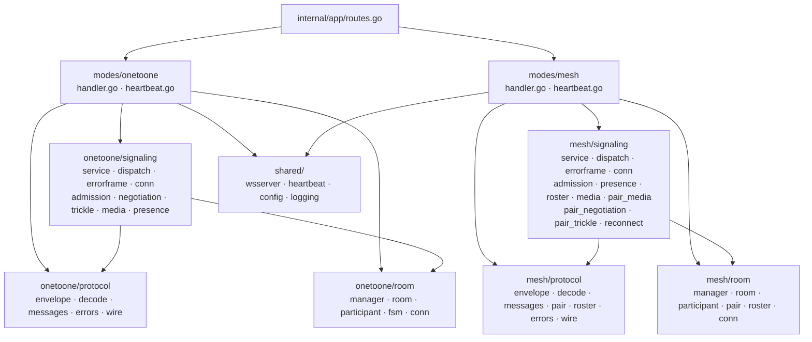
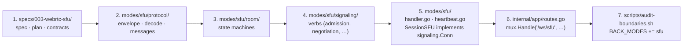

# Architecture: per-mode layout

**Status**: canonical. **Date**: 2026-05-02.
**Scope**: cross-version structure rules. Per-version specs (001, 002, …) remain authoritative for their own contracts and behavior. The **per-mode internal** layout (Ring 2 + Ring 3 inside each mode's backend subtree) lives in [`specs/signaling-architecture.md`](signaling-architecture.md) — this doc covers the cross-mode boundary; that doc covers what's inside each mode.

This repo is a learning playground for multiple WebRTC topologies. Every WebRTC implementation is a self-contained **mode**:

| id           | UI label                  | Route                | Signaling endpoint | Spec                          |
|--------------|---------------------------|----------------------|--------------------|-------------------------------|
| `one-to-one` | 1:1 mode                  | `/`                  | `/ws`              | `specs/001-webrtc-1to1-call/` |
| `mesh`       | Mesh mode (capacity 4)    | `/mesh/:roomId`      | `/ws/mesh`         | `specs/002-webrtc-mesh-room/` |

Future modes (SFU, recording, simulcast, …) follow the same pattern.

## Boundary rules (apply forever)

1. A **mode** may import **shared**.
2. **shared** must NEVER import a mode.
3. One mode must NEVER import another mode.
4. Contract schemas, reducers, presence states, pair states, room-capacity rules, negotiation rules — **mode-owned**.
5. Only stable infrastructure goes in **shared**: heartbeat, ICE config loading, logging, generic media-acquisition helper, structurally-shared primitive types.
6. **No generic "WebRTC topology engine."** 1:1, mesh, and SFU have materially different state machines; a fake abstraction makes the code less educational and harder to debug.
7. **Cross-tree imports MUST go through TS path aliases (`@/...`) / Go module paths (`webrtc-lab/signaling/internal/...`)** — relative imports must not escape a mode subdir or `shared/`.

Rules 1–3 and 7 are enforced at validation time by `scripts/audit-boundaries.sh`. The mode list is enumerated inline in two `for m in ...` loops (frontend + backend); adding a mode requires updating both.

## Repo shape

### Frontend (`frontend/src/`)

```
app/
  main.tsx          — Vite entry
  App.tsx           — <BrowserRouter> + <ModeBadge> + <AppRoutes>
  routes.tsx        — iterates MODES + wildcard fallback
  ModeBadge.tsx     — uses matchPath() against MODES, falls back to FALLBACK_MODE_ID
  modes.tsx         — single source of truth: { id, label, path, component, signalingPath }
shared/
  contract/         — primitive types both modes share (e.g. MediaFailedReason)
  webrtc/           — pure helpers (e.g. acquireLocalMedia)
modes/
  one-to-one/
    route/OneToOneApp.tsx
    components/  state/  signaling/  webrtc/  types/  tests/
  mesh/
    route/MeshApp.tsx
    components/  state/  signaling/  webrtc/  tests/

tests/
  e2e/              — Playwright cross-mode browser scenarios
```

TypeScript path aliases (`tsconfig.json` `paths` + `vite.config.ts` `resolve.alias`):

| Alias        | Maps to        |
|--------------|----------------|
| `@/app/*`    | `src/app/*`    |
| `@/modes/*`  | `src/modes/*`  |
| `@/shared/*` | `src/shared/*` |

### Backend (`signaling/`)

Each mode subtree under `internal/modes/` follows the three-ring layout from [`signaling-architecture.md`](signaling-architecture.md) §3 — a thin mode root plus three sibling sub-packages (`protocol/`, `room/`, `signaling/`). The mode root is a wsserver adapter; everything substantive lives in the rings.

```
cmd/signaling/main.go        — minimal entry; calls app.RegisterRoutes(...)
internal/
  app/
    routes.go                — mux wiring per mode + /healthz
  shared/
    wsserver/                — WS session lifecycle (Accept, conn-id, heartbeat goroutine, write
                               serialization, read loop, error classification, teardown)
    heartbeat/               — parameterized over Labels{ PongTimeoutEvent, PongTimeoutMessage }
    config/                  — IceServer + LoadFromEnv (tag-less internal struct)
    logging/                 — slog setup
  modes/
    onetoone/
      handler.go             — wsserver.Mode adapter (NewHandler, ServeHTTP, NewSession)
      heartbeat.go           — per-mode pong-timeout label constants
      protocol/              — envelope.go  decode.go  messages.go  errors.go  wire.go
      room/                  — manager.go  room.go  participant.go  fsm.go  conn.go
      signaling/             — service.go  conn.go  dispatch.go  errorframe.go
                               admission.go  negotiation.go  trickle.go  media.go  presence.go
    mesh/
      handler.go             — wsserver.Mode adapter; SessionMesh per-WS state lives here too
      heartbeat.go
      protocol/              — envelope.go  decode.go  messages.go  pair.go  roster.go  errors.go  wire.go
      room/                  — manager.go  room.go  participant.go  pair.go  roster.go  conn.go
      signaling/             — service.go  conn.go  dispatch.go  errorframe.go
                               admission.go  presence.go  roster.go
                               media.go  pair_media.go
                               pair_negotiation.go  pair_trickle.go  reconnect.go

tests/
  modes/
    onetoone/                — 001 protocol-flow + room manager + messages + heartbeat tests
    mesh/                    — mesh handler + admission + roster + media-failed tests
  shared/
    heartbeat_test.go        — locks observable-log behavior of the parameterized helper
    wsserver_test.go         — locks observable-log behavior of the WS session lifecycle
```

Component diagram (per-mode three-ring layout):



Inside each mode the dependency direction is: `signaling/` → `protocol/` + `room/`, never the reverse. `signaling/` reaches the per-conn write surface only through the mode's `signaling.Conn` interface; the mode root implements it. The mode root is the only package that imports `shared/wsserver` directly. These rules are enforced by `scripts/audit-boundaries.sh` per-mode ring checks (see §2.4 of `signaling-architecture.md`).

## Adding a new mode

Suppose we add `sfu` (Selective Forwarding Unit, contract v3):

1. **Spec**: write `specs/003-webrtc-sfu/{spec,plan,contracts/...}.md`.
2. **Frontend**:
   - Create `frontend/src/modes/sfu/` mirroring the mesh subtree.
   - Add an entry to `frontend/src/app/modes.tsx`:
     ```ts
     { id: "sfu", label: "SFU mode", path: "/sfu/:roomId", component: SfuApp, signalingPath: "/ws/sfu" }
     ```
3. **Backend**: create `signaling/internal/modes/sfu/` following the three-ring layout in [`signaling-architecture.md`](signaling-architecture.md) §5.1 — a thin mode root (`handler.go` + per-mode heartbeat labels) plus three sibling sub-packages (`protocol/`, `room/`, `signaling/`). `handler.go` is a `wsserver.Mode` adapter; `signaling.Service` hosts the WebRTC verbs; `SessionSFU` (the per-WS struct on the mode root) implements both `wsserver.SessionHandler` (the transport contract) and the mode's `signaling.Conn` (the verb-side contract). Then wire `mux.Handle("/ws/sfu", sfu.NewHandler(...))` inside `internal/app/routes.go`.
4. **Tests**: `signaling/tests/modes/sfu/` for Go protocol-flow tests; `frontend/src/modes/sfu/tests/` for Vitest reducer / dispatcher specs.
5. **Boundary audit**: append `sfu` to the `FRONT_MODES` and `BACK_MODES` arrays in `scripts/audit-boundaries.sh`. Without this, cross-mode imports involving `sfu` and the new mode's per-mode ring rules would slip past the gate.
6. **Architecture doc**: append a row to the table at the top of this file.
7. **Validation**: `npm run typecheck && npx vitest run && go test ./... && bash scripts/audit-boundaries.sh`.



The boundary audit is heuristic-by-design (regex over imports + `go list -deps`). The mode list inside the script is hand-maintained — that's the documented maintenance cost of the per-mode pattern.

## What lives in `shared/` vs. mode-owned

**In `shared/` today:**

- Frontend `shared/contract/media-failed-reason.ts` — the 4-element `MediaFailedReason` enum (both contracts agree).
- Frontend `shared/webrtc/media-acquisition.ts` — `getUserMedia` wrapper + DOMException → `MediaFailedReason` classifier.
- Backend `internal/shared/logging/` — slog setup.
- Backend `internal/shared/heartbeat/` (Commit B) — parameterized over `Labels` so each mode keeps its event-name + message text.
- Backend `internal/shared/config/` (Commit B) — tag-less `IceServer` + `LoadFromEnv()`.
- Backend `internal/shared/wsserver/` — WebSocket session lifecycle (Accept, conn-id, heartbeat goroutine launch, write serialization, read loop, error classification, teardown ordering). Identical across modes; lifted so each mode's `handler.go` opens with topology (admission, roster, dispatch) instead of ~100 lines of WebSocket bookkeeping. Modes implement `wsserver.Mode.NewSession` returning a `wsserver.SessionHandler`. Mode-specific decode/dispatch error log fields (`code`, `type`) stay on the mode side.

**Explicitly NOT in `shared/`** (kept mode-owned because abstracting hurts more than it helps):

- The signaling-protocol Zod schemas (v1, v2). Different discriminated unions; sharing requires generics over the union, which obscures rather than clarifies.
- Reducers + state slices (`session`, `roster`, `eventLog`, `chat`). Entry shapes differ; merging requires schema reconciliation that hides per-mode invariants.
- `IceBuffer`. 001 uses a single per-call buffer; mesh M6+ uses per-`PairContext` buffers. Different shapes.
- WebSocket-client base. Schema typing differs; a generic base obscures the per-mode contract.
- Wire-payload `IceServer` types. Each mode keeps JSON-tagged structs; the shared `config.IceServer` is the internal config representation, with explicit conversion at the wire boundary.

Lift any of these only when a third mode arrives and the duplication is genuinely costly. Resist preemptive abstraction (Constitution Principle IX).

## References

- Constitution: `.specify/memory/constitution.md` (Principle IX preserves extension points; this doc realizes them).
- 001 plan + contract: `specs/001-webrtc-1to1-call/`.
- 002 plan + contract: `specs/002-webrtc-mesh-room/`.
- Boundary audit script: `scripts/audit-boundaries.sh`.
