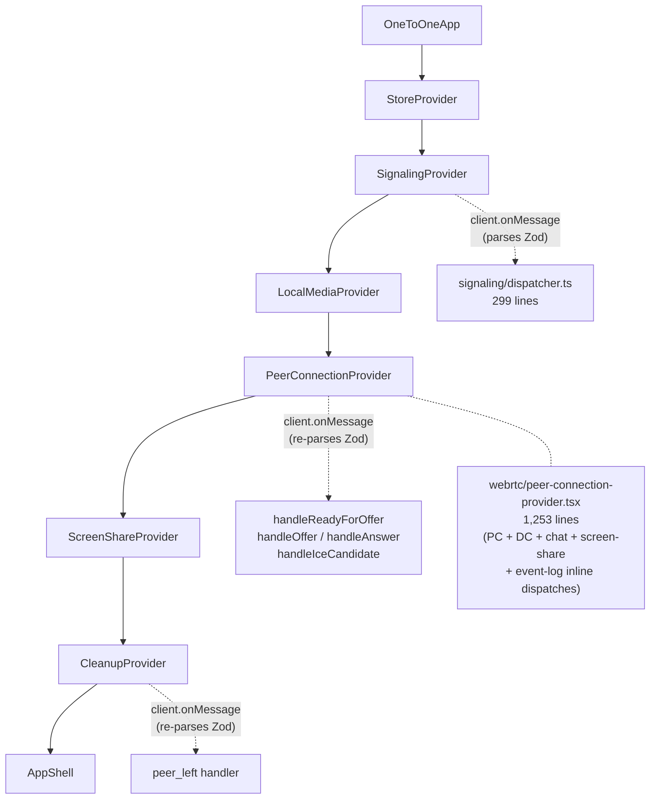
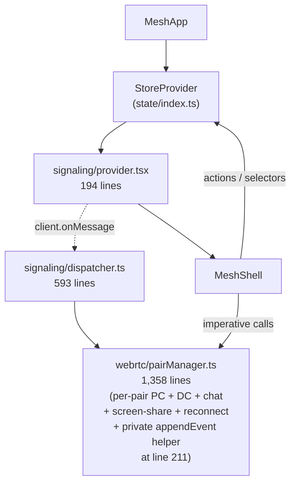
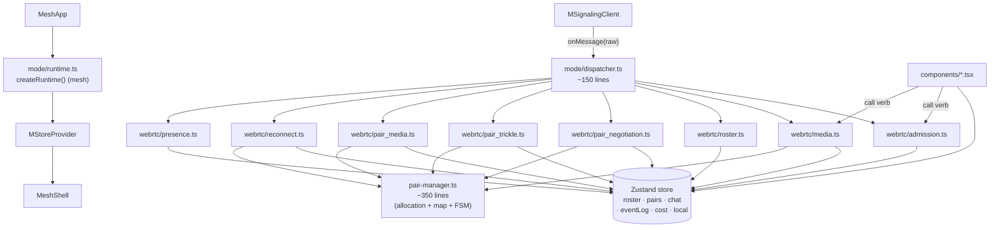

# Frontend architecture v2

**Status**: design proposal. **Date**: 2026-05-02.
**Scope**: `frontend/src/modes/` redesign. Sits **under** the cross-mode
boundary rules in `specs/architecture.md` — those rules (rules 1–7,
the per-mode pattern, `scripts/audit-boundaries.sh`) stay in force.
This document describes the *internal* layout of each mode, not the
cross-mode boundary.

This is a paper design that mirrors `specs/signaling-architecture.md`
on the frontend side. The two docs are intentionally drawn at the
same level of detail and use the same ring vocabulary so a reader who
has internalized the backend layout can move between client and server
without re-learning the structure.

## Decision summary

Five load-bearing decisions made up-front so the rest of the doc reads
as elaboration:

- Mirror the backend's three-ring layout per mode. Ring 1 (`shared/`)
  already exists. Ring 2 splits each mode into `protocol/` (Zod
  schemas + wire types — moved out of `signaling/schema.ts`) and
  `state/` (the store). Ring 3 is the new `webrtc/` layout: one file
  per WebRTC verb (`admission.ts`, `negotiation.ts`, `trickle.ts`,
  `media.ts`, `presence.ts`, plus mesh-only verbs).
- Replace `useReducer` + Context with Zustand. Single store per mode,
  sliced by concern. Removes (a) the `is*Action` discriminator in the
  root reducer, (b) the `*Ref = useRef(state)` mirrors that exist
  only so async WS / `RTCPeerConnection` callbacks can read fresh
  state outside the React render cycle (~57 `useRef` declarations and
  ~179 `Ref.current` reads in `modes/`), and (c) the `<StoreProvider>`
  component. Keeps selectors and structural sharing; tests stay pure.
- Keep the contract Zod schemas. They are the single client-side
  source of truth for the wire — same role as the backend's
  `protocol/`. They move to `protocol/`; their content does not change.
- Collapse the provider tower into one runtime per mode. The mode
  root (`route/<Mode>App.tsx`) constructs the store, the signaling
  client, the peer-connection / pair manager, and a single dispatcher
  that routes parsed frames to the right verb file. No more
  per-feature React providers; one Zod parse per inbound frame
  (currently the same WS frame is re-parsed in 3 separate React
  subtrees in 1:1: `signaling/provider.tsx`,
  `webrtc/peer-connection-provider.tsx`, `webrtc/cleanup.tsx`).
- Add a `log` helper per mode. One module that exports
  `log.signaling("offer sent", {...})` etc., wrapping
  `makeEventLogEntry` + the store action. Collapses the ~105
  `makeEventLogEntry` callsites without changing the on-screen event
  log. (Mesh already has a private `appendEvent` helper inside
  `pairManager.ts`; the redesign promotes that pattern to a top-level
  module.)

Zustand is the only new runtime dep (~1KB gzipped, no peer deps).
This project is a **WebRTC** lab; we don't want readers to scroll past
React-state plumbing to reach the lesson.

## 1. Goals & non-goals

### Goals (drive every decision below)

1. A new reader of `frontend/src/modes/<m>/` can answer "what does
   this client do, in WebRTC terms?" by reading file *names* and one
   entry-point file. The directory tree should read like a WebRTC
   table of contents, not a React provider scaffold.
2. Adding mode N+1 (SFU first) is a copy-the-package-shape operation
   on a single sub-tree of well-scoped files, with zero edits to
   existing modes.
3. React-state plumbing is invisible by default. A reader who wants
   to learn about WebRTC never has to scroll past `useReducer`
   discriminator code, `useRef` mirrors of reducer state, or React
   context wiring to reach the lesson.
4. No file in the redesign exceeds ~250 lines.
   - Today: `one-to-one/webrtc/peer-connection-provider.tsx` is 1,253
     lines, `mesh/webrtc/pairManager.ts` is 1,358, `mesh/signaling/
     dispatcher.ts` is 593, `one-to-one/signaling/schema.ts` is 444.

### Non-goals (explicitly preserved or off-limits)

- The 001 v1 wire contract
  (`specs/001-webrtc-1to1-call/contracts/signaling-protocol.md`) is
  frozen byte-for-byte. Wire format, error codes, message types,
  payload shapes do not change. The Zod schemas in
  `one-to-one/signaling/schema.ts` move file but do not change
  content.
- The 002 v2 wire contract
  (`specs/002-webrtc-mesh-room/contracts/signaling-protocol.md`) is
  frozen byte-for-byte for the same reason.
- The cross-mode boundary rules in `specs/architecture.md` (rules 1–7)
  stay in force. This redesign sits *under* them.
- `frontend/src/shared/` stays as-is — `contract/` and `webrtc/`
  helpers are correctly factored. The redesign builds on them; it
  does not replace them.
- The `app/` shell stays as-is — `App.tsx`, `routes.tsx`,
  `ModeBadge.tsx`, `modes.tsx` are the cross-mode registry and do
  not change.
- Tests under `modes/<m>/tests/` stay; their imports may shift during
  the refactor, but their assertions about reducer semantics, dispatch
  routing, and rendered components do not change. Reducer-style
  unit tests (`session.spec.ts`, `chat.spec.ts`, `event-log.spec.ts`)
  switch from `reducer(state, action)` to `store.getState().method(...)`
  but assert the same post-condition snapshots.

## 2. Three-ring model

The redesign organizes each mode into three concentric rings. Each
ring depends only on rings inside it. The ring boundary is the
visibility test for "is this WebRTC, or is this React plumbing?"

```
   ┌──────────────────────────────────────────────────────────┐
   │  Ring 3 — modes/<m>/webrtc/   (per-mode WebRTC verbs)    │
   │     admission · negotiation · trickle · media · presence │
   │                                                          │
   │  ┌──────────────────────────────────────────────────┐    │
   │  │  Ring 2 — modes/<m>/{protocol,state}/            │    │
   │  │    protocol/  Zod schemas, wire types            │    │
   │  │    state/     Zustand store (slices)             │    │
   │  │                                                  │    │
   │  │  ┌──────────────────────────────────────────┐    │    │
   │  │  │  Ring 1 — shared/   (mode-agnostic)      │    │    │
   │  │  │    contract  webrtc (acquireLocalMedia)  │    │    │
   │  │  └──────────────────────────────────────────┘    │    │
   │  └──────────────────────────────────────────────────┘    │
   └──────────────────────────────────────────────────────────┘
```

### 2.1 Ring 1 — `shared/`

Mode-agnostic primitives. The 4-element `MediaFailedReason` enum that
both wire contracts agree on lives in `shared/contract/`; the
`getUserMedia` wrapper plus DOMException → `MediaFailedReason`
classifier lives in `shared/webrtc/`. A reader who wants to learn the
1:1 or mesh mode skips this ring entirely. Already exists today; the
redesign leaves it alone.

### 2.2 Ring 2 — per-mode `protocol/` + `state/`

The wire schema and the in-memory state store. Two reasons they live
in sibling sub-trees:

- `protocol/` answers "what does the wire look like" — Zod schemas
  for envelope + each message type, wire enums, error codes. No
  React, no store, no I/O.
- `state/` answers "what state does the client keep" — the Zustand
  store, sliced by concern (session, eventLog, peerConnection,
  dataChannel, chat, media for 1:1; plus roster, pairs, cost,
  localMedia for mesh). No schema, no WS lifecycle, no peer-connection
  wiring. State methods may guard transitions and throw the same
  `IllegalSessionTransitionError` the current reducers throw — they
  are *state-only* in the sense that they neither parse the wire nor
  drive `RTCPeerConnection`, not in the stricter sense of being pure
  setters.

Both may import from `shared/` but not from each other and not from
Ring 3. `state/` may import *types* from `protocol/` (e.g. the
parsed-message types) but not Zod schemas at runtime — keeping
schema decoding out of state writes.

### 2.3 Ring 3 — per-mode `webrtc/`

The WebRTC verbs. One file per concept: `admission.ts`,
`negotiation.ts`, `trickle.ts`, `media.ts`, `presence.ts` (1:1) plus
`pair_negotiation.ts`, `pair_trickle.ts`, `pair_media.ts`, `roster.ts`,
`reconnect.ts` (mesh). Each file holds free functions over a small
`Ctx` interface (store, signaling client, peer/pair manager, log).
This is *the* layer a reader opens to learn what the client does.
The wire decode, Zod parse, and frame routing happen one function
call deep — in `mode/dispatcher.ts` — and the verb files stay short.

Ring 3 also keeps the existing pure helpers that already match this
shape and aren't React-wrapped: the `RTCPeerConnection` wrapper, the
`DataChannel` wrapper, the `IceBuffer`, the `ScreenShareController`,
the SDP/candidate `learning-inspector` summarizers, and (mesh) the
`PairManager`. They stay in `webrtc/` unchanged; only the React
provider files (`peer-connection-provider.tsx`,
`local-media-provider.tsx`, `screen-share-provider.tsx`,
`cleanup.tsx`) dissolve into verb files.

### 2.4 Package dependency rules (the most important guardrail)

These rules are what prevent the obvious React-context tower
(`StoreProvider → SignalingProvider → LocalMediaProvider →
PeerConnectionProvider → ScreenShareProvider → CleanupProvider`) from
coming back. They are the load-bearing constraint of the entire
model:

```
shared/      imports no modes
protocol/    imports neither state/ nor webrtc/
state/       imports protocol/ types only (no Zod schemas, no webrtc/)
webrtc/      imports protocol/ + state/, but NOT components/ or route/
mode root    wires signaling client + peer/pair manager to webrtc/ verbs
components/  read state/ via selectors; call verb-exposed actions
route/       composes the mode root and AppShell; only place that
             constructs <StoreProvider>
```

`webrtc/` verbs reach the store only through the small `Ctx` they are
passed (or via `useStore.getState()`); they never import React.
Components never import `webrtc/` modules — they call verb-exposed
actions through the store or through the `Ctx` exposed by the runtime.

**Enforcement.** The rules in this section are enforced by
`scripts/audit-boundaries.sh` after the migration. The audit extends
the existing cross-mode checks with per-mode ring checks:

- `protocol/` must not import `state/` or `webrtc/`
- `state/` must not import `webrtc/` or `components/`
- `webrtc/` must not import `components/` or `route/`
- only `route/` and `mode/` may construct `<StoreProvider>`

Wiring those checks into the audit script is the migration's final
phase (Phase G), not a separate task.

## 3. Per-mode internal layout

### 3.1 `frontend/src/modes/one-to-one/`

```
route/OneToOneApp.tsx     ~80   — composes runtime + AppShell

mode/
  runtime.ts              ~150  — createRuntime(): builds store,
                                  signaling client, PC manager, dispatcher
  dispatcher.ts           ~100  — routeFrame(ctx, raw): one Zod parse,
                                  switch on msg.type → call verb

protocol/
  envelope.ts             ~100  — Envelope, ContractVersion=1, primitives
  messages.ts             ~250  — per-type payload schemas + types
  errors.ts                ~50  — error code enum
  schema.ts               ~100  — top-level discriminated union, re-exports

state/
  store.ts                ~120  — createOneToOneStore() (Zustand)
  session.ts              ~250  — session slice (FSM transitions)
  event-log.ts            ~100  — event log slice + ring buffer
  peer-connection.ts       ~70  — PC snapshot slice (4 getters)
  data-channel.ts          ~50  — DC state slice
  chat.ts                 ~100  — chat slice + validation
  media.ts                 ~80  — media triplet slice

webrtc/                   (Ring 3 — verbs, one file per concept)
  admission.ts            ~150  — handleJoinAccepted/Rejected,
                                  sendJoinRoom, retry
  negotiation.ts          ~220  — handleReadyForOffer (allocate PC),
                                  handleOffer/Answer, sendOffer/Answer
  trickle.ts              ~150  — handleIceCandidate, sendIceCandidate,
                                  IceBuffer wiring
  media.ts                ~180  — acquireLocalMedia driver, mic/camera
                                  toggles, sendMediaState,
                                  handleRemoteMediaState
  presence.ts             ~150  — handlePeerLeft, handleParticipantReleased,
                                  handleTransportChange,
                                  leaveSession (Path A/B/C orchestrator)
  log.ts                   ~80  — log.signaling/datachannel/system/error
                                  helpers (collapses ~80 callsites)

  peer-connection.ts      ~280  — RTCPeerConnection wrapper (unchanged)
  data-channel.ts         ~170  — DataChannel wrapper (unchanged)
  ice-buffer.ts           ~140  — IceBuffer (unchanged)
  screen-share.ts         ~310  — ScreenShareController (unchanged)
  learning-inspector.ts   ~190  — SDP/candidate summarizers (unchanged)
  signaling-client.ts     ~180  — WS client (moved from signaling/client.ts;
                                  unchanged behavior)

components/                     — unchanged module count; bodies shrink
                                  because they call verbs + read selectors
                                  instead of dispatching inline EVENT_LOG
                                  actions.

types/contract.ts                — unchanged (re-exports from protocol/)
tests/                           — unit tests follow files; same shape
```

Today's 1:1 mode is 32 non-test files totalling 6,268 lines, with
`peer-connection-provider.tsx` alone at 1,253. The ~6 React provider
files (`signaling/provider.tsx`,
`webrtc/{peer-connection,local-media,screen-share}-provider.tsx`,
`webrtc/cleanup.tsx`, plus the `StoreProvider` part of
`state/index.tsx`) collapse into `mode/runtime.ts` +
`mode/dispatcher.ts`. Every file in the future layout is under ~250
lines (the unchanged Ring 3 helpers `peer-connection.ts` 280 and
`screen-share.ts` 310 are the two grandfathered exceptions; they
already split cleanly along method boundaries if needed).

### 3.2 `frontend/src/modes/mesh/`

Same shape, mesh-specific verb files. Ring 3 splits along the same
backend-mirrored lines; mesh has more verb files because it has more
verbs:

```
route/MeshApp.tsx         ~80

mode/
  runtime.ts              ~180  — createRuntime() (mesh variant)
  dispatcher.ts           ~150  — switch over mesh message types

protocol/
  envelope.ts             ~100
  messages.ts             ~280
  errors.ts                ~50
  schema.ts               ~100  — discriminated union, re-exports

state/
  store.ts                ~150  — createMeshStore()
  roster.ts               ~210  — roster slice (existing 209 lines)
  pairs.ts                ~140  — pair-state slice (existing 134)
  chat.ts                 ~170  — mesh chat slice (existing 165)
  event-log.ts            ~160  — mesh event log + ring buffer (existing 159)
  cost.ts                 ~130  — partial-mesh cost summary slice (existing 129)
  local.ts                ~230  — local participant slice (existing 224)
  local-media.ts           ~75  — local media slice (existing 71)

webrtc/                   (Ring 3 — verbs, one file per concept)
  admission.ts            ~150  — join_room / join_rejected / retry
  media.ts                ~180  — media_ready / media_failed / local
                                  toggles / screen-share + replaceTrack
                                  across pairs
  pair_negotiation.ts     ~220  — pair_negotiation_instruction, pair_offer,
                                  pair_answer (per pair PC alloc)
  pair_trickle.ts         ~150  — pair_ice_candidate (per-pair IceBuffer)
  pair_media.ts           ~150  — pair_media_state outbound + inbound
  roster.ts               ~180  — mesh_roster_snapshot/update,
                                  roster-driven log entries
  reconnect.ts            ~200  — pair_failed, pair_reconnect_instruction,
                                  reconnect_pair
  presence.ts             ~150  — peer_left, participant_released,
                                  leave path
  log.ts                  ~100  — log.signaling/datachannel/system/error
                                  helpers (promotes the existing private
                                  appendEvent helper inside pairManager.ts)

  pair-manager.ts         ~350  — Map<pairId, PairContext> + lifecycle
                                  (slimmed: no inline event-log emission;
                                  verbs own wire I/O and log calls)
  pair-context.ts          ~70  — type only (unchanged)
  data-channel.ts         ~400  — DC wrapper (unchanged 398)
  ice-buffer.ts            ~45  — IceBuffer (unchanged 42)
  screen-share.ts         ~450  — ScreenShareController (unchanged 446)
  senders.ts              ~205  — replaceTrack helpers (unchanged)
  media-acquisition.ts    ~280  — local-media driver (unchanged)
  signaling-client.ts     ~180  — WS client (moved from signaling/client.ts)

components/                     — unchanged module count
tests/                          — unit tests follow files
```

Today's mesh mode is 33 non-test files totalling 7,390 lines, with
`pairManager.ts` alone at 1,358 and `signaling/dispatcher.ts` at 593.
The `pairManager.ts` god-object splits into: `pair-manager.ts`
(allocation + map + state machine, ~350) plus four verb files
(`pair_negotiation`, `pair_trickle`, `pair_media`, `reconnect`) each
~150–220 lines. The 593-line `signaling/dispatcher.ts` collapses to
~150 in `mode/dispatcher.ts` because the per-message handler bodies
move into the verb files.

### 3.3 The `log` helper

Today's idioms differ between modes:

- **1:1** dispatches `EVENT_LOG_APPEND` actions inline at ~80 sites,
  each constructing `makeEventLogEntry({type, direction, summary,
  transport, ...})` by hand.
- **Mesh** has a private `appendEvent` helper closure inside
  `webrtc/pairManager.ts` (line 211) that wraps `makeMeshEventEntry`,
  used at ~30 sites inside that one file. Other mesh files
  (`signaling/dispatcher.ts`, etc.) build entries directly.

The redesign introduces a per-mode `webrtc/log.ts` module that both
modes import:

```ts
// modes/one-to-one/webrtc/log.ts
export function makeLog(store: OneToOneStore) {
  const append = (entry: Omit<EventLogEntry, "id" | "ts">) =>
    store.getState().appendEvent(makeEventLogEntry(entry));
  return {
    signaling: (summary: string, extra?: Pick<EventLogEntry, "code"|"reason"|"direction">) =>
      append({ type: "signaling", direction: "system", summary, transport: "signaling", ...extra }),
    datachannel: (summary, extra?) => append({ ..., transport: "datachannel" }),
    system:      (summary, extra?) => append({ ..., direction: "system" }),
    error:       (code: string, message: string) =>
      append({ type: "error_occurred", direction: "system",
               summary: `error occurred: ${code}`, code,
               reason: message.slice(0, 120) }),
  };
}
```

Each verb file constructs `const log = ctx.log` once. The replacement
on the existing sites is mechanical:

```diff
- dispatch({ type: "EVENT_LOG_APPEND", entry: makeEventLogEntry({
-   type: "offer_sent", direction: "local",
-   summary: "offer sent", transport: "signaling",
- })})
+ log.signaling("offer sent", { direction: "local" })
```

Every entry shape stays valid (the helper is type-checked against
`EventLogEntryType`). On-screen event log output is unchanged.

### 3.4 Zustand store shape

`state/store.ts` exposes `createOneToOneStore()` returning a vanilla
Zustand store; a tiny `<StoreProvider>` puts the store in a React
context; `useStore` is the typed hook bound to that context's store.

```ts
// state/store.ts (1:1 sketch — mesh follows the same pattern)
export interface OneToOneStore {
  // slice state
  session: SessionSlice;
  eventLog: EventLogSlice;
  peerConnection: PeerConnectionSlice;
  dataChannel: DataChannelSlice;
  chat: ChatSlice;
  media: MediaSlice;

  // intent verbs (flat namespace, called by both components and
  // webrtc/ verb files). Each method is the FSM-guarded write the
  // current reducer action represented; bodies use immer-style
  // set((s) => { s.session.session = "joining"; ... }).
  requestJoin(roomId: string): void;
  acceptJoin(msg: JoinAcceptedMessage): void;
  rejectJoin(msg: JoinRejectedMessage): void;
  // ...etc, one per current SessionAction / MediaAction / ...

  appendEvent(entry: EventLogEntry): void;
}

export function createOneToOneStore() {
  return createStore<OneToOneStore>()(
    immer((set, get) => ({
      session: initialSessionSlice,
      eventLog: initialEventLogSlice,
      // ...
      requestJoin: (roomId) => set((s) => {
        if (s.session.session !== "idle") {
          throw new IllegalSessionTransitionError(...);
        }
        s.session = { ...initialSessionSlice, session: "joining", roomId };
      }),
      // ...
    })),
  );
}
```

The FSM guards / immutable updates from the existing reducers move
into the store actions verbatim; the action-name constants and the
`is*Action` discriminator vanish. `session.spec.ts`-style tests stay
pure: instantiate the store, call `store.getState().acceptJoin(...)`,
assert the new snapshot.

The key property that motivates Zustand over `useReducer`:
`store.getState()` is callable from any closure — including async
WebSocket / `RTCPeerConnection` handlers that fire outside the React
render cycle. This eliminates the ~57 `useRef(state.x)` mirrors
(~179 `Ref.current` reads) that exist in `modes/` today purely so
async callbacks can read fresh state. Selectors keep render
correctness via Zustand's structural sharing.

## 4. Diagrams: current vs future

The diagrams render with GitHub's Mermaid support. Each pair (current
vs future) is intentionally drawn at the same level of detail so the
delta is visible.

### 4.1 Component diagram — current state (1:1)



Key observations:

- 6-deep React provider tower per mount.
- Three independent `client.onMessage` subscriptions on the same
  WebSocket — `signaling/provider.tsx:50`,
  `webrtc/peer-connection-provider.tsx:227`, `webrtc/cleanup.tsx:216`
  — each re-parsing the same frame through Zod independently.
- `peer-connection-provider.tsx` (1,253 lines) is the god-object;
  verbs live as private methods on it.
- State reads inside async handlers go through `useRef(state.x)`
  mirrors (~57 declarations across `modes/`).

### 4.2 Component diagram — future state (1:1)

```mermaid
graph TB
    OneToOneApp --> Runtime["mode/runtime.ts<br/>createRuntime(): store,<br/>signaling, pcManager, dispatcher"]
    Runtime --> StoreProvider
    StoreProvider --> AppShell

    SignalingClient -- "onMessage(raw)" --> Dispatcher["mode/dispatcher.ts<br/>switch on msg.type<br/>(one Zod parse)"]
    Dispatcher --> Admission["webrtc/admission.ts"]
    Dispatcher --> Negotiation["webrtc/negotiation.ts"]
    Dispatcher --> Trickle["webrtc/trickle.ts"]
    Dispatcher --> Media["webrtc/media.ts"]
    Dispatcher --> Presence["webrtc/presence.ts"]

    Admission --> Store[("Zustand store<br/>session · eventLog · pc<br/>· dc · chat · media")]
    Negotiation --> Store
    Trickle --> Store
    Media --> Store
    Presence --> Store

    Negotiation --> PCManager["pcManager<br/>(RTCPeerConnection wrapper)"]
    Trickle --> PCManager
    Media --> PCManager

    Components["components/*.tsx<br/>(useStore selectors)"] --> Store
    Components -- "call verb" --> Admission
    Components -- "call verb" --> Media
    Components -- "call verb" --> Presence
```



Key observations:

- One layer of React provider (`<StoreProvider>` only).
- One Zod parse per inbound frame (the dispatcher's). `grep -RIn
  'client.onMessage' frontend/src/modes/one-to-one/` returns exactly
  one match after Phase E1 — today it returns three.
- Verbs are flat module functions, not methods on a 1.2 kLOC class.
- State reads are `store.getState()` — synchronous, no refs.
- The ~80 1:1 `EVENT_LOG_APPEND` callsites become `log.system(...)`
  / `log.signaling(...)` calls inside each verb.

### 4.3 Component diagram — current state (mesh)



Key observations:

- Mesh's provider tower is shallower (only `<StoreProvider>` +
  `<SignalingProvider>` mount in `MeshApp.tsx`), so mesh is closer
  to the future state on the React-context dimension.
- The god-object problem is worse: `pairManager.ts` is 1,358 lines
  (vs. 1:1's 1,253).
- The Zod re-parse problem is smaller: only one `client.onMessage`
  subscription in mesh today.
- Mesh has a private `appendEvent` helper inside `pairManager.ts`
  but uses it only within that file.

### 4.4 Component diagram — future state (mesh)



Key observations:

- Same provider depth as 1:1 future state.
- `pair-manager.ts` shrinks from 1,358 to ~350 (allocation + map +
  FSM only); the four verb-shaped slices (`pair_negotiation`,
  `pair_trickle`, `pair_media`, `reconnect`) each ~150–220 lines.
- 8 verb files for mesh vs. 5 for 1:1 — same shape, more verbs,
  exactly mirroring the backend mesh/1:1 verb-file count delta.

### 4.5 Delta table — what moved, what's new, what disappears

| Aspect | Today | Future |
|---|---|---|
| Where do 1:1 WebRTC verbs live? | private methods on `peer-connection-provider.tsx` (1,253 lines) | free functions in `webrtc/{admission,negotiation,trickle,media,presence}.ts` (~150–220 each) |
| Where does mesh per-pair logic live? | `pairManager.ts` god-object (1,358 lines) | `pair-manager.ts` (~350) + `webrtc/pair_{negotiation,trickle,media}.ts` + `webrtc/reconnect.ts` |
| How is store state read inside async WS / RTCPeerConnection callbacks? | `Ref.current` mirrors of reducer state (~57 `useRef` declarations, ~179 `Ref.current` reads) | `store.getState()` (synchronous, no refs) |
| How many `client.onMessage` subscriptions in 1:1? | 3 (provider + PC provider + cleanup) | 1 (dispatcher only) |
| How many React providers in the 1:1 mount? | 6 | 1 (`<StoreProvider>`) |
| How are event-log entries created in 1:1? | inline `dispatch({ type: "EVENT_LOG_APPEND", entry: makeEventLogEntry({...}) })` at ~80 sites | `log.signaling("...", {...})` / `log.system(...)` |
| Schema location | `signaling/schema.ts` (444 + 430 lines) | `protocol/{envelope,messages,errors,schema}.ts` |
| Mesh `appendEvent` helper | private closure inside `pairManager.ts:211` | promoted to `webrtc/log.ts` |

## 5. Adding a new mode

### 5.1 Recipe — package shape, not implementation

What the Ring layout reuses for a new mode is the *package shape*:
a mode root (`route/<Mode>App.tsx` + `mode/{runtime,dispatcher}.ts`),
Ring 2 sub-trees (`protocol/`, `state/`), and a Ring 3 sub-tree
(`webrtc/`) with one file per WebRTC verb. The *contents* of these
sub-trees will differ for each mode and should not be copy-pasted.
Mode-specific state is, in particular, materially different across
modes — copying the 1:1 store into a new mode's `state/` smuggles in
1:1 assumptions that don't hold (e.g. mesh has roster + per-pair
state that 1:1 has no concept of).

Procedure for adding mode N+1 (extends the existing recipe in
`specs/architecture.md`):

1. Write `specs/00N-<mode>/` (spec, plan, contracts).
2. Create `frontend/src/modes/<m>/` with the package shape:
   `route/`, `mode/`, `protocol/`, `state/`, `webrtc/`, `components/`,
   `tests/`.
3. Implement `protocol/` against the contract spec — Zod schemas for
   envelope + each message type, wire enums, error codes.
4. Implement `state/` against the data model in the spec — the
   Zustand store with one slice per concern. Define the store-method
   verbs that components and Ring 3 will call.
5. Implement `webrtc/` one verb file at a time, against the
   contract's message-flow sections. Each verb is a free function
   over a `Ctx` interface (store, signaling client, peer/pair manager,
   log).
6. Add `mode/runtime.ts` (constructs everything) and
   `mode/dispatcher.ts` (one Zod parse, switch on `msg.type`).
7. Add `route/<Mode>App.tsx`: calls `createRuntime()`, wraps in
   `<StoreProvider>`, mounts `<AppShell>`.
8. Add the entry to `frontend/src/app/modes.tsx` (already required
   by `specs/architecture.md`).
9. Add `<m>` to `scripts/audit-boundaries.sh`'s `FRONT_MODES` array
   (already required) and to the new per-mode ring checks (Phase G).
10. Write tests under `frontend/src/modes/<m>/tests/`.

What the redesign explicitly does NOT add:

- No "topology runtime" base class that all modes extend.
- No shared `Ctx` interface across modes — each mode declares its own.
- No generic over contract version.

Per Constitution Principle IX, modes share Ring 1 infrastructure and
the file-shape convention. They do not share types.

### 5.2 Where this slots into the cross-doc structure

`specs/architecture.md` owns the cross-mode boundary (rules 1–7,
the per-mode pattern, the `app/modes.tsx` registry, `audit-
boundaries.sh`). This doc owns the per-mode internal layout — the
ring vocabulary, the `protocol/state/webrtc/mode/route` sub-trees,
the Zustand store shape, the `log` helper. The two docs are sibling
concerns; neither restates the other.

`specs/signaling-architecture.md` is the backend equivalent. The two
architecture docs use the same ring numbering and the same vocabulary
(`protocol/` for wire schema, Ring 3 = "verbs", "one file per WebRTC
concept") so a reader who has internalized one finds the other.

## 6. Migration approach

This doc deliberately stops at the phase level. The actual file-by-
file move list and commit sequencing is part of the strangler series
on the `refactor/frontend-rings` branch, not a separate `plan.md`.

### 6.1 Phase order

The refactor lands as a strangler-style series of phases on a
dedicated branch, mode-by-mode, ring-by-ring. After **every** phase,
the verification gate is the same:

```
cd frontend && npm run typecheck && npx vitest run
bash scripts/audit-boundaries.sh
```

Playwright e2e (`docker compose up --build` then `npx playwright
test`) runs at the end of each mode's F-phase, not after every
sub-phase.

```mermaid
graph LR
    P0["0. Spec doc<br/>specs/frontend-architecture.md"] --> P1A
    P1A["A1. protocol/ extraction (1:1)<br/>signaling/schema.ts → protocol/"] --> P1B
    P1B["B1. Zustand store (1:1)<br/>slices → store actions"] --> P1C
    P1C["C1. log helper (1:1)<br/>collapse ~80 EVENT_LOG_APPEND sites"] --> P1D
    P1D["D1. webrtc/ verb split (1:1)<br/>peer-connection-provider.tsx<br/>→ admission/negotiation/trickle/<br/>media/presence + log"] --> P1E
    P1E["E1. Provider collapse (1:1)<br/>6 providers → mode/runtime.ts<br/>+ mode/dispatcher.ts"] --> P1F
    P1F["F1. Verification gate (1:1)<br/>typecheck + vitest + playwright"] --> P2
    P2["F2-F5. Repeat A-E for mesh<br/>(adds pair_*, roster, reconnect)"] --> AUDIT
    AUDIT["G. Extend scripts/audit-boundaries.sh<br/>with frontend ring checks"]
```



Per-phase scope (file budget at end of phase ≤250 lines per file,
mirroring the backend doc's rule):

| Phase | Scope | Output |
|---|---|---|
| **0. Baseline / spec** | Branch off `main`. Land `specs/frontend-architecture.md` (this doc). Run full frontend gate on a clean tree. | Canonical reference. Green starting point. |
| **A1. `protocol/` extraction (1:1)** | Move `modes/one-to-one/signaling/schema.ts` (444 lines) → `modes/one-to-one/protocol/{envelope,messages,errors,schema}.ts`. Update imports in `signaling/dispatcher.ts`, `webrtc/peer-connection-provider.tsx`, `state/`, `tests/`. No behavioral change. | Ring 2 schema package exists. Tests pass. |
| **B1. Zustand store (1:1)** | Add `zustand` dep. Replace `state/index.tsx` (`useReducer` + Context) with `state/store.ts` (Zustand) + a thin `<StoreProvider>` context. Convert each `XxxAction` reducer case into a method on the store. Update reducer-style unit tests to call store methods. | `<StoreProvider>` shrinks to ~30 lines; root reducer + 5 `is*Action` discriminators deleted. Tests pass. |
| **C1. `log` helper (1:1)** | Add `webrtc/log.ts`. Migrate the ~80 1:1 callsites to `log.signaling/...` form. | Event-log on-screen output unchanged; commit diff is mostly `-/+`. |
| **D1. `webrtc/` verb split (1:1)** | Extract methods from `peer-connection-provider.tsx` into `webrtc/admission.ts`, `webrtc/negotiation.ts`, `webrtc/trickle.ts`, `webrtc/media.ts`, `webrtc/presence.ts`. Each verb is a free function `(ctx, msg) => void` taking a small `Ctx` interface (store, signalingClient, pcManager, log). The PC wrapper, IceBuffer, DataChannel wrapper, ScreenShareController stay where they are — they are already pure. `LocalMediaProvider` / `ScreenShareProvider` / `CleanupProvider` collapse: bodies become functions inside `webrtc/media.ts` / `webrtc/presence.ts`, called from the runtime's lifecycle effect or from `useStore.subscribe(...)`. | `peer-connection-provider.tsx` is gone. Every file in `webrtc/` ≤250 lines (the unchanged Ring 3 helpers — `peer-connection.ts` 280, `screen-share.ts` 310 — are grandfathered exceptions). Tests for verbs become plain function tests (no React tree). |
| **E1. Provider collapse (1:1)** | Add `mode/runtime.ts` and `mode/dispatcher.ts`. Move `OneToOneApp` to `route/OneToOneApp.tsx`: it calls `createRuntime()` (which builds store + signaling + PC manager + dispatcher), wraps in `<StoreProvider>`, mounts `<AppShell>`. The provider tower is now one layer deep. | One Zod parse per WS frame (the dispatcher's). `grep -RIn 'client.onMessage' frontend/src/modes/one-to-one/` returns exactly one match. |
| **F1. Verification gate (1:1)** | Frontend typecheck + vitest + Playwright e2e on the 1:1 routes. | 1:1 redesign behavior-preserving. |
| **F2–F5. Repeat A1–E1 for mesh** | Same five sub-phases applied to `modes/mesh/`. Mesh has the additional verb files (`pair_negotiation`, `pair_trickle`, `pair_media`, `roster`, `reconnect`) and the slimmed `pair-manager.ts`. | Both modes redesigned. Both green. |
| **G. Extend `audit-boundaries.sh`** | Extend `scripts/audit-boundaries.sh` with frontend ring rules: `protocol/` may not import `state/` or `webrtc/`; `state/` may not import `webrtc/` or `components/`; `webrtc/` may not import `components/` or `route/`; only `route/` and `mode/` may construct `<StoreProvider>`. Same regex-over-imports approach as the existing checks. | Ring rules enforced on every CI run. |

### 6.2 002-and-backend-rings-merge-first constraint

The redesign should start from `main` after both
`002-webrtc-mesh-room` and the backend `refactor/signaling-audit-rings`
branch have merged. Otherwise every structural move in `mesh/`
becomes a moving target, and the contract-Zod re-organization in
Phase A1 conflicts with in-flight schema changes. The
`refactor/frontend-rings` branch is cut from `main` for exactly this
reason.

> **Exception**: if the redesign must start before backend rings
> merge, cut it from that branch and freeze schema changes first.

### 6.3 Risk register

- **001 contract drift.** The 001 wire contract is frozen byte-for-
  byte. The refactor must not change Zod schema shapes — only their
  file location. The dispatcher contract test
  (`tests/contract/dispatcher.spec.ts`, 377 lines) is the load-
  bearing safety net for Phase A1 + E1.
- **002 contract drift.** Same constraint for 002 once mesh enters
  Phase F. `tests/dispatcher.spec.ts` etc. inside
  `modes/mesh/tests/` is the safety net.
- **`useReducer` → Zustand semantic drift.** Reducer transition
  guards (e.g. `IllegalSessionTransitionError` in `state/session.ts`)
  must be preserved in the store methods. `tests/unit/session.spec.ts`
  (381 lines) and `tests/unit/chat.spec.ts` (139 lines) catch this
  per slice.
- **`useRef` removal regressions.** Each removed `Ref.current` read
  must be replaced with `store.getState()` (or with a Zustand
  selector for render-time reads). Phase B1 lands the store; D1 and
  E1 do the actual `useRef` removals as the verb / provider bodies
  move. The Playwright e2e on the F-phase catches behavioral drift
  (e.g. stale state inside an `onicecandidate` handler).
- **Log-string drift.** Phase C1 may normalize a few summary strings
  while collapsing the call shape. The Phase F audit watches the set
  of `type=` values on the on-screen event log and flags any
  unintended drift; intentional Phase C1 changes are documented in
  the commit.
- **Two `Ctx` shapes diverging.** `webrtc/<verb>.ts` files in 1:1
  and mesh take different `Ctx` types (different store, different
  manager). This is intentional per Principle IX — no shared base —
  but it means a mistake in one mode's `Ctx` won't surface from a
  test in the other. The audit rule on `webrtc/` imports catches
  cross-mode `Ctx` import accidents.

### 6.4 What the migration commits own

Each phase is a single PR (or a small commit series within one PR
when sub-phases are tightly coupled). The commits own:

- File-by-file move list with old-path → new-path mapping.
- Test-file import-path fixes inside the same commit.
- Commit-message convention: `refactor(frontend-<mode>): <phase
  letter><mode digit> <one-line summary>`.
- Whether mesh redesign happens in the same PR series as 1:1 or a
  follow-up: the F2–F5 phases are a separate PR, gated on F1 green
  on `main`.
- Whether log-string normalization (Phase C1) ships in the same PR
  or as a separate hygiene pass: same PR, since the touched lines
  overlap.

## 7. References

- Constitution: `.specify/memory/constitution.md` — Principle IX
  (preserve extension space; do not preemptively abstract) is the
  load-bearing constraint behind every "shared types are not lifted
  here" decision in this doc.
- Cross-mode boundary rules: `specs/architecture.md`. This doc lives
  *under* those rules — they own the cross-mode boundary; this doc
  owns the per-mode internal layout.
- Backend equivalent: `specs/signaling-architecture.md`. Same
  vocabulary, same ring numbering, same diagram density. Read both
  side-by-side.
- Frozen contracts:
  - `specs/001-webrtc-1to1-call/contracts/signaling-protocol.md`
  - `specs/002-webrtc-mesh-room/contracts/signaling-protocol.md`
- Boundary audit script: `scripts/audit-boundaries.sh`.
- Zustand: <https://github.com/pmndrs/zustand> — vanilla store
  (`createStore`) + React binding (`useStore`) + immer middleware.
  ~1KB gzipped, no peer deps.
