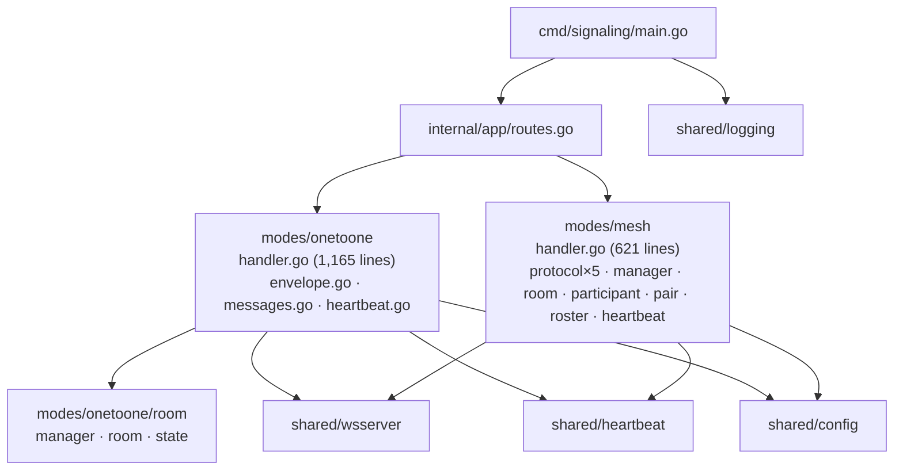
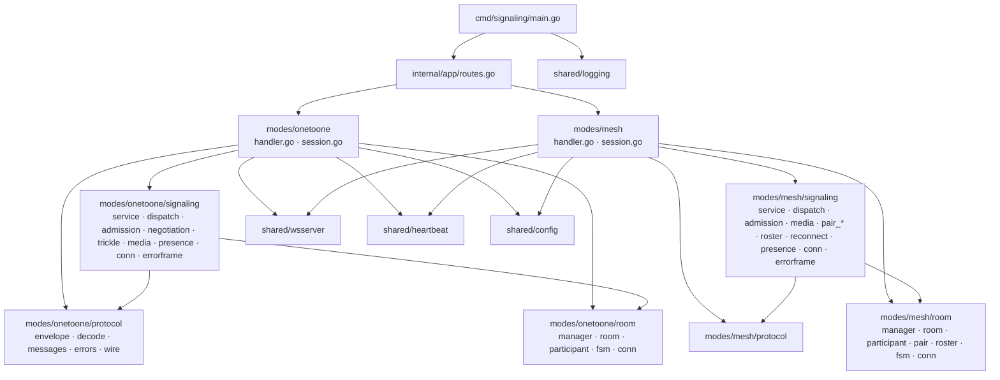
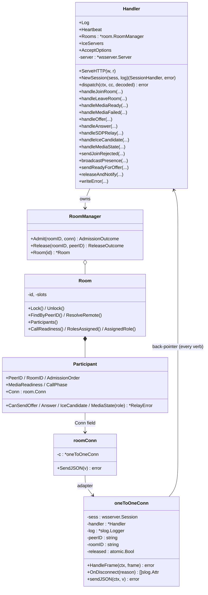
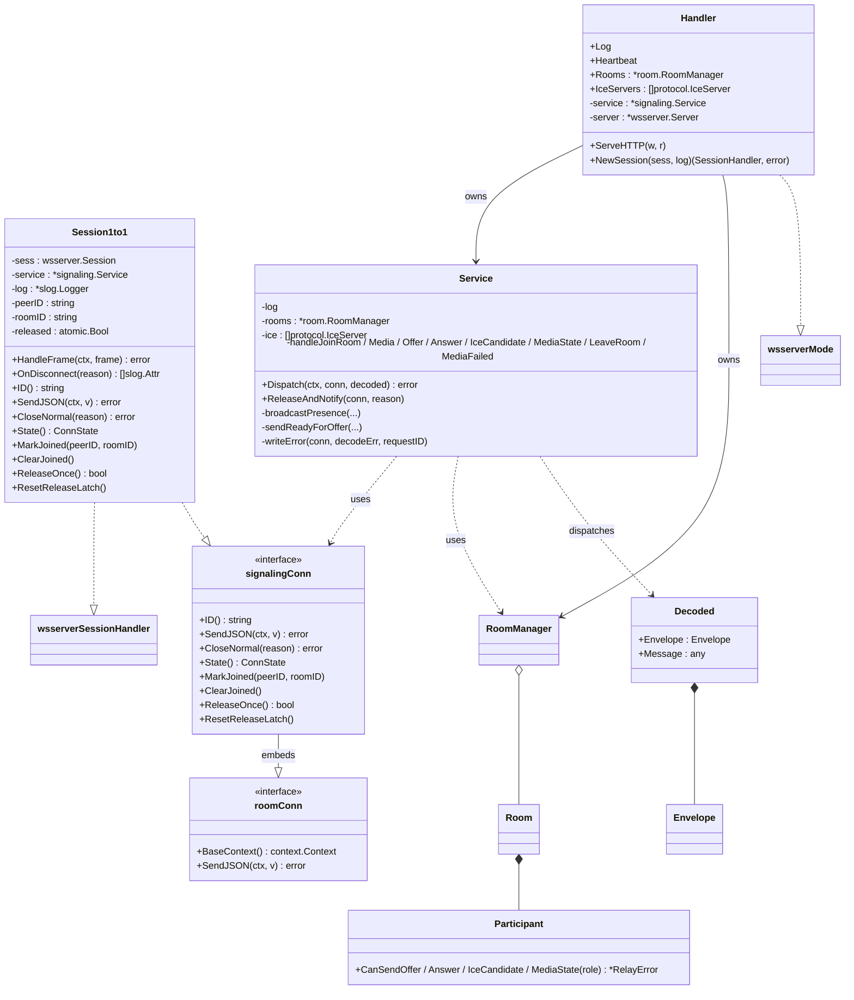

# Signaling architecture v2

**Status**: design proposal. **Date**: 2026-05-01.
**Scope**: `signaling/` backend redesign. Sits **under** the cross-mode
boundary rules in `specs/architecture.md` — those rules (rules 1–7,
the per-mode pattern, `scripts/audit-boundaries.sh`) stay in force.
This document describes the *internal* layout of each mode, not the
cross-mode boundary.

This is a paper design (deliverable type B from the brainstorming
session). Per-task migration sequencing belongs in a separate
`plan.md` cut from this doc.

## Decision summary

Five load-bearing decisions made up-front so the rest of the doc reads
as elaboration:

- Keep `modes/onetoone/` as the directory name (Go package = directory
  name; do not introduce hyphenated dirs that diverge from the package
  declaration).
- Split each mode's Ring 2 into two sibling sub-packages: `protocol/`
  (wire schema) and `room/` (state).
- Name each mode's Ring 3 sub-package `signaling/`. The doubled word
  in the import path (`.../onetoone/signaling`) is a small price for
  accurate naming; alternatives (`flows/`, `verbs/`, `handlers/`)
  understate or mislead.
- Introduce `signaling.Service` (the verb host) plus a small
  `signaling.Conn` interface (the per-conn surface the verbs use).
  This inverts the import direction so `signaling/` does **not** import
  the mode root, eliminating the obvious cycle.
- Defer the SFU media-plane question to the 003 spec. This doc surfaces
  it as the one architectural decision the redesign deliberately does
  not pre-decide.

## 1. Goals & non-goals

### Goals (drive every decision below)

1. A new reader of `signaling/` can answer "what does this server do,
   in WebRTC terms?" by reading file *names* and one entry-point file.
   The directory tree should read like a WebRTC table of contents, not
   a Go web-server scaffold.
2. Adding mode N+1 (SFU first, then recording / simulcast / …) is a
   copy-the-package-shape operation on a single sub-tree of well-scoped
   files, with zero edits to existing modes.
3. The HTTP / WebSocket plumbing is invisible by default. A reader who
   wants to learn about WebRTC never has to scroll past JSON envelope
   handling, write mutexes, or close-frame logic to reach the lesson.
4. No file in the redesign exceeds ~250 lines.
   - Today: `onetoone/handler.go` is 1,165 lines, `mesh/handler.go` is
     621 lines, `onetoone/messages.go` is 565 lines.

### Non-goals (explicitly preserved or off-limits)

- The 001 v1 wire contract
  (`specs/001-webrtc-1to1-call/contracts/signaling-protocol.md`) is
  frozen byte-for-byte. Wire format, error codes, message types,
  payload shapes do not change.
- The 002 v2 wire contract
  (`specs/002-webrtc-mesh-room/contracts/signaling-protocol.md`) is
  frozen byte-for-byte for the same reason.
- The cross-mode boundary rules in `specs/architecture.md` (rules 1–7)
  stay in force. This redesign sits *under* them.
- `internal/shared/wsserver/` stays as the transport layer; the recent
  extraction (commit `515afe7 refactor(arch): extract WebSocket
  transport into shared wsserver package`) already does the right
  thing. The redesign builds on it; it does not replace it.
- `internal/shared/{heartbeat,config,logging}/` stay as-is — they are
  correctly factored.
- Tests under `signaling/tests/modes/{onetoone,mesh}/` stay; their
  imports / type names may shift during the refactor, but their
  assertions about wire behavior do not change.

## 2. Three-ring model

The redesign organizes the server into three concentric rings. Each
ring depends only on rings inside it. The ring boundary is the
visibility test for "is this WebRTC, or is this plumbing?"

```
   ┌──────────────────────────────────────────────────────────┐
   │  Ring 3 — signaling/   (per-mode WebRTC verbs)           │
   │     admission · negotiation · trickle · media · presence │
   │                                                          │
   │  ┌──────────────────────────────────────────────────┐    │
   │  │  Ring 2 — protocol/ + room/   (per-mode)         │    │
   │  │    protocol/  envelope, codes, decode, validate  │    │
   │  │    room/      Room, Participant, Pair, FSMs      │    │
   │  │                                                  │    │
   │  │  ┌──────────────────────────────────────────┐    │    │
   │  │  │  Ring 1 — shared/   (mode-agnostic)      │    │    │
   │  │  │    wsserver  heartbeat  config  logging  │    │    │
   │  │  └──────────────────────────────────────────┘    │    │
   │  └──────────────────────────────────────────────────┘    │
   └──────────────────────────────────────────────────────────┘
```

### 2.1 Ring 1 — `shared/`

Mode-agnostic infrastructure. WebSocket session lifecycle, heartbeat
goroutine, ICE config loading, slog setup. A reader who wants to learn
WebRTC skips this ring entirely. Already exists today; the redesign
leaves it alone.

### 2.2 Ring 2 — per-mode `protocol/` + `room/`

The wire schema and the in-memory state machine. Two reasons they live
in sibling packages instead of a single Ring 2 package:

- `protocol/` answers "what does the wire look like" — envelope,
  message types, error codes, decode, payload validators. No I/O, no
  state.
- `room/` answers "what state does the server keep" — `Room` registry,
  `Participant` FSM, `Pair` FSM (mesh only), presence enums. No I/O,
  no schema.

Both are pure: they may import `protocol` from `shared/` packages but
not from each other or from Ring 3.

### 2.3 Ring 3 — per-mode `signaling/`

The WebRTC verbs. One file per concept: `admission.go`,
`negotiation.go`, `trickle.go`, `media.go`, `presence.go`. Each file
holds the methods on `*Service` for the messages that belong to that
concept, plus any concept-private helpers. This is *the* layer a
reader opens to learn what the server does. The transport plumbing
(decode, write-back, error frames) is one function-call deep — the
verb files call into Ring 2 for state, into the mode root for I/O via
the `Conn` interface, and stay short.

The mode root is small. `modes/{mode}/handler.go` is a ~40-line
`wsserver.Mode` adapter. `modes/{mode}/session.go` is the per-conn
`SessionHandler`: it owns `HandleFrame` (decode → `service.Dispatch`)
and `OnDisconnect` (cleanup hand-off to `service.ReleaseAndNotify`).
Everything substantive lives in the rings.

### 2.4 Package dependency rules (the most important guardrail)

These rules are what prevent the obvious import cycle
(`session.go` → `signaling/` → `onetoone` root) from coming back.
They are the load-bearing constraint of the entire model:

```
shared/      imports no modes
protocol/    imports neither room/ nor signaling/
room/        imports neither protocol/ nor signaling/
signaling/   imports protocol/ + room/, but NOT mode root or wsserver
mode root    wires shared/wsserver to signaling.Service; satisfies
             both wsserver.SessionHandler (via session.go) and
             signaling.Conn (via session.go)
```

`signaling/` reaches the per-conn write surface only through the
`signaling.Conn` interface declared in `signaling/`. The mode root
implements that interface; `signaling/` never imports the mode root.

## 3. Per-mode internal layout

### 3.1 `signaling/internal/modes/onetoone/`

```
handler.go              ~40 lines   — wsserver.Mode adapter; NewHandler, ServeHTTP, NewSession
session.go              ~80 lines   — Session1to1 (per-conn SessionHandler);
                                      implements wsserver.SessionHandler + signaling.Conn

protocol/
  envelope.go           ~100        — Envelope, Type enum, ContractVersion=1, validateEnvelope
  decode.go             ~150        — Decode + decodePayload + ValidateRoomID + IsUUID
  messages.go           ~250        — per-type payload structs + their Validate() methods
  errors.go             ~50         — ErrorCode enum, DecodeError, sentinel decode errors
  wire.go               ~80         — IceServer (JSON-tagged), Role, Presence, MediaReadiness wire enums

room/
  manager.go            ~200        — RoomManager (registry, Admit, Release)
  room.go               ~250        — Room (paired slot, lock, FindByPeerID, ResolveRemote, AssignedRole)
  participant.go        ~120        — Participant, MediaReadiness, CallPhase
  fsm.go                ~120        — CanSendOffer/Answer/IceCandidate/MediaState + RelayError
  conn.go               ~20         — room.Conn interface (SendJSON only)

signaling/
  conn.go               ~50         — signaling.Conn interface, ConnState struct
  dispatch.go           ~50         — Service.Dispatch (top-level switch on Decoded.Envelope.Type)
  errorframe.go         ~30         — writeError helper (one place; every verb shares it)
  service.go            ~50         — Service struct, NewService constructor
  admission.go          ~150        — handleJoinRoom, sendJoinRejected, broadcastPresence-on-admit
  negotiation.go        ~200        — handleSDPRelay (offer + answer), sendReadyForOffer, role assignment
  trickle.go            ~120        — handleIceCandidate
  media.go              ~150        — handleMediaReady, handleMediaFailed, handleMediaState
  presence.go           ~200        — handleLeaveRoom, ReleaseAndNotify, classifyDeparture, broadcastPresence
```

~21 files across the mode root + three sub-packages (`protocol/`,
`room/`, `signaling/`). Today's 1:1 mode is 7 files (4 flat in the
mode package + 3 in `room/`) totalling 2,736 lines, with `handler.go`
alone at 1,165. Every file in the future layout is under ~250 lines
and named after one WebRTC concept.

### 3.2 `signaling/internal/modes/mesh/` — same shape, different verbs

`handler.go`, `session.go`, `protocol/`, `room/` mirror 1:1's layout
with mesh-specific additions: `room/pair.go` for the Pair FSM,
`room/roster.go` for roster snapshots — both genuinely mesh-only.

`signaling/` for mesh has additional verb files because mesh has more
concepts:

```
admission.go            — join_room (+ join_rejected)
media.go                — media_ready, media_failed (room-level, pre-pair)
pair_negotiation.go     — pair_negotiation_instruction, pair_offer, pair_answer
pair_trickle.go         — pair_ice_candidate
pair_media.go           — pair_media_state
roster.go               — mesh_roster_snapshot, mesh_roster_update
reconnect.go            — reconnect_pair, pair_reconnect_instruction, pair_failed
presence.go             — peer_left, leave_room, participant_released
dispatch.go             — Service.Dispatch
errorframe.go           — writeError
service.go              — Service struct, NewService
conn.go                 — signaling.Conn interface, ConnState struct
```

8 verb files vs. 1:1's 5 (the four infrastructure files —
`dispatch.go`, `errorframe.go`, `service.go`, `conn.go` — are the
same in both modes). Each mesh-only concept is its own file; `pair_*`
messages stay split by concept (negotiation / trickle / media-state)
so a reader who already learned 1:1 sees the same three files with a
`pair_` prefix.

### 3.3 Frontend ↔ backend naming map

The frontend uses `one-to-one` as the mode id (kebab-case URL-style
identifier — see `specs/architecture.md` table). The backend keeps
`onetoone` as the directory and Go package name. Go permits a
hyphenated import path with a non-hyphenated package declaration, but
that divergence is a permanent tooling and readability tax for little
gain. The mapping is documented here and that is sufficient:

| Layer    | `1:1` mode id | `mesh` mode id |
|----------|---------------|----------------|
| Frontend | `one-to-one`  | `mesh`         |
| Backend  | `onetoone`    | `mesh`         |

### 3.4 The `signaling.Conn` and `room.Conn` interfaces

The per-mode `Conn` interfaces are the inversion point that makes the
"`signaling/` does not import mode root" rule hold. Exact shapes:

```go
// modes/onetoone/room/conn.go (Ring 2)
package room

import "context"

// Conn is the minimal write surface room/ needs for async broadcasts
// (presence-changed, peer-left fan-out). Defined here so room/ does
// not depend on signaling/.
//
// BaseContext returns the *target* session's base context. Broadcasts
// iterate participants and write to other sessions whose context is
// unrelated to the calling Service's request ctx; without this method
// the Service has no clean way to obtain the target ctx, which forced
// today's adapter struct to capture it implicitly.
type Conn interface {
    BaseContext() context.Context
    SendJSON(ctx context.Context, v any) error
}
```

```go
// modes/onetoone/signaling/conn.go (Ring 3)
package signaling

import (
    "context"

    "webrtc-lab/signaling/internal/modes/onetoone/room"
)

// ConnState is a snapshot of per-session join/release state. Returned
// by value so the caller cannot mutate the session indirectly.
type ConnState struct {
    PeerID   string
    RoomID   string
    Released bool
}

// Conn is the per-conn surface the signaling verbs use. It embeds
// room.Conn so a signaling.Conn value is also usable wherever a
// room.Conn is expected (e.g. RoomManager.Admit), without a downcast.
type Conn interface {
    room.Conn // adds SendJSON(ctx context.Context, v any) error

    ID() string
    CloseNormal(reason string) error

    State() ConnState
    MarkJoined(peerID, roomID string)
    ClearJoined()
    ReleaseOnce() bool         // CAS true → returns true on first call
    ResetReleaseLatch()        // for the media_failed retry path only
}
```

Notes:

- `ConnState` is returned by value, not by pointer, so a verb cannot
  reach back through the snapshot to mutate the session.
  `MarkJoined` / `ClearJoined` are intent verbs, not field setters —
  they keep invalid partial mutations out of `signaling.Service`.
- `CloseNormal` hides `coder/websocket.StatusCode` from Ring 3. If a
  future use case needs non-normal close codes, add the method when
  the use case appears, not before.
- The `room.Conn` embedding lets `Service.handleJoinRoom` write
  `s.rooms.Admit(roomID, conn)` and pass its `signaling.Conn` to
  `RoomManager.Admit`, which expects `room.Conn`. Without the
  embedding, the Service would need a downcast or a separate
  accessor — both ugly.
- The `roomConn` adapter struct that exists in today's code
  (`onetoone/handler.go:181-187`) goes away. `Session1to1` directly
  satisfies `room.Conn` via its own `BaseContext()` and
  `SendJSON(ctx, v)` methods — the same two methods that also
  satisfy the embedded `room.Conn` inside `signaling.Conn`. The
  Service's broadcast call sites pass each target's context
  explicitly: `p.Conn.SendJSON(p.Conn.BaseContext(), env)`. (See
  §6.1 Phase B for when the deletion lands.)

The mesh equivalents (`mesh/room/conn.go` and `mesh/signaling/conn.go`)
follow the same pattern with no shared types between modes. Per
Constitution Principle IX, the same *shape* is used in two places
because the underlying need is genuinely the same, not because we are
preemptively abstracting.

## 4. Diagrams: current vs future

The diagrams render with GitHub's Mermaid support. Each pair (current
vs future) is intentionally drawn at the same level of detail so the
delta is visible.

### 4.1 Component diagram — current state



Key observations:

- `modes/mesh/` is a single flat package with 12 sibling Go files
  (2,441 lines total; `handler.go` = 621).
- `modes/onetoone/` is 4 flat top-level files (2,004 lines;
  `handler.go` = 1,165, `messages.go` = 565) plus a 3-file `room/`
  sub-package (732 lines).
- All verb logic, envelope decode, error frames, and broadcast helpers
  live inside one large `handler.go` per mode.

### 4.2 Component diagram — future state



Key observations:

- Mode root is two files (`handler.go`, `session.go`).
- Each mode has three sub-packages whose names map directly onto the
  three rings (`protocol/`, `room/` = Ring 2; `signaling/` = Ring 3).
- `signaling/` imports Ring 2 packages but *not* the mode root and
  *not* `wsserver`. The mode root is the only place that wires
  `wsserver` to `signaling.Service`.

### 4.3 Class diagram — current state (1:1)



Pain points the diagram encodes:

- Every verb is a method on `Handler`. `Handler` is the God-object.
- `oneToOneConn` carries a back-pointer to `Handler` so verbs can
  reach it. The two structs are tightly coupled.
- `roomConn` exists only because `room.Conn.SendJSON()` (no ctx) and
  `oneToOneConn.sendJSON(ctx, v)` (with ctx) have different
  signatures. The adapter bridges them.

### 4.4 Class diagram — future state (1:1)



Note for readers of the diagram: `signalingConn` is the Mermaid alias
for the Go type `signaling.Conn`; `roomConn` here is the Mermaid alias
for the Go type `room.Conn` (interface, not the deleted adapter
struct). `Session1to1` implements both — `room.Conn` for free via the
embedding.

### 4.5 Delta table — what moved, what's new, what disappears

| Aspect | Today | Future |
|---|---|---|
| Where do verbs live? | `*Handler` methods, all in `handler.go` (1,165 lines) | `*Service` methods, one file per WebRTC concept (~150–250 lines each) |
| What does the per-conn struct hold? | conn-level state + back-pointer to `Handler` (used as God-object) | conn-level state + back-pointer to a small `Service` |
| How do verbs reach the conn? | `cc *oneToOneConn` (concrete struct, mode-internal) | `conn signaling.Conn` (interface; no mode-root import) |
| How does `room/` write to a peer? | `room.Conn.SendJSON(v)` (no ctx) via the `roomConn` adapter | `room.Conn.SendJSON(ctx, v)` (with ctx); `Session1to1` satisfies it directly |
| Adapter struct `roomConn` | exists in `handler.go:181-187` | deleted (Phase B) |
| Schema location | `envelope.go` + `messages.go` flat in mode package | `protocol/` sub-package |
| Verb-level error helper | `Handler.writeError` mixed with verbs in `handler.go` | `signaling/errorframe.go` (one file) |

## 5. Adding a new mode

### 5.1 Recipe — package shape, not implementation

What the Ring layout reuses for a new mode is the *package shape*:
a mode root (`handler.go` + `session.go`), Ring 2 sub-packages
(`protocol/`, `room/`), and a Ring 3 sub-package (`signaling/`) with
one file per WebRTC verb. The *contents* of these packages will differ
for each mode and should not be copy-pasted. Mode-specific room state
is, in particular, materially different across modes — copying 1:1
implementation files into a new mode's `room/` will smuggle in 1:1
assumptions that don't hold.

Procedure for adding mode N+1:

1. Write `specs/00N-<mode>/` (spec, plan, contracts).
2. Create `modes/<mode>/` with the package shape: `handler.go`,
   `session.go`, `protocol/`, `room/`, `signaling/`.
3. Implement `protocol/` against the contract spec (envelope, types,
   codes, validators).
4. Implement `room/` against the data model in the spec (manager,
   room, participant, mode-specific state types). Define the local
   `room.Conn` interface (SendJSON-only).
5. Implement `signaling/` one verb-file at a time, against the
   contract's message-flow sections. Define `signaling.Conn`
   embedding `room.Conn`. Implement `Service` and `Service.Dispatch`.
6. In the mode root, define the per-conn `Session<Mode>` struct. It
   implements both `wsserver.SessionHandler` (the transport contract)
   and `signaling.Conn` (the verb-side contract).
7. Wire `mux.Handle("/ws/<id>", <mode>.NewHandler(deps.Logger))` in
   `internal/app/routes.go`.
8. Add `<mode>` to `scripts/audit-boundaries.sh`'s mode list (per the
   existing `specs/architecture.md` recipe).
9. Write tests under `signaling/tests/modes/<mode>/`.

What the redesign explicitly does NOT add:

- No "topology engine" interface that all modes implement.
- No shared base class for `Service`.
- No generic over contract version.

Per Constitution Principle IX, modes share Ring 1 infrastructure and
the file-shape convention. They do not share types.

### 5.2 SFU and the media-plane question

1:1 and mesh share an important property: the signaling server never
touches media. SDP, ICE, and media-state are relayed verbatim; the
server is a pure control-plane component. **SFU is different.** A real
SFU participates in media forwarding — the server holds Pion
`RTCPeerConnection` objects per participant, terminates ingress
tracks, and forwards them to subscribers per layer. This is a
media-plane concern, so the three-ring signaling layout should not
try to absorb it.

**Therefore, before SFU lands, the 003 spec must answer one
architectural question that this doc deliberately does not pre-decide:**

> Does this Go service host the SFU media plane, or only the SFU
> signaling/control plane?

The answer changes the file tree.

**If signaling-only** (the SFU media plane lives in a separate Go
service, a non-Go process, or a managed SFU like LiveKit / mediasoup
talking to this server), `modes/sfu/` stays the same shape as 1:1 and
mesh. The recipe in §5.1 applies unchanged.

**If the same Go service hosts the media plane**, `modes/sfu/` grows
a fourth top-level sub-package for media-fabric concerns:

```
modes/sfu/
  handler.go
  session.go
  protocol/
  room/                      // control-plane state: who is publishing,
                             // who is subscribed; stores opaque media-plane
                             // identifiers issued by mediafabric/ or by an
                             // external SFU. Does NOT import mediafabric/.
  signaling/                 // control-plane verbs
    admission.go  publish.go  subscribe.go  media.go  presence.go
    dispatch.go  errorframe.go
  mediafabric/               // SFU-owned media plane: Pion peer connections,
                             // RTP/RTCP loops, tracks, forwarding, subscriptions,
                             // layer selection, and teardown.
```

`mediafabric/` does not belong in Ring 2's `room/` because it is not
pure state — it owns goroutines, RTP packets, and Pion peer-connection
objects. It does not belong in Ring 3's `signaling/` because it is not
a verb on a JSON message. It is parallel to (not below) the signaling
stack. The dependency direction is: `mediafabric/` is referenced
through *opaque IDs* held in `room/`; `room/` does not import
`mediafabric/`.

## 6. Migration approach

This doc deliberately stops at the phase level. The actual file-by-file
move list and commit sequencing belong in a separate `plan.md` cut from
this doc.

### 6.1 Phase order

The refactor lands as a strangler-style series of phases on a dedicated
branch, mode-by-mode, ring-by-ring. After **every** phase, the
verification gate is the same:

```
cd signaling && go test ./...
bash scripts/audit-boundaries.sh   # from repo root
```

Focused per-mode tests (e.g.
`go test ./tests/modes/onetoone/...`) are extra signal during a phase,
not a substitute for the full backend gate. The full `go test ./...`
catches compile and import breakage across `internal/app`,
`cmd/signaling`, and the `shared/` packages.

| Phase | Scope | Output |
|---|---|---|
| **0. Baseline** | Branch off `main`. Run full backend gate on a clean tree. | Green starting point. No code changes. |
| **A. `protocol/` extraction (1:1)** | Move `envelope.go` and `messages.go` into `modes/onetoone/protocol/`. Update imports. No method signatures change. | Ring 2 schema package exists. Tests pass. |
| **B. `signaling.Service` + `signaling.Conn` + `room.Conn` cleanup (1:1)** | Create `modes/onetoone/signaling/`. Move all `(h *Handler) handleXxx` methods to `(s *Service) handleXxx` methods. Introduce `signaling.Conn` interface. Rename `oneToOneConn` → `Session1to1`. Update `room.Conn.SendJSON` to take ctx. Delete the `roomConn` adapter — `Session1to1` satisfies `room.Conn` directly via the embedded interface. | Ring 3 verbs in their own package; `handler.go` shrinks to ~40 lines; adapter gone. Tests pass. |
| **C. Verb-file split (1:1)** | Split the now-relocated `Service` methods into one file per WebRTC verb: `admission.go`, `negotiation.go`, `trickle.go`, `media.go`, `presence.go`, plus `dispatch.go` and `errorframe.go`. | Every file ≤250 lines. Tests pass. |
| **D. Readability / name cleanup (1:1, optional)** | Final naming pass — internal type names, log event names, helper function names. | Names match across the diagrams and the prose in this doc. |
| **E. Verification gate (1:1)** | `cd signaling && go test ./... && bash scripts/audit-boundaries.sh`. | Confirms 1:1 redesign is behavior-preserving before mesh starts. |
| **F. Repeat A–E for mesh** | Same five steps applied to `modes/mesh/`. Mesh has the additional Ring 2 type `Pair` and additional verb files (`roster.go`, `reconnect.go`, `pair_negotiation.go`, `pair_trickle.go`, `pair_media.go`). | Both modes redesigned. Both green. |
| **H. Final verification** | Full backend gate, `go vet ./...`, and an audit of expected structured log event names against `main` — timestamps, conn IDs, and ordering will naturally differ, so a literal diff is too brittle; the audit checks that the set of `event=...` slog field values is unchanged unless explicitly normalized in Phase D. | Branch ready for review/merge. |

### 6.2 002-merges-first constraint

The redesign should start from `main` after `002-webrtc-mesh-room`
has merged. Otherwise every structural move in `mesh/` becomes a
moving target, and review gets polluted by feature work plus
architecture work.

> **Exception**: if the redesign must start before 002 merges, cut it
> from the 002 branch and freeze mesh feature changes first.
> Otherwise defer until 002 is on `main`.

### 6.3 Risk register

- **001 contract drift.** The 001 wire contract is frozen byte-for-byte.
  The refactor must not change envelope JSON, error codes, or message
  types. Phase E catches this — tests under
  `tests/modes/onetoone/` assert wire-level behavior.
- **002 contract drift.** Same constraint for 002 once mesh enters
  Phase F. `tests/modes/mesh/` is the load-bearing safety net.
- **Test fixture import paths.** All phases rename packages or move
  files. Test files import the mode packages — every phase's commit
  needs to update those imports. The boundary-audit script's mode list
  also moves with the renames if any.
- **Log-string drift.** Phase D may normalize log event names across
  modes. The Phase H audit (set of `event=...` values vs. `main`)
  catches *unintended* drift; intentional Phase D changes are
  documented at the time they're made.

### 6.4 What the future plan owns

This doc deliberately stops at the phase level. The future `plan.md`
owns:

- File-by-file move list with old-path → new-path mapping.
- Test-file update list per phase (which tests need import-path
  fixes).
- Commit-message convention for the refactor branch.
- Whether mesh redesign happens in the same PR series or a follow-up.
- Whether log-string normalization (Phase D) ships in the same PR or
  as a separate hygiene pass.

## 7. References

- Constitution: `.specify/memory/constitution.md` — Principle IX
  (preserve extension space; do not preemptively abstract) is the
  load-bearing constraint behind every "shared types are not lifted
  here" decision in this doc.
- Cross-mode boundary rules: `specs/architecture.md`. This doc lives
  *under* those rules — they own the cross-mode boundary; this doc
  owns the per-mode internal layout.
- Frozen contracts:
  - `specs/001-webrtc-1to1-call/contracts/signaling-protocol.md`
  - `specs/002-webrtc-mesh-room/contracts/signaling-protocol.md`
- Boundary audit script: `scripts/audit-boundaries.sh`.
- Recent precedent for ring-style extraction:
  commit `515afe7 refactor(arch): extract WebSocket transport into
  shared wsserver package` — the wsserver lift validated the
  three-rings-after-three-consumers heuristic and is the template
  Phase B follows.
